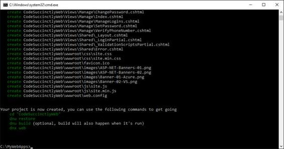
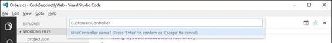
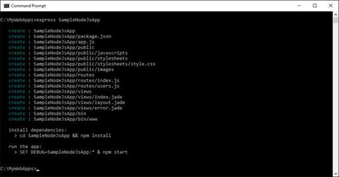
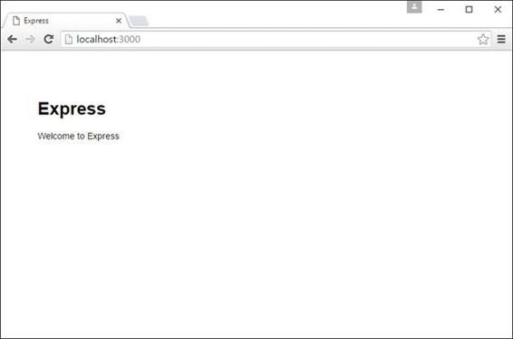
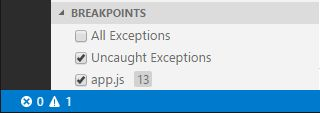
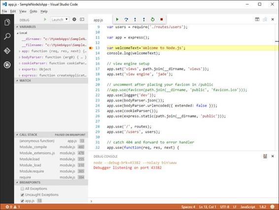
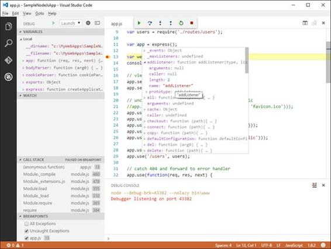
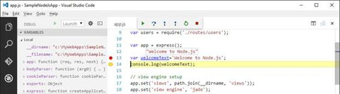
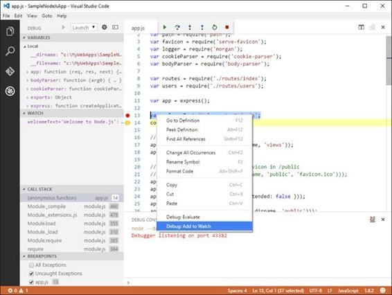

# 四、创建和调试应用

作为一个端到端的开发环境，VSCode 提供了在其他代码编辑器中找不到的机会。事实上，使用代码，您可以创建和调试许多应用类型。本章将帮助您开始使用 VSCode 编写 web 应用，提供调试指导以及支持的地方。

在开始使用 VSCode 编写 web 应用之前，您需要确保已经安装了以下先决条件:

*   [Node.js](https://nodejs.org/en/) ，一个 JavaScript 运行时，其中包括 **npm** (节点包管理器)命令行工具。
*   [DNX](http://docs.asp.net/en/latest/getting-started/index.html) ，the.NET 执行环境要求用 ASP.NET Core 1.0(原 ASP.NET 5)构建跨平台 web 应用，这是微软面向下一代跨平台 web 应用的新开发平台。

DNX 与 Node.js 集成得很好，并提供了您将经常使用的附加命令行工具。下一步是安装 [Yeoman](http://yeoman.io/) ，这是一个非常流行的命令行工具，可以帮助你搭建各种现代网络项目。安装 Yeoman 非常简单:打开一个命令提示符，输入下面一行，假设您已经安装了 Node.js:

> npm 安装-g yo 发电机-aspnet 大口 bower

这条线路将从约曼(也称为 yo)安装 ASP.NET 核心发电机，加上[](http://gulpjs.com)**和 [**鲍尔**](http://bower.io/) 。**

 **|  | 注意:如果你是跨平台网络开发的新手，你可能会想知道什么是大口和鲍尔。简而言之，大口是一个简化重复任务自动化的工具，而鲍尔则是一个网络应用的库和包管理器。单击上一段中他们的链接以获取更多信息。 |

如果您想知道为什么需要这些额外的工具，答案很简单:它们允许以完全独立于平台和环境的方式创建和管理应用。例如，Yeoman 基于 project.json 文件生成 ASP.NET Core 应用，适用于不同操作系统和平台上的 VSCode 和许多其他开发工具。这不同于使用微软 Visual Studio 创建 ASP.NET 核心应用，后者生成专有解决方案文件。虽然结果是一样的，虽然 Visual Studio 强大得多，但是当然，你需要 Windows 和 Visual Studio 本身。另一个先决条件是安装 [Express](http://expressjs.com/) 应用框架，您可以使用该框架构建一个 Node.js 应用。您在命令行中键入的命令如下:

> npm 安装-g 快速-发电机

现在你有了所有必要的工具，可以出发了。

要为 VSCode 创建您的第一个 ASP.NET 核心 web 应用，您需要从命令行运行 Yeoman 工具并键入几行。

|  | 提示:前一句话部分属实。您实际上可以在 VSCode 中从命令面板启动 Yeoman，方法是键入 Yo，按回车键，然后选择适当的命令。但是，您必须首先了解命令本身；这就是为什么您应该首先手动键入它们。 |

Yeoman 在当前目录的子目录中生成一个新的 web 应用，因此您必须确定要在哪里创建应用。例如，假设您有一个名为 C:\MyWebApps 的文件夹。打开该文件夹的命令提示符，然后键入以下行:

> yo aspnet

这将推出约曼 ASP.NET 5 号发电机，它提供了许多可能的选择，如图 69 所示。


图 69:约曼 ASP.NET 5 号发电机

请注意如何创建各种项目，包括流行的网络应用编程接口。选择**网络应用**模板，按**进入**。系统将提示您输入应用的名称。为保持一致，请输入**代码简明网页**并按**进入**。Yeoman 会生成一个名为 C:\ MyWebApps \code 琥珀 lyWeb 的子文件夹，以及在该文件夹中搭建应用所需的所有文件。您可以在控制台窗口中看到生成进度，完成后，Yeoman 建议运行一系列命令(见图 70)。



图 70:进度报告和命令建议

现在，您可以跳过运行建议的命令，因为您将很快从 VSCode 中完成这项工作。

|  | 提示:dnu 代表。NET 实用程序，并允许对项目执行特定的操作。键入 dnu–帮助以获取更多信息 |

现在打开 VSCode，选择**文件** > **打开文件夹**，选择**代码简洁网页**文件夹。VSCode 将找到一个 project.json 文件，并在适当的视图中组织这些文件。

|  | 注:解释 ASP.NET 核心项目是如何构建的超出了本书的范围。在这里，我们关注如何在 VS 代码中使用 ASP.NET 核心项目。更多详情，请参考官方[ASP.NET 核心文件](http://docs.asp.net/en/latest/)。 |

当代码打开一个 ASP.NET 核心项目时，它会分析 project.json 文件，并检查是否所有必需的 NuGet 包都可用。如果没有，它会显示一条消息，并为您提供恢复 NuGet 包的选项(参见图 71)。缺少 NuGet 包可能是源代码中许多错误的最常见原因。在图 71 中，您可以看到大量红色的曲线，表明代码编辑器不知道如何解析该代码，除非恢复所需的包。


图 71:代码提供恢复丢失的 NuGet 包。

您可以在命令面板中手动请求恢复 NuGet 包，方法是首先键入 dnx 恢复包，然后选择 dnu 恢复命令。如果您的文件夹中有多个项目，您可以选择以指定的项目为目标。一旦恢复了所有的 NuGet 包，红色的曲线就会消失。

您刚刚为 VSCode 构建了第一个 ASP.NET 5 应用，您已经准备好了解如何启动和运行它了。在命令面板中，键入 dnx 运行命令。这将显示两个可用命令:dnx web 和 dnx ef。第一个命令构建并启动 web 应用，而第二个命令允许对项目执行实体框架命令。现在，执行 dnx web。为了部署您的应用，VSCode 使用了一个新的开发服务器来代替 IIS Express，称为 [**红隼**](https://github.com/aspnet/KestrelHttpServer) 。当您执行该命令时，会出现一个控制台窗口，提供有关应用执行的信息，包括整个生命周期中的错误和问题。默认情况下，Kestrel 监听端口 5000 上的应用，这意味着您的应用可以通过 http://localhost:5000 访问，并将如图 72 所示。


图 72:示例 web 应用已经启动并运行。

|  | 提示:您可以在名为 Dockerfile 的文件中更改默认端口(5000)。 |

在[文档](http://docs.asp.net/en/latest/)中解释了将 ASP.NET 5 应用发布到不同生产服务器类型的替代方法。微软还制作了一个很棒的[教程](https://azure.microsoft.com/en-us/documentation/articles/web-sites-create-web-app-using-vscode/)，解释了如何通过几个步骤将你的 ASP.NET 5 应用发布到微软 Azure。

###  实现数据访问

|  | 注意:如果您通常使用 Microsoft Visual Studio，那么您肯定会在该 IDE 中而不是在 VS 代码中执行本节中描述的步骤。然而，在这里我们展示了微软有多少平台和技术可以用于 Visual Studio 之外的跨平台应用。 |

大多数应用，包括网络应用，都需要处理数据。您可以找到许多关于用 VS Code 编写应用的教程，但是关于实现数据访问的资源非常有限，所以我想通过这些来指导您。如您所知，[实体框架](https://msdn.microsoft.com/en-us/data/ef.aspx)是来自微软的现代应用的数据访问平台，微软最近已经[开源](https://github.com/aspnet/EntityFramework)。版本 7 有一些显著的改进，此外，它与移动和 ASP.NET 核心应用配合良好。您可以通过使用 dnx ef 命令在您的 ASP.NET 核心应用中轻松实现数据访问，其中 ef 代表实体框架。尽管命令面板允许从代码中调用实体框架命令，但更好的方法是使用命令提示符。使用实体框架，您可以针对许多场景，例如基于现有数据库创建数据模型，创建数据模型，然后编写数据库脚本，或者使用[代码优先](https://msdn.microsoft.com/en-us/library/jj200620.aspx)方法为新的或现有的数据库定义数据模型。对于当前的示例应用，我将向您展示如何基于流行的 Northwind 数据库生成数据模型，以及如何通过控制器公开查询。在做任何其他事情之前，在 VSCode 中打开当前项目的 **project.json** 文件，并在**依赖项**节点中添加对 **EntityFramework 的引用。设计**库，版本号与**实体框架相同。MicrosoftSqlServer** 库。这是一个基本步骤，否则脚手架会立即失效。当您保存 project.json 时，VSCode 将检测到丢失的 NuGet 包，并为您提供下载。当然接受这个提议，但是如果没有发生这种情况，请手动执行 dnu restore 命令。现在打开一个命令提示符，指向**C:\ my webapps \code 琥珀里的 Web** 文件夹。准备就绪后，键入以下行:

>

这将激活当前文件夹的实体框架命令行。在控制台窗口中，您将看到可用命令的列表，如数据库、上下文和迁移。在这种情况下，您已经有了一个数据库，所以您需要使用的命令是 **context** ，它允许生成一个 DbContext 类，并将支撑数据模型。根据您的数据库配置，编写以下命令:

> dnx ef dbcontext 支架"服务器=。\ sqlexpress 数据库=北风；可信连接=真；”EntityFramework。微软 SqlServer

如有必要，用您的 SQL Server 实例替换服务器名称。几秒钟后，您将看到一条完成消息。如果您在 VSCode 中查看该项目，您会看到新文件已添加到该项目中。更具体地说，数据库中的每个表都有一个类(例如 Customers.cs、Orders.cs、Order_Details.cs)，加上在 NorthwindContext.cs 文件中定义的上下文类。假设您希望您的 web 应用实现对数据的查询。正确的方法是使用网络应用编程接口控制器，您可以使用约曼添加它。因为您有一个现有的和已配置的项目，所以您可以从命令面板运行 Yeoman。所以，输入 yeoman aspnet。此时，命令选项板显示了可以添加到现有 ASP.NET 核心项目的项目列表。选择**网速控制器**项，出现提示时，输入**客户控制器**作为控制器名称(见图 73)。



图 73:添加新的网络应用编程接口控制器

新控制器被添加到“控制器”文件夹中，“输出”窗口显示有关代码生成的信息。如果你查看错误列表，你会看到一个错误说明**一个匿名类型不能有多个同名属性**。这是一个已知的问题，您可以通过导航到错误所在的代码并删除重复的属性来修复它。Web API 控制器通过常见的 HTTP 动词接受请求，如 GET、POST、PUT 和 DELETE。因此，新的控制器有自动生成的方法来匹配一些最常见的 HTTP 动词。假设您想要返回一个经过筛选的客户列表。为此，重写 Get 方法，如代码清单 8 所示。

代码清单 8

```js

  NorthwindContext context=new NorthwindContext();

  // GET: api/values

  [HttpGet]

  public IEnumerable<string> Get()

  {

  var query = from cust in context.Customers

  select cust.CompanyName;

  return query;
          }

```

此外，请记住使用 CodeSuccinctlyWeb 指令添加一个。在测试应用之前，您需要进行最后的编辑。打开 **wwwroot** 文件夹下的 **Web.config** 文件，添加如下连接字符串声明:

< add name="NorthwindContext "

连接字符串=“数据源=”。\ SqlExpress 初始目录=北风；集成安全性=真”

providerName= "系统。数据。SqlClient" />

在现实场景中，您可能希望在 C#代码中提供连接字符串，而不是将其放在配置文件中，但在这种情况下这不是必需的。现在使用您之前学习的命令再次运行该应用，并打开一个指向 http://localhost:5000 网址的 web 浏览器。通过遵循 Web API 的路由约定，您可以通过键入以下地址来获取客户列表:http://localhost:5000/API/Customers。您得到的结果如图 74 所示。


图 74:查询由网络应用编程接口控制器公开的数据

通过几个步骤，您已经能够使用实体框架在您的 ASP.NET 核心应用中实现数据访问。其他步骤可能包括添加[代码迁移](https://msdn.microsoft.com/en-us/data/jj591621.aspx)、CRUD 操作和适当的视图，以向用户界面呈现信息。

VSCode 中最重要的工具之一是内置调试器，这是与其他代码编辑工具相比具有显著差异的另一个关键特性。在撰写本文时，Code 已经通过一个特殊的扩展集成了对 Node.js (JavaScript)应用的支持和对带有 C#和 F#的 Mono 的实验性支持。开发者社区制作的其他调试器可以在[Visual Studio market](https://marketplace.visualstudio.com/vscode/Debuggers?sortBy=Downloads)中找到。

要尝试调试，首先需要一个 Node.js 应用。如果没有的话，可以使用 [Express](http://expressjs.com/) 应用框架，这样就可以很容易的搭建一个新的 Node.js app。Express 的工作方式与 Yeoman 类似，因此它会在当前目录的子文件夹中创建一个应用。打开一个命令提示符，指向要放置新应用文件夹的目录，例如之前创建的示例 C:\MyWebApps 目录。准备好之后，在命令提示符下编写以下命令，创建一个名为 SampleNodeJsApp 的示例应用:

> express SampleNodeJsApp

几秒钟后，应用将准备就绪。请注意，完成后，Express 建议您安装应用依赖项(参见图 75)，因此导航到子文件夹并键入 npm install。



图 75:用 Express 创建 Node.js 应用

测试应用非常容易，因为您只需要键入 npm start。默认情况下，这将启动服务器侦听端口 3000，因此在您的 web 浏览器中，您可以通过 http://localhost:3000 访问应用。图 76 显示了运行的示例应用。



图 76:用 Express 创建的 Node.js 应用正在运行。

在幕后，该项目包含一个 package.json 文件，该文件定义了一个名为 start 的脚本，该脚本运行 node。/bin/www .这提供了启动机制。

启动 VSCode，打开 **SampleNodeJsApp** 文件夹。正如预期的那样，代码识别应用类型，加载文件，并提供适当的视图。打开 **app.js** 文件，在 var app = express()之后；代码行，添加以下内容:

var welcomeText = '欢迎使用 node . js '；

console . log(welcome text)；

这是一个简单的字符串变量声明，对于调试非常有用。请注意，当您键入时，智能感知是多么强大。

在调试应用之前，您需要配置调试器。首先，打开**调试**视图。其次，点击代表**打开**命令的齿轮图标。VS Code 将显示可用调试环境的列表，这取决于您安装了多少调试器。只需选择**节点，按**进入。此时，代码会创建一个名为 launch.json 的文件，您可以在其中配置调试器。VSCode 支持两种调试配置:启动和附加。使用启动调试当前在代码中打开的项目，而使用附加调试已经运行的应用。当代码生成 launch.json 时，它会自动为这两种配置提供默认值，如代码清单 9 所示。

代码清单 9

```js
  {
        "version": "0.2.0",
        "configurations": [
              {
                    "name": "Launch",
                    "type": "node",
                    "request": "launch",
                    "program": "${workspaceRoot}\\bin\\www",
                    "stopOnEntry": false,
                    "args": [],
                    "cwd": "${workspaceRoot}",
                    "preLaunchTask": null,
                    "runtimeExecutable": null,
                    "runtimeArgs": [
                          "--nolazy"
                    ],
                    "env": {
                          "NODE_ENV": "development"
                    },
                    "externalConsole": false,
                    "sourceMaps": false,
                    "outDir": null
              },
              {
                    "name": "Attach",
                    "type": "node",
                    "request": "attach",
                    "port": 5858,
                    "address": "localhost",
                    "restart": false,
                    "sourceMaps": false,
                    "outDir": null,
                    "localRoot": "${workspaceRoot}",
                    "remoteRoot": null
              }
        ]
  }

```

在大多数情况下，您将保持默认值不变，但您可能需要调整附加配置的值。属性不言自明，容易理解，但您可以随时查看[官方文档](https://code.visualstudio.com/docs/editor/debugging)了解更多详细信息。继续之前，请确保您已经保存了 launch.json。

在调试模式下启动应用之前，放置一个或多个断点来发现 VS 代码中的全部调试功能是非常有用的。为了放置断点，您可以单击行号附近的空白。例如，在您之前编写的 welcomeText 变量声明中放置一个断点，如图 77 所示。


图 77:在代码编辑器中放置断点

您可以通过再次单击断点来删除断点，也可以在调试视图的断点区域管理断点(参见图 78)。



图 78:管理断点

在“调试”视图中，确保选择了启动配置，然后单击“开始”按钮或按 F5。VSCode 将启动调试器，并在遇到异常或断点时中断，如当前示例所示。图 79 显示了遇到断点的代码和所有调试工具。



图 79:调试器遇到一个断点并显示所有的检测。

请注意，调试时状态栏如何变成橙色，以及“输出”窗口如何显示有关调试过程的信息。在左侧，“调试”视图显示了许多工具:

*   **变量**，显示当前在调试器控制下的变量列表，可以通过展开每个变量进行调查。
*   **观看**，在这里可以评估表情。
*   **调用栈**，可以看到方法调用的栈。如果您单击一个方法调用，代码编辑器会将您带到进行该调用的代码。
*   **断点**，可以管理断点。

在 IDE 的顶部，还可以看到名为**调试操作窗格**的调试工具栏(见图 80)，它从左到右包含以下命令:

*   **继续(F5)** ，允许在断点或异常中断后继续应用执行。
*   **Step Over (F10)** ，一次执行一条语句，方法调用除外，方法调用在不单步执行的情况下被调用。
*   **单步执行(F11)** ，一次执行一条语句，包括方法体内的语句。
*   **单步执行(F12)** ，从当前断点开始执行函数的剩余行。
*   **重启(Ctrl+Shift+F5)** ，重启应用执行。
*   **停止(Shift+F5)** ，停止调试。


图 80:调试操作窗格

如果将鼠标悬停在代码编辑器中的变量名上，一个方便的弹出窗口可以根据变量的类型轻松地研究值和属性值。图 81 显示了一个弹出窗口，显示了关于 app 变量的信息。您可以展开属性并查看其值，还可以在调试侧栏的“变量”区域调查属性。



图 81:在调试时分析和研究属性值

作为另一个例子，只需将鼠标悬停在手工声明的 welcomeText 变量上，查看工具提示如何显示其当前值(参见图 82)。在这种情况下，该值已经被硬编码，但是如果它是以编程方式提供的，那么这个特性将很容易理解实际值是否是预期值。



图 82:分析局部变量

调试器还提供了**调用堆栈**功能，允许单步执行方法调用堆栈。当您单击堆栈中的一个方法调用时，代码编辑器将打开包含该调用的文件，突出显示它，如图 83 所示。


图 83:用调用栈分析方法调用

最后，您可以选择使用**观察**工具来评估表达式。调试时，右键单击一个对象，然后选择**调试:添加到手表**(见图 84)。



图 84:使用手表调试工具

另一个有用的工具是**调试控制台**。您可以通过在调试视图中单击齿轮图标右侧的**打开** **调试控制台**按钮来打开它。当您打开此工具时，您可以编写要立即计算的表达式。例如，图 85 显示了如何通过键入名称来计算 welcomeText 变量。代码将显示变量的当前值。


图 85:调试控制台

值得一提的是，调试控制台还允许向调试器发送命令，这是通过将调试器附加到已经运行的应用来完成的。

VSCode 为调试基于 Mono 的 C#和 F#应用提供了实验性支持。在撰写本文时，这仅适用于 Linux 和 OS X，不适用于 Windows。[必须安装 Mono 3.1.2](http://www.mono-project.com/download/) 或更高版本才能使用。此外，您需要通过键入安装扩展命令，然后选择**单声道调试**扩展，从命令面板下载 VSCode 的单声道调试器。一旦安装了这些先决条件，就必须使用下面的行来调用编译器，以启用应用进行调试:

>监控系统-调试程序

或者，您可以键入以下命令来调试已经运行的应用:

> mono-debug-debugger-agent = transport = dt _ socket，server=y，地址= 127 . 0 . 0 . 1:55555 Program.exe

关于 Mono 调试的更多信息以及关于特性更新的新闻可以在[官方文档](https://code.visualstudio.com/docs/editor/debugging)中找到。

当涉及到编写真正的应用时，VSCode 作为开发环境的力量是显而易见的。在特定生成器的帮助下，您可以使用 C#和。NET 执行环境(DNX)。本章还描述了用几个命令实现实体框架数据访问是多么容易。如果您改为开发 Node.js 应用，您还可以利用强大的内置调试器，该调试器提供编写优秀应用所需的所有必要工具，例如断点、变量调查、调用堆栈和表达式求值器。通过完成这一章，您已经体验到了编写出色的跨平台应用所需的最重要和最强大的功能。现在是讨论如何定制 VSCode 的时候了。**