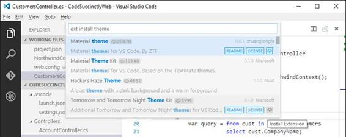
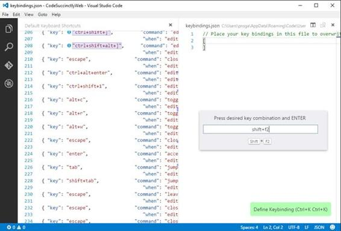
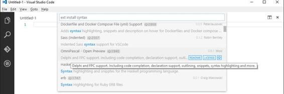
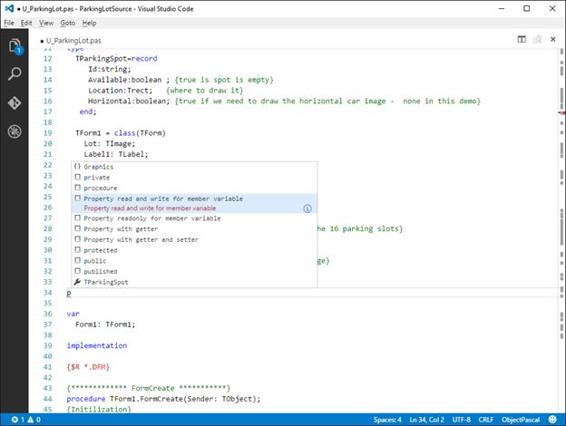
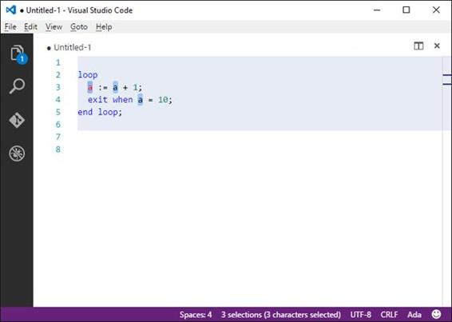
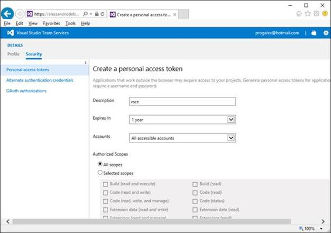
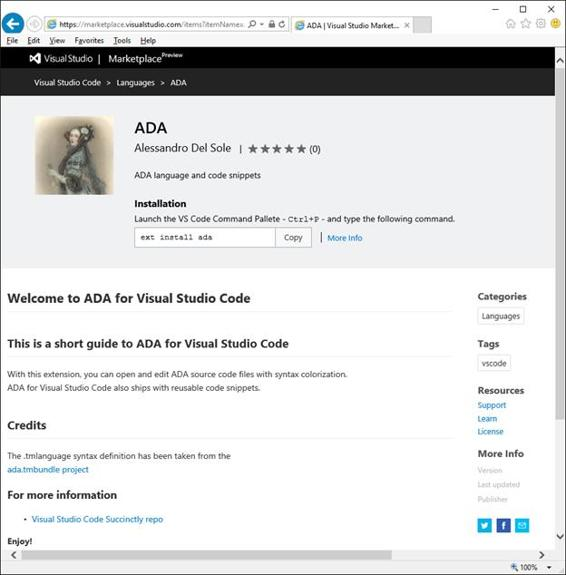

# 五、定制和扩展 VSCode

作为一个伟大的环境，VSCode 也可以在许多方面进行定制和扩展。事实上，您可以自定义它的外观、代码编辑器和键盘快捷键，以使您的编辑体验极其个性化。此外，您还可以下载和安装许多扩展，例如带有语法着色的新语言、调试器、主题、摘要和代码片段。你甚至可以创建和共享自己的扩展，让其他开发人员知道你有多酷。本章说明如何自定义和扩展 VSCode，包括可扩展性示例。

|  | 注意:在本章中，您将学习如何自定义和扩展 VSCode，以及创建和发布自己的扩展的基础知识。然而，解释可扩展性模型的核心概念和描述每个可扩展性场景在这里是不可能的。因此，如果您对其他可扩展性场景感兴趣，请参考[概述](https://code.visualstudio.com/docs/extensions/overview)文档，以及关于可扩展性模型的[可扩展性方法](https://code.visualstudio.com/docs/extensions/our-approach)文档。 |

VSCode 允许使用自定义扩展来扩展环境。开发者社区共享对 [**VSCode 市场**](https://marketplace.visualstudio.com/VSCode) 的扩展，也称为**扩展库**。要下载扩展和自定义，请打开命令面板并键入以下命令:

>扩展安装

当您键入此命令时，将显示图库中的扩展名列表，您将能够在键入时看到扩展名类型并过滤列表。这是下载新语言、代码片段、颜色主题、调试器、完整扩展包等的地方。您也可以通过键入 ext 来浏览已安装的扩展列表。从这个列表中，您也可以只需点击一下就可以卸载扩展。关于扩展库和相关命令，这是您现在需要了解的全部内容。在我解释如何定制和扩展 VSCode 时，我将更详细地介绍。

VSCode 可以通过自定义和扩展进行个性化。它们之间的区别在于扩展为工具增加了功能，改变了现有功能的行为，或者提供了新的工具。为默认情况下没有智能感知的语言提供智能感知、向状态栏添加命令以及自定义调试器都是扩展的示例。另一方面，定制与环境设置相关，不会给工具增加功能。表 2 描述了 VS 代码的可扩展性点，并总结了 VS 代码中的定制和扩展。

表 2: VSCode 可扩展性

| 特征 | 描述 | 类型 |
| --- | --- | --- |
| 颜色主题 | 用不同的颜色设计环境布局。 | 用户化 |
| 用户和工作区设置 | 指定您对编辑体验的偏好。 | 用户化 |
| 键绑定 | 以一种你觉得更舒服的方式重新定义快捷键。 | 用户化 |
| 语言语法和语法着色程序 | 通过语法着色增加对其他语言的支持，并将 VS Code 的进化编辑体验带到您最喜欢的语言中。 | 用户化 |
| 代码片段 | 添加文本匹配和升华文本片段，更快地编写重复的代码。 | 用户化 |
| 调试器 | 为特定语言和平台添加新的调试器。 | 延长 |
| 语言服务器 | 为在 VS 代码中打开的文件实现验证逻辑。 | 延长 |
| 激活 | 当检测到特定文件类型或在命令选项板中选择命令时，加载扩展名。 | 延长 |
| 编者ˌ编辑 | 针对代码编辑器的内容工作，包括文本操作和选择。 | 延长 |
| 工作空间 | 增强状态栏、工作文件列表和其他工具。 | 延长 |
| 事件 | 与代码的生命周期事件交互，如打开和关闭。 | 延长 |
| 进化编辑 | 通过智能感知、查看、转到定义以及所有支持的高级编辑功能来改进语言支持。 | 延长 |

除了可以通过 VS Code 的特定选项进行自定义的颜色主题、键绑定和用户设置之外，自定义和扩展共享它们的创建方式。事实上，你通常用 Yeoman 来创建两者(或者至少你开始创建它们)，Yeoman 是你已经在[第 4 章](4.html#_Chapter_4_)中遇到的命令行生成器。因此，在向您展示如何安装现有的扩展之后，在本章中，我将描述如何使用 Yeoman 创建自定义的基本语言支持和代码片段。我也将引导您进入扩展的正确方向，但我不会介绍产生其他类型扩展的过程，这是更复杂的事情，超出了*简明*系列一本书的范围。在阅读本章之前，您真正需要做的是为 VS 代码安装 Yeoman 生成器，这可以通过在命令提示符下键入以下内容来完成:

> npm 安装–gyo 代码

本节将介绍表 2 中总结的支持的定制。

VSCode 附带了许多颜色主题，您可以选择这些主题来赋予环境不同的外观和感觉。您可以通过单击**文件** > **首选项** > **颜色主题**来选择颜色主题。可用颜色主题的列表将显示在命令面板中，如图 86 所示。


图 86:选择颜色主题

一旦您选择了不同的颜色主题，它将立即应用。此外，您可以在用键盘滚动列表时预览主题。例如，图 87 显示了深色(Visual Studio)主题，这是一个非常流行的选择，类似于深色+默认主题。


图 87:黑暗主题

尝试其他可用的颜色主题是留给你的好奇心。

#### 从扩展库中安装主题

您可以从扩展库中下载并安装开发人员社区制作的其他主题。为此，按下 **F1** 打开命令面板，键入安装扩展，然后键入主题以过滤列表。此时，您将看到图库中可用主题的列表，如图 88 所示。



图 88:从扩展库中选择主题

如果由主题制作人提供，您可以通过**自述文件**和**许可文件**获取主题信息。最后，点击右侧最后一个**安装扩展**按钮，安装所选主题。请注意，需要重新启动 VS Code，然后您就可以应用新的主题了。您还可以使用 Yeoman 命令行工具创建自定义主题，我稍后将介绍该工具。

在大多数应用中，包括其他 IDEs，您可以通过特定的工具或窗口设置环境设置和首选项。在 VSCode 中，设置是通过编写 JSON 标记来指定的。有两种类型的设置:用户设置和工作区设置。用户设置全局应用于开发环境，而工作区设置仅应用于当前项目或文件夹。此外，您还可以自定义 JSON 格式的键盘快捷键。

#### 自定义用户设置

用户设置全局适用于 VS Code 的开发环境。自定义用户设置是通过选择**文件** > **首选项** > **用户设置**来完成的。此操作将代码编辑器分成两个视图。在左视图中，可以看到默认的 JSON 设置文件；在右侧视图中，您可以看到一个名为 **settings.json** 的新的空 JSON 文件，您可以在其中覆盖默认设置。

|  | 提示:settings.json 文件的位置取决于您的操作系统，并且在代码编辑器的顶部可见。 |

默认设置涉及代码编辑器、文件管理、HTTP 代理、Git 引擎、linters、Markdown 预览和已安装扩展的行为(如果有)。默认设置视图为用 JSON 格式表示的每个可用设置提供详细的注释，以便您可以轻松理解特定行适用于什么设置。有关可用设置的更多详细信息，请访问[官方文档](https://code.visualstudio.com/docs/customization/userandworkspace)。您可以通过覆盖一个或多个默认设置，在 settings.json 中编写来轻松提供自定义设置。图 89 显示了一个示例，您可以在其中看到如何更改默认编辑器字体、如何删除行号以及如何禁用文件自动保存。此外，您可以看到智能感知将如何帮助您在可用设置中进行选择。值得一提的是，使用智能感知选择一个设置还会添加一个默认值，您将希望用一个自定义值替换它。


图 89:提供自定义用户设置

智能感知还会在选定的设置下用方便的工具提示显示设置提示。您也可以通过单击信息图标来展开工具提示。完成后，不要忘记保存 settings.json，否则您的更改将会丢失。

#### 自定义工作区设置

与全局应用于 VS Code 环境的用户设置不同，工作区设置仅应用于当前文件夹。为了自定义工作区设置，您首先需要打开一个现有文件夹。接下来，选择**文件** > **偏好设置** > **工作区设置**。此时您所看到的和可以做的与用户设置完全相同:您有一个 settings.json 文件，可以在其中指定您的首选项。不同之处在于 settings.json 保存在。vscode 子文件夹，将设置可用性仅限于当前文件夹。

#### 自定义键绑定

在 VS Code 术语中，键绑定表示从键盘调用命令和动作的快捷方式，而不是使用鼠标。VSCode 包含大量键盘快捷键(在[官方文档](https://code.visualstudio.com/docs/customization/keybindings)中进行了总结)，您可以使用自定义值覆盖这些快捷键。键绑定用 JSON 标记表示，每个键绑定由两个元素组成:键，它存储一个或多个要与动作相关联的键；命令，它表示要调用的动作。在某些情况下，VS 代码可能为不同的场景提供相同的快捷方式。这是 Esc 键的典型情况，它根据您正在使用的内容(如代码编辑器或工具窗口)来定位许多操作。为了识别正确的操作，键绑定设置支持 when 元素，该元素根据上下文指定正确的操作。自定义键绑定非常简单:你只需要选择**文件** > **首选项** > **快捷键**，编辑**键绑定. json** 代码为你生成的文件。代码编辑器被分成两个视图。在左视图中，您可以看到[默认键绑定的完整列表](https://code.visualstudio.com/docs/customization/keybindings)，在右视图中，您可以用自定义快捷键覆盖默认快捷键。请记住，VSCode 有不同的默认键绑定，并允许根据运行的操作系统进行自定义。

|  | 提示:键绑定仅在全局范围内可用，因此您不能像在工作区设置中那样为特定文件夹提供自定义键盘快捷键。此外，键盘快捷键默认以美国键盘布局为目标。幸运的是，VSCode 突出显示了对当前键盘布局具有不同键绑定的快捷键，建议您应该使用的键。 |

VS Code 中一个很酷的功能，可以让你通过按 **Ctrl+K** 两次快速添加自定义键绑定。当您这样做时，会出现一个弹出窗口，要求您指定密钥绑定，如图 90 所示。



图 90:输入新的密钥绑定

只需按下想要绑定到新快捷方式的按键，然后按**进入**。此时，VSCode 生成正确的 JSON 标记(参见图 91)，让您指定目标命令，并可选地指定一个 when 元素来指定操作上下文。


图 91:指定新密钥绑定的设置

完成自定义键绑定后，不要忘记保存**键绑定。**

VSCode 可以使用其他语言、语法着色程序和代码片段进行自定义。您可以从扩展库中获取其他语言和片段。通常情况下，您还会发现包含语言支持和相关代码片段的包，以及可能的额外好处，如任务和调试器。安装新的语言和代码片段非常容易。在命令面板中，键入 ext install，您将能够从扩展列表中选择所需的语言和代码片段或包。例如，图 92 显示了一个名为 OmniPascal 的包，它支持 Delphi 编程语言，包括代码片段、智能感知支持和转到定义支持。



图 92:选择新语言、代码片段或捆绑包

当你选择一个项目，VS 代码开始安装它。完成后，将提示您重新启动应用。此时，您将能够使用如图 93 所示的新语言和代码片段，图 93 显示了一个基于 Delphi 和新安装的 OmniPascal 扩展的示例。



图 93:用语法着色、代码片段和智能感知支持编写 Delphi 代码

扩展库中已经有对重要语言的丰富支持，比如 Python、Cobol、Fortran，甚至 PowerShell 脚本。其中，您可能想要查看 VSCode 的 [Cordova 工具](https://marketplace.visualstudio.com/items?itemName=vsmobile.cordova-tools)，它为 Cordova 项目引入了新的调试器、命令和智能感知； [Python](https://marketplace.visualstudio.com/items?itemName=donjayamanne.python) 扩展，通过 IntelliSense、代码片段、调试器扩展了 Python 语言支持，并启用了“转到定义”、“查找所有引用”和“转到符号”等功能；和 [Visual Studio 团队服务](https://marketplace.visualstudio.com/items?itemName=ms-vsts.team)，它提供 VS 代码和 Visual Studio 团队服务之间的集成，引入了对团队项目、工作项和代码管理的支持。这些都是 VS 代码可扩展性的很好的例子。

如您所知，VSCode 支持大量现成的语言，此外，您还可以从 VSCode Marketplace 安装其他语言。不限于此，您可以通过几个步骤向 VSCode 中添加新语言。在下一个示例中，您将为 [Ada](https://en.wikipedia.org/wiki/Ada_(programming_language)) 编程语言添加语言支持，包括代码片段。当然，本节中描述的所有步骤都适用于任何其他语言。

VSCode 支持基于文本编辑器[的语言语法。tmLanguage 格式](https://manual.macromates.com/en/language_grammars)。您当然可以定义自己的语法，但是如果许可协议允许使用该文件，最快的方法是从现有的语法开始。您可能首先要搜索现有的。tmLanguage 语法是 [GitHub](https://github.com) 。例如，在[https://raw . githubuser content . com/mulander/Ada . tmbundle/master/syntax/Ada . tmlanguage](https://raw.githubusercontent.com/mulander/ada.tmbundle/master/Syntaxes/Ada.tmLanguage)上可以找到一个很好的 Ada 语言语法实现。

|  | 提示:VSCode 需要语言语法定义的原始文本。在 GitHub 作为源代码的情况下，您需要打开。原始视图中的 tmLanguage 文件，这是通过单击文件视图中的“原始”按钮来完成的。 |

一旦有了语法，就可以为 VS 代码生成语言支持了。

启动命令提示符并键入 yo 代码。这将启动 Yeoman VSCode 扩展生成器，它会询问您想要生成什么类型的扩展(参见图 94)。


图 94: Yo 代码的第一个屏幕

如您所见，使用该工具，您可以创建扩展、颜色主题、新语言和代码片段。选择**新语言支持**并按**进入**。接下来，该工具将依次询问几条信息。因此，提供以下信息(参考图 95):

1.  输入的网址或路径。tmLanguage 语法文件，本例中为[https://raw . githubuser content . com/mulander/ada . tmbundle/master/syntax/ada . tmLanguage](https://raw.githubusercontent.com/mulander/ada.tmbundle/master/Syntaxes/Ada.tmLanguage)。
2.  输入 **ADA** 作为分机名称。
3.  接受 **ada** 自动建议作为分机标识。
4.  提供扩展描述。在这种情况下，我输入的是 **ADA 语言和代码片段**。
5.  输入您的发布者姓名。如果您计划将扩展发布到在线 Visual Studio Marketplace，请记下您正在输入的发布者名称，因为您需要在线注册(这将在后面介绍)。
6.  接受 **ada** 作为**语言标识**选项。请注意，这必须始终是小写的。
7.  接受 **Ada** 作为检测到的名称，这是您在代码编辑器的选择器中选择一种语言时会看到的。
8.  接受 VS 代码将与当前语言相关联的建议文件扩展名。亚行和。这种情况下的广告。当然，您可以添加或编辑文件扩展名。

您的新语言将在几秒钟内创建。图 95 显示了操作结束时的完整步骤和总结。


图 95:用约曼生成新语言

新语言将在您调用命令提示符的文件夹的子文件夹中创建，在我的示例中是 C:\Temp\Ada。现在，用 VSCode 打开新创建的 Ada 文件夹。如图 96 所示，资源管理器显示了组成新扩展名的文件列表。其中，README.md 文件是可用的，您应该将该文件编辑成更个性化的文档。图 96 显示了一个例子。


图 96:编辑 README.md

|  | 提示:当您使用由其他开发人员生成的. tmLanguage 语法文件时，尽管许可协议通常允许不受限制地使用它，但给原始作品加分是一个好主意，正如我在图 96 中所做的那样。 |

现在打开 **package.json** 文件，其内容如代码清单 10 所示。一般来说，扩展和自定义都有一个名为 package.json 的清单文件，其中包含 VSCode 正确安装和运行扩展所需的所有信息。如您所见，属性是不言自明的，并且是您在使用 Yeoman 时输入的信息的 JSON 对应项。值得一提的是类别的重要性，它用于对 Visual Studio Marketplace 中的扩展进行分类。您可以组合多个类别，正如您很快将看到的片段。contributes 字段存储扩展引入到 VSCode 中的功能列表——在本例中是语言及其语法。这也是提供额外贡献的地方，正如您稍后将对代码片段所做的那样。

代码清单 10

```js
  {

  "name": "ada",

  "displayName": "ADA",

  "description": "ADA language and code snippets",

  "version": "0.0.1",

  "publisher": "AlessandroDelSole",

  "engines": {

  "vscode": "^0.10.10"

  },

  "categories": [

  "Languages"

  ],

  "contributes": {

  "languages": [{

  "id": "ada",

  "aliases": ["Ada", "ada"],

  "extensions": [".adb",".ads"],

  "configuration": "./ada.configuration.json"

  }],

  "grammars": [{

  "language": "ada",

  "scopeName": "source.ada",

  "path": "./syntaxes/ada.tmLanguage"

  }]
      }
  }

```

现在关闭 VS 代码，并将 **Ada** 子文件夹复制到 **%USERPROFILE%\。vscode\extensions** (其中 USERPROFILE 是您的用户配置文件在磁盘上的路径，如 C:\Users\YourName)。在苹果和 Linux 上，这个文件夹位于 **%HOME/。vscode/extensions** 。这是安装 VS 代码扩展的文件夹。如果您现在打开 VSCode，编写一些 Ada 代码并选择 Ada 作为当前文件语言，您将看到正确的语法着色，如图 97 所示。


图 97:自定义语言被正确识别。

还要注意，当您第一次保存一个新文件时，VS Code 会建议正确的文件扩展名。现在您有了一种新的语言，但是最好捆绑一些代码片段，并对扩展清单进行一些定制。

VSCode 支持 JSON 作为代码片段的格式。如果您还没有任何用 JSON 编写的代码，您可以使用 Yeoman 从[文本匹配](http://manual.macromates.com/en/snippets)或[崇高文本](http://docs.sublimetext.info/en/latest/extensibility/snippets.html)代码片段开始生成代码片段。例如，考虑下面的 Ada 代码片段，它为..循环迭代并打印 I 变量的值:

因为我在 1..10 环路

艾达。Text_IO。put(I)；

结束循环；

使用文本匹配或升华文本，创建一个包含先前代码的新片段。图 98 显示了代码片段在崇高文本中的外观。


图 98:准备带有崇高文本的代码片段

文本匹配和升华文本片段是 XML 文件。基本上，您必须将代码包含在内容节点的 CDATA 部分中。请注意如何使用括号之间的占位符来定义字段的默认值。在这种情况下，{1:i}占位符意味着代码编辑器将突出显示 I 变量，以便用户理解可以用不同的标识符替换它。数字 1 将匹配指定变量的任何出现，但是您可以使用 2、3 等来建议其他默认值替换。您还应该提供一个键盘快捷键，允许通过按 Tab 键激活 VS Code 中的代码片段，这是通过在 tabTrigger 节点中提供快捷键来实现的。让我们离开范围节点，在这一点上没有必要。将文件保存为**adafollop**。现在考虑下面的 Ada 代码，它执行一个简单的循环..结束循环循环:

环

a:= a+1；

当 a = 10 时退出；

结束循环；

图 99 显示了崇高文本中的这个片段。


图 99:准备带有崇高文本的第二个代码片段

将片段保存为 **AdaLoopEndLoop** 。现在在保存代码片段文件的目录中打开一个命令提示符，并键入 yo 代码。当约曼工具启动时，选择**新代码片段**作为扩展生成选项。以图 100 为参考，依次提供:

1.  包含文本匹配或升华片段的文件夹。你可以打字。如果已经在包含所需代码片段的文件夹中打开了命令提示符。
2.  扩展的名称，例如，Ada 代码片段。
3.  扩展标识符。您可以接受自动生成的标识符。
4.  扩展描述。
5.  您的发布者姓名，就像您对语言支持生成所做的那样。
6.  您的代码片段所代表的语言 id。在这种情况下，语言 id 是 **ada** 。如果您正在打包其他语言的代码片段，您将需要提供这些语言的 id(例如，Markdown、Python)。


图 100:生成代码片段扩展

至于新的语言，Yeoman 会生成一个包含扩展清单(package.json)的新文件夹，一个在分发扩展之前鼓励您编辑的 README.md 文件，以及一个名为 **snippets** 的子文件夹，其中包含一个名为 **snippets.json** 的文件。这个包含您提供的所有代码片段，转换成 JSON 格式。您当然可以用 VSCode 打开新文件夹并研究扩展结构，而不仅仅是编辑 README.md 文件。事实上，代码片段扩展已经为[发布](https://code.visualstudio.com/docs/customization/userdefinedsnippets#_sharing-your-snippets-in-the-gallery)做好了准备，所以打包和发布现有语言的代码片段非常容易。然而，现在的目标是分发 Ada 语言支持和 JSON 代码片段。首先，将**代码片段**子文件夹复制到包含 Ada 语言扩展的文件夹中(参见创建代码片段之前列出的步骤)。为了确保您将该文件夹复制到正确的位置，它与**语法**和**处于同一级别。vscode** 文件夹。其次，您需要对为 Ada 语言支持创建的 **package.json** 文件进行编辑。更具体地说，因为您可以在一个扩展中组合多个贡献，所以您将添加一个 snippets 属性，如代码清单 11 所示。这个 snippets 属性可以简单地从为代码段扩展创建的 package.json 复制和粘贴。

代码清单 11

```js
  {

  "name": "ada",

  "displayName": "ADA",

  "description": "ADA language and code snippets",

  "version": "0.0.1",

  "publisher": "AlessandroDelSole",

  "engines": {

  "vscode": "^0.10.10"

  },

  "categories": [

  "Languages", "Snippets"

  ],

  "contributes": {

  "languages": [{

  "id": "ada",
              "aliases": ["Ada", "ada"],
              "extensions": [".adb",".ads"],

  "configuration": "./ada.configuration.json"

  }],

  "grammars": [{

  "language": "ada",

  "scopeName": "source.ada",

  "path": "./syntaxes/ada.tmLanguage"

  }],

  "snippets": [{

  "language": "ada",

  "path": "./snippets/snippets.json"

  }]
      }
  }

```

请注意 categories 属性是如何扩展到包含片段的。这将使扩展在用户搜索语言和代码片段时都能被发现。保存您的编辑，然后再次运行 VSCode。您已经看到了语言支持是如何工作的，所以现在键入代码片段快捷方式 flp，然后按**选项卡**，或者 llp，然后按**选项卡**。图 101 显示了循环是如何..已插入结束循环代码段，突出显示替换占位符。



图 101:对 Ada 代码片段的支持

因此，通过相对较少的努力，您已经能够将一种带有代码片段的新语言插入到 VSCode 中。此时，你已经准备好与世界分享你的工作成果。

为您自己的使用扩展和定制 VSCode 当然很有帮助，但是真正的乐趣始于您与其他开发人员分享您的工作。您可以轻松地将扩展发布到 VSCode 市场，这样其他开发人员就可以从代码中下载它们，并且还可以在市场门户中查看摘要信息。在开始之前，您需要注册为发布者。注册过程通过[微软 Visual Studio 团队服务](https://www.visualstudio.com/en-us/products/visual-studio-team-services-vs.aspx)。VS Team Services 的前身是 Visual Studio Online，它为团队中最多五个用户提供免费服务，例如版本控制、工作管理、构建和测试自动化等等。你需要做的第一件事是[注册你的免费账户](https://go.microsoft.com/fwlink/?LinkId=307137&clcid=0x409&wt.mc_id=o~msft~vscom~product-vso-hero~dn720314&campaign=o~msft~vscom~product-vso-hero~dn720314)。注册后，您需要一个**个人访问令牌**，该令牌授予您向市场发布您的扩展的权限。为此，请遵循以下步骤:

1.  在主页面右上角点击你的名字，然后点击**我的个人资料**。
2.  一旦你访问了你的档案管理，点击页面左侧的**安全**标签(见图 102)。
3.  点击**个人访问令牌**，然后点击**添加**。
4.  输入个人访问令牌的名称。如图 102 所示，我使用的是 **vsce** ，它回忆了您用来发布到 Marketplace 的工具的名称，您很快就会用到它，但是您可以使用任何您喜欢的名称。
5.  在中的**到期字段，输入 **1 年**。**
6.  在**账户**字段中，选择**所有可访问账户**以向与当前订阅相关联的任何账户授予权限。
7.  在**授权范围**组中，选择**所有范围**。
8.  点击页面底部的**保存**(图 102 中不可见)。



图 102:创建个人访问令牌

|  | 注意:因为个人访问令牌不会存储在任何地方，所以您必须按照门户的建议将其保存在安全的地方，因为您需要它来在线发布扩展。 |

扩展清单，即 package.json 文件，可以进一步定制，为最终用户提供有用的信息。[官方文档](https://code.visualstudio.com/docs/extensionAPI/extension-manifest)提供了清单定制的全部细节，但这里我将展示常见的定制。例如，您可以添加一个图标属性来指定一个 128 × 128 的图像，该图像将用于在图库中升级您的扩展，指定一个许可证属性来指示您的扩展的许可证协议，指定一个指向您的扩展在 web 上的主页的主页属性，指定一个 bug 属性，您可以在其中指定用户可能用来归档 bug 的 URL 和电子邮件地址。代码清单 12 显示了一个清单定制的例子，包括一个图标、一个许可证、一个主页和一个 bug 提交页面。

代码清单 12

```js
  {
    "name": "ada",
    "displayName": "ADA",
    "description": "ADA language and code snippets",
    "version": "0.0.1",
    "publisher": "AlessandroDelSole",

  "icon": "images/MyIcon.jpg",

  "license": "SEE LICENSE IN
  LICENSE.md",

  "homepage": "https://github.com/AlessandroDelSole/VSCodeSuccinctly/blob/AdaLanguage/README.md",

  "bugs": {

  "url": "https://github.com/AlessandroDelSole/VSCodeSuccinctly/issues",

  "email": "alessandro.delsole@visual-basic.it"

  },
    "engines": {

  "vscode": "^0.10.10"

  },
    "categories": [

  "Languages"

  ],
    "contributes": {

  "languages": [

  {

  "id": "ada",

  "aliases": [ "Ada", "ada" ],

  "extensions": [ ".adb", ".ads" ],

  "configuration": "./ada.configuration.json"

  }

  ],

  "grammars": [

  {

  "language": "ada",

  "scopeName": "source.ada",

  "path": "./syntaxes/ada.tmLanguage"

  }

  ],

  "snippets": [

  {

  "language": "ada",

  "path": "./snippets/snippets.json"

  }
      ]
    }
  }

```

关于扩展清单的几点注意事项:

*   要提供图标，请在扩展名的文件夹中创建一个子文件夹，并在其中放置一个 128 × 128 的图像。
*   license 属性值必须始终为 SEE LICENSE IN LICENSE.md，因此您需要在扩展名的根文件夹中添加一个 LICENSE.md 文件。

不要忘记查看[官方文档](https://code.visualstudio.com/docs/extensionAPI/extension-manifest)中的其他可能性。现在你真的拥有了在网上发布作品所需的一切。

为了向 VSCode 市场发布扩展，您需要一个名为 vsce 的命令行工具。您可以通过在命令行中键入以下内容来获得它:

> npm 安装–g vsce

接下来，在要发布的扩展的根文件夹中打开一个命令提示符，在本例中是 Ada 语言扩展。第一次发布扩展时，首先需要创建一个发布者身份，将 vsce 与您的个人访问令牌相关联，这是通过以下命令完成的:

> vsce create-publisher name

其中 publisherName 是您要使用的唯一标识符。当您按下**进入**时，系统会提示您输入一个友好的、人类可读的名称，以及您之前收到的个人访问令牌。您只需要执行一次此步骤。下一步就是简单地键入 vsce publish，将您的扩展发布到 VSCode 市场。如果一切顺利，该扩展将在几秒钟后上线。图 103 显示了 Ada 扩展在市场门户中的样子。



图 103:发布的扩展出现在 VS 代码市场中。

图 104 显示了扩展如何出现在命令面板中，您可以看到用户如何查看许可协议并打开自述文件。


图 104:扩展出现在命令面板中。

在 VSCode 可扩展性中还有很多东西，但是在本章中，您已经看到了许多步骤、信息和资源，这些对于您想要构建的任何定制和扩展都是通用的。

VSCode 可以通过多种方式进行自定义和扩展。您可以自定义 VS Code 的设置，例如颜色主题、用户和工作区设置以及键绑定。您还可以使用命令面板从 VSCode 市场下载和安装扩展，并管理已安装的扩展。不限于此，您可以使用 VSCode 的 Yeoman 生成器编写自己的自定义和扩展，这使您能够快速开始使用可扩展性，例如生成新的语言支持、代码片段、颜色主题和其他类型的扩展。本章没有讨论高级可扩展性，但是您可以查看文档。