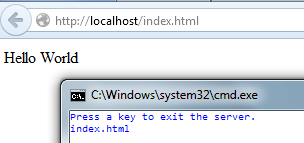

# 第二章你的第一台网络服务器

本章介绍的源代码位于[比特桶存储库](https://bitbucket.org/syncfusiontech/web-servers-succinctly)的文件夹**示例\第 2 章\演示**中。

## 编写网络服务器很简单

编写 web 服务器本质上相当简单。如果我们想做的只是提供一些 HTML 页面，我们可以用下面的实现来完成。

我们需要使用的命名空间:

```cs
    using System;
    using System.IO;
    using System.Net;
    using System.Text;
    using System.Threading;
    using System.Threading.Tasks;

```

代码清单 1

一些有用的扩展方法:

```cs
    /// <summary>
    /// Some useful string extensions.
    /// </summary>
    public static class ExtensionMethods
    {
      /// <summary>
      /// Return everything to the left of the first occurrence of the specified string,
      /// or the entire source string.
      /// </summary>
      public static string LeftOf(this String src, string s)
      {
        string ret = src;
        int idx = src.IndexOf(s);

        if (idx != -1)
        {
          ret = src.Substring(0, idx);
        }

        return ret;
      }

      /// <summary>
      /// Return everything to the right of the first occurrence of the specified string,
      /// or an empty string.
      /// </summary>
      public static string RightOf(this String src, string s)
      {
        string ret = String.Empty;
        int idx = src.IndexOf(s);

        if (idx != -1)
        {
          ret = src.Substring(idx + s.Length);
        }

      return ret;
    }

```

代码清单 2

以及程序本身:

```cs
    class Program
    {
      static Semaphore sem;

      static void Main(string[] args)
      {
        // Supports 20 simultaneous connections.
        sem = new Semaphore(20, 20);
        HttpListener listener = new HttpListener();
        string url = "http://localhost/";
        listener.Prefixes.Add(url);
        listener.Start();

        Task.Run(() =>
        {
          while (true)
          {
            sem.WaitOne();
            StartConnectionListener(listener);
          }
        });

        Console.WriteLine("Press a key to exit the server.");
        Console.ReadLine();
      }

      /// <summary>
      /// Await connections.
      /// </summary>
      static async void StartConnectionListener(HttpListener listener)
      {
        // Wait for a connection. Return to caller while we wait.
        HttpListenerContext context = await listener.GetContextAsync();

        // Release the semaphore so that another listener can be immediately started up.
        sem.Release();

        // Get the request.
        HttpListenerRequest request = context.Request;
        HttpListenerResponse response = context.Response;

        // Get the path, everything up to the first ? and excluding the leading "/"
        string path = request.RawUrl.LeftOf("?").RightOf("/");
        Console.WriteLine(path);  // Nice to see some feedback.

        try
        {
        // Load the file and respond with a UTF8 encoded version of it.
        string text = File.ReadAllText(path);
        byte[] data = Encoding.UTF8.GetBytes(text);
        response.ContentType = "text/html";
        response.ContentLength64 = data.Length;
        response.OutputStream.Write(data, 0, data.Length);
        response.ContentEncoding = Encoding.UTF8;
        response.StatusCode = 200; // OK
        response.OutputStream.Close();
        }
        catch(Exception ex)
        {
          Console.WriteLine(ex.Message);
        }
      }
    }

```

代码清单 3

前面的代码初始化了 20 个侦听器。使用信号量，当接收到请求时，信号量被释放并创建一个新的侦听器。因此，该代码可以同时接收 20 个请求。我们依靠`await`机制来确定延续(在`await`之后的代码)在哪个线程上执行。如果你不熟悉`Task`和`async` / `await`的用法，斯蒂芬·克利里在他位于[http://blog.stephencleary.com/2012/02/async-and-await.html](http://blog.stephencleary.com/2012/02/async-and-await.html)的博客上对`async` / `await`和执行上下文进行了精彩的讨论。

我们还需要做两件事。

首先，用以下内容创建一个**index.html**文件:

```cs
    <p>Hello World</p>

```

代码清单 4

我们刚刚编写的服务器将在 **bin\Debug** 文件夹中运行(假设您没有将构建配置从“Debug”更改为“Release”)，因此我们需要将**index.html**文件放入 **bin\Debug** 文件夹中，以便应用在尝试加载与 URL 关联的页面时可以找到它。


图 2:解决方案树

其次，将名为**faviicon . ico**的图标文件也放入 **bin\Debug** 文件夹中；否则，如果浏览器发出请求，web 服务器将抛出“找不到文件”异常。

现在，当您运行控制台应用时，它将等待连接。启动浏览器并输入网址:

```cs
    http://localhost/index.html

```

代码清单 5

我在这里假设您的机器上没有运行在端口 80 上的服务器，如果有，程序将失败。

在控制台窗口中，您将看到发出的路径，在浏览器中，您将看到如下图所示的页面。



图 3:提供静态内容

本地主机的问题？

如果您的浏览器在连接到本地主机时出现问题，请编辑您的**C:\ Windows \ System32 \ drivers \ etc \ hosts**文件，并确保有如下条目:

127.0.0.1 本地主机

如果它丢失了，添加它，保存文件，然后重新启动计算机。

## 写 Web 服务器很复杂！

我们创建了一个简单的服务器，它只提供静态的 HTML 页面，但是它有很多问题:

*   只支持 HTML MIME 类型(你的浏览器相当宽容——如果你把内容类型弄错了，大部分时间它会容纳错误)。其他 MIME 类型[<sup>【21】</sup>](Web_Servers_Succinctly_0018.htm#_ftn21)包括 CSS、JavaScript，当然还有媒体，比如图片。
*   它不处理常见的 HTTP 方法，[<sup>【22】</sup>](Web_Servers_Succinctly_0018.htm#_ftn22)即`GET``POST``PUT``DELETE`。
*   我们没有异常处理。
*   不支持跨站点请求伪造[<sup>【23】</sup>](Web_Servers_Succinctly_0018.htm#_ftn23)(CSRF)代币。
*   服务器没有会话的概念。
*   服务器不支持 HTTPS。SSL/TLS 支持在当今世界至关重要。
*   在将页面发送到浏览器之前，某种 HTML 处理引擎对于解析服务器上特定于连接的内容非常有用。
*   例如，不支持将请求路由到模型-视图-控制器[<sup>【24】</sup>](Web_Servers_Succinctly_0018.htm#_ftn24)(MVC)或模型-视图-视图模型[<sup>【25】</sup>](Web_Servers_Succinctly_0018.htm#_ftn25)(MVVM)架构。
*   我们的服务器实现与特定于应用的 HTML 页面纠缠在一起。我们需要对它进行解耦——基本上，让它成为我们的应用特定的东西引用的一个程序集。
*   母版页呢？
*   授权、身份验证和会话到期怎么办？
*   模型支持呢？
*   集成测试呢？

当实现 REST[<sup>【26】</sup>](Web_Servers_Succinctly_0018.htm#_ftn26)API 时，结合某种控制器实现的请求路由非常有用，这也是我们的 web 服务器应该能够做到的。REST 也是 AJAX[<sup>【27】</sup>](Web_Servers_Succinctly_0018.htm#_ftn27)和 AJAJ[<sup>【28】</sup>](Web_Servers_Succinctly_0018.htm#_ftn28)请求的中心(SOAP[<sup>【29】</sup>](Web_Servers_Succinctly_0018.htm#_ftn29)是另一种常见的协议，但 REST 现在要流行得多)，允许我们编写单页应用。这里，我们隐含地进入了服务动态内容的领域。如果您主要呈现静态内容，那么您也可以看看 Apache(尤其是与 PHP 结合使用)或 Nginx，这两者主要是静态内容网络服务器，但支持动态内容。[<sup>【30】</sup>](Web_Servers_Succinctly_0018.htm#_ftn30)

## 我们需要一个架构

如果你看看一些流行的中间件框架，比如 ASP.NET、[<sup>【31】</sup>](Web_Servers_Succinctly_0018.htm#_ftn31)【Ruby on Rails】[<sup>【32】</sup>](Web_Servers_Succinctly_0018.htm#_ftn32)或者 Nancy FX[<sup>【33】</sup>](Web_Servers_Succinctly_0018.htm#_ftn33)(可以作为服务器独立运行，也可以作为中间件在 IIS 下运行)，你会立刻感觉到有一个复杂的架构在支持 web 服务器。还有一些非常聪明的内置功能，与处理请求没有任何关系，但往往会使工作变得更容易，因为人们在创建专业网站时需要执行一组典型的常见任务。

如果您使用这些框架中的任何一个，您几乎会立即注意到以下一个或多个特征:

*   强制或者至少默认使用 MVC 架构创建项目。
*   具有某种视图引擎，用于在浏览器看到最终页面之前在服务器上呈现动态内容，例如 ASP。NET 的 Razor、[<sup>【34】</sup>](Web_Servers_Succinctly_0018.htm#_ftn34)ASPX 视图引擎，或者 NancyFx 的 SuperSimpleViewEngine。[<sup>【35】</sup>](Web_Servers_Succinctly_0018.htm#_ftn35)Rails 支持多种视图(也称为“模板”)引擎。[<sup>【36】</sup>](Web_Servers_Succinctly_0018.htm#_ftn36)
*   可能包括某种对象关系映射器。在 ASP.NET 世界，这通常是实体框架；[<sup>【37】</sup>](Web_Servers_Succinctly_0018.htm#_ftn37)在 Rails 中我们找到了 ActiveRecord。[<sup>【38】</sup>](Web_Servers_Succinctly_0018.htm#_ftn38)

流行的 web 服务器和中间件的这三个共同特征的基础是三个非常重要的前提:

*   您几乎总是在呈现动态内容。
*   动态内容将在很大程度上由外部数据决定。
*   模型-视图-控制器(MVC)范例是您将用于用户界面和数据库之间交互的架构粘合剂。

请注意，在本书介绍的 web 服务器实现中，MVC 模式并没有融入到体系结构中——您可以自由使用 MVC 模式，也可以不使用它来处理 web 请求。

## 动态与静态内容和单页范式

趋势(尤其是作为“推送服务器；”参见 signor[<sup>【39】</sup>](Web_Servers_Succinctly_0018.htm#_ftn39))是走向单页应用(SPAs)——页面的内容更新不需要整页刷新。整页刷新需要回调服务器来加载所有内容，而 SPA 只请求它需要的内容。

这使得开发 web 应用变得更加复杂，因为您不仅仅是在服务器上呈现页面，您还在客户端用 JavaScript 编码来实现动态行为，并且可能使用额外的 JavaScript 包，如 jQuery、[<sup>【40】</sup>](Web_Servers_Succinctly_0018.htm#_ftn40)【淘汰赛】[<sup>【41】</sup>](Web_Servers_Succinctly_0018.htm#_ftn41)主干、[<sup>【42】</sup>](Web_Servers_Succinctly_0018.htm#_ftn42)角形、[<sup>【43】</sup>](Web_Servers_Succinctly_0018.htm#_ftn43)或此外，您不仅仅是在编写“呈现此页面”的服务器端和客户端代码。相反，您在服务器上编写的很大一部分内容看起来更像是一个支持 AJAX/REST 回调的应用编程接口，以返回客户端请求的内容。事实上，更多地从编写 API 的角度来思考可能比从编写网站的角度来思考更有帮助！

## 但是我们需要所有这些开销吗？

简单的答案是:不会。

我之所以不厌其烦地从头开始编写另一个 web 服务器，完全是因为这些特性通常与 web 服务器的基本过程集成在一起，并在新的项目模板中初始化，尽管并非完全没有必要，但有时轻量级版本的特性更好。

经常出现的问题是，是自己构建还是购买现有的架构，更深层次的问题是，为什么我们总是重写以前的工作？

这两个问题的答案，以及你为什么阅读这本书的前提(除了了解网络服务器如何工作的内部)是，基于使用其他技术的经验，你发现你的需求没有被现有的解决方案所满足。

典型的答案是“因为现有技术可以改进”，这实际上是一个薄弱的论点，尤其是当人们考虑到任何新技术都将在它所取代的技术之外的领域存在缺陷时。所以，我的动机是编写一个网络服务器，不仅满足他或她的需求，而且采用不妨碍你满足你的需求的架构。这种架构的前提是 web 服务器的功能应该与 MVC 等范例以及视图引擎和 ORM 实现完全解耦。这些应该在应用的权限范围内，如果不是应用的权限范围内，那么至少是一些中间层，您可以根据自己的需要选择加入或退出。