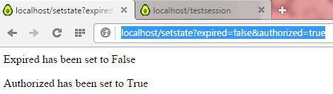
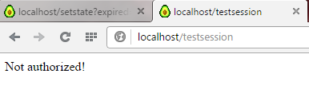

# 第六章会议

本节介绍的源代码位于[比特桶存储库](https://bitbucket.org/syncfusiontech/web-servers-succinctly)的文件夹**示例\第 6 章**中。Visual Studio 解决方案文件位于**第 6 章\克利夫顿。WebServer** 文件夹。

处理程序是无状态的——它们必须是无状态的，因为相同的代码可能在数百个线程上执行。但是，显然需要维护请求之间的信息，通常是授权令牌、用户名、最后一次请求时间等等。这些信息都在与用户的 IP 地址相关联的有状态会话中进行管理。

这里提供的会话管理实际上是一个基本实现，我当然不想假设您的授权、会话到期和用户角色管理需要什么。正如我们在介绍路由的章节中看到的，您可以使用“在罐子里”的路由处理程序，也可以为工作流提供不同的路由处理程序。

在本章中，我们将添加两个单独的工作流步骤:一个用于检查会话到期，另一个用于检查授权。如前一章所述，它们与请求动词和路径交织在一起。因此，像路由提供者一样，我们将实现一个测试，看看是否存在提供者，如果存在，根据提供者的响应继续或终止工作流。

当我们讨论会话时，我们还应该讨论跨站点请求伪造(CSRF)，因为这是一个在会话上下文中保留的令牌。

## 会议

首先，我们需要一个会话概念的容器。在下面的实现中，请注意会话提供了三件事:

*   一种管理会话是否已过期的方法。
*   一种管理用户是否被授权的方法。
*   应用可能希望在跨请求的会话中保留的键值对的一般集合。

```cs
    /// <summary>
    /// Sessions are associated with the client IP.
    /// </summary>
    public class Session
    {
      public DateTime LastConnection { get; set; }

      /// <summary>
      /// Is the user authorized?
      /// </summary>
      public bool Authorized { get; set; }

      /// <summary>
      /// This flag is set by the session manager if the session has expired between
      /// the last connection timestamp and the current connection timestamp.
      /// </summary>
      public bool Expired { get; set; }

      /// <summary>
      /// Can be used by controllers to add additional information that needs
      /// to persist in the session.
      /// </summary>
      private ConcurrentDictionary<string, object> Objects { get; set; }

      // Indexer for accessing session objects. If an object isn't found,
      // null is returned.
      public object this[string objectKey]
      {
        get
        {
          object val = null;
          Objects.TryGetValue(objectKey, out val);

          return val;
        }
        set { Objects[objectKey] = value; }
      }

      /// <summary>
      /// Object collection getter with type conversion.
      /// Note that if the object does not exist in the session, the default   /// value is returned.
      /// Therefore, session objects like "isAdmin" or "isAuthenticated"
      /// should always be true for their "yes" state.
      /// </summary>
      public T GetObject<T>(string objectKey)
      {
        object val = null;
        T ret = default(T);

        if (Objects.TryGetValue(objectKey, out val))
        {
          ret = (T)Converter.Convert(val, typeof(T));
        }

        return ret;
      }

      public Session()
      {
        Objects = new ConcurrentDictionary<string, object>();
        UpdateLastConnectionTime();
      }

      public void UpdateLastConnectionTime()
      {
        LastConnection = DateTime.Now;
      }

      /// <summary>
      /// Returns true if the last request exceeds the specified expiration
      /// time in seconds.
      /// </summary>
      public bool IsExpired(int expirationInSeconds)
      {
        return (DateTime.Now - LastConnection).TotalSeconds > expirationInSeconds;
      }

      /// <summary>
      /// De-authorize the session.
      /// </summary>
      public void Expire()
      {
        Authenticated = false;
        Expired = true;
      }
    }

```

代码清单 48

还要注意，我们使用的是`ConcurrentDictionary`，因为应用可能在我们不知道的情况下，在一个请求中建立自己的工作线程，其中每个线程可能同时访问会话信息。

## 会话管理器

接下来，我们需要一个会话管理器。如果会话不存在，会话管理器将创建该会话。如果确实存在，它会在会话过期时更新`Expired`标志——这是基于自上次请求以来的时间是否超过过期时间，默认情况下，过期时间设置为 10 分钟。

```cs
    public class SessionManager
    {
      public string CsrfTokenName { get; set; }
      public int ExpireInSeconds { get; set; }
       protected RouteTable routeTable;

      /// <summary>
      /// Track all sessions.
      /// </summary>
      protected ConcurrentDictionary<IPAddress, Session> sessionMap;

      public SessionManager(RouteTable routeTable)
      {
        this.routeTable = routeTable;
        sessionMap = new ConcurrentDictionary<IPAddress, Session>();
        CsrfTokenName = "_CSRF_";
        ExpireInSeconds = 10 * 60;
      }

      public WorkflowState Provider(
                     WorkflowContinuation<HttpListenerContext>  workflowContinuation,
                     HttpListenerContext context)
      {
        Session session;
        IPAddress endpointAddress = context.EndpointAddress();

        if (!sessionMap.TryGetValue(endpointAddress, out session))
        {
          session = new Session();
          session[CsrfTokenName] = Guid.NewGuid().ToString();
          sessionMap[endpointAddress] = session;
        }
        else
        {
          // If the session exists, set the expired flag before we
          // update the last connection date/time.
          // Once set, stays set until explicitly cleared.
          session.Expired |= session.IsExpired(ExpireInSeconds);
        }

        session.UpdateLastConnectionTime();     WorkflowState ret = CheckExpirationAndAuthorization(
           workflowContinuation, context, session);

        return ret;
      }

      protected WorkflowState CheckExpirationAndAuthorization(              WorkflowContinuation<HttpListenerContext> workflowContinuation,
                 HttpListenerContext context,              Session session)
      {     // Inspect the route to see if we should do session
        // expiration and/or session authorization checks.
        WorkflowState ret = WorkflowState.Continue;
        RouteEntry entry = null;

        if (routeTable.TryGetRouteEntry(context.Verb(), context.Path(), out entry))
        {
          if (entry.SessionExpirationProvider != null)
          {
            ret = entry.SessionExpirationProvider(workflowContinuation, context, session);
          }

          if (ret == WorkflowState.Continue)
          {
            if (entry.AuthorizationProvider != null)
            {
              ret = entry.AuthorizationProvider(workflowContinuation, context, session);
            }
          }
        }

        return WorkflowState.Continue;
      }
    }

```

代码清单 49

## CSRF 令牌

对于新会话，会注册一个 CSRF 令牌。我们可以在渲染页面时使用这个令牌，将其嵌入到`put`、`post`和`delete`对服务器的请求中，以保护服务器上的数据免受恶意伪造用户活动的人的攻击。我们将在后面关于视图引擎的章节中讨论这一点。

再次注意`ConcurrentDictionary`的使用，因为我们最有可能处理的是对服务器范围会话管理器的并发访问。

## 试试看

首先，让我们创建我们的`sessionManager`实例，并将其添加到工作流中:

```cs
    public static void InitializeSessionManager()
    {
      sessionManager = new SessionManager(routeTable);
    }

```

代码清单 50

接下来，我们设置了几个网页，让我们玩明确设置到期和授权。我们需要一个页面，告诉我们是否有过期或未经授权的请求。与路由示例一样，如果会话过期或未经授权，我们将抛出一个异常。

```cs
    routeTable.AddRoute("get", "testsession", new RouteEntry()
    {
      SessionExpirationProvider = (continuation, context, session) =>
      {
        if (session.Expired)
        {
          throw new ApplicationException("Session has expired!");
        }
        else
        {
          return WorkflowState.Continue;
        }
      },
      AuthorizationProvider = (continuation, context, session) =>
      {
        if (!session.Authorized)
        {
          throw new ApplicationException("Not authorized!");
        }
        else
        {
          return WorkflowState.Continue;
        }
      },
      RouteHandler = (continuation, context, session) =>
      {
        context.RespondWith("<p>Looking good!</p>");
        return WorkflowState.Done;
      }
    });

```

代码清单 51

我们还想要一个页面，让我们设置和清除`expired`和`authorized`标志。请注意，出于本演示的目的，我们不测试此页面的过期或身份验证！在这里，我们将从路由处理程序中的 URL 参数中获得一些乐趣:

```cs
    routeTable.AddRoute("get", "SetState", new RouteEntry()
    {
      RoutingProvider = (continuation, context, session) =>
      {
        Dictionary<string, string> parms = context.GetUrlParameters();
        session.Expired = GetBooleanState(parms, "Expired", false);
        session.Authorized = GetBooleanState(parms, "Authorized", false);     context.RespondWith(
          "<p>Expired has been set to " + session.Expired + "</p>"+
          "<p>Authorized has been set to "+session.Authorized + "</p>");

        return WorkflowState.Done;
      }
    });

```

代码清单 52

我们有一个小助手函数，可以将一些表示是和否的不同方式转换为`boolean`:

```cs
    public static bool GetBooleanState(
           Dictionary<string, string> parms,
           string key,
           bool defaultValue)
    {
      bool ret = defaultValue;
      string val;

      if (parms.TryGetValue(key.ToLower(), out val))
      {
        switch(val.ToLower())
        {
          case "false":
          case "no":
          case "off":
          ret = false;
          break;

          case "true":
          case "yes":
          case "on":
          ret = true;
          break;
        }
      }

      return ret;
    }

```

代码清单 53

我们将首先测试一个未过期的授权站点，它会返回:



图 9:未过期、已授权

现在，当我们用`testsession`网址测试我们的状态时，我们得到:


图 10:好看！

我们可以终止会话:


图 11:终止会话

这给了我们:


图 12:会话已过期

最后，我们可以取消会话授权:


图 13:取消会话授权

我们得到:



图 14:会话不再被授权

## 自动清理过期会话

重要的是我们要清理过期的会话。要做到这一点，问题变成了:我们什么时候真正删除会话的任何知识，而不是潜在地给用户一些反馈，比如“您的会话已经过期，请再次登录”？真正删除会话应该在会话过期后的某个时间发生，但最终，这是创建 web 应用的开发人员的决定。我们最多可以在会话管理器中提供此功能，该功能使用特定的“自该日期/时间以来未看到任何用户活动”标准来清理会话:

```cs
    public void CleanupDeadSessions(int deadAfterSeconds)
    {
      sessionMap.Values.Where(s =>
        s.IsExpired(deadAfterSeconds)).ForEach(s =>
          sessionMap.Remove(s.EndpointAddress));
    }

```

代码清单 54

真正由您决定何时调用该函数，但我建议使用每分钟左右触发一次的工作线程。

## 重复使用

在前面的代码中，我将会话到期和授权检查嵌入为匿名函数。这不是一个容易重用的模式——我当然不建议您为每个路由处理程序复制和粘贴几个匿名方法——它只是为了保持代码示例的严密性。

例如，您可以向`RouteTable`添加一些扩展方法:

```cs
    public static class RouteTableExtensions
    {
      /// <summary>
      /// Add a route with session expiration checking.
      /// </summary>
      public static void AddExpirableRoute(this RouteTable routeTable,
        string verb,
        string path,
        Func<WorkflowContinuation<HttpListenerContext>, HttpListenerContext, Session,     
          PathParams, WorkflowState> routeHandler)
      {
        routeTable.AddRoute(verb, path, new RouteEntry()
        {
          SessionExpirationHandler = (continuation, context, session, parms) =>
          {
            /* Your expiration check */
            return WorkflowState.Continue;
          },
          RouteHandler = routeHandler,
        });
      }

      /// <summary>
      /// Add a route with session expiration and authorization checking.
      /// </summary>
      public static void AddExpirableAuthorizedRoute(this RouteTable routeTable,
      string verb,
      string path,
      Func<WorkflowContinuation<HttpListenerContext>, HttpListenerContext, Session,     PathParams, WorkflowState> routeHandler)
      {
        routeTable.AddRoute(verb, path, new RouteEntry()
        {
          SessionExpirationHandler = (continuation, context, session, parms) =>
          {
            /* Your expiration check */
            return WorkflowState.Continue;
          },

          AuthorizationHandler = (continuation, context, session, parms) =>
          {
            /* Your authentication check */
            return WorkflowState.Continue;
          },

          RouteHandler = routeHandler,
        });
      }
    }

```

代码清单 55

您现在可以更轻松地重新使用到期检查和授权检查；例如:

```cs
    routeTable.AddExpirableRoute("get", "somepath", myRouteHandler);
    routeTable.AddExpirableAuthorizedRoute("get", "someotherpath", myRouteHandler);

```

代码清单 56

## 结论

在这一点上，我们的网络服务器提供了很多功能。我们可以:

*   管理会话状态。
*   将会话到期和授权纳入我们的路由。
*   将请求路由到自定义处理程序。
*   基于网址和请求正文参数实现行为。
*   使用默认页面、自定义 HTML 和/或自定义响应正文进行响应。
*   处理 REST 端点调用。

但是，还有一些事情要做，例如:

*   参数化路线(内嵌标识的路线)。
*   更好的错误处理——为“找不到页面”和“会话过期”之类的事情抛出异常并不理想！
*   支持 HTTPS。
*   查看引擎。
*   一些 AJAX 例子。

我们将在剩下的章节中研究这些问题。