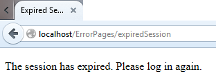
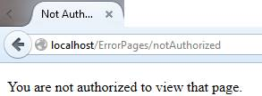
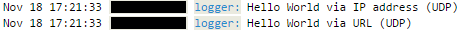
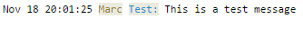

# 第 8 章错误处理和重定向

本节介绍的源代码位于[比特桶存储库](https://bitbucket.org/syncfusiontech/web-servers-succinctly)的文件夹**示例\第 8 章**中。Visual Studio 解决方案文件位于**第 8 章\克利夫顿。WebServer** 文件夹。

抛出异常代价高昂，而且显示异常消息并不是用户最友好的做法，而且可能会暴露服务器的内部细节，使其更容易受到攻击。我们应该将用户重定向到错误页面，而不是抛出异常。因为重定向是路由处理程序的常见操作，所以我们将以通用的方式实现它，并在这个过程中发现一些有趣的东西。

典型的错误页面包括:

*   会话已过期
*   找不到页面
*   找不到文件
*   未授权
*   服务器错误

“服务器错误”是服务器代码引发的实际异常的总称。

你可以把这些页面放在你网站的任何地方——我倾向于把它们放在网站\错误页面文件夹中。

我们将重构之前创建的`restricted`和`testsession`路由，改为进行页面重定向:

```
    // Test session expired and authorization flags.
    routeTable.AddRoute("get", "testsession", new RouteEntry()
    {
      SessionExpirationHandler = (continuation, context, session, parms) =>
      {
        if (session.Expired)
        {
          // Redirect instead of throwing an exception.
          context.Redirect(@"ErrorPages\expiredSession");
          return WorkflowState.Abort;
        }
        else
        {
          return WorkflowState.Continue;
        }
      },
      AuthorizationHandler = (continuation, context, session, parms) =>
      {
        if (!session.Authorized)
        {
          // Redirect instead of throwing an exception.
          context.Redirect(@"ErrorPages\notAuthorized");
          return WorkflowState.Abort;
        }
        else
        {
          return WorkflowState.Continue;
        }
      },
      RouteHandler = (continuation, context, session, parms) =>
      {
        context.RespondWith("<p>Looking good!</p>");
        return WorkflowState.Done;
      }
    });

```

代码清单 61

在前面的代码清单中，您会注意到我使用的是 Windows 路径分隔符 **\** 。我们必须在`Redirect`扩展方法中解决这个问题:

```
    /// <summary>
    /// Redirect to the designated page.
    /// </summary>
    public static void Redirect(this HttpListenerContext context, string url)
    {
      url = url.Replace('\\', '/');
      HttpListenerRequest request = context.Request;
      HttpListenerResponse response = context.Response;
      response.StatusCode = (int)HttpStatusCode.Redirect;
      string redirectUrl = request.Url.Scheme + "://" + request.Url.Host + "/" + url;
      response.Redirect(redirectUrl);
      response.OutputStream.Close();
    }

```

代码清单 62

请注意，在前面的代码中列出了响应`StatusCode`必须如何设置为`Redirect`。在我对不同浏览器的测试中，如果我们不这样做，一些浏览器将不会更新地址栏上的网址。

现在让我们来测试一下。我们将使用测试网址将会话状态设置为`expired`:

```
    http://localhost/setstate?expired=true&authorized=true

```

代码清单 63

当我们导航到`localhost/testsession`时，我们会看到:



图 27:重定向

同样，我们将会话状态设置为`unauthorized`:

```
    http://localhost/setstate?expired=false&authorized=false

```

代码清单 64

我们看到:



图 28:重定向

我们现在有一种优雅地处理错误的方法。我们还可以将“发生了非常糟糕的事情”异常处理程序替换为:

```
    static void OnException(HttpListenerContext context, Exception ex)
    {
      if (ex is FileNotFoundException)
      {
        // Redirect to page not found
        context.Redirect(@"ErrorPages\pageNotFound");
      }
      else
      {
        // Redirect to server error
        context.Redirect(@"ErrorPages\serverError");
      }
    }

```

代码清单 65

请注意，根据异常情况，我们如何重定向到两个不同的页面。

## 日志服务

您可能想考虑像 PaperTrail 这样的日志服务，我在[代码项目](http://www.codeproject.com/Articles/843938/Logging-With-PaperTrail-Directly-In-Your-Applicati)中写过。向 paperport trail 发送 UDP 消息既快速又简单:

```
    private static void SendUdpMessage(
      IPAddress address,
      int port,
      string message)
    {
      Socket socket = new Socket(
               AddressFamily.InterNetwork,
               SocketType.Dgram,
               ProtocolType.Udp);
      IPEndPoint endPoint = new IPEndPoint(address, port);
      byte[] buffer = Encoding.ASCII.GetBytes(message);
      socket.SendTo(buffer, endPoint);
      socket.Close();
    }

```

代码清单 66

该日志可以在您的浏览器中查看，显示如下:



图 29:纸张跟踪日志消息示例

PaperTrail 符合 [RFC-5424](https://tools.ietf.org/html/rfc5424) 中描述的系统日志协议，因此您可以使用该协议格式化您的消息。例如:

```
    logger.Log("<22>" +
        DateTime.Now.ToString("MMM d H:mm:ss") +
        " Marc Test: This is a test message");

```

代码清单 67

这将导致以下日志条目(注意 PaperTrail 所做的突出显示):



图 30:系统日志协议