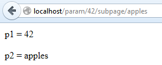

# 第九章参数化路线

本节介绍的源代码位于[比特桶存储库](https://bitbucket.org/syncfusiontech/web-servers-succinctly)的文件夹**示例\第 9 章**中。Visual Studio 解决方案文件位于**第 9 章\克利夫顿。WebServer** 文件夹。

常见的做法是在路线中添加参数。您会看到这在 Ruby on Rails 应用中经常使用，尽管我更喜欢将参数放在 URL 的参数部分。无论如何，没有理由制造一个“马克·克利夫顿”的固执己见的服务器，所以我们应该支持这个功能。

什么是参数化路线？可能是这样的:

`localhost/items/1/subitems`

其中`1`是物品集合中某个物品的 ID。

或者，另一个例子:

`localhost/items/groceries/subitems`

其中`groceries`是 items 集合中某个项目的名称。路由器会对第二种形式做出各种假设，用标识值替换“杂货”。以下是一些可能的假设:

*   有一张桌子叫“物品”。
*   有一个模型叫做单数形式的“项目”。
*   模型可以(也可以不)定义一种将非数字参数映射到查找字段的方法。
*   路由器能够直接从数据库或通过模型间接从非数字参数中查找标识。

这个问题可能要复杂得多。考虑 [NancyFx](https://github.com/NancyFx/Nancy/wiki/Defining-routes) 支持的路由选项:

*   文字段(如`mypage/mystuff/foobar`)。
*   捕捉像`/tasks/{tasked}`这样的片段(我称之为参数化 URL)。
*   可选捕获段。
*   用默认值捕获段。
*   RegEx 段。
*   贪婪的片段。
*   贪婪的 RegEx 段。
*   多个捕获段。

这些都是在路由处理程序上匹配网址的潜在有用方法。这应该会让你感觉到路由的复杂性。为了本章的目的，我们将保持它相当简单，并专注于简单地捕获参数并将其传递到`PathParams`集合中的路由处理程序。但是它确实建议有一种方法可以针对非常特殊的路由需求回调应用。

## 商定语法

我们可以使用任何我们想要的语法来指定路径中的参数。例如，我们可能需要这样一个表单(由 Rails 使用):

```cs
    param/:p1/subpage/:p2

```

代码清单 68

然而，我们将使用 ASP.NET MVC 和 NancyFx 形式:

```cs
    param/{p1}/subpage/{p2}

```

代码清单 69

## 处理身份证

回想一下我们在`RouteHandler`中进行的调用，试图获取路由处理器:

```cs
    if (routeTable.TryGetRouteEntry(context.Verb(), context.Path(), out entry))

```

代码清单 70

它目前被实现为这两个名称的一些重载方法:

```cs
    public RouteEntry GetRouteEntry(RouteKey key)
    {
    return routes.ThrowIfKeyDoesNotExist(key, "The route key " + key.ToString() + " does not exist.")[key];
    }

    public bool TryGetRouteEntry(string verb, string path, out RouteEntry entry)
    {
      return routes.TryGetValue(NewKey(verb, path), out entry);
    }

```

代码清单 71

在这里，我们期望请求路径和路由定义完全匹配。我们需要重构这段代码(以及代码中的一些其他区域，因为它们很小，所以我不会显示)，以匹配参数化的 URL，我们希望这些参数在键值字典中返回，我只是为它们导出了一个特定的类型:

```cs
    public class PathParams : Dictionary<string, string>
    {
    }

```

代码清单 72

我们将`GetRouteEntry`方法重构为类似的形式(未显示所有重载):

```cs
    public RouteEntry GetRouteEntry(RouteKey key, out PathParams parms)
    {
      parms = new PathParams();
      RouteEntry entry = Parse(key, parms);

      if (entry == null)
      {
        throw new ApplicationException("The route key " + key.ToString() + " does not exist.");
      }

      return entry;
    }

```

代码清单 73

我们实现了一个简单的解析器，它遍历路由，找到第一个匹配的。这个方法有两个部分:迭代器和匹配器。首先，迭代器:

```cs
    /// <summary>
    /// Parse the browser's path request and match it against the routes.
    /// If found, return the route entry (otherwise null).
    /// Also if found, the parms will be populated with any segment parameters.
    /// </summary>
    protected RouteEntry Parse(RouteKey key, PathParams parms)
    {
      RouteEntry entry = null;
      string[] pathSegments = key.Path.Split('/');

      foreach (KeyValuePair<RouteKey, RouteEntry> route in routes)
      {
        // Above all else, verbs must match.
        if (route.Key.Verb == key.Verb)
        {
          string[] routeSegments = route.Key.Path.Split('/');

          // Then, segments must match.
          if (Match(pathSegments, routeSegments, parms))
          {
            entry = route.Value;
            break;
          }
        }
      }

      return entry;
    }

```

代码清单 74

接下来是匹配器(请注意，如果我们愿意，我们可以在这里添加额外的行为来匹配捕获片段):

```cs
    /// <summary>
    /// Return true if the path and the route segments match. Any parameters in the path
    /// get put into parms. The first route that matches will win.
    /// </summary>
    protected bool Match(string[] pathSegments, string[] routeSegments, PathParams parms)
    {
      // Basic check: # of segments must be the same.
      bool ret = pathSegments.Length == routeSegments.Length;

      if (ret)
      {
        int n = 0;

        // Check each segment.
        while (n < pathSegments.Length && ret)
        {
          string pathSegment = pathSegments[n];
          string routeSegment = routeSegments[n];
          ++n;

          // Is it a parameterized segment (also known as "capture segment")?
          if (routeSegment.BeginsWith("{"))
          {
            string parmName = routeSegment.Between('{', '}');
            string value = pathSegment;
            parms[parmName] = value;
          }
          else // We could perform other checks, such as regex.
          {
            ret = pathSegment == routeSegment;
          }
        }
      }

      return ret;
    }

```

代码清单 75

## 测试一下！

让我们编写一个路由处理程序，它需要两个参数，并在浏览器中返回我们的参数值。实现看起来是这样的(注意，`RouteHandler`也被重构以添加一个`PathParams`参数):

```cs
    routeTable.AddRoute("get", "param/{p1}/subpage/{p2}", new RouteEntry()
    {
      RouteHandler = (continuation, context, session, parms) =>
      {
        context.RespondWith("<p>p1 = " +
          parms["p1"] + "</p><p>p2 = " +
          parms["p2"] + "</p>");
        return WorkflowState.Done;
      }
    });

```

代码清单 76

现在，当我们访问该页面并将一些参数直接替换到 URL 中时，我们看到服务器回显我们捕获的参数:



图 31:路径参数

请注意，我们并不关心参数类型:它可以是整数、浮点数或字符串，只要它包含 URL 路径部分的有效字符。

## 结论

虽然相对容易实现，但参数化路由增加了解析路由的复杂性，因此降低了应用的性能，尤其是当您有数百条路由和数千个并发请求时。这就是为什么，在本章的开始，我声明我不喜欢参数化的网址。

虽然支持参数化路由很有用，但我们仍然应该支持之前实现的更优化的查找。这是通过首先用路径“原样”检查路由表来实现的这里没有显示它的实现，但是在本书的源代码 repo 中。