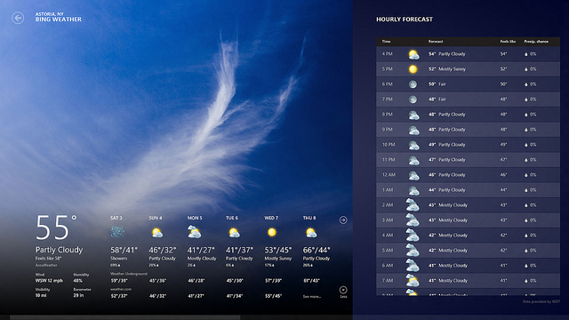
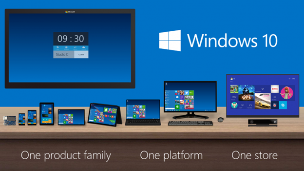
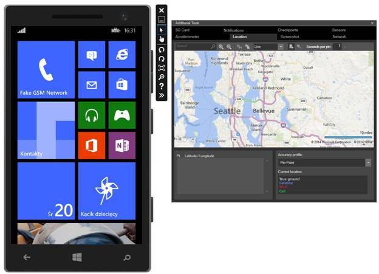
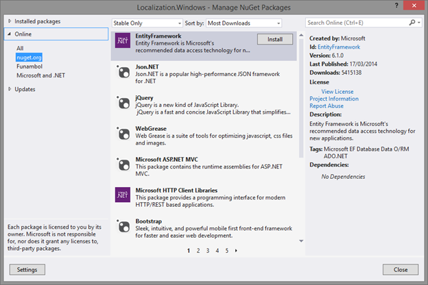

# 第一章引言

最近几年，科技世界面临着许多重要的变化。直到几年前，个人电脑还是连接数字世界的主要且唯一的工具:人们用它们来上网、写文档、看视频、玩游戏和进行商业活动。

如今，个人电脑仍然发挥着重要作用，但由于其独特的功能，如长电池寿命、重量轻、硬件传感器和连接性，它们经常被新设备(如智能手机和平板电脑)取代或一起使用，这开辟了一系列新的场景。

Windows 和 Windows Phone 是微软生态系统中的两个关键平台，它们是为了应对这个不断变化的世界中的用户需求而创建和发展的。

## Windows 8.1

Windows 8 已经成为微软生态系统中的游戏规则改变者:在 Windows 7 之前，Windows 主要是一个致力于台式机和笔记本电脑的传统平台。相反，Windows 8 引入了一种新的方法。由于其新的开始屏幕取代了旧的开始菜单，以及新的视窗商店应用程序，该平台已被重新设计，以实现触摸体验。基于鼠标和键盘的老桌面体验还在，你还能用；然而，新的操作系统也针对平板电脑和新一代设备进行了优化，如超极本和敞篷车，它们将传统的桌面体验与触摸屏界面相结合。

Windows 8 对开发者来说也是一个游戏规则的改变者:新的 Windows 商店应用不再依赖传统的。NET 框架，它是最近几年许多微软技术的基础开发平台(如 WPF、Silverlight 或 ASP。NET)。事实上，Windows 8 引入了一个新的本机运行时平台，称为 Windows Runtime，它为现代设备和应用程序中使用的最新、最强大的技术(如运动传感器、地理定位、蓝牙等)提供了更好的性能和更好的支持。).

Windows 8 还改变了微软操作系统的典型生命周期。技术世界变化很快，传统的 Windows 开发周期(每三年发布一次操作系统，中间有少量 Service Packs)已经不足以跟上竞争对手的步伐。有了 Windows 8，微软正在增加发布频率；Windows 8.1 是这种新方法的第一个成果。在 Windows 8 发布大约一年后，它增加了许多新功能，既面向消费者(如新的平铺格式、新的控制面板、更好的 OneDrive 集成等)。)和开发人员(拥有 5000 个新的 API、新的硬件支持等。).几个月后，微软再次更新了操作系统，发布了 Windows 8.1 Update 1，增加了许多功能来改善传统的鼠标和键盘桌面体验。

图 Windows 8.1 开始屏幕

## Windows Phone 8.1

Windows Phone 是最早展示微软新身份的产品之一。该平台引入的许多新概念(平面设计、实时平铺、新的开发方法等。)已经成为后来所有微软产品和服务的基础，比如 Windows 8 或 Xbox One。此外，视窗手机是第一款打破旧视窗世界遗产的真正消费产品。它是 Windows Mobile 的继承者，但除了内核之外，从用户体验到应用开发方法，它与旧平台没有任何共同之处。

Windows Phone 的一个特殊功能是硬件方法，它充分利用了苹果和谷歌的优势。像谷歌一样，微软允许多个供应商创建 Windows Phone 设备。由于这种选择，您可以在市场上找到各种不同外形、硬件功能和价格的手机。同时，微软对操作系统拥有完全的控制权:厂商无法定制基本的用户体验。因此，无论用户打算购买哪种设备，他们都可以使用相同的功能和界面，这使得 Windows Phone 为所有人所熟悉，并且易于识别。此外，微软还定义了一套对开发人员有帮助的标准硬件要求，开发人员可以开发应用程序，而不用担心运行应用程序的手机会缺少基本功能(如全球定位系统或加速度计)。

第一个 Windows Phone 版本标有 7.0 版本号。这是一个良好的开端，但与竞争对手相比，它缺乏许多功能，因为微软必须从头开始开发其移动平台。因此，几个月后微软宣布了 Windows Phone 7.5，这是第一次重大更新，为双方消费者引入了许多新功能(任务切换器、语音集成、社交网络集成等)。)和开发人员(后台执行、数据库支持等。).

然而，在 Windows Phone 7.5 发布后，Windows 8 问世了，从技术角度来看，它在两个平台之间造成了错位。尽管对用户来说有相似之处(平面设计、实时切片、应用程序的生命周期等)。，)，引擎盖下有很多不同。事实上，Windows Phone 7.5 仍然依赖旧的 Windows Mobile 内核和 Silverlight 框架进行应用程序开发。

Windows Phone 8.0 是这一场景中的第一个游戏规则改变者:它引入了许多重要的消费者功能(重新设计的开始屏幕、新的瓦片、对 NFC 等新技术的支持等)。)，但更重要的是，它开始将平台与“老大哥”Windows 8 看齐。微软用相同的 Windows 8 内核取代了旧的 Windows Mobile 内核，这使得两个平台共享一个通用的基础设施、通用的驱动程序和通用的安全功能。

从开发人员的角度来看，情况也开始发生变化:Windows Phone 7.5 应用程序仍然依赖于 Silverlight 框架，但由于新的 Windows Runtime 的一个特殊子集，微软开始在两个平台之间引入一些相似之处。因此，许多应用编程接口和功能(如存储访问、传感器和蓝牙)在它们之间共享，因此您可以通过编写相同的代码在两个平台上实现相同的目标。

然而，只有大约 30%的 API 在两个平台之间共享，并且许多关键场景(实时切片、应用程序的生命周期、XAML 控件等)共享。)以不同的方式实现。Windows Phone 8.1 解决了其中的大部分问题:通过共享 90%以上的相同 API，开发人员现在终于能够用一个公共的代码库为两个平台编写应用程序。

从消费者的角度来看，Windows Phone 8.1 也是一个巨大的更新，增加了像 Cortana(数字语音助手)、World Flow 键盘、通知中心、更好的 SD 卡支持等重要功能。然而，该团队并没有固步自封:在 Windows Phone 8.1 发布几个月后，微软发布了 Windows Phone 8.1 Update 1，推出了许多新的有趣的消费者功能，如支持 Live Folders、更好地支持配件应用程序(如智能手表或健身腕带)、改进消息管理等。

图 Windows Phone 8.1 启动屏幕

## 视窗商店应用程序

视窗商店应用程序是一种新的应用程序，与旧的传统桌面应用程序相比，它提供了一种完全不同的方法。最大的区别是设计和用户体验。Windows 商店应用程序通常以全屏方式运行，而不是依赖于基于 Windows 的旧方法，尽管它们仍然支持鼠标和键盘(Windows 8)等传统输入，但它们针对触摸屏的使用进行了优化。

此外，生命周期非常不同，因为它们不仅是为传统电脑制造的，也是为智能手机和平板电脑制造的。良好的性能和低电池消耗是两个关键因素，因此，在内存使用和后台执行方面，他们需要遵守一系列限制(我们将在第 4 章中详细介绍)。

移动应用的其他重要要求是稳定性和安全性。平板电脑和智能手机应该总是对用户交互反应迅速，应用程序不应该破坏操作系统，使设备使用缓慢或不安全。因此，Windows Store 应用程序在沙箱中运行:除非用户或应用程序允许，否则不允许它们访问其他应用程序或操作系统公开的数据。

最后但同样重要的是，Windows Store 应用程序有一种独特的视觉风格，称为现代设计，它依赖于以下原则:

*   **工艺自豪感:**就像工匠在工作中注重细节一样，设计师应该注重视觉元素的正确平衡，并正确对齐页面中放置的各种控件。
*   **快速流畅:**用户界面应易于在触摸屏上使用，并应对用户交互做出快速反应。这个原则也适用于动画的明智使用:它们应该是快速和流畅的——它们不必降低用户体验。
*   **真正的数字化:**这可能是现代设计最重要和最具创新性的原则，最早是由微软推出的，但在今天，它是软件或网站设计中使用最广泛的方法之一。过去很多软件产品(网站、移动操作系统等)的视觉设计。)是用一种叫做“T2”的方法定义的。它的目的是尽可能地模仿真实世界的物体。iOS 7 之前的 iOS 版本就是这种方法的一个很好的例子:日历应用程序被渲染为真实的日历；notes 应用程序被设计成一套纸张等。随着时间的推移，这种方法开始变得不那么相关，因为它试图模仿那些在日常生活中不再广泛使用的物体。“真正数字化”的方法与 skeuomorphism 相反:用户界面应该简单而现代，这样用户可以立即理解他使用的是数字产品，而不是真实对象的仿真。
*   **少花钱多办事:**这个原理与另一个重要的概念有关，那就是“内容重于铬。”在最近几年，设计师试图用效果和动画来填充网站和应用程序的视觉布局，这些效果和动画经常会分散用户对真实内容的注意力。这个原则颠覆了这种方法，将内容放在应用程序的中心:效果和动画仍然有空间，但只有当它们为用户增加价值时，而不是当它们从内容中窃取空间时。
*   **Win as one** :这个原则与原生的 Windows 和 Windows Phone 体验是严格相连的，它允许开发人员将他们的应用程序与他们的操作系统集成在一起，并遵循基本准则。这样，无论用户使用哪种应用，他们都会发现自己在家。

图 3:适用于 Windows 8.1 的 Windows 商店应用:MSN 天气

## 商店

Windows 商店应用程序在受保护的环境中运行，因此，它们使用一个独特的渠道分发:商店。这是一个受控的环境:当您发布应用程序时，它会经历一个认证过程，以确保该应用程序符合微软概述的技术和安全要求以及用户体验准则。应用程序也可以手动分发，但不能在消费者场景中分发:手动部署仅支持测试和企业场景。

需要注意的是，在撰写本文时，通用的 Windows 应用程序仍然输出两个不同的二进制文件，因此 Windows 的 Windows Store 应用程序不能在 Windows Phone 上运行，反之亦然。因此，这里没有单一的商店，而是有两个不同的商店，每个商店只为他们运行的特定平台分发应用程序。但是，由于共享的身份，您将能够在两家商店连接您的应用程序的两个版本。例如，这样一来，如果用户想同时下载平板电脑和手机版的应用程序，就不必支付两次费用。我们将在第 12 章看到更多细节。

应用程序可以使用开发者帐户在商店中发布，该帐户可以从微软购买。个人花费 19 美元，公司花费 99 美元；两者都是一次性费用。但是，有两种方法可以获得免费的开发人员帐户:

*   如果你是一名学生，你可以获得一个免费的代币，这要归功于一个名为“梦想火花”的特别项目(更多关于[http://www.dreamspark.com](http://www.dreamspark.com)的详细信息)。
*   如果您是 MSDN 订户，您可以获得免费代币，作为某些订阅类型的部分优惠。

尽管有两个商店，但开发者帐户是唯一的，并允许您为两个平台发布应用程序。由于有了这个帐户，您将能够发布免费和付费应用程序。对于付费应用，微软将保留应用价格的 30%，剩下的 70%留给开发者。

## Windows 运行时

Windows 8 不仅是用户的突破，也是开发者的突破。视窗商店应用程序，而不是依赖。NET 框架，开发人员以前用来创建桌面和网络应用程序，是基于一个新的运行时平台称为 Windows Runtime。这是一个构建在 Windows 内核之上的本机运行时，提供了一组应用程序可以用来与硬件和操作系统交互的 API。它使用了与旧方法类似的方法，基于组件对象模型，创建于 1993 年，目标是定义一个可以用不同语言访问的单一平台。

Windows Runtime 采用了类似的方法，引入了**语言** **投影**，这是在运行时之上添加的层，允许开发人员使用众所周知和熟悉的语言与 Windows Runtime 进行交互，而不是强迫他们只学习和使用 C++。现有的预测是:

*   **XAML 和 C#或者 VB。NET:** 这是 Windows Phone 开发者会比较熟悉的投影，因为可以用它来开发 Windows Store 应用，用 C#或者 VB.NET 为逻辑，用 XAML 来定义布局。这个投影是用。NET 框架 4.5。
*   **HTML 和 Javascript:** 这是最受 web 开发人员赞赏的投影，因为它允许他们使用 web 技术来创建 Windows Store 应用程序。应用程序的布局是使用 HTML 5 定义的，而逻辑是基于一个名为 WinJS 的特殊库，该库允许使用 JavaScript 访问 Windows Runtime APIs。
*   **XAML 和 C++** :这个投影可以使用一个叫做 C++ / CX 的 C 扩展来创建原生应用程序，这使得开发人员更容易使用 C++与 Windows Runtime 进行交互。
*   **C++和 Direct X** :这种投影对于游戏特别有用，因为它允许开发人员创建本地应用程序，利用 Direct X 库提供的所有强大功能来渲染 2D 和 3D 图形。

使用特殊的元数据文件来描述 Windows 运行时库，这使得开发人员可以使用他们所使用的语言的特定语法来访问 API。这样，投影也能够尊重语言约定和类型，比如 C#的大写，或者 JavaScript 的 camel case。

在 Windows Phone 8.0 中增加了 Windows Runtime 支持，有一个特定的子集叫做**Windows Phone 的 Windows Runtime**。然而，正如我已经提到的，只有大约 30%的应用编程接口在 Windows 和 Windows Phone 之间共享。Windows Phone 8.1 不仅通过共享 95%以上的应用程序接口，还通过共享 Windows 商店应用程序的概念和模型，引入了几乎完全的 Windows 运行时实现。

这本书的重点是 XAML 和 C#投影；即使所描述的 API 和特性可用于任何项目，代码示例也仅在 XAML 和 C#中可用。

图 4:视窗运行时架构

## 通用视窗应用

Windows Phone，在 8.1 版本之前，严重依赖 Silverlight 框架:即使有 Windows Runtime，并且两个平台之间共享了一些 API，但在大多数情况下，为 Windows 和为 Windows Phone 创建应用程序是一种非常不同的体验。事实上，许多基本概念(如导航、应用程序生命周期和可视化控件)尽管有相似之处，但都是以不同的方式实现的，这使得开发人员在两个平台之间共享代码变得更加复杂。

有了 Windows Phone 8.1，一切都变了。随着两个平台几乎完全融合，现在您可以为 Windows 和 Windows Phone 创建 Windows Store 应用程序，它们可以共享大部分代码、资产和视觉控件。通用视窗应用程序也可以共享相同的身份，这意味着数据、购买和漫游设置可以在多个设备上共享。

然而，有一件重要的事情需要强调:Windows 和 Windows Phone 的 Windows Store 应用程序仍然输出两个独立的二进制文件，它们使用两个不同的存储进行分发。Windows 商店应用程序不能在 Windows Phone 上运行，反之亦然。因此，“通用视窗应用程序”的概念并没有定义一个真正的应用程序，而是指一个特定的 Visual Studio 模板，它允许代码在同一个应用程序的两个版本之间轻松共享。我们将在接下来的章节中了解到，Universal Windows 应用程序模板由三个项目组成:一个用于 Windows，一个用于 Windows Phone，一个用于 shared，在这三个项目中，您可以包含您想要在两个平台之间共享的所有资产、类和可视化控件。

## 【Windows Phone 8.1 的 Silverlight

如果您已经是一名 Windows Phone 开发人员，您会发现与 Windows Phone Silverlight 应用程序相比，Windows Store 应用程序有许多不同之处。即使基本概念相同，也有许多关键场景以不同的方式(如导航或应用程序的生命周期)或不同的 API(如推送通知、切片管理和网络操作)实现。

因此，如果您已经开发了一个 Windows Phone 应用程序，并且想要将其转换为 Windows Store 应用程序，Visual Studio 不会提供自动转换的方法。由于布局控件和 API 中的许多重大变化，这是一个只能手动执行的操作，方法是重写布局或使用不再可用的控件和 API 的代码。

由于这种方法需要所有的 Windows Phone 开发人员重写现有的应用程序，微软找到了一种方法来保持与 Silverlight 框架的兼容性，同时允许使用 Windows Phone 8.1 中添加的大多数新功能。**Silverlight for Windows Phone 8.1**是 Silverlight 的更新版本，保证与你现有应用的代码库兼容。这样，您只需在 Visual Studio 中升级您的项目，就可以瞄准 Windows Phone 8.1，这将使您能够访问新的应用编程接口和功能。您不必更改现有的代码——所有旧的 Silverlight APIs 将继续正常工作。然而，这种方法有一个缺点:您将无法使用通用的视窗应用程序模板，因为在幕后，您仍然需要处理一个 Silverlight 应用程序。因此，在 Windows 商店应用程序和 Windows Phone 的 Silverlight 应用程序之间共享代码并不像使用 Windows 商店应用程序那样容易。

因此，本书将只关注 Windows 商店应用程序和通用 Windows 应用程序模板。您将能够在 Silverlight 应用程序中使用本书中描述的大多数功能和应用编程接口，但是当涉及到基本概念(如导航、应用程序生命周期和布局控件)时，您会发现只参考了窗口商店应用程序方法。

如果你想了解更多的 Silverlight 应用，可以从[http://Syncfusion . com/resources/tech portal/ebooks/window sphone 8](http://syncfusion.com/resources/techportal/ebooks/windowsphone8)下载我之前的 Syncfusion 书 *Windows Phone 8 Development 简洁明了*。

## Windows vs Windows RT

当你使用智能手机应用程序时，你通常不必担心中央处理器架构:市场上所有的视窗手机设备都基于 ARM，这是智能手机市场上非常常用的中央处理器架构，因为它性能好，电池消耗低。因此，所有分布在视窗手机商店的应用程序都是为 ARM 处理器架构编译的。

然而，说到 Windows，情况就不一样了:Windows 8 是一个同时针对平板电脑和传统电脑的操作系统。虽然平板电脑通常基于 ARM，但传统电脑基于 x86/x64 架构，这种架构受到英特尔和 AMD 等公司的欢迎。

因此，微软创建了两个不同版本的操作系统:运行在 x86/x64 处理器上的 Windows 8 和运行在 ARM 处理器上的 Windows RT。第一个是传统的视窗版本，它提供了对新的视窗商店应用程序和传统桌面以及所有现有应用程序的全面支持。你可以在传统电脑和平板电脑上找到它。得益于英特尔在最新处理器方面所做的工作，华硕或戴尔等硬件制造商已经开发出了运行完整版本 Windows 的平板电脑，同时提供了良好的性能和电池续航时间。

相反，Windows RT 是为平板电脑制作的特殊 Windows 版本。乍一看像是完整的 Windows 版本，但因为架构不同，传统桌面应用不会运行(除了微软直接提供的，像是特别的 Office 2013 版本，是预装的)；只能执行 Windows 商店应用程序。Windows RT 版本最大的优势是更为消费者友好:由于传统的 X86 应用和进程无法运行，平台基本不会受到恶意软件和病毒的侵害，所以对于计算机知识不多的人来说使用起来更安全。微软已经创建了自己的设备，运行 Windows RT，名为 Surface(不要与 Surface Pro 混淆，Surface Pro 是一款全功能 PC，大小相当于运行完整 Windows 版本的平板电脑)。

在大多数情况下，开发人员不必担心 CPU 架构；由 Visual Studio 编译的 Windows Store 应用程序可以在两种架构上运行，而无需任何更改。唯一的例外是当您需要在项目中使用本机库时:不能为两种架构编译本机代码，因此您需要创建两个不同版本的应用程序。商店将根据用户的设备负责分发合适的产品。我们将在接下来的章节中更多地讨论这种方法，届时我们将需要使用一些本机库，如 SQLite。

## 接下来是什么？Windows 10

微软已经推出了他们下一个操作系统 Windows 10 的技术预览版。该版本将如何影响应用程序开发仍不得而知:技术预览版的主要重点是提供对平台所有新功能的一瞥，以赢回对新操作系统方法(新的开始屏幕菜单、全屏应用程序等)持怀疑态度的传统桌面用户。).一些新功能包括:

*   重新设计的开始屏幕，结合了 Windows 7 和 Windows 8 的最佳方法:这是一个传统的开始屏幕菜单，但能够显示来自 Windows 商店应用程序的实时切片。
*   能够在窗口中运行 Windows Store 应用程序，该窗口可以像传统桌面应用程序一样调整大小。
*   改进以更好地将触摸体验与传统鼠标体验分开。例如，只有当用户正在与设备的触摸屏交互时，才会显示魅力栏和旧的开始屏幕。

9 月底发布第一期《技术预览版》时，微软就明确表示，Windows 10 将是其所有即将推出产品的基础核心:Windows、Windows Phone、Xbox One 等。因此，在未来，我们可以期待运行在每个平台上的窗口运行时和商店体验的更紧密集成和更好的融合。

图 5:跨多个设备的 Windows 10 融合

## 开发工具

为 Windows 和 Windows Phone 开发 Windows Store 应用的工具是 **Visual Studio 2013** ，有多个版本:

*   社区版，可从[http://www . visualstudio . com/en-us/products/visual-studio-Community-vs](http://www.visualstudio.com/en-us/products/visual-studio-community-vs)下载。这是一个完全免费的版本，具有专业版提供的相同功能。个人开发者、学生、开源项目开发者和小公司都可以使用它。
*   不同的付费版本可以从微软购买，也可以与 MSDN 套餐捆绑购买。在这种情况下，您至少需要安装更新 2，它增加了对通用视窗应用程序和视窗手机 8.1 的支持。

就 Windows Store 应用程序开发体验而言，您不会在社区版本中发现任何差异或限制:您将能够以与专业 Visual Studio 版本相同的方式创建和发布应用程序。如果你是学生，还可以查看 DreamSpark 程序([https://www.dreamspark.com/](https://www.dreamspark.com/))，可以免费获得所有微软专业工具。

Visual Studio 2013 专注于为 Windows 8.1 和 Windows Phone 8.0 和 8.1 开发应用程序。如果您需要为以前版本的操作系统(如视窗 8.0 或视窗手机 7.8)开发应用程序，您将需要 Visual Studio 2012。然而，这本书侧重于适用于 Windows 8.1 和 Windows Phone 8.1 的通用 Windows 应用程序，因此您不会在以前的版本中找到任何细节。

最低硬件要求是 Windows 8.1 计算机，配备 1.6 GHz 处理器，1 GB 内存，硬盘上至少有 4 GB 可用空间。如果您计划使用 Windows Phone 模拟器，您还需要:

*   专业版或企业版视窗 8.1 64 位版本。
*   能够支持 SLAT 的处理器，SLAT 是 Hyper-V 所需的硬件芯片，Hyper-V 是微软开发的微软虚拟化技术，用于运行仿真器。发布在[http://blogs . msdn . com/b/dev fish/archive/2012/11/06/you-are-slat-compatible-wp8-SDK-tip-01 . aspx](http://blogs.msdn.com/b/devfish/archive/2012/11/06/are-you-slat-compatible-wp8-sdk-tip-01.aspx)上的帖子将向您展示如何找出您的 CPU 是否支持此功能。
*   至少 4 GB 内存(如果您计划同时运行多个仿真器，建议使用 8 GB 内存)。

## 测试你的应用

### Windows 8.1

使用 Visual Studio 测试 Windows 8.1 应用程序有三种方法。

*   通过在您用于开发的电脑上部署应用程序。因为它是一台 Windows 8.1 电脑，所以 Windows 商店应用程序运行得很好。然而，为了改善测试体验，强烈建议使用触摸屏电脑或显示器:这样，您可以用触摸和鼠标/键盘测试应用程序的可用性。
*   使用集成模拟器:这种方法会启动一个专用的模拟器，在您自己的计算机上打开一个远程桌面会话(您会注意到，您会发现与当前计算机相同的应用程序和视觉设置)。该模拟器有助于测试难以在真实计算机上验证的场景，这得益于一组附加工具，例如:
*   触摸手势:通过使用鼠标，您将能够模拟不同的触摸手势，如捏来缩放或旋转触摸。
*   旋转:用于模拟设备在纵向或横向模式下的旋转。
*   分辨率:您将能够模拟不同的分辨率和屏幕大小，以检查您的应用程序的布局在每台设备上是否正常运行。
*   位置:此工具可用于插入一组特定的地理坐标，这些坐标将被发送到应用程序。
*   网络属性:您可以模拟不同类型的网络连接，如无线网络或漫游。
*   通过在另一台设备上部署该应用程序，比如 Windows RT 平板电脑:微软发布了一款名为**Visual Studio 2013 远程工具**([http://s.qmatteoq.com/RemoteTools](http://s.qmatteoq.com/RemoteTools))的应用程序，ARM 和 X86 设备都可以使用，需要安装在你想用来测试的平板电脑上。有了这个工具，您将能够部署和调试应用程序，就像它安装在您当前的电脑上一样。

### Windows Phone 8.1

Visual Studio 2013 包括一组不同的 Windows Phone 模拟器，这些模拟器基于名为 Hyper-V 的微软虚拟化技术。它们旨在重新创建一个真正的 Windows Phone 设备，并且可以访问您计算机的硬件。例如，如果你有触摸屏，你可以用它来模拟手机的屏幕；或者如果你有麦克风，你可以用它来模拟手机的内置麦克风。

由于 Windows Phone 设备具有不同的分辨率和屏幕大小，您会发现 Visual Studio 2013 中有多个仿真器可以模拟不同类型的设备。

此外，Windows Phone 模拟器提供了一组实用程序，可从**附加工具**部分访问:

*   **加速度计:**它可以用来模拟设备在 3D 空间中的运动，这样你就可以测试利用加速度传感器的应用程序。
*   **位置:**借助地图，可以模拟手机的位置，并将坐标发送给模拟器。这样，您将能够轻松测试使用地理定位 API 的应用程序。
*   **截图:**这个工具可以在模拟器中对当前屏幕进行截图。当您准备向商店提交应用程序时，这尤其有用，因为所需信息的一部分至少是应用程序的一个屏幕截图。
*   **网络**:这个部分可以用来改变网络连接的类型，这样可以模拟连接慢或者信号差的情况。
*   **SD 卡**:得益于这个功能，你可以模拟一个 SD 卡插入手机，这样你就可以测试允许你从外部存储器读写数据的专用 API。我们将在第五章详细介绍它们。
*   **通知**:用来模拟推送通知，这样即使你的通知后端还没有准备好，你也可以测试你的应用程序在收到其中一个通知时是如何反应的。我们将在第 10 章详细讨论通知。
*   **检查点**:每次关闭 Windows Phone 模拟器，其状态都会自动复位；当你再次打开它时，你会发现原来的状态恢复了。使用此功能，您将能够保存当前状态(已安装的应用程序、存储数据、当前区域设置等)。)，以便可以恢复供以后使用。
*   **传感器:**此部分可用于定制设备上可用的传感器数量；这样，如果您的应用程序正在使用其中的一个，您可以测试您是否正确管理了应用程序在没有特定传感器的设备上运行的场景。

当然，Windows Phone 应用程序可以在真实设备上进行测试:事实上，建议在将应用程序提交到商店之前始终在设备上进行测试，因为性能可能与仿真器提供的性能有很大不同。然而，为了提高安全性和减少盗版，您不能简单地将应用程序部署到手机上:所有应用程序都需要从商店安装。由于这种方法在测试应用程序时会产生问题，因此允许开发人员解锁他们的设备，以便他们可以直接从 Visual Studio 部署多达 10 个应用程序，并像使用模拟器一样调试它们。

这个目标是使用与 Visual Studio 2013 一起安装的工具实现的，该工具名为 **Windows Phone 开发者注册 8.1** 。打开后，您必须使用 USB 电缆将设备连接到电脑，并使用您的微软帐户登录。如果一切顺利，设备将被解锁，您将能够手动部署您的应用程序。如果出了问题，你会收到一条详细的信息，说明原因。一些常见的错误有:

*   设备和计算机都应该连接到互联网。
*   您已经注册了允许的最大设备数量。
*   你手机上的日期和时间应该是正确的。

如果您的微软帐户链接到开发人员帐户(授予您向商店发布应用程序的权限的帐户)，您最多可以解锁三个设备；否则，您只能解锁一台设备。但是，您可以随时连接到 Windows Phone Dev Center 上的仪表板，并移除不再使用的解锁设备，以便为新手机腾出位置。

图 6:视窗手机 8.1 模拟器

## 使用 NuGet

NuGet 是一个流行的包管理器，它简化了开发人员的生活。当涉及到在我们的项目中添加第三方库时，我们可以使用 NuGet 来为我们执行所有这些操作，而不是浏览网页、搜索它，然后在我们的项目中下载并手动添加引用。NuGet 将负责下载库，添加对适当的 DLL(或多个 DLL)的引用，并使用所有必需的文件和配置来设置项目。

我们将在本书的许多场景中使用 NuGet 来安装第三方库，这可以简化我们的工作。使用 NuGet 真的很简单:右击你的项目，选择**管理 NuGet 包**选项。您将看到 NuGet 主窗口，您可以使用该窗口在核心存储库中查找新包、卸载已安装的包或更新现有包。您也可以通过右键单击解决方案来访问名为**管理解决方案的新包**的选项。在这种情况下，您将能够管理安装在每个项目上的包，这对于通用窗口应用程序尤其有用，因为您必须处理至少两个不同的项目(一个用于窗口，一个用于窗口电话)。

添加一个包，按名称或关键字搜索就够了:找到后，只需点击包描述附近显示的**安装**按钮即可。NuGet 会为你打理一切。

图 7:获取主窗口