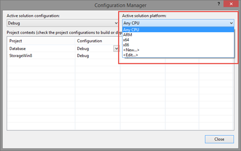

# 第 5 章使用文件:存储、数据库和设置

## 存储

与传统的视窗应用程序方法相比，视窗商店应用程序的存储管理是另一个很大的区别。如果桌面应用程序能够虚拟地读写任何计算机文件夹中的文件，那么 Windows Store 应用程序将在沙箱中运行。存储工作起来像一个标准的硬盘，但它是孤立的:应用程序不能在这个沙箱之外读写数据(除非用户明确允许)。这种方法最重要的优点是安全性。应用程序不能访问核心操作系统的文件，因此它们不能破坏手机的完整性，无论是有意的还是由于错误而导致的。保存在本地存储中的数据是持久的；即使应用程序关闭或暂停，数据也不会丢失，相反，每次再次启动时，数据总是可用的。

由于`Windows.Storage`命名空间中的`ApplicationData.Current`类，视窗运行时提供了不同类型的存储。让我们详细看看可用的存储。

### 本地存储

本地存储由`LocalFolder`类标识，并且是使用最广泛的。这是一个传统的文件系统，你可以像在电脑硬盘上一样创建文件和文件夹。但是，由于存储的隔离性质，存储的数据只能由您的应用程序访问。其他应用程序只能通过使用特殊合同(将在第 8 章中详细说明)来访问您的数据。

本地存储遵循应用程序的相同生命周期:一旦卸载，存储也会被移除。除了设备上的可用空间，应用程序可以使用的存储配额没有限制。本地存储还提供了一种简单的方法来管理应用程序开发中的常见场景(存储和读取设置)，这要归功于一个名为`LocalSettings`的类。我们将在本章后面更详细地讨论如何使用它。

关于本地存储，需要提到的一件重要事情是，它严格连接到 Windows Phone 8.1 中引入的新备份功能。事实上，在最新的 Windows Phone 版本中，内置的备份功能能够保存的不仅仅是手机的设置，包括开始屏幕配置、电子邮件帐户或锁屏图像(也包括 8.1 应用程序的本地存储内容)等内容。这样，如果用户重置他或她的手机或购买一部新手机，他或她会发现它完全处于以前的状态，包括其应用程序的数据。

需要强调的是，此备份保存到 OneDrive(即使对用户透明，他或她也无法看到他或她的帐户上的数据)，并且会计入他或她的配额。

### `The Local Storage without Backup Support (Windows Phone Only)`

应用于本地存储的自动备份功能很有帮助，因为作为开发人员，我们不需要找到替代方法来为我们的应用程序提供备份机制。但是，有些应用程序在使用该功能时效果不佳。如果该应用程序从互联网下载大量数据，可能会浪费 OneDrive 用户的存储空间，将所有内容都保存在云上。

例如，考虑一个应用程序，如 Spotify 或 Xbox Music。因为用户能够离线下载音乐，所以本地存储空间会变得很大，这样他们就可以在没有互联网连接的情况下收听音乐。在这种情况下，我们谈论的不是用户生成的内容，而是简单地从互联网下载并存储在本地的内容。

在所有这些场景中，保存整个应用程序的内容会浪费用户 OneDrive 帐户的空间，而 Windows Phone 8.1 提供了一个名为`LocalCacheFolder`的特殊存储，这也是`ApplicationData.Current`类的一部分。它的工作原理和`LocalFolder`一模一样；唯一的区别是，在备份过程中，创建并放入此存储的数据不会自动保存。

### 漫游存储

漫游存储由`RoamingStorage`类标识，通常由`ApplicationData.Current`对象提供。它具有与本地存储相同的基本特征，这意味着数据是隔离的，并且它可以存储设置(通过使用`RoamingSettings`类)、文件和文件夹。

漫游存储最重要的功能是，数据会自动与注册在同一微软帐户下的用户的所有设备同步，无论他们是 Windows 8.1 计算机、Windows 8.1 平板电脑还是 Windows Phone 8.1 智能手机。这意味着，如果用户在多个设备上安装了相同的应用程序，我们可以同步数据，例如，用户可以在平板电脑上开始一项工作，然后在手机上恢复(或者用户可以在手机上找到他或她在平板电脑上配置的相同设置)。

漫游的存储不遵循应用程序的相同生命周期。即使卸载了，漫游数据也会保留 30 天，以防用户改变主意，决定重新安装应用程序。漫游存储基于 OneDrive，即使它不计入用户配额。但是，在存储大小方面有一个重要的限制。实际上，当前限制是 100 KB。因此，漫游存储非常适合保存小数据，如应用程序的设置，而不是真实内容(如数据库)。如果需要同步应用的内容，最好依靠第三方解决方案(比如微软云解决方案 Azure 提供的移动服务)。

然而，100KB 的限制并不是固定的，因为微软可能会决定在未来增加它。因此，当您需要在漫游存储中保存一些数据并且想要确保填满最大空间时，您不必检查 100KB 配额，而是检查名为`RoamingStorageQuota`的特殊属性。在这种情况下，如果微软决定在未来的窗口更新中增加它，您将不必更改代码来支持新的配额。以下示例显示了如何检索这些信息，以便我们可以通过弹出消息向用户显示这些信息:

```
          private async void OnShowQuotaClicked(object sender, RoutedEventArgs e)
          {
              string quota = string.Format("Roaming quota: {0} KB", ApplicationData.Current.RoamingStorageQuota);
              MessageDialog dialog = new MessageDialog(quota);
              await dialog.ShowAsync();
          }

```

如果超过漫游配额会发生什么？没什么，因为在你删除一些内容之前，数据根本不会被同步。需要提到的另一个重要限制是，同步不是立即执行的，而是取决于许多情况，包括网络可用性、设备是否在电池节电模式下运行等。因此，对于需要在所有设备上尽快同步数据的关键场景，您不应该依赖漫游存储。

由于同步是在开发人员无法控制的情况下执行的，因此我们可以订阅一个名为`DataChanged`(由`ApplicationData.Current`类提供)的事件，当同步已经执行并且数据已经更新时，该事件将被触发。这样，例如，如果设置被更改，我们可以执行所需的操作来正确更新应用程序的行为。以下示例显示了如何订阅此事件:

```
          public sealed partial class MainPage : Page
          {
              public MainPage()
              {
                  this.InitializeComponent();
                  ApplicationData.Current.DataChanged += Current_DataChanged;
              }

              private void Current_DataChanged(ApplicationData sender, object args)
              {
                  //update the application
              }
          }

```

### 临时存储

最后一个存储的类型称为临时存储，它由`ApplicationData.Current`对象提供的`TemporaryFolder`类标识。它主要用于缓存场景，这意味着数据可以用来加快应用程序的速度(例如保存一组从互联网下载的图像)，但这并不重要。事实上，用户(在他或她决定清理临时文件的情况下)或系统(在维护任务的情况下)可以在没有通知的情况下随时擦除该存储。

与其他两种存储类型不同，临时存储不支持设置管理。

## 使用文件夹

对于开发人员来说，一个常见的场景是通过使用文件夹来组织存储结构，以便以逻辑方式保持文件的分离。Windows Runtime 中的每个文件夹都由`StorageFolder`类标识，该类提供了许多方法来执行最常见的操作(如创建新文件、获取可用文件列表、重命名文件等)。).

因此，每个存储类型的主根(例如，`LocalFolder`和`RoamingFolder`对象)都用`StorageFolder`类来标识。以下是可以执行的最常见操作的简要列表:

*   `CreateFolderAsync()`创建新文件夹
*   `GetFolderAsync()`获取对现有子文件夹的引用
*   `DeleteAsync()`删除文件夹
*   `RenameAsync()`重命名文件夹

以下示例代码显示了如何在本地存储中创建文件夹:

```
          private async void OnCreateFolderClicked(object sender, RoutedEventArgs e)
          {
              await ApplicationData.Current.LocalFolder.CreateFolderAsync("myFolder");
              await ApplicationData.Current.LocalFolder.CreateFolderAsync("myFolder2\\mySubFolder");
          }

```

如您所见，通过使用反斜杠(\)作为一个文件夹和另一个文件夹之间的分隔符，不仅可以操作文件夹，还可以操作子文件夹。如果其中一个子文件夹不存在，Windows 运行时将创建它(例如，第二行代码将创建 myFolder2 和 mySubFolder 文件夹)。在本例中，我们使用了一个双反斜杠来正确转义这个特殊字符。

在使用`TryGetItemAsync()`方法执行任何操作之前，窗口运行时还提供了一种检查文件夹是否已经存在的方法。如果文件夹存在，你会得到一个对它的引用作为回报；如果没有，你会得到一个`null`对象。下面的代码在创建名为 myFolder 的新文件夹之前，检查它是否已经存在于本地存储中:

```
          private async void OnCreateFolderClicked(object sender, RoutedEventArgs e)
          {
              IStorageItem storageItem = await ApplicationData.Current.LocalFolder. TryGetItemAsync("myFolder");
              if (storageItem == null)
              {
                  await ApplicationData.Current.LocalFolder.CreateFolderAsync("myFolder");
              }
          }

```

|  | 注意:`TryGetItemAsync()`方法仅在 Windows 中可用。在 Windows Phone 中，检查文件夹是否存在的唯一方法是使用`GetFolderAsync()`方法，并通过使用`try` / `catch`语句来捕获在文件夹不存在的情况下引发的异常。 |

### 使用文件

文件由`StorageFile`类标识，该类提供了一组执行最常见操作的方法，例如:

*   `DeleteAsync()`删除文件
*   `RenameAsync()`重命名文件
*   `CopyAsync()`将文件从一个位置复制到另一个位置
*   `MoveAsync()`将文件从一个位置移动到另一个位置

处理文件的起点是`StorageFolder`类，因为每个文件都属于一个文件夹(因为，正如我们提到的，存储的根也被视为一个文件夹)。我们有两种不同的选择:使用`CreateFileAsync()`方法创建一个新文件，或者使用`GetFileAsync()`方法获取对现有文件的引用。

让我们看看如何在本地存储中读写文件。Windows 运行时提供了两种不同的方法，一种基于流，另一种基于批量操作。

#### 以流的形式创建和读取文件

要创建一个文件，我们需要使用`StorageFolder`类提供的`CreateFileAsync()`方法，它接受文件名作为参数。以下示例显示了如何在本地存储中创建文本文件:

```
          private async void OnCreateFileClicked(object sender, RoutedEventArgs e)
          {
              StorageFile file = await ApplicationData.Current.LocalFolder.CreateFileAsync("file.txt");
          }

```

作为回报，您将获得对刚刚创建的文件的引用。此外，当您处理文件时，您可以使用我们之前在文件夹中看到的`TryGetItemAsync()`方法，在执行任何操作之前检查文件是否已经存在，如下例所示:

```
          private async void OnCreateFileClicked(object sender, RoutedEventArgs e)
          {
              IStorageItem storageItem = await ApplicationData.Current.LocalFolder.TryGetItemAsync("file.txt");
              if (storageItem == null)
              {
                  StorageFile file = await ApplicationData.Current.LocalFolder.CreateFileAsync("file.txt");
              }
          }

```

|  | 注意:重要的是要记住，同样在这种情况下，`TryGetItemAsync()`方法仅在 Windows 上可用。在 Windows Phone 上，您必须调用`GetFileAsync()`方法，并通过使用 try / catch 语句来捕获文件不存在时引发的异常。 |

一旦有了对文件的引用，就可以调用`OpenAsync()`方法获取读写流。流的类型由作为参数传递的`FileAccessMode`属性定义。要执行写操作，我们需要使用`ReadWrite`值，如下例所示:

```
          private async void OnCreateFileClicked(object sender, RoutedEventArgs e)
          {
              IStorageItem storageItem = await ApplicationData.Current.LocalFolder.TryGetItemAsync("file.txt");
              if (storageItem == null)
              {
                  StorageFile file = await ApplicationData.Current.LocalFolder.CreateFileAsync("file.txt");
                  IRandomAccessStream randomAccessStream = await file.OpenAsync(FileAccessMode.ReadWrite);
                  using (DataWriter writer = new DataWriter(randomAccessStream.GetOutputStreamAt(0)))
                  {
                      writer.WriteString("Sample text");
                      await writer.StoreAsync();
                  }
              }
          }

```

当您使用`OpenAsync()`方法打开文件时，您会得到一个由`IRandomAccessStream`类标识的内容流的引用。由于有了这个流，您将能够使用`DataWriter`类来执行写操作。需要强调的是`IRandomAccessStream`类提供了对写流和读流的访问。在这种情况下，由于我们想要向文件中写入一些内容，我们需要使用输出流，它是使用`GetOutputStreamAt()`方法获得的。参数标识了我们要开始写入操作的流位置。在我们的案例中，我们使用`0`从头开始。

`DataWriter`类是一个特殊的 Windows Runtime 类，它使得将最常见的数据类型写入文件变得更加容易。在示例中，您可以看到`WriteString()`方法来编写文本，但是也可以使用，例如，`WriteBytes()`来编写二进制内容，`WriteDouble()`来编写数字，`WriteDateTime()`来编写日期，等等。将内容写入文件后，可以通过调用`StoreAsync()`方法来完成操作。

读取文件内容的方法类似。同样在这种情况下，在使用`GetFileAsync()`方法获得对文件的引用后，我们需要使用`OpenAsync()`方法打开它。在这种情况下，由于我们只需要读取内容，我们可以将`FileAccessMode`枚举器的`Read`值作为参数传递。以下是完整的示例:

```
          private async void OnReadFileClicked(object sender, RoutedEventArgs e)
          {
              IStorageItem storageItem = await ApplicationData.Current.LocalFolder.TryGetItemAsync("file.txt");
              if (storageItem != null)
              {
                  StorageFile file = await
                  ApplicationData.Current.LocalFolder.GetFileAsync("file.txt");
                  IRandomAccessStream randomAccessStream = await
                  file.OpenAsync(FileAccessMode.Read);
                  using (DataReader reader = new
                  DataReader(randomAccessStream.GetInputStreamAt(0)))
                  {
                      uint bytesLoaded = await reader.LoadAsync((uint)randomAccessStream.Size);
                      string readString = reader.ReadString(bytesLoaded);
                      MessageDialog dialog = new MessageDialog(readString);
                      await dialog.ShowAsync();
                  }
              }
          }

```

如您所见，代码与标准过程非常相似。主要区别是:

*   因为在这种情况下，我们想要执行读取操作，所以我们需要使用`IRandomAccessStream`类提供的`GetInputStreamAt()`方法来检索输入流。同样在这种情况下，我们需要指定开始读取操作的流的位置。通过使用`0`，我们将从头开始阅读内容。
*   代替`DataWriter`类，我们使用了`DataReader`类，其工作原理相同。它提供了一组读取最常见数据类型的方法。在这种情况下，因为我们正在读取文本文件，所以我们称之为`ReadString()`方法，但是我们可以使用`ReadDouble()`来读取数字，或者使用`ReadDateTime()`来读取日期。

#### 使用批量操作创建和读取文件

在前一节中，我们看到，由于有了`DataWriter`和`DataReader`类，我们能够以流的形式处理文件。我们能够从任何位置开始写作或阅读程序，而不仅仅是从头开始。然而，这种精度并不总是必需的。对于这些场景，Windows Runtime 提供了一个名为`FileIO`的类(它是`Windows.Storage`命名空间的一部分)，更容易用来执行基本的读写操作。

像往常一样，起点是`StorageFile`类，所以我们仍然需要使用我们之前看到的 API 来创建一个文件(在编写过程的情况下)或者获取对现有文件的引用(在读取过程的情况下)。`FileIO`类公开的方法提供了一种简单的方法来编写最常见的数据类型，如`WriteTextAsync()`来编写字符串或`WriteBufferAsync()`来编写二进制内容，如图像。以下示例显示了如何在本地存储中创建文本文件:

```
          private async void OnCreateFileClicked(object sender, RoutedEventArgs e)
          {
              StorageFile file = await ApplicationData.Current.LocalFolder.CreateFileAsync("file.txt");
              await FileIO.WriteTextAsync(file, "Sample text");
          }

```

您也可以使用`AppendTextAsync()`方法将文本添加到现有文件中:

```
          private async void OnReadFileClicked(object sender, RoutedEventArgs e)
          {
              StorageFile file = await ApplicationData.Current.LocalFolder.GetFileAsync("file.txt");
              await FileIO.AppendTextAsync(file, "Sample text to append");
          }

```

读取操作以相同的方式执行，使用`FileIO`类提供的读取方法(如`ReadTextAsync()`读取字符串或`ReadBufferAsync()`读取二进制文件)。以下示例显示了如何检索以前保存的文本:

```
          private async void OnReadFileClicked(object sender, RoutedEventArgs e)
          {
              StorageFile file = await ApplicationData.Current.LocalFolder.GetFileAsync("file.txt");
              string text = await FileIO.ReadTextAsync(file);
          }

```

### 使用网址访问文件

在某些情况下，使用网址访问应用程序的文件可能会很有用。例如，当您使用`Image`控件并希望显示存储在本地存储器中的图像时，可能会出现这种情况。在 Windows Store 应用程序中，您可以使用一些特殊协议来访问应用程序的文件:

*   `ms-appx:///`协议用于提供对作为 Visual Studio 项目一部分的文件的访问。但是，要访问这些文件，您需要确保**构建操作**属性(可以通过在 Visual Studio 中右键单击文件并选择**属性**来设置)设置为**内容**。例如，假设您有一个名为**logo.png**的图像放置在项目的“资产”文件夹中。以下示例显示了如何使用 XAML 的`Image`控件来显示它:

```
          <Image Source="ms-appx:///Assets/logo.png" />

```

*   `ms-appdata:///`协议用于提供对存储在可用存储类型之一中的文件的访问。协议完成后，您需要指定要使用哪个存储:`local`、`localcache`、`roaming`或`temporary`。以下示例显示了如何使用`Image`控件显示存储在本地存储器中的图像:

```
          <Image Source="ms-appdata:///local/Assets/logo.png" />

```

### 调试应用程序:检查存储内容

当您正在开发和测试一个向存储中写入一些数据的应用程序时，验证一切正常并且文件在存储中有效创建是很重要的。让我们看看如何做到这一点。

#### 在窗口中检查存储内容

Windows 中的本地存储存储在路径***% user profile % \ AppData \ Local \ Packages \*****中的一个特殊文件夹中(%USERPROFILE%** 是一个代表您的用户帐户的根文件夹的特殊字符串)。在这个文件夹中，你会发现许多子文件夹；它们中的每一个都标识了您在设备上安装的一个 Windows Store 应用程序。通常，从 Visual Studio 手动部署而不是从存储区安装的应用程序由包名标识，包名是您可以在清单文件的打包部分找到的标识符。

在这个文件夹中，你会发现一些子文件夹；它们中的每一个都指一种存储类型。您只需打开您感兴趣的文件夹，并验证其中的数据是否正确。

#### 在 Windows Phone 中检查存储内容

在 Windows Phone 中检查存储内容不像在 Windows 中那么容易，因为该平台只允许用户和开发人员浏览手机的一些库(如图片、视频、文档等)。).您无法访问操作系统的文件夹或保存本地存储的位置。Visual Studio 2013 包括一个探索手机存储的工具，但使用起来不太直观，因为它是一个命令行应用程序。

因此，许多开发人员创建了第三方工具，通过依赖这个应用程序，为开发人员提供了更容易使用的可视化界面。其中一个最好的工具叫做 **Windows Phone 电动工具**，可以在这里下载[。](mailto:http://wptools.codeplex.com/)

使用这个工具很容易。当您启动它时，下拉菜单将允许您在设备和一个可用的仿真器之间进行选择。连接成功后，您将能够使用独立存储部分查看手机上手动部署的应用程序(通过使用 Visual Studio 或 SDK 附带的应用程序部署工具)。当然，出于安全原因，您将无法探索从商店安装的应用程序的本地存储。

一旦您选择了正确的应用程序，您将能够像使用常规文件资源管理器一样执行最常见的操作。您可以浏览、打开、删除或下载文件，甚至可以将文件从计算机上传到手机(这对于在测试阶段模拟真实数据非常有用)。

### 管理应用的设置

开发应用程序时，一个常见的考虑因素是设置管理；该应用程序可以提供一个设置页面，用户可以根据自己的需求定制应用程序。本地存储和漫游存储都提供了一种简单的方法来管理这种情况，方法是提供一个类(`LocalSettings`用于本地存储，`RoamingSettings`用于漫游存储)，这是一个集合，我们可以在其中保存设置并使用唯一的密钥来标识它们，以便以后检索它们。

在引擎盖下，它的工作方式类似于我们在第 4 章中描述的关于管理页面状态的功能。设置由`Dictionary<string, object>`集合标识，我们可以在其中保存数据(可以是通用对象)，每个设置都由一个字符串键标识。这些数据会在需要的时候自动序列化和反序列化，这样即使应用程序关闭了，数据也会被持久化和维护。

字典存储在`LocalSettings`和`RoamingSettings`类提供的`Value`属性中。以下示例显示了如何将一些数据保存到漫游设置中:

```
          private void OnSaveSettingsClicked(object sender, RoutedEventArgs e)
          {
              if (ApplicationData.Current.RoamingSettings.Values.ContainsKey("IsEnabled"))
              {
                  ApplicationData.Current.RoamingSettings.Values.Remove("IsEnabled");
              }
              ApplicationData.Current.RoamingSettings.Values.Add("IsEnabled", true);
          }

```

首先，我们使用`ContainsKey()`方法检查与特定键相关联的值是否已经存在(在示例中，它被称为`IsEnabled`)。如果有，在使用`Add()`方法保存之前，我们使用`Remove()`方法将其从集合中删除。

以下示例显示了如何从漫游设置中检索最近保存的值:

```
          private async void OnReadSettingsClicked(object sender, RoutedEventArgs e)
          {
              if (ApplicationData.Current.LocalSettings.Values.ContainsKey("IsEnabled"))
              {
                  bool isEnabled = (bool)ApplicationData.Current.LocalSettings.Values["IsEnabled"];
                  MessageDialog dialog = new MessageDialog(isEnabled.ToString());
                  await dialog.ShowAsync();
              }
          }

```

语法应该很熟悉，因为这是您使用`Dictionary`集合时使用的标准语法。在检查由`IsEnabled`键识别的值是否存在之后，我们通过在方括号内指定键的名称来检索它。因为字典可以存储一个泛型对象，所以我们需要对预期的对象类型执行强制转换。在我们的例子中，我们将其转换为`bool`，因为我们之前保存了一个`Boolean`值。

需要强调的是，这些设置不能存储任何类型的数据，只能存储本地的 Windows Runtime 类型，这些类型在 MSDN 官方文档[中列出](mailto:http://s.qmatteoq.com/WinRT-Types)。

说到管理设置，最好使用的存储类型是漫游存储。这样，如果你正在开发一个可以同时安装在 Windows 和 Windows Phone 上的通用 Windows 应用程序，你就可以在两个不同的版本之间共享设置，这样用户就不必自定义该应用程序两次。

#### 组织设置

我们之前讨论的设置类也提供了一种在不同容器中组织设置的简单方法，例如，可以与应用程序的不同部分相关联。这样，您就可以将所有设置拆分成许多字典，每个字典都有自己唯一的标识符，而不是将所有设置都存储在一个集合中。

要使用容器，首先必须调用其中一个设置类提供的`CreateContainer()`方法。所需的参数是容器的名称和`ApplicationDataCreateDisposition`枚举器的值，该枚举器告诉窗口运行时是否应该创建容器(如果不存在的话)。一旦创建了容器，它就像标准设置一样工作；你可以进入名为`Values`的房产，这是一个`Dictionary<string, object>`系列。以下示例显示了如何创建名为`MainSettings`的集合，其中保存了一个整数值:

```
          private void OnSaveSettingsClicked(object sender, RoutedEventArgs e)
          {
              ApplicationDataContainer container = ApplicationData.Current.LocalSettings.
              CreateContainer("MainSettings", ApplicationDataCreateDisposition.Always);
              container.Values.Add("NumberOfItems", 10);
          }

```

要访问现有容器，您可以使用由`LocalSettings`和`RoamingSettings`类提供的`Containers`属性，这是所有可用容器的集合。检索到对所需容器的引用后，您可以再次使用`Values`集合来获取您正在寻找的设置，方式与我们之前所做的相同:

```
          private async void OnReadSettingsClicked(object sender, RoutedEventArgs e)
          {
              if (ApplicationData.Current.LocalSettings.Containers.ContainsKey("MainSettings"))
              {
                  ApplicationDataContainer container = ApplicationData.Current.LocalSettings.Containers["MainSettings"];
                  int numberOfItems = (int)container.Values["NumberOfItems"];
                  MessageDialog dialog = new MessageDialog(numberOfItems.ToString());
                  await dialog.ShowAsync();
              }
          }

```

### 在 Windows 应用程序中集成设置

到目前为止，我们已经看到了如何从逻辑角度管理设置。`LocalSettings`和`RoamingSettings`是两个让开发者更容易存储和读取数据的类。现在让我们从视觉的角度来看看如何在我们的应用程序中集成设置。Windows Phone 没有任何具体要求。通常，您只需在应用程序中定义一个新页面，并在主页面中为用户提供快速访问该页面的方法。

在 Windows 8.1 中，您有一个连接到魅力栏的特定要求。如果你打开魅力栏(屏幕右侧的那个)，你会发现一个名为**设置**的按钮。当您按下**设置**时，右侧面板打开；这是包含所有应用程序设置的地方:


图 33:视窗商店应用程序的设置面板

让我们看一下如何将我们的设置包含到这个面板中。第一步是创建布局来放置我们的设置。每个部分都由一个像传统页面一样工作的页面来标识。唯一的区别是，它不是全屏显示，而是放在右侧面板内。因此，我们需要记住，我们包含 XAML 控制的空间较少。

为了帮助开发人员，Visual Studio 为设置页面包含了一个特定的模板。您可以通过在解决方案资源管理器中右键单击您的项目并选择**添加新项目**来找到它。你会发现一个名为**设置弹出**的选项。该模板将添加一个 XAML 控件，该控件不是继承自`Page`类，而是派生自`SettingsFlyout`类。

下面是一个示例定义:

```
          <SettingsFlyout
              x:Class="SampleApp.SettingsFlyout1"

              xmlns:x="http://schemas.microsoft.com/winfx/2006/xaml"
              xmlns:d="http://schemas.microsoft.com/expression/blend/2008"
              xmlns:mc="http://schemas.openxmlformats.org/markup-compatibility/2006"
              mc:Ignorable="d"
              IconSource="Assets/SmallLogo.png"
              Title="SettingsFlyout1"
              d:DesignWidth="346">

              <StackPanel VerticalAlignment="Stretch" HorizontalAlignment="Stretch" >

                  <StackPanel VerticalAlignment="Stretch" HorizontalAlignment="Stretch" >
                      <StackPanel Style="{StaticResource SettingsFlyoutSectionStyle}">
                          <TextBlock Style="{StaticResource TitleTextBlockStyle}" Text="Setup transfers" />
                          <ToggleSwitch Header="Enable download" />
                          <ToggleSwitch Header="Enable upload" />
                      </StackPanel>
                  </StackPanel>

              </StackPanel>
          </SettingsFlyout>

```

与标准页面相比，主要区别在于`SettingsFlyout`类的一些属性:

*   它的宽度为 346 像素，这是“设置”面板的大小
*   它有一个标题，由`Title`属性设置
*   它有一个显示在标题附近的图标，由`IconSource`属性设置

除了这些不同之外，`SettingsFlyout`就像普通页面一样工作。您可以在其中放置任何 XAML 控件(在示例中，我们添加了一个`TextBlock`作为标题和两个`ToggleSwitch`按钮)，并且在后面的代码中，您可以使用我们在本章前面看到的方法定义逻辑来存储设置中的值。

我们需要正确管理的是与魅力吧的整合。当按下设置按钮，我们的应用程序打开时，我们需要显示设置列表和我们创建的页面。为此，我们需要使用`App`类提供的`OnWindowCreated()`方法。此方法在创建应用程序窗口时触发:

```
          protected override void OnWindowCreated(WindowCreatedEventArgs args)
          {
              SettingsPane.GetForCurrentView().CommandsRequested += App_CommandsRequested;
          }

          private void App_CommandsRequested(SettingsPane sender, SettingsPaneCommandsRequestedEventArgs args)
          {
              //manage the settings
          }

```

在我们检索到对当前应用的设置面板的引用后(通过调用`SettingsPane`类的`GetForCurrentView()`方法)，我们订阅了`CommandsRequested`事件，当用户按下**设置**时，该事件被调用。

当您按下**设置**时，您将看到一个选项列表，代表用于组织设置的不同部分。在这个事件处理程序中，我们需要做的是加载所有的部分，这些部分只是我们之前创建的不同设置页面的快捷方式:

```
          private void App_CommandsRequested(SettingsPane sender, SettingsPaneCommandsRequestedEventArgs args)
          {
              SettingsCommand command = new SettingsCommand("Settings", "Settings", handler =>
              {
                  SettingsFlyout1 settings = new SettingsFlyout1();
                  settings.Show();
              });
              args.Request.ApplicationCommands.Add(command);
          }

```

我们可以有任意多的设置页面；我们只需要像前面的示例一样，在`CommandsRequested`事件处理程序中注册所有这些事件。在这种情况下，我们只有一个设置页面，由我们之前创建的 XAML 页面表示。每个部分都由一个`SettingsCommand`标识，它要求作为参数:

*   命令的唯一标识符
*   将显示在设置面板中的部分的名称
*   当用户点击面板中的分区名称时要执行的操作

通常，当用户点击部分名称时，我们需要显示我们定义的设置页面。我们可以通过创建我们之前创建的`SettingsFlyout`页面的新实例，然后调用`Show()`方法来实现这一点。

最后一步是将我们定义的所有`SettingsCommand`添加到当用户点击魅力栏中的**设置**时显示的可用部分列表中。该列表由`ApplicationCommands`集合表示，该集合是方法参数公开的属性之一。我们简单地称之为`Add()`方法，将我们定义的`SettingsCommand`对象作为参数传递。

## 访问项目中包含的文件

当您从商店下载应用程序时，操作系统会将 Visual Studio 创建的包解压缩到一个特殊的系统文件夹中，开发人员和用户无法访问该文件夹。通常，此文件夹的内容与 Visual Studio 中的项目结构相匹配。因此，在应用程序运行时，您可能需要从代码中访问其中一个文件(如数据库或图像)。您可以通过使用一个名为`Package.Current.InstalledLocation`的特殊类来实现这一点，该类标识了您的项目的根。它的行为类似于常规存储；每个文件夹(包括`InstalledLocation`对象本身)用`StorageFolder`类标识，而文件用`StorageFile`类映射。

这和本地存储唯一重要的区别是，你不能在 app 文件夹中写入数据，你只能读取它们。每一个执行写操作的方法(比如`CreateFileAsync()`)都会抛出一个异常。以下示例显示如何获取对存储在项目中的文件的引用，并将其复制到本地存储中:

```
          private async void OnCopyFileClicked(object sender, RoutedEventArgs e)
          {
              StorageFile file = await Package.Current.InstalledLocation.GetFileAsync("file.xml");
              await file.CopyAsync(ApplicationData.Current.LocalFolder);
          }

```

## 导入存储在设备中的文件或文件夹

在本章中，我们了解到本地存储是隔离的；我们无法直接访问由其他应用程序创建或存储在手机中的数据(如文档、图像或音乐曲目)。由于这种方法可能会成为许多应用程序的严重限制，Windows Runtime 提供了一个名为`FileOpenPicker`的类，可以用来将外部文件导入我们的应用程序。`FileOpenPicker`类打开一个由操作系统管理的特殊对话框，可用于浏览各种设备的文件夹。

由于 Windows 支持同时运行多个应用程序的能力，而 Windows Phone 不支持，因此该类的实现因平台而异。让我们详细了解一下如何在两个平台上使用它。

### 在窗口中导入文件或文件夹

使用`FileOpenPicker`类在 Windows 中导入文件的方法很简单，如下例所示:

```
          private async void OnPickFileClicked(object sender, RoutedEventArgs e)
          {
              FileOpenPicker picker = new FileOpenPicker();
              picker.FileTypeFilter.Add(".jpg");
              picker.FileTypeFilter.Add(".png");
              StorageFile file = await picker.PickSingleFileAsync();
              if (file != null)
              {
                  await file.CopyAsync(ApplicationData.Current.LocalFolder);
              }
          }

```

要设置的第一个选项是我们要导入的文件类型。这样，选取器将自动只显示与我们选择的扩展名匹配的文件。我们需要给`FileTypeFilter`集合至少添加一个扩展，否则会得到一个异常。如果我们想支持任何类型的文件，我们可以添加星号(*)作为文件的类型。

一旦定义了支持的扩展，只需要调用`PickSingleFileAsync()`方法。拾取器的用户界面将被打开，用户将能够选择设备上的任何文件。一旦他们做出选择，选择器将关闭，控件将返回到您的应用程序。`PickSingleFileAsync()`方法将返回一个包含用户选择的文件的`StorageFile`对象。前面的示例显示了如何将该文件复制到本地存储中。由于用户有机会取消导入操作，所以在执行任何操作之前，务必检查文件不是`null`。

也可以使用`FileOpenPicker`类，通过调用`PickMultipleFileAsync()`一次操作导入多个文件。它的工作方式与前面的方式相同，唯一的区别是，它不是返回一个单独的`StorageFile`对象，而是返回它们的集合。以下示例显示了如何将所有选定的文件复制到应用程序的本地存储中:

```

          private async void OnPickFilesClicked(object sender, RoutedEventArgs e)
          {
              FileOpenPicker picker = new FileOpenPicker();
              picker.FileTypeFilter.Add(".png");
              IReadOnlyList<StorageFile> files = await picker.PickMultipleFilesAsync();
              if (files.Count > 0)
              {
                  foreach (StorageFile file in files)
                  {
                      await file.CopyAsync(ApplicationData.Current.LocalFolder);
                  }
              }
          }

```

文件不是唯一可以导入的东西。您还可以导入整个文件夹，这意味着您可以访问该文件夹中包含的所有文件。操作是以类似的方式实现的，除了在这种情况下，我们使用`FolderPicker`类，如下例所示:

```
          private async void OnPickFolderClicked(object sender, RoutedEventArgs e)
          {
              FolderPicker picker = new FolderPicker();
              picker.FileTypeFilter.Add("*");
              StorageFolder folder = await picker.PickSingleFolderAsync();
              if (folder != null)
              {
                  var files = await folder.GetFilesAsync();
                  foreach (StorageFile file in files)
                  {
                      MessageDialog dialog = new MessageDialog(file.DisplayName);
                      await dialog.ShowAsync();
                  }
              }
          }

```

此外，在这种情况下，我们需要向`FileTypeFilter`集合中添加至少一个元素，但是，由于文件夹没有类型，因此只需传递一个星号(*)，以便用户可以导入设备上的任何文件夹。然后，您可以调用`PickSingleFolderAsync()`方法，该方法将打开通常的选择器用户界面。一旦用户选择了一个文件夹，该方法将返回一个引用它的`StorageFolder`对象。这样，您将能够对文件夹执行其他操作，如创建、打开或删除文件，或创建子文件夹等。上一个示例获取文件夹中包含的所有文件的列表，并通过弹出消息显示它们的名称。

### 在 Windows Phone 中导入文件或文件夹

由于 Windows Phone 无法保持两个应用同时打开，当您激活`FileOpenPicker`时，当前应用将被暂停(待用户选择要导入的文件或文件夹后恢复)。因此，在我们以与在 Windows 中相同的方式配置了`FileOpenPicker`之后，我们需要使用仅在 Windows Phone 上可用的方法来激活它。导入单个文件称为`PickSingleFileAndContinue()`，导入多个文件称为`PickMultipleFilesAndContinue()`。

下面是一个完整的示例:

```
          private void OnOpenFileClicked(object sender, RoutedEventArgs e)
          {
              FileOpenPicker picker = new FileOpenPicker();
              picker.FileTypeFilter.Add(".jpg");
              picker.FileTypeFilter.Add(".png");
              picker.PickSingleFileAndContinue();
          }

```

如您所见，与 Windows 方法最大的区别在于`PickSingleFileAndContinue()`方法不返回对所选文件的引用；由于应用程序被暂停，我们需要以另一种方式获得它。

为了帮助开发人员管理这个场景，微软创建了一个名为`ContinuationManager`的类；但是，它不包含在 Windows 运行时中。相反，微软在 MSDN 文档中发布了源代码。以下是完整的类定义，您可以将其复制到项目中的新类中:

```
          #if WINDOWS_PHONE_APP
              /// <summary>
              /// ContinuationManager is used to detect if the most recent activation was due
              /// to a continuation such as the FileOpenPicker or WebAuthenticationBroker
              /// </summary>
              public class ContinuationManager
              {
                  IContinuationActivatedEventArgs args = null;
                  bool handled = false;
                  Guid id = Guid.Empty;

                  /// <summary>
                  /// Sets the ContinuationArgs for this instance using default frame of current Window
                  /// Should be called by the main activation handling code in App.xaml.cs
                  /// </summary>
                  /// <param name="args">The activation args</param>
                  internal void Continue(IContinuationActivatedEventArgs args)
                  {
                      Continue(args, Window.Current.Content as Frame);
                  }

                  /// <summary>
                  /// Sets the ContinuationArgs for this instance. Should be called by the main activation
                  /// handling code in App.xaml.cs
                  /// </summary>
                  /// <param name="args">The activation args</param>
                  /// <param name="rootFrame">The frame control that contains the current page</param>
                  internal void Continue(IContinuationActivatedEventArgs args, Frame rootFrame)
                  {
                      if (args == null)
                          throw new ArgumentNullException("args");

                      if (this.args != null && !handled)
                          throw new InvalidOperationException("Can't set args more than once");

                      this.args = args;
                      this.handled = false;
                      this.id = Guid.NewGuid();

                      if (rootFrame == null)
                          return;

                      switch (args.Kind)
                      {
                          case ActivationKind.PickFileContinuation:
                              var fileOpenPickerPage = rootFrame.Content as IFileOpenPickerContinuable;
                              if (fileOpenPickerPage != null)
                              {
                                  fileOpenPickerPage.ContinueFileOpenPicker(args as FileOpenPickerContinuationEventArgs);
                              }
                              break;

                          case ActivationKind.PickSaveFileContinuation:
                              var fileSavePickerPage = rootFrame.Content as IFileSavePickerContinuable;
                              if (fileSavePickerPage != null)
                              {
                                  fileSavePickerPage.ContinueFileSavePicker(args as FileSavePickerContinuationEventArgs);
                              }
                              break;

                          case ActivationKind.PickFolderContinuation:
                              var folderPickerPage = rootFrame.Content as IFolderPickerContinuable;
                              if (folderPickerPage != null)
                              {
                                  folderPickerPage.ContinueFolderPicker(args as FolderPickerContinuationEventArgs);
                              }
                              break;

                          case ActivationKind.WebAuthenticationBrokerContinuation:
                              var wabPage = rootFrame.Content as IWebAuthenticationContinuable;
                              if (wabPage != null)
                              {
                                  wabPage.ContinueWebAuthentication(args as WebAuthenticationBrokerContinuationEventArgs);
                              }
                              break;
                      }
                  }

                  /// <summary>
                  /// Marks the contination data as 'stale', meaning that it is probably no longer useful.
                  /// Called when the app is suspended (to ensure future activations don't appear
                  /// to be for the same continuation) and whenever the continuation data is retrieved
                  /// (so that it isn't retrieved on subsequent navigations)
                  /// </summary>
                  internal void MarkAsStale()
                  {
                      this.handled = true;
                  }

                  /// <summary>
                  /// Retrieves the continuation args if they have not already been retrieved and
                  /// prevents further retrieval via this property (to avoid accidental double usage)
                  /// </summary>
                  public IContinuationActivatedEventArgs ContinuationArgs
                  {
                      get
                      {
                          if (handled)
                              return null;
                          MarkAsStale();
                          return args;
                      }
                  }

                  /// <summary>
                  /// Unique identifier for this particular continuation. Most useful for components that
                  /// retrieve the continuation data via <see cref="GetContinuationArgs"/> and need
                  /// to perform their own replay check
                  /// </summary>
                  public Guid Id { get { return id; } }

                  /// <summary>
                  /// Retrieves the continuation args, optionally retrieving them even if they have already
                  /// been retrieved
                  /// </summary>
                  /// <param name="includeStaleArgs">Set to true to return args even if they have previously been returned</param>
                  /// <returns>The continuation args or null if there aren't any</returns>
                  public IContinuationActivatedEventArgs GetContinuationArgs(bool includeStaleArgs)
                  {
                      if (!includeStaleArgs && handled)
                          return null;
                      MarkAsStale();
                      return args;
                  }
              }

              /// <summary>
              /// Implement this interface if your page invokes the file open picker
              /// API
              /// </summary>
              interface IFileOpenPickerContinuable
              {
                  /// <summary>
                  /// This method is invoked when the file open picker returns picked
                  /// files
                  /// </summary>
                  /// <param name="args">Activated event args object that contains returned files from file open picker</param>
                  void ContinueFileOpenPicker(FileOpenPickerContinuationEventArgs args);
              }

              /// <summary>
              /// Implement this interface if your page invokes the file save picker
              /// API
              /// </summary>
              interface IFileSavePickerContinuable
              {
                  /// <summary>
                  /// This method is invoked when the file save picker returns saved
                  /// files
                  /// </summary>
                  /// <param name="args">Activated event args object that contains returned file from file save picker</param>
                  void ContinueFileSavePicker(FileSavePickerContinuationEventArgs args);
              }

              /// <summary>
              /// Implement this interface if your page invokes the folder picker API
              /// </summary>
              interface IFolderPickerContinuable
              {
                  /// <summary>
                  /// This method is invoked when the folder picker returns the picked
                  /// folder
                  /// </summary>
                  /// <param name="args">Activated event args object that contains returned folder from folder picker</param>
                  void ContinueFolderPicker(FolderPickerContinuationEventArgs args);
              }

              /// <summary>
              /// Implement this interface if your page invokes the web authentication
              /// broker
              /// </summary>
              interface IWebAuthenticationContinuable
              {
                  /// <summary>
                  /// This method is invoked when the web authentication broker returns
                  /// with the authentication result
                  /// </summary>
                  /// <param name="args">Activated event args object that contains returned authentication token</param>
                  void ContinueWebAuthentication(WebAuthenticationBrokerContinuationEventArgs args);
              }

          #endif

```

此类的目的是使挂起过程对开发人员透明。它将负责管理激活事件，将用户重定向到调用`FileOpenPicker`的页面，并允许访问用户选择的文件。

一旦将`ContinuationManager`类添加到项目中，就该更改`App`类配置了。这样做的第一步是在`App`构造函数中创建类的新实例，如下例所示:

```
          public sealed partial class App : Application
          {
              public static ContinuationManager ContinuationManager { get; private set; }

              public App()
              {
                  this.InitializeComponent();
                  this.Suspending += this.OnSuspending;
                  ContinuationManager = new ContinuationManager();
              }
          }

```

接下来的步骤是正确管理激活和暂停事件，因为它们是当您在 Windows Phone 中使用`FileOpenPicker`时涉及的事件。当选取器被激活时，应用程序将被挂起。用户选择文件后，应用程序将被重新激活，并在激活参数中包含所选文件。

以下示例展示了如何使用`ContinuationManager`正确管理`App`类的`OnActivated()`方法:

```
          protected override void OnActivated(IActivatedEventArgs args)
          {
              if (args.Kind == ActivationKind.PickFileContinuation)
              {
                  var continuationEventArgs = args as IContinuationActivatedEventArgs;
                  if (continuationEventArgs != null)
                  {
                      ContinuationManager.Continue(continuationEventArgs);
                      ContinuationManager.MarkAsStale();
                  }
              }
          }

```

最重要的激活事件(如与某些合同或扩展相关的事件)是用特定的方法管理的。然而，`App`类还提供了一个通用方法，该方法是为特定事件未覆盖的所有激活事件触发的。`FileOpenPicker`激活就是其中之一，所以我们需要管理通用的`OnActivated()`事件。该方法的参数包含一个名为`Kind`的属性，该属性描述了通过使用`ActivationKind`枚举器的一个值来触发它的激活事件。在我们的场景中，我们需要管理`PickFileContinuation`值。在这种情况下，我们可以使用`ContinuationManager`方法，首先调用`Continue()`方法(将激活参数作为参数传递)，然后调用`MarkAsStale()`方法。`Continue()`方法是操作的关键；它将用户重定向到调用选择器用户界面的原始页面，携带所选文件作为参数。相反，`MarkAsStale()`用于将当前数据标记为过时。这样，我们确保`FileOpenPicker`的下一次使用不会返回旧数据。出于同样的原因，我们需要在`OnSuspending()`方法中也调用`MarkAsStale()`方法。这样，当应用程序因`FileOpenPicker`使用而暂停时，我们会确保旧数据消失。以下是如何正确管理`OnSuspending()`的方法:

```
          private void OnSuspending(object sender, SuspendingEventArgs e)
          {
              ContinuationManager.MarkAsStale();
          }

```

我们已经完成了`App`班的工作。`ContinuationManager`类的`Continue()`方法会将用户重定向到调用选择器的页面，因此我们需要将代码移到该页面的类后面。做到这一点的第一步是实现一个在`ContinuationManager`类中声明的特殊接口。叫做`IFileOpenPickerContinuable`，需要我们执行`ContinueFileOpenPicker()`方法。以下是完整的示例:

```
          public sealed partial class MainPage : Page, IFileOpenPickerContinuable
          {
              public MainPage()
              {
                  this.InitializeComponent();
              }

              public async void ContinueFileOpenPicker(FileOpenPickerContinuationEventArgs args)
              {
                  StorageFile file = args.Files.FirstOrDefault();
                  if (file != null)
                  {
                      var stream = await file.OpenReadAsync();
                      BitmapImage image = new BitmapImage();
                      await image.SetSourceAsync(stream);
                      SelectedImage.Source = image;
                  }
              }
          }

```

`ContinueFileOpenPicker()`方法将允许我们完成操作。该方法的参数包含一个名为`Files`的集合，它是用户在选择器中选择的文件列表。该集合可以只包含一个文件(如果您使用了`PickSingleFileAndContinue()`方法)，也可以包含多个文件(如果您使用了`PickMultipleFilesAndContinue()`方法)。前面的示例代码管理用户可以使用选取器选择图像的场景。使用`ContinueFileOpenPicker()`方法检索所选图像，并通过使用`Image`控件向用户显示。

在 Windows Phone 中导入文件夹使用相同的方法。您将使用`FolderOpenPicker`类，它提供了一个名为`PickFolderAndContinue()`的方法；这将触发应用程序暂停和选择器 UI 打开:

```
          private void OnPickFolderClicked(object sender, RoutedEventArgs e)
          {
              FolderPicker picker = new FolderPicker();
              picker.FileTypeFilter.Add("*");
              picker.PickFolderAndContinue();
          }

```

正如我们之前对文件所做的那样，我们现在需要正确管理`App`类中的`OnActivated()`方法。这一次，我们寻找的`ActivationKind`的价值被称为`PickFolderContinuation`。在这种情况下，正如我们之前所做的，我们将调用`ContinuationManager`的`Continue()`和`MarkAsStale()`方法，以便用户可以重定向到调用选择器用户界面的页面:

```
          protected override void OnActivated(IActivatedEventArgs args)
          {
              if (args.Kind == ActivationKind.PickFolderContinuation)
              {
                  var continuationEventArgs = args as IContinuationActivatedEventArgs;
                  if (continuationEventArgs != null)
                  {
                      ContinuationManager.Continue(continuationEventArgs);
                      ContinuationManager.MarkAsStale();
                  }
              }
          }

```

最后一步是在调用`FolderOpenPicker`的页面后面的代码中实现`IFolderPickerContinuable`接口。这就要求我们实行`ContinueFolderPicker`法；它将作为参数接收选定的文件夹。以下示例显示了如何检索所选文件夹(由于`Folder`属性)并向用户显示其中存储的所有文件的名称:

```
          public sealed partial class MainPage : Page, IFolderPickerContinuable
          {
              public MainPage()
              {
                  this.InitializeComponent();
              }

              public async void ContinueFolderPicker(FolderPickerContinuationEventArgs args)
              {
                  StorageFolder folder = args.Folder;
                  if (folder != null)
                  {
                      var files = await folder.GetFilesAsync();
                      foreach (StorageFile file in files)
                      {
                          MessageDialog dialog = new MessageDialog(file.DisplayName);
                          await dialog.ShowAsync();
                      }
                  }
              }
          }

```

### 访问存储在外部存储器上的文件

许多平板电脑和智能手机通过使用安全数字卡或外部通用串行总线内存来扩展内部存储内存。访问存储在外部存储器上的文件和文件夹的方法依赖于本章前面解释的相同概念，例如使用`StorageFolder`和`StorageFile`类。然而，有一个重要的区别需要记住:你不能自由访问存储在内存中的任何文件；您只能读取和写入文件(其类型已在清单文件中声明)。

因此，第一步是注册我们想要管理的扩展。我们可以在清单文件的**声明**部分做到这一点。我们需要添加一个新的**文件类型关联**元素，该元素在**可用声明**下拉菜单中可用。要正常工作，此扩展需要以下设置:

*   标识扩展注册的唯一名称，需要在**名称**字段中设置
*   我们想要支持的文件扩展名。对于它们中的每一个，我们需要指定**文件类型**字段(扩展名如。txt)和可选的**内容类型**字段(例如，在纯文本的情况下，它是文本/纯文本)

现在我们能够访问所有文件，这些文件的扩展名已经在清单文件中指定。我们能够做到这一点要感谢`KnownFolders`类，它是一个静态类，提供对所有设备库的快速访问。当我们学习如何访问多媒体库时，我们将在第 9 章中再次讨论这个问题。其中一个库叫做`RemovableDevices`，它是一个`StorageFolder`对象，提供对可移动设备的访问。

请务必记住，一个 Windows 设备可以有多个可移动设备(例如，带有 USB 内存和 SD 卡插槽的平板电脑)，也可以根本没有可移动设备(例如，没有 SD 卡插槽的智能手机)。每个设备都被视为一个文件夹。为了发现所有可用的可移动存储器，我们需要调用`RemovableDevices`类上的`GetFoldersAsync()`方法。以下示例代码显示了一个典型的 Windows Phone 应用程序场景。我们首先获得所有可用设备的列表，如果结果数大于零，则意味着手机支持外部内存。只有在这种情况下，我们才能获得存储在第一个内存中的所有可用文件的列表(因为智能手机不能有多个 SD 卡插槽)。我们通过使用`ListView`控件向用户显示:

```
          private async void OnGetFilesClicked(object sender, RoutedEventArgs e)
          {
              StorageFolder card = KnownFolders.RemovableDevices;
              IReadOnlyList<StorageFolder> folders = await card.GetFoldersAsync();
              if (folders.Count > 0)
              {
                  IReadOnlyList<StorageFile> files = await folders[0].GetFilesAsync();
                  FilesList.ItemsSource = files;
              }
          }

```

重要的是要记住，在这个示例中，`GetFilesAsync()`方法不会返回存储在外部存储器中的所有文件；它将只返回扩展名与我们在清单文件中声明的扩展名匹配的文件。在这个示例中，它将只返回扩展名为. txt 的文本文件。

#### 在视窗手机应用程序中测试 SD 卡支持

针对 SD 卡支持测试 Windows Phone 应用程序并不总是一件容易的事情，因为市场上并非所有设备都提供外部内存支持。由于这个原因，Windows Phone 模拟器能够模拟 SD 卡，这样我们就可以测试我们的代码是否能够正确读写外部存储器上的文件。

这个工具包含在模拟器的**附加工具**中，它只需要我们在电脑上选择一个文件夹(它将被插入模拟器，并被视为 SD 卡)。重要的是要强调，通过启用此功能，选定的文件夹不会成为假的 SD 卡，而是其内容将被复制到模拟器中。因此，如果您执行一些代码，例如，在 SD 卡上创建一个新文件，您不会立即在文件夹中找到它。您需要启用名为“弹出 SD 卡时将更新的文件同步回本地文件夹”的选项，然后按**弹出**来模拟 SD 卡的移除。这样，模拟器 SD 卡的内容将被复制回原始文件夹，以便您可以检查代码是否成功执行。

## 管理应用的数据

到目前为止，我们已经学习了如何管理 Windows 和 Windows Phone 为开发人员提供的不同存储，以及如何轻松创建和读取文件和文件夹。但是，在管理本地数据时，最重要的要求是以更结构化的方式保存它们，以便更容易执行最常见的操作(如添加、删除或编辑项目)。

假设我们想开发一个需要管理客户列表的应用程序。我们不能简单地将这些信息写入文本文件，因为很难在数据之间建立逻辑联系并执行简单的查询(例如检索所有客户的列表或添加新客户)。让我们看看管理这种情况的最佳技术。

### 序列化和反序列化

序列化是在本地存储中存储应用程序数据的最简单方法。这个过程可以将复杂的数据(如对象)存储到纯文本文件中，这些文件可以很容易地保存在存储器中。这种情况下最常用的标准是 XML 和 JSON。反序列化只是相反的方法:简单的数据被转换回复杂的对象，这些对象很容易被应用程序操纵。

由于提供了一组能够自动执行这些操作的内置类，序列化变得更加容易。我们不需要手动编写与我们的数据匹配的 XML 或 JSON 文件，因为运行时会为我们处理它。通常，每次修改数据时(例如，添加、编辑或删除项目时)都会执行序列化，以便在应用程序出现意外问题时，我们可以将数据丢失风险降至最低。相反，反序列化是在应用程序从挂起状态打开或恢复时执行的。

让我们来看一个序列化示例，其中我们将使用一个简单的类来描述一个人。在应用程序中，我们将存储一个人员列表:

```
          public class Person
          {
              public string Name { get; set; }
              public string Surname { get; set; }
          }

```

在一个典型的应用程序中，我们将处理一组数据，这些数据可以从网络服务或数据库中检索。在下面的示例中，我们将创建一组示例数据:

```
          public sealed partial class MainPage : Page
          {
              private List<Person> people;

              public MainPage()
              {
                  this.InitializeComponent();
              }

              protected override void OnNavigatedTo(NavigationEventArgs e)
              {
                  people = new List<Person>
                  {
                      new Person
                      {
                          Name = "Matteo",
                          Surname = "Pagani"
                      },
                      new Person
                      {
                          Name = "Ugo",
                          Surname = "Lattanzi"
                      }
                  };
              }
          }

```

#### 使用 XML 序列化和反序列化数据

由于序列化是使用文本文件执行的，我们将使用前面描述的 API 在本地存储中创建一个 XML 文件。下面的示例使用我们之前看到的`CreateFileAsync()`和`OpenAsync()`方法在本地存储中创建了一个名为 **people.xml** 的文件:

```
          private async void OnSerializeDataClicked(object sender, RoutedEventArgs e)
          {
              DataContractSerializer serializer = new DataContractSerializer(typeof(List<Person>));
              StorageFile file = await ApplicationData.Current.LocalFolder.
              CreateFileAsync("people.xml", CreationCollisionOption.ReplaceExisting);
              IRandomAccessStream randomAccessStream = await file.OpenAsync(FileAccessMode.
              ReadWrite);
              using (Stream stream = randomAccessStream.AsStreamForWrite())
              {
                  serializer.WriteObject(stream, people);
                  await stream.FlushAsync();
              }
          }

```

XML 序列化和反序列化过程通过使用`DataContractSerializer`类来执行，该类是`System.Runtime.Serialization`命名空间的一部分。当我们创建这个类的新实例时，我们需要指定我们要保存的数据类型；在我们的例子中，它是`List<Person>`。

接下来，正如我们在本章中已经看到的，我们创建一个名为 **people.xml** 的新文件。我们使用`IRandomAccessStream`对象上的`AsStreamForWrite()`方法打开书写流。序列化过程通过使用`DataContractSerializer`类的`WriteObject()`方法来执行，该方法需要目标流(我们刚刚创建的文件)和我们想要序列化的数据(T4 对象的集合)。最后，我们调用`FlushAsync()`方法，强制将所有仍在缓冲区中的数据写入流中。

如果您检查本地存储的内容，您会发现一个名为 **people.xml** 的文件，它包含以下内容，是我们数据的简单表示:

```
          <?xml version="1.0" encoding="utf-8" ?>
          <ArrayOfPerson 
          xmlns:i="http://www.w3.org/2001/XMLSchema-instance">
            <Person>
              <Name>Matteo</Name>
              <Surname>Pagani</Surname>
            </Person>
            <Person>
              <Name>Ugo</Name>
              <Surname>Lattanzi</Surname>
            </Person>
          </ArrayOfPerson>

```

相反的过程(即反序列化)非常类似，因为它总是通过使用`DataContractSerializer`类来执行。不同的是，这次我们只需要一个读取流，它作为`DataContractSerializer`类提供的`ReadObject()`方法的参数传递。让我们看看下面的示例:

```

          private async void OnDeserializeClicked(object sender, RoutedEventArgs e)
          {
              StorageFile file = await ApplicationData.Current.LocalFolder.GetFileAsync("people.xml");
              DataContractSerializer serializer = new DataContractSerializer(typeof(List<Person>));
              IRandomAccessStream randomAccessStream = await file.OpenAsync(FileAccessMode.Read);
              List<Person> people = new List<Person>();
              using (Stream stream = randomAccessStream.AsStreamForRead())
              {
                  people = serializer.ReadObject(stream) as List<Person>;
              }
          }

```

在使用`GetFileAsync()`方法获得对 **people.xml** 文件的引用并使用`AsStreamForRead()`方法打开读取流之后，我们调用返回泛型对象的`ReadObject()`方法。执行强制转换是我们的职责，这样我们就可以得到我们期望的数据类型(在我们的例子中，它是`List<People>`集合)。

#### 使用 JSON 进行序列化和反序列化

窗口运行时还提供了一种通过使用 JSON 格式序列化数据的方法，JSON 格式的语法更短，因此需要更少的存储空间。为了使用 JSON 格式，我们可以使用与之前通过使用 XML 看到的完全相同的代码。唯一不同的是，我们将使用`DataContractJsonSerializer`类，而不是`DataContractSerializer`类。让我们看一下下面的示例:

```
          private async void OnSerializeDataClicked(object sender, RoutedEventArgs e)
          {
              DataContractJsonSerializer serializer = new DataContractJsonSerializer(typeof(List<Person>));
              StorageFile file = await ApplicationData.Current.LocalFolder.
              CreateFileAsync("people.json", CreationCollisionOption.ReplaceExisting);
              IRandomAccessStream randomAccessStream = await file.OpenAsync(FileAccessMode.
              ReadWrite);
              using (Stream stream = randomAccessStream.AsStreamForWrite())
              {
                  serializer.WriteObject(stream, people);
                  await stream.FlushAsync();
              }
          }

```

如您所见，除了我们正在使用的序列化类之外，没有任何区别。`WriteObject()`方法将产生以下 JSON 文件:

```
          [
            {
              "Name":"Matteo",
              "Surname":"Pagani"
            },
            {
              "Name":"Ugo",
              "Surname":"Lattanzi"
            }
          ]

```

下面是我们如何执行反序列化:

```

          private async void OnDeserializeClicked(object sender, RoutedEventArgs e)
          {
              StorageFile file = await ApplicationData.Current.LocalFolder.GetFileAsync("people.json");
              DataContractJsonSerializer serializer = new DataContractJsonSerializer(typeof(List<Person>));
              IRandomAccessStream randomAccessStream = await file.OpenAsync(FileAccessMode.Read);
              List<Person> people = new List<Person>();
              using (Stream stream = randomAccessStream.AsStreamForRead())
              {
                  people = serializer.ReadObject(stream) as List<Person>;
              }
          }

```

#### 控制序列化

默认情况下，当我们使用`DataContractSerializer`或`DataContractJsonSerializer`类时，属于一个类的所有属性都会自动序列化。但是，在某些情况下，我们希望避免序列化一个或多个属性(例如，如果它们包含二进制数据，如图像，因此无法正确序列化)。

为了实现这个目标，Windows Runtime 提供了一组属性，我们可以用它们来修饰我们的类，如下例所示:

```
          [DataContract]
          public class Person
          {
              [DataMember]
              public string Name { get; set; }

              [DataMember]
              public string Surname { get; set; }

              public BitmapImage Photo { get; set; }
          }

```

首先，我们给整个类增加了一个`DataContract`属性。然后，我们为每个要序列化的属性添加了一个`DataMember`属性；所有其他的都将被忽略。在前面的示例中，只有`Name`和`Surname`属性将被序列化。`Photo`属性(类型为`BitmapImage`不能序列化)将被忽略。

## 使用数据库:SQLite

序列化很容易使用，但也有一些限制。它最大的局限性是所有的数据都需要存储在内存中。因为我们不能直接操作数据，所以我们首先需要在内存中反序列化整个集合，然后才能对其执行任何操作。此外，当您有大量数据以及它们之间的关系时(例如，当您不必只管理一组人，还可以管理这些人所做的订单的集合时)，序列化并不能很好地发挥作用。

数据库是这些场景的最佳技术。通过使用数据库，我们能够将所有的数据保存在存储器中，并且只检索我们需要的子集(感谢查询)。此外，我们还能够创建数据之间的关系，以便我们可以轻松检索，例如，由特定人员发出的所有订单。

与 Windows Phone 8.0(也通过使用名为 SQL CE 的微软技术为数据库提供本机支持)不同，Windows Phone 8.1 仅依赖于 SQLite，这是一种用于数据库支持的第三方技术。SQLite 具有以下优点:

*   这是一个广泛使用的开源项目，得到了许多公司的支持，如 Adobe、甲骨文和诺基亚。
*   它能够作为一个断开的数据库引擎工作。与传统的数据库解决方案不同，如 SQL Server(需要一种称为数据库管理系统(DBMS)的特殊服务来充当数据和应用程序之间的中间人)，SQLite 数据库是普通的二进制文件，可以从客户端应用程序直接访问。
*   它是跨平台的；你会发现很多平台都有 SQLite 实现，既有移动的(Windows Phone、Windows、iOS、Android 等)。)和传统(桌面应用、网络应用等。)
*   它是用 C++编写的，提供了出色的性能。

由于 SQLite 是第三方数据库，您不会发现它包含在 Windows Runtime 中。您必须单独安装 SQLite 引擎。

### 安装 SQLite 引擎

在您的 Windows Store 应用程序中开始使用 SQLite 的第一步是安装引擎，该引擎作为 Visual Studio 扩展提供。有两个不同的扩展需要安装:一个是 Windows 8.1 [这里](mailto:http://s.qmatteoq.com/SQLiteWinRT)一个是 Windows Phone 8.1 [这里](mailto:http://s.qmatteoq.com/SQLite81)。

安装扩展后，您将在“添加引用”菜单中找到它们，当您在解决方案资源管理器中右键单击某个项目时，会显示该菜单。如果是 Windows 项目，就要在**Windows 8.1–扩展**部分寻找引擎；它叫做“Windows 运行时的 SQLite(Windows 8.1)”。如果它是一个视窗手机项目，你将不得不在**视窗手机 8.1-扩展**部分寻找它；它叫做“Windows 运行时的 SQLite(Windows Phone 8.1)”。在继续之前，有一个重要的变化需要应用。如果您尝试在添加引擎后构建项目，您将会得到一个编译错误，它将声明当前的体系结构不受 SQLite 引擎的支持。

这是向项目中添加 C++库的缺点，因为本机库不能用标准的**任何 CPU** 配置(用于创建能够在 x86、x64 或 ARM 设备上运行的应用程序)进行编译。这意味着我们需要改变项目的配置，为每个架构编译一个特定的包。当我们在商店提交应用程序时，我们必须提交所有的包，商店将负责为用户提供最适合他们设备的包。这种方法特别适用于 Windows 应用程序，它们可以在 x86 和 x64 设备(如计算机)和 ARM 设备(如平板电脑)上运行。Windows Phone 没有这个问题，因为你在市场上只能找到 ARM 设备。

要解决这个问题，您需要打开【构建】菜单中的**配置管理器**窗口。现在，在名为**主动解决方案平台**的下拉菜单中，您需要选择最适合您需求的配置。如果你在电脑上或在 Windows Phone 模拟器上测试你的应用，你必须选择 X86 或 X64。如果你在 ARM 平板电脑或 Windows Phone 设备上测试你的应用，你必须选择 ARM。



图 34:配置管理器窗口

### 对数据库执行操作:SQLite-net

在上一步中，我们安装的只是 SQLite 引擎。然而，如果没有额外的支持，我们在数据库上执行操作的唯一方法就是编写 C++代码，这并不那么简单。事实上，如果你正在读这本书，你更有可能知道 C#或 VB.NET。因此，一些第三方开发人员创建了一组额外的库，可以帮助开发人员通过使用高级语言(如 C#)对数据库执行操作。

第三方开发者弗兰克·克鲁格创建了一个名为 SQLite-net 的库。这是一个在 GitHub [这里](mailto:https://github.com/praeclarum/sqlite-net)托管的开源项目，在这里可以作为 NuGet 包[获得。如果您曾经在 Windows Phone 8.0 上使用过 SQL CE，您会发现这种方法很熟悉。事实上，SQLite-net 提供了一种基于 LINQ 的方法，类似于 LINQ 这样的库提供的方法。这些库被称为对象关系映射(ORM)，充当数据库和应用程序之间的中间人。它不会强迫开发人员以两种不同的方式考虑应用程序的数据(即代码中的类和对象，以及数据库中的列和行)，而是通过在数据库上执行的查询中自动转换对对象的操作(例如向集合中添加项)来为他们处理数据。](mailto:http://www.nuget.org/packages/sqlite-net/)

#### 创建数据库

SQLite-net 使用的处理 SQLite 数据库的方法叫做代码优先。我们将能够在代码中对我们的类应用一些特殊的属性，这将告诉 SQLite 引擎如何在表、行和列中翻译它们。首次启动应用程序时，将使用以下约定在本地存储中创建数据库:

*   实体被转换成表格
*   属性被转换为列
*   项目被转换为行

下面的示例再次展示了如何管理人员集合，这次是使用一个 SQLite 数据库和 SQLite-net 库。以下是`Person`类的新定义:

```
          public class Person
          {
              [PrimaryKey, AutoIncrement]
              public int Id { get; set; }
              [MaxLength(30)]
              public string Name { get; set; }
              public string Surname { get; set; }
          }

```

默认情况下，SQLite-net 将在数据库中创建一个与该类同名的表。此外，每个属性都将转换为具有相同名称的列。列的类型将根据属性的类型自动检测(例如，一个`string`属性将被转换为一个`varchar`列)。如果有些属性我们不想转换成列，用`[Ignore]`属性修饰就够了。

SQLite-net 还提供了一组附加属性，可用于定制表的生成。在前面的示例中，您看到了其中的一些，包括`[PrimaryKey]`和`[AutoIncrement]`，它们被应用于`Id`字段，以指定它是表的主键，并且它的值将自动生成。您还看到了`[MaxLength]`，它通过设置可存储在列中的字符串的最大长度来优化性能。

一旦我们定义了数据库模式，我们就可以创建它并执行操作了。SQLite-net 库的核心是`SQLiteAsyncConnection`类。下面是我们如何在应用程序启动时使用它来创建数据库:

```
          private async void OnCreateDatabaseClicked(object sender, RoutedEventArgs e)
          {
              SQLiteAsyncConnection conn = new SQLiteAsyncConnection(Path.Combine(ApplicationData.Current.LocalFolder.Path, "people.db"), true);
              await conn.CreateTableAsync<Person>();
          }

```

当我们创建`SQLiteAsyncConnection`对象的新实例时，需要的参数是我们要使用的数据库的名称和路径。在前面的示例中，我们正在处理一个名为 **people.db** 的文件，该文件存储在本地存储的根目录中。然后，对于我们想要创建的每个表，我们需要调用`CreateTableAsync<T>()`方法，其中`T`是我们想要存储的数据类型。如果该表已经存在，该方法将什么也不做。因此，我们可以在每次应用程序启动时安全地调用它，并且现有数据不会被擦除。

#### 执行常见操作

您可以对数据库执行的最常见操作是在表中插入一个新行。我们可以通过使用`SQLiteAsyncConnection`类提供的`InsertAsync()`方法来做到这一点，如下例所示:

```
          private async void OnInsertDataClicked(object sender, RoutedEventArgs e)
          {
              SQLiteAsyncConnection conn = new SQLiteAsyncConnection(Path.Combine(ApplicationData.Current.LocalFolder.Path, "people.db"), true);
              Person person = new Person
              {
                  Name = "Matteo",
                  Surname = "Pagani"
              };
              await conn.InsertAsync(person);
          }

```

正如您所看到的，SQLite-net 将负责为您将对象转换为行。您只需将想要存储在数据库中的对象传递给`InsertAsync()`方法。从对象的类型(在本例中为`Person`)来看，SQLite-net 将自动理解存储数据的正确表。

要检索数据，我们可以使用应用于`SQLiteAsyncConnection`对象提供的`Table<T>`属性的熟悉的 LINQ 方法，其中 T 是我们正在处理的数据类型。以下示例显示了如何使用`Where()` LINQ 方法检索所有名为 Matteo 的人:

```
          private async void OnReadDataClicked(object sender, RoutedEventArgs e)
          {
              SQLiteAsyncConnection conn = new SQLiteAsyncConnection(Path.Combine(ApplicationData.
              Current.LocalFolder.Path, "people.db"), true);
              var query = conn.Table<Person>().Where(x => x.Name == "Matteo");
              var result = await query.ToListAsync();
              foreach (Person item in result)
              {
                  Debug.WriteLine(string.Format("{0}: {1} {2}", item.Id, item.Name, item.Surname));
              }
          }

```

与标准 LINQ 操作的唯一区别是调用`Where()`方法只是准备查询；为了有效地执行操作并获得结果列表，我们需要调用`ToListAsync()`方法。

更新操作通过使用另一个名为`UpdateAsync()`的`SQLiteAsyncConnection`类方法来执行。但是，在使用它之前，我们首先需要检索(使用前面的方法)我们想要修改的项目，这样我们就可以将其传递给 update 方法，如下例所示:

```
          private async void OnUpdateDataClicked(object sender, RoutedEventArgs e)
          {
              SQLiteAsyncConnection conn = new SQLiteAsyncConnection(Path.Combine(ApplicationData.
              Current.LocalFolder.Path, "people.db"), true);
              Person person = await conn.Table<Person>().Where(x => x.Name == "Matteo").FirstOrDefaultAsync();
              person.Name = "Ugo";
              await conn.UpdateAsync(person);
          }

```

在检索了所有名为 Matteo 的人之后，我们使用`FirstOrDefaultAsync()`方法获得了对列表中第一个人的引用。然后，在更改人的名字后，我们将检索到的对象传递给`UpdateAsync()`方法来执行操作。

插入和更新操作也可以通过使用`InsertAll()`和`UpdateAll()`方法对多个项目执行，这两种方法接受对象的集合，而不仅仅是单个对象。

最后，如果你想删除一个现有的项目，你需要调用`SQLiteAsyncConnection`类提供的`DeleteAsync()`方法。同样，您必须首先获取对要删除的项目的引用，以便将其传递给`DeleteAsync()`方法，如下例所示:

```
          private async void OnDeleteDataClicked(object sender, RoutedEventArgs e)
          {
              SQLiteAsyncConnection conn = new SQLiteAsyncConnection(Path.Combine(ApplicationData.
              Current.LocalFolder.Path, "people.db"), true);
              Person person = await conn.Table<Person>().Where(x => x.Name == "Matteo").FirstOrDefaultAsync();
              await conn.DeleteAsync(person);
          }

```

#### SQLite-net:利弊

和其他工具一样，SQLite-net 也有它的优点和缺点。当然，最大的 SQLite-net pro 是它的简单性。得益于 LINQ 方法，即使我们不太熟悉 SQL 语法，我们也可以轻松地使用数据库。

SQLite-net 最大的缺点是库不是 100%完整的，因为它不支持关系数据库可以管理的所有场景。最重要的场景是关系；SQLite-net 没有提供在表之间创建关系和定义外键的方法。因此，我们没有一种简单的方法来执行能够从两个或多个表中检索相关数据的查询。唯一可行的方法是执行多个嵌套查询；然而，这些对绩效有负面影响。

### SQLite 的可移植类库

微软(通过微软开放技术子公司)为 SQLite 创建了一个名为**可移植类库的库，它提供了一种与 SQLite-net 完全不同的方法。它没有提供一个中间层来翻译 SQL 查询中的对象操作，而是给了开发人员最大的灵活性。通过手动编写执行操作所需的 SQL 查询，您将能够像使用传统应用程序一样与数据库进行交互。我们将不详细讨论我们将在本章中描述的 SQL 语句，因为它超出了本书的范围；我假设你对 SQL 有基本的了解。**

您可以使用这里的将这个库安装到您的项目中。

#### 创建数据库

因为在这种情况下，没有中间层为我们翻译查询中的代码，所以我们不必在类和表之间设置任何映射。为了创建一个表，我们将只执行`CREATE TABLE`查询，如下例所示:

```
          private void OnCreateDatabaseClicked(object sender, RoutedEventArgs e)
          {
              using (SQLiteConnection conn = new SQLiteConnection("people.db"))
              {
                  string query = "CREATE TABLE IF NOT EXISTS PEOPLE " +
                  "(Id INTEGER PRIMARY KEY AUTOINCREMENT NOT NULL," +
                  "Name varchar(100), " +
                  "Surname varchar(100))";
                  ISQLiteStatement statement = conn.Prepare(query);
                  statement.Step();
              }
          }

```

连接是通过使用`SQLiteConnection`对象创建的，该对象需要我们要处理的文件的名称作为参数(在这种情况下，它被称为 **people.db** )。通过将连接包装在 using 语句中，我们可以确保在完成对数据库的操作后，关闭连接。

在前面的示例中，我们首先用要执行的查询定义一个简单的字符串。然后我们准备好它，通过调用`Prepare()`方法把它变成一个`ISQLiteStatement`对象。最后，我们通过调用语句上的`Step()`方法来执行查询。请注意，在`CREATE TABLE`命令中，我们添加了`IF NOT EXISTS`选项。这样，我们将能够多次运行查询而没有问题。如果该表已经存在，查询就不会被执行。

#### `Performing Common Operations`

为了使用 SQL 执行常见的操作，我们需要引入一个新概念:参数。事实上，SQLite 支持一种向查询添加参数的方法，以便可以在运行时定义一些值。下面的示例显示了如何使用这种方法将一些数据插入到我们之前创建的表中:

```
          private void OnInsertDataClicked(object sender, RoutedEventArgs e)
          {
              using (SQLiteConnection conn = new SQLiteConnection("people.db"))
              {
                  using (var statement = conn.Prepare("INSERT INTO People (Name, Surname) VALUES(@Name, @Surname);"))
                  {
                      statement.Bind("@Name", "Matteo");
                      statement.Bind("@Surname", "Pagani");
                      statement.Step();

                      statement.Reset();
                      statement.ClearBindings();
                      statement.Bind("@Name", "Ugo");
                      statement.Bind("@Surname", "Lattanzi");
                      statement.Step();
                  }
              }
          }

```

基本方法是相同的:我们定义一个查询，并使用`Prepare()`方法将其转换为`ISQLiteStatement`对象。但是，这一次，您会注意到我们向查询中添加了两个参数，它们由@符号标识:`@Name`和`@Surname`。在执行查询之前，我们需要配置语句，以便它知道将哪些值分配给这些参数。我们通过使用`Bind()`方法来做到这一点，该方法需要参数的名称和我们想要分配的值。只有在我们执行了这个操作之后，我们才能调用`Step()`方法来执行查询。

如果我们想在不创建新的`ISQLiteStatement`对象的情况下插入另一个项目，我们可以通过调用`Reset()`和`ClearBindings()`方法来重置已经存在的项目。这样，我们可以再次调用`Bind()`方法为参数赋值，然后调用`Step()`方法执行查询。

说到从表中读取数据，我们将使用相同的方法，但有一点不同:当您从表中检索一些数据时，您可以获得多行结果。因此，库将返回给你一个迭代器，我们需要处理这个迭代器才能得到所有的结果。这个目标是使用我们之前看到的同样的`Step()`方法实现的；不同的是，这一次，每次我们打电话给它，我们只会得到一排作为回报。因此，我们需要多次调用它，直到处理完所有的行。让我们看一下下面的示例:

```
          private void OnReadDataClicked(object sender, RoutedEventArgs e)
          {
              using (SQLiteConnection conn = new SQLiteConnection("people.db"))
              {
                  using (var statement = conn.Prepare("SELECT * FROM People ORDER BY Name;"))
                  {
                      while (statement.Step() == SQLiteResult.ROW)
                      {
                          long id = (long)statement[0];
                          string name = (string)statement[1];
                          string surname = (string)statement[2];
                          Debug.WriteLine("Id: {0} - Name: {1} - Surname: {2}", id, name, surname);
                      }
                  }
              }
          }

```

在我们定义了查询(简单地返回存储在 People 表中的所有行，按名称排序)之后，我们将它变成一个`ISQLiteStatement`对象。然后我们把`Step()`方法称为一个`while`语句。该方法返回查询的结果类型:如果值为`ROW`，则表示还有行需要处理。这个`while`语句确保重复迭代，直到所有的行都被处理完。

对于每一行，我们可以通过使用`ISQLiteStatement`对象并将其视为一个数组来提取数据；每个数组的位置都与表的列相匹配。因此，在前面的示例中，我们可以使用索引 0 来检索列`Id`的值，或者使用索引 1 来检索列`Name`的值。但是，该数组包含泛型对象，因此我们需要对预期的类型执行强制转换。

最后说到数据的更新或者删除，就没有什么新概念可以介绍了；方法总是一样的。我们准备查询，设置参数，并通过将其转换为`ISQLiteStatement`对象来执行。以下示例显示了如何执行更新:

```
          private void OnUpdateDataClicked(object sender, RoutedEventArgs e)
          {
              using (SQLiteConnection conn = new SQLiteConnection("people.db"))
              {
                  string query = "UPDATE People SET Name=@Name WHERE Id=@Id";
                  using (var statement = conn.Prepare(query))
                  {
                      statement.Bind("@Name", "Ugo");
                      statement.Bind("@Id", 1);
                      statement.Step();
                  }
              }
          }

```

下面是如何执行删除:

```
          private void OnDeleteDataClicked(object sender, RoutedEventArgs e)
          {
              using (SQLiteConnection conn = new SQLiteConnection("people.db"))
              {
                  string query = "DELETE FROM People WHERE Id=@Id";
                  using (var statement = conn.Prepare(query))
                  {
                      statement.Bind("@Id", 1);
                      statement.Step();
                  }
              }
          }

```

#### SQLite 的可移植类库:优点和缺点

将可移植类库用于 SQLite 的最大优势是它的灵活性:因为您可以编写 SQL 语句，所以您将能够执行 SQLite 支持的任何操作(例如管理索引、关系等)。).但是，这种方法使用起来更复杂，并且使代码更难阅读，因为您将使用两种不同的数据方法:数据库的表、行和列，以及应用程序的对象和类。因此，每次需要执行操作时，都需要手动从一种数据类型转换到另一种数据类型。

### 使用现有数据库

在许多情况下，您不需要从头开始创建数据库，但是已经有了一个包含一些数据的预填充数据库。但是，我们不能简单地在 Visual Studio 中将它添加到我们的项目中并连接到它。如果你还记得我们在本章中学到的内容，项目的内容将被复制到系统的只读文件夹中。因此，我们将无法执行任何改变数据库中数据的操作(例如添加新项目或编辑现有项目)。

因此，最好的方法是在应用程序第一次启动时将数据库从项目复制到本地存储。这样，由于数据库将存储在本地存储中，我们将同时拥有读和写访问权限。由于我们在本章中获得的知识，很容易编写一个执行此操作的方法:

```
          private async Task CopyDatabase()
          {
              bool isDatabaseExisting = false;
              try
              {
                  StorageFile storageFile = await ApplicationData.Current.LocalFolder.
                  GetFileAsync("people.db");
                  isDatabaseExisting = true;
              }
              catch
              {
                  isDatabaseExisting = false;
              }
              if (!isDatabaseExisting)
              {
                  StorageFile databaseFile = await Package.Current.InstalledLocation.
                  GetFileAsync("people.db");
                  await databaseFile.CopyAsync(ApplicationData.Current.LocalFolder);
              }
          }

```

在这个示例中，我们假设我们的项目中有一个名为 **people.db** 的文件。首先，我们通过调用`GetFileAsync()`方法来检查文件是否已经存在于本地存储中(并拦截文件不存在时可能引发的异常)。

只有当数据库不存在时，我们才使用本章前面提到的`Package.Current.InstalledLocation`类从项目中复制它。使用`CopyAsync()`方法执行复制，该方法需要目标文件夹作为参数(在本例中是本地存储)。

### 探索数据库内容

在测试阶段，我们可能需要查看存储在数据库中的数据，以便了解是否一切正常。互联网上有许多免费的商业工具，可以打开一个 SQLite 数据库并对其执行查询。你可以在 SQLite 官方网站[这里](mailto:http://www.sqlite.org/cvstrac/wiki?p=ManagementTools)找到完整的列表。

其中一个最好的工具(有免费和付费两种版本)叫做 SQLite Expert，可以在[这里](mailto:http://www.sqliteexpert.com)下载。

## 存储敏感数据

Windows 运行时提供了一组专门帮助存储敏感数据(如服务凭据)的类。这些类是`Windows.Security.Credentials`命名空间的一部分，能够:

*   保持数据隔离，以便其他应用程序无法访问
*   加密数据
*   将数据与使用同一 Microsoft 帐户注册并标记为受信任的所有其他设备同步

存储敏感数据的关键类称为`PasswordVault`，它可以存储一个或多个`PasswordCredential`对象，如下例所示:

```
          private void OnSavePasswordClicked(object sender, RoutedEventArgs e)
          {
              PasswordVault vault = new PasswordVault();
              PasswordCredential credential = new PasswordCredential("YourServiceCredentials", "username", "password");
              vault.Add(credential);
          }

```

每个凭据都由一个唯一的名称标识，这是传递给类构造函数的第一个参数(在示例中，它是`YourServiceCredentials`)。然后，您可以指定要存储的用户名和密码。要向保险库添加一个`PasswordCredential`对象，只需调用`Add()`方法即可。

要检索存储的凭证，可以使用`PasswordVault`类提供的`FindAllByResource()`方法；它将返回与给定资源名匹配的`PasswordCredential`对象列表。通常，您只会得到一个结果，因为您不能用相同的名称存储两个凭据。以下示例检索以前存储的凭据并向用户显示它们:

```
          private async void OnGetPasswordClicked(object sender, RoutedEventArgs e)
          {
              PasswordVault vault = new PasswordVault();
              IReadOnlyList<PasswordCredential> credentials = vault.FindAllByResource("YourServiceCredentials");
              if (credentials.Count > 0)
              {
                  PasswordCredential credential = credentials.FirstOrDefault();
                  credential.RetrievePassword();
                  string message = string.Format("Username: {0} - Password: {1}", credential.UserName, credential.Password);
                  MessageDialog dialog = new MessageDialog(message);
                  await dialog.ShowAsync();
              }
          }

```

这里唯一需要强调的是，在访问`PasswordCredential`类的`Password`属性之前，我们需要调用`RetrievePassword()`方法作为安全措施；否则，我们将无法读取其值。