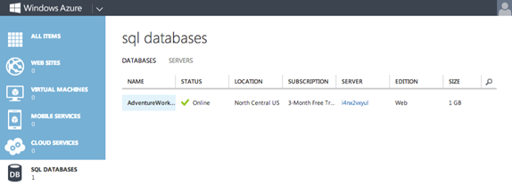
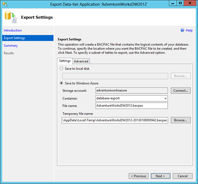
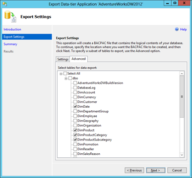
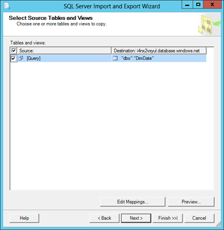

# 第二章入门

在开始使用 SQL Reporting 交付报表之前，您需要有这些报表的可用数据。SQL Reporting 只能使用 SQL Database 作为数据源，因此您需要计划一些时间来建立用于报表的数据库。为此，您需要一个添加了 SQL 数据库和 SQL 报告服务的 Windows Azure 订阅。然后在 SQL 数据库中创建一个数据库，并将数据迁移到其中。

## Windows Azure 安装程序

SQL 数据库和 SQL 报告是 Windows Azure 平台上提供的独立服务。Windows Azure 是微软托管的基于订阅的云计算平台。激活订阅之前，您必须在[http://go.microsoft.com/fwlink/p/?LinkID=238657](http://go.microsoft.com/fwlink/p/?LinkID=238657)创建一个微软帐户(以前称为 Windows Live ID)。接下来，在[http://windows.azure.com](http://windows.azure.com)注册 Windows Azure。

您可以每月支付调配服务的费用，而不是为软件支付许可和维护费用以及投资硬件。在撰写本文时，Windows Azure 作为以下订阅类型之一可用:

*   **3 个月免费试用**。您可以注册一个功能齐全的[免费试用版的 Windows Azure](http://www.windowsazure.com/en-us/pricing/free-trial/) ，除了其他服务之外，它还包括 750 小时的 SQL Database 和每月 100 小时的 SQL Reporting。
*   **现收现付**。你为你使用的服务付费。SQL 数据库定价目前基于数据库大小。SQL Reporting 定价基于每个已部署实例的时钟小时数。此外，如果使用时钟小时执行的报告数量超过指定的阈值，则会额外计费一小时。有关 SQL 数据库、SQL 报告和其他服务的当前现收现付费率，请参考[定价详情](http://www.windowsazure.com/en-us/pricing/details)。
*   [**6 个月计划**](http://www.windowsazure.com/en-us/offers/ms-azr-0037p) **或** [**12 个月计划**](http://www.windowsazure.com/en-us/offers/ms-azr-0039p) 。有了这些计划，您每月至少承诺获得一个相对于现收现付基本费率的折扣。更高的月承诺可以获得更高的折扣。如果您没有提供足够的服务来满足最低承诺，余额将滚动到未来一个月，如果从未使用过，将在订阅期结束时被没收。

## SQL 数据库设置

在 SQL 数据库服务器上创建新数据库时，必须决定使用哪个版本，并指定数据库的最大大小。对于您的数据库，您有以下选择:

*   网络版:1 GB 或 5 GB
*   商务版:10 GB、20 GB、30 GB、40 GB、50 GB、100 GB 或 150 GB。

要将 SQL 数据库服务添加到您的订阅中，请使用 Windows Azure 主页上的**管理门户**链接。然后在管理门户中，点击左下角**新建**，指向**数据服务**，再指向 **SQL 数据库**。您有以下三个选项:

*   **快速创建**。使用此选项可以通过提供名称、将其分配给数据库服务器(或者创建一个新的数据库服务器，如果订阅中还没有数据库服务器的话)以及创建登录名和密码来创建数据库。数据库自动创建为 1gb 网络版数据库，并分配给服务器和数据中心位置。
*   **自定义创建**。使用此选项可以通过提供名称、选择版本、最大数据库大小、排序方法和服务器来创建数据库。
*   **导入**。使用此选项可从另一台 SQL 数据库服务器或内部 SQL 服务器数据库实例复制数据库。但是，在选择此选项之前，您必须将要复制的数据库导出到 BACPAC 文件，并将其存储在 Windows Azure blob 存储帐户中。我将在本章后面的[数据层应用导出和导入](#DataTier)部分详细解释如何做到这一点。要执行导入，您需要提供数据库的 URL 和名称，选择服务器，并创建登录名和密码。

创建数据库后，它会出现在 Windows Azure 管理门户的 **SQL 数据库**列表中，如图 1 所示。在这里，您可以看到它的状态、数据中心位置、与之关联的 Windows Azure 订阅、服务器名称、数据库版本及其大小。



图 Windows Azure 管理门户中的 SQL 数据库

要查看数据库的更多信息，请在 **SQL 数据库**列表中单击其名称。页面顶部是一个仪表板，其中包含一个显示过去 24 小时数据库活动的图表和另一个将数据库当前大小与定义的最大大小进行比较的图表。(如果您稍后决定要更改版本类型或数据库大小，请单击页面顶部的**配置**链接。)

滚动仪表板页面，在页面下部查看有关数据库的附加信息。在这里，您可以找到服务器的完全限定域名，并找到数据库在线管理的网址。此网址打开 SQL 数据库管理门户，允许您为数据库执行查询或设计表、视图或存储过程。如果已经有一个内部部署的 SQL Server 实例可用，您可能更愿意使用 SQL Server Management Studio。

在将计算机的 IP 地址添加到服务器配置之前，您不能通过联机管理门户或从 SQL Server Management Studio 访问服务器。为此，单击左侧导航面板中的 **SQL 数据库**图标，单击数据库列表上方的**服务器**链接，然后单击**配置**。只需单击一下即可添加您当前的 IP 地址，如果需要，您还可以设置其他规则来授予对一系列 IP 地址的访问权限。创建完规则后，一定要点击页面底部的**保存**。

## 数据迁移选项

一旦数据库服务器就位，就可以添加数据库和加载数据了。如果要从内部数据库服务器移动数据库，您有几个选项:

*   部署数据库向导
*   数据库脚本
*   Windows Azure SQL 数据同步
*   数据层应用导出和导入
*   SQL Server 集成服务
*   批量复制实用程序

* * *

| [SQL 数据库迁移向导](http://sqlazuremw.codeplex.com/)您可以下载一个分析数据库兼容性问题的开源应用，并可选地从 [Codeplex](http://sqlazuremw.codeplex.com/) 为您执行数据库迁移。因为它是一个开源应用，所以不被微软支持。 |

* * *

### 部署数据库向导

如果您运行的是内部部署的 SQL Server 2012 实例，则可以使用 SQL Server 管理工作室中的部署向导来部署 SQL Server 2008、2008 R2 或 2012 数据库。为此，在对象资源管理器中右键单击要迁移的数据库，指向**任务**，然后单击**将数据库部署到 SQL Azure** 。在向导的**部署设置**页面，点击**连接**通过提供服务器名称和登录信息来定义与服务器的连接。如果您愿意，也可以更改数据库名称。您可以在这里选择指定数据库版本和数据库的最大大小。

在所有可用的数据迁移选项中，部署数据库向导是最简单的。但是，您的数据库存在可能导致迁移问题的潜在问题。查看 MSDN 的[指南和限制](http://msdn.microsoft.com/en-us/library/windowsazure/ee336245.aspx)，了解在迁移数据库之前需要解决的问题。

### 数据库脚本

在 SQL Server Management Studio 中，您可以使用生成脚本向导来生成用于将内部数据库迁移到 SQL 数据库服务器的 T-SQL 脚本。在对象资源管理器中，右键单击数据库，指向**任务**，然后单击**生成脚本**。逐步完成向导，选择要迁移的对象，可以是整个数据库，也可以是特定的数据库对象，并将脚本保存到一个文件中。在保存文件之前，点击向导的**设置脚本选项**页面上的**高级**，更改一些选项，以与 SQL 数据库兼容，如表 2 所示。

表 2:生成脚本向导的脚本选项

| [计]选项 | 环境 |
| 将 UDDTs 转换为基本类型 | 真实的 |
| 数据库引擎类型的脚本 | SQL Azure 数据库 |
| 要编写脚本的数据类型 | 模式和数据 |

虽然您可以在 SQL 数据库管理门户中打开和执行脚本文件，但数据库脚本文件可能太大。门户接受 250，000 个字符或更少的输入。要运行脚本，请使用 SQL Server 管理工作室连接到您的 SQL 数据库服务器。在**连接到服务器**对话框中，您需要提供在 Windows Azure 管理门户的数据库仪表板页面上找到的整个服务器名称。例如，如果您的服务器是 **xyz123** ，那么您输入**xyz123.database.windows.net**作为服务器名称。切换到 SQL 身份验证，并输入您在创建数据库时指定的登录名和密码。然后打开保存的脚本文件，在工具栏的**可用数据库**下拉列表中选择适用的数据库，然后执行脚本。

SQL 数据库不完全支持 T-SQL。因此，您可能需要在脚本成功完成之前对其进行修改。与部署数据库向导一样，您应该熟悉 MSDN 的[指南和限制](http://msdn.microsoft.com/en-us/library/windowsazure/ee336245.aspx)列表，以了解您可能需要在脚本中更改的内容。

使用数据库脚本的优势在于它相对简单。您可以使用脚本来迁移数据库的子集，或者在必要时对模式进行更改。然而，这种方法的一个潜在问题是，脚本对数据执行单行插入。如果数据量很大，这种数据迁移方法的性能可能会很差。

### Windows Azure 数据同步

迁移数据的另一个选项是在内部的 SQL Server 2005 SP2(或更高版本)和 SQL 数据库服务器之间使用同步。在 Windows Azure 管理门户中，转到 **SQL 数据库**页面。指向页面底部功能区的**添加同步**，点击**新建同步代理**。如果这是您第一次添加同步代理，您必须单击链接下载它，然后执行下载的安装程序，但保持**新的 SQL 数据同步代理**对话框打开。

代理安装完成后，返回**新建 SQL 数据同步代理**对话框，键入代理的名称，然后选择代理的区域和订阅。在页面底部的功能区，单击**管理密钥**，然后单击**生成**创建代理访问密钥。单击键右侧的图标将其复制到剪贴板，然后在计算机上运行新安装的应用。单击功能区中的**提交代理密钥**，然后将代理访问密钥粘贴到显示的对话框中。

接下来，点击功能区上的**注册**注册数据库。单击适用于内部数据库的身份验证类型，即 SQL 或 Windows，并在 **SQL Server 配置**对话框中提供服务器和数据库名称。

回到 Windows Azure 管理门户，点击导航窗格中的 **SQL 数据库**，指向功能区中的**添加同步**，然后点击**新建同步组**。提供名称，并在向导的第一页上选择同步组的区域和订阅。在向导的第二页上，在**中心数据库**下拉列表中选择一个数据库，然后提供连接到该数据库的凭据。此外，您需要指定在发生冲突时是集线器还是客户端获胜。在第三页上，您可以指定参考数据库、凭据(如果它使用 SQL 身份验证)和同步方向。您可以为同步方向选择以下选项之一:

*   双向的
*   同步到集线器
*   从集线器同步

您可以通过建立同步规则来定义要同步的表和列。为此，在 Windows Azure 管理门户中单击 **SQL 数据库**，单击页面顶部的**同步**链接，单击**同步组**，单击**同步规则**链接，然后单击**定义同步规则**链接。接下来，在下拉列表中选择中心数据库或参考数据库。然后单击表格旁边的箭头以显示要同步的列。点击页面底部功能区的**选择**，选择所有表格中的所有列。另一种选择是在表格中选择一列，然后点击**选择**从当前表格中选择所有列。完成选择后，点击**保存**。

您可以使用 Windows Azure 管理门户按需或按计划同步数据库。点击 **SQL 数据库**，点击**同步**链接，然后点击**同步组**。对于按需同步，单击功能区上的**同步**。否则，点击**配置**，然后点击上的**进行自动同步。然后您可以设置一个从五分钟到一个月的**同步频率**。退出页面前一定要点击**保存**。**

### 数据层应用导出和导入

您可以使用数据层应用(DAC)导出过程将数据库的模式定义和数据复制到导出文件(BACPAC)中。然后将此文件存储在一个 Windows Azure blob 存储帐户中，从该帐户中使用 DAC 导入过程将数据迁移到 SQL 数据库服务器中的数据库。使用这种方法的一个优点是能够使用源代码控制和版本控制来管理数据库。

### Windows Azure Blob 存储帐户

在创建 BACPAC 文件之前，您必须创建一个 blob 存储帐户。在 Windows Azure 管理门户中，点击左下角**新建**，指向**数据服务**，指向**存储**，然后点击**快速创建**。在“网址”框中，使用小写字母和数字的组合键入子域名称，最小长度为 3 个字符，最大长度为 24 个字符。如果您键入的子域已经在 Windows Azure 服务器上使用，将显示一条警告消息，阻止您创建帐户，直到您提供唯一的名称。当名称有效时，URL 框中会显示一个绿色图标，如图 2 所示。


图 2:存储帐户创建

您还必须在**区域/相似性组**下拉列表中选择一个数据中心位置。默认情况下选择**启用地理复制**复选框。**地理复制**选项确保您的数据在多个位置持续存在，无需额外成本，以减轻单个数据中心的停机。点击**创建存储账户**开始流程，可能需要几分钟才能完成。

创建帐户后，接下来必须向其中添加 Blob 存储容器。在 Windows Azure 管理门户的**存储**页面，点击列表中的账户，然后点击仪表盘页面顶部的**容器**链接，然后点击**创建 Blob 容器**。要创建一个新的容器，需要为它指定一个符合以下规则的名称:

*   3 到 63 个字符
*   仅包含字母、数字或-
*   不能连续以-或使用-开头两次

您还可以选择以下访问方法之一:

*   列兵。只有您作为帐户所有者才能使用该容器。
*   公共 Blob。任何人都可以访问容器中的 blobs，但不能访问容器属性和元数据。
*   公共集装箱。任何人都可以完全进入集装箱。

当容器成功创建后，您将拥有如下网址:http://adventureworkazure . blob . core . windows . net/database-export。

## BACPAC 出口

SQL Server Management Studio 包括导出数据层应用向导，用于创建一个 BACPAC 文件，您可以将其上传到 Windows Azure 中的 blob 存储。在**对象浏览器**中右键点击数据库，指向**任务**，点击**导出数据层应用**。在向导的**导出设置**页面上，您有两个保存 BACPAC 文件的选项。一种选择是将文件保存在本地，然后使用自定义应用或工具，如 [Azure 存储资源管理器](http://azurestorageexplorer.codeplex.com/)或[云存储工作室 2](http://www.cerebrata.com/products/cloudstoragestudio/) 将文件上传到 blob 存储。另一种选择是将文件保存到 Windows Azure，这种情况下需要点击**连接**定义连接设置。

在向导中定义连接设置之前，您需要**存储帐户**和**帐户密钥**。您可以通过在 Windows Azure 管理门户中打开存储帐户的仪表板页面来找到这些值。单击页面底部的**管理密钥**查看存储帐户名、主访问密钥和次访问密钥。您可以单击这些字段旁边的按钮，将该值放入计算机的剪贴板中，然后将该值粘贴到向导中相应的字段中。

|  | 注意:请务必先粘贴存储帐户，以清除帐户密钥。 |

连接成功后，选择一个容器，完成向导的**导出设置**页面，如图 3 所示。您可以为文件设置文件名和临时位置。



图 3:导出数据层应用向导

在**高级**选项卡上，如果不想迁移整个数据库，可以选择导出特定的表，如图 4 所示。



图 4:用于导出的单个表选择

## 迁移到 SQL 数据库

在 Windows Azure 管理门户中，使用导航窗格打开 SQL 数据库服务器上的数据库列表。点击底部功能区的**导入**。您需要提供 BACPAC 文件的网址。当您单击“网址”框时，会打开一个对话框，允许您导航存储帐户及其容器来定位 BACPAC 文件。

您必须命名数据库，选择一个数据库服务器或创建一个新的数据库服务器，并提供登录凭据。您可以选择复选框来配置高级数据库设置。具体来说，您可以设置数据库的版本和大小。

## SQL Server 集成服务

您可以使用 SQL Server Management Studio 中的“SQL Server 导入和导出向导”作为将数据从本地服务器导出到 SQL 数据库服务器的简单方法。在**对象浏览器**中，右键点击数据库，指向**任务**，然后点击**导出数据**启动向导。向导的**选择数据源**页面会自动填充正确的数据源提供程序、服务器、身份验证和数据库选择。在**选择目的地**页面，选择**。SqlServer 的. NET 框架数据提供程序**。然后将**加密**属性改为**真**，输入登录密码，将**信任服务器证书**设置为**真**，输入登录用户标识。服务器的完全限定名和数据库的名称进入**初始目录**，如图 5 所示。


图 5:的属性。SqlServer 的. NET 框架数据提供程序

在向导的**指定表复制或查询**页面上，您可以选择特定的表或编写查询来定义要迁移的数据。

在**查看数据类型映射**页面上，您可能会看到警告，但只要没有出现错误，您就可以继续。然后，您可以运行向导生成的包。但是，该包可能会失败。尽管失败了，向导还是将每个表的模式复制到 SQL 数据库中的目标数据库。例如，如果源表没有聚集索引，向导将失败。您可以让向导保持打开状态，然后通过使用 SQL Server Management Studio 界面或运行类似如下的 T-SQL 命令(对于要迁移的每个表)来添加聚集索引:

```cs
    create clustered index idxDateKey on dbo.DimDate (DateKey)

```

添加聚集索引后，点击**返回**返回**指定表复制或查询**页面，恢复向导。您必须切换到查询模式，因为表复制模式会在包执行期间在目标数据库中创建表，但是如果您在初始失败后再次尝试运行向导，这些表已经存在。如果将向导切换到查询模式，可以编写 SELECT 语句复制一个表的全部或部分数据，在**选择源表和视图**页面选择目标表，如图 6 所示，然后执行向导。您需要为每个表单独执行这组步骤。



图 6:将源查询映射到目标表

|  | 注意:对于一次性迁移，向导应该足够了，但是如果您定期将数据库迁移到 SQL Database，请考虑构建一个更健壮的集成服务包。在这个包中，您可以将复制模式、添加聚集索引和复制数据的步骤分开。 |

### 批量复制实用程序

SQL Server [bcp 实用程序](http://msdn.microsoft.com/en-us/library/ms162802.aspx)是另一种移动数据的方式，尽管它仅限于数据。与使用数据库脚本方法进行单行插入相比，这种方法的优点是对高数据量具有更高的性能。bcp 实用程序无法迁移数据库架构，因此您必须使用单独的过程在 SQL Database 中准备数据库。例如，您可以使用 SQL Server Management Studio 中的“生成脚本向导”来定义要复制的数据库对象，并将**数据类型设置为脚本**选项以仅导出模式。您可以运行一次 bcp 实用程序，从内部的 SQL Server 导出数据，将数据存储在数据文件中，然后再次运行该实用程序，将数据从数据文件传输到 SQL Database server 上的空数据库中。

|  | 注意:您必须从安装了 SQL Server 2008 R2 或更高版本的客户端工具中使用 bcp 实用程序。 |

从源数据库导出

为每个要迁移的表运行 **bcp** 实用程序。要从您的 SQL Server 数据库中导出数据，请在**命令提示符**窗口中使用如下命令:

```cs
    bcp AdventureWorksDW2012.dbo.FactResellerSales out c:\your path\FactResellerSales.dat -S localhost -T -n -q

```

请注意，第二个参数是数据库、模式和表名。第四个参数是存储导出数据文件的输出路径。如果没有在源服务器上运行 bcp 实用程序，可以用服务器或数据库实例名称替换`-S`参数后面的参数。其余参数是可选的。`-n`参数保留数据的原生数据库类型，而`-q`参数在连接到源数据库时执行`SET QUOTED_IDENTIFIERS ON`语句。

导入目标数据库

接下来，运行 bcp 实用程序，将数据导入到 SQL 数据库服务器上的目标数据库中。假设您有一个要分两步处理的表。您可以使用以下命令来定义每次执行 bcp 实用程序时要处理的行:

```cs
    bcp AdventureWorksDW.dbo.FactResellerSales in c:\your path\FactResellerSales.dat –n –U awadmin –S tcp:xyz123.database.windows.net –P YourPassword –b 500 –L 29999 –h"TABLOCK"
    bcp AdventureWorksDW.dbo.FactResellerSales in c:\your path\FactResellerSales.dat –n –U awadmin –S tcp:xyz123.database.windows.net –P YourPassword –b 500 –F 30000 –L 61000 –h"TABLOCK"

```

`-S`参数现在引用以`tcp:`作为前缀的 SQL 数据库服务器。还要注意`-U`和`-P`参数，它们需要您为数据库设置的登录名和密码。`-b`参数指定在 bcp 实用程序执行期间每批要处理的行数。`-F`和`-L`参数指定要处理的文件中的第一行和最后一行，尽管在第一个 bcp 命令中省略了`-F`来指示处理从第一行开始。最后，`-h`参数是在处理过程中应用表级锁的提示。

|  | 注意:如果您的数据包含 Unicode 字符，请确保添加–w 参数，以确保这些字符被保留而不被转换。 |

## SQL 报告设置

在撰写本文时，您将在单独的门户上执行 SQL Reporting server 的设置。要访问此门户，请在 Windows Azure 管理门户右上角单击您的用户名，然后单击**上一个门户**。在旧门户的左下角，点击**报表**，然后在浏览器窗口的中央，点击**新建一个 SQL 报表服务器**。在**创建服务器**对话框中，选择订阅和托管新服务器的区域。为了最大限度地减少延迟问题，请考虑为计划用作报告数据源的 SQL 数据库选择相同的区域。您还必须建立用于管理报表服务器的管理员名称和密码。

在左侧面板中，您可以展开**订阅**文件夹以查看与您的帐户相关联的订阅。展开订阅以查看您的 SQL Reporting 服务器。点击服务器查看其网络服务网址并管理其内容，您将在[第 4 章报告管理](4.html#_Chapter_4_)中学习如何操作。