# 第三章报告发展

现在，您已经在一个 SQL 数据库和一个设置为在 SQL Reporting 中承载报表的服务器中获得了数据，下一步是开发报表。在本章中，我将向您介绍可以用来创建报告的工具，并解释可以在报告中使用的基本功能。此外，我描述了如果您决定在报表生成器而不是 BIDS 或 SSDT 中开发报表时会遇到的一些差异。最后，我将向您展示如何使用 **ReportViewer** 控件，如果您的目标是开发一个自定义的报告应用程序。

## 工具

SQL Azure Reporting 的创作过程使用与 SQL Server Reporting Services 相同的内部工具:

*   报表设计器
*   报表生成器
*   报表查看器控件

如果您内部已经有了报表服务，那么如果您使用的是 SQL 2008 R2，则可以使用商业智能开发工作室(BIDS)中的**报表设计器**，如果您使用的是 SQL Server 2012，则可以使用 SQL Server 数据工具(SSDT)。如果您还没有报告服务，也没关系。您可以免费下载[带有高级服务的 SQL Server 2012 Express】，使用 SQL Server 数据工具中的报表设计器开发报表。](http://www.microsoft.com/en-us/download/details.aspx?id=29062)

另一个选择是下载 [**报表生成器**](http://www.microsoft.com/en-us/download/details.aspx?id=29072) ，也是免费的。像 BIDS 和 SSDT 一样，它为所有报告服务功能提供支持。这些产品之间的区别在于，报表生成器允许您一次只处理一个报表，而 BIDS 和 SSDT 允许您在一个项目中处理多个报表。另一方面，如果您决定实现报表部分，正如我在本章后面解释的那样，您必须使用报表生成器基于这些报表部分创建新报表。

还有一个选择是在 Visual Studio 中使用 **ReportViewer** 控件作为自定义窗口或 Web 应用程序的一部分。就像 BIDS、SSDT 和报表生成器一样，您可以使用各种布局选项创建一个交互式的、动态的、视觉上吸引人的报表。

## 报告发展基础

报表开发是一个多步骤的过程。在本节中，我将介绍如何使用报表设计器。报表生成器和报表查看器中的大部分功能是相似的，但是如果您需要使用这些工具中的一个，我将在本章后面解释这些工具的不同之处。选择工具后，下一步是为报表获取数据，因此需要创建数据源和数据集来定义数据的位置以及要检索的内容。一旦有了数据，就可以设计报表布局了。在此步骤中，您可以指定数据在报表中的结构，添加标题、页眉和页脚文本以及图像。您可以应用格式并配置任何交互功能，不仅可以控制报表的外观，还可以控制报表的行为。

工作时，您可以预览报告，以确保获得所需的结果。完成后，将报告部署到 SQL Reporting。因为报表开发是一个非常迭代的过程，所以您可能会预览报表，然后重新开始处理报表布局，多次微调报表设计，直到得到您想要的结果。

### 报告项目

如前所述，报表设计器是大多数专业报表开发人员的首选报表开发工具。与其使用报表生成器，不如使用它的优点是能够在一个项目中处理多个报表。创建新项目时，可以选择创建以下项目类型之一:

*   报表服务器项目向导
*   报表服务器项目

为了快速开发基本报表，可以使用报表服务器项目向导。您可以使用向导界面逐步完成定义数据源、定义查询以及从几个选项中选择布局的过程。因为您可以在使用向导后对报表进行修改，所以这是启动简单报表的简单方法。

另一种项目类型是报表服务器项目。这是您在报表开发中最常选择的项目类型。在本章中，我使用报表服务器项目类型来解释报表开发基础。

项目项目

创建项目后，可以向其中添加项目。当您添加项目时，它们在**解决方案资源管理器**窗口中可见，如图 7 所示。报表服务器项目支持三种不同类型的项:

*   数据源
*   资料组
*   报告

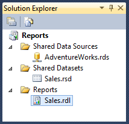

图 7:在解决方案资源管理器中报告项目项

**数据源**作为 RDS 文件存储在您计算机上的项目目录中，并在您部署项目时单独上传到 SQL Reporting。您可以创建一个或多个用于报表的数据源。当数据源独立于报表创建时，它被称为**共享数据源**，可用于任何报表。这样，对于多个报表，可以对数据源设置进行一次更改。

**数据集**存储为 RSD 文件，也单独上传。与数据源一样，您可以在任何报表中使用一个或多个数据集，对共享数据集所做的更改会影响所有报表。

第三种项目类型是**报告，**存储为 RDL 文件。虽然项目中可能没有数据源和数据集文件，但项目中至少会有一个报表文件。

项目属性

如果计划使用报表设计器将报表部署到 SQL Reporting，则必须在部署前配置项目属性。这些属性仅由**部署**命令使用。在部署时，这些属性标识您在 SQL Reporting server 上的各种项目文件的目标位置。许多项目属性都有默认值，并引用用于存储项目项的文件夹。例如，您的共享数据集转到**数据集**文件夹，共享数据源转到**数据源**文件夹。如果您愿意，可以将这些目标文件夹更改为备用路径。

在**解决方案资源管理器**中右键单击项目名称，选择**属性**打开项目属性，如图 8 所示。请注意**目标报告文件夹**默认为当前项目的名称，在本例中为**报告**。您可能希望报表的文件夹名称不同于项目名称，因此请确保在必要时更改此值。另外，您必须为报表服务器指定**目标服务器 URL** ，然后才能部署报表。在新项目中它将为空，并且在您为此属性提供值之前，项目不会部署。使用显示在 SQL 报告门户中的网络服务网址，如 https://xyz123.reporting.windows.net/ReportServer.


图 8:报告项目属性

报告数据

作为数据获取过程的一部分，您可以定义数据源，以便向 SQL Reporting server 提供有关在报表中定位要使用的数据以及如何验证数据请求的说明。您还需要创建数据集来定义要从数据源中检索的列，以便放置在报表中。

数据源

要在报表中显示数据，至少需要一个数据源。报表服务数据源包括数据提供程序、连接字符串和用于身份验证的凭据。因为 SQL Reporting 只支持 SQL Database 作为源，所以必须在**类型**下拉列表中选择**微软 SQL Azure** ，如图 9 所示。图 9 中的示例说明了一个共享数据源，您可以通过右键单击**解决方案资源管理器**中的**共享数据源**文件夹来创建该共享数据源，但是您也可以在**报告数据**窗格中创建一个嵌入式数据源，我将在本章后面解释。


图 SQL 数据库的共享数据源

SQL 数据库的连接字符串格式如下所示:

```cs

    Data Source=xyz123.database.windows.net;Initial Catalog=AdventureWorksDW;Encrypt=True;TrustServerCertificate=False

```

在**共享数据源属性**对话框的**凭证**选项卡上输入登录名和密码，如图 10 所示。

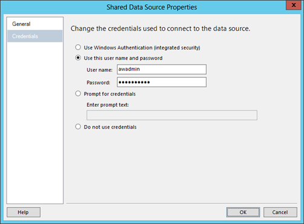

图 10:数据源连接的凭证

有两种不同类型的数据源:

*   共享数据源
*   嵌入式数据源

通常，您创建一个**共享数据源**来定义一次连接信息，以便与许多报告一起使用。如果连接信息在以后发生更改，例如当您将源数据库移动到不同的 SQL Database server 时，您可以更新数据源定义一次，以更新所有关联的报表。

你的另一个选择是**嵌入式数据源**。在这种情况下，您不会为项目创建单独的数据源文件，而是在每个报表的 RDL 内部创建数据源定义。使用嵌入式数据源的优点是可以使用动态连接字符串。缺点是，如果您需要对连接字符串进行更改，则必须打开每个报告并编辑每个连接字符串，如果您有很多报告，这可能是一个非常繁琐的过程。

|  | 注意:如果决定使用嵌入式数据源，请注意，更改凭据的唯一方法是在报表设计器或报表生成器中打开报表，编辑凭据，然后重新部署报表。管理门户不支持对嵌入式数据源的更改。 |

无论您决定使用哪种类型的数据源，都必须在报表中添加对数据源的引用。为此，请打开报告，然后在**报告数据**窗格中，右键单击**数据源**文件夹，然后单击**添加数据源**。这里可以选择**嵌入式连接**选项，然后定义连接字符串和凭据，或者选择**共享数据源引用**选项，然后在下拉列表中选择适用的数据源，如图 11 所示。

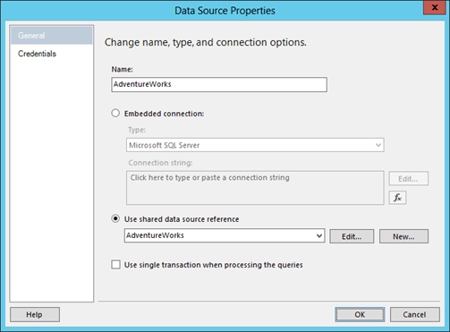

图 11:添加到报告中的共享数据源引用

|  | 提示:请考虑命名数据源以匹配共享数据源名称或嵌入式连接中的数据库名称，从而使数据源在报表中更容易识别。 |

资料组

创建数据源定义后，报表开发过程的下一步是创建数据集。简单来说，数据集是用于获取报表数据的查询。但是，仔细查看就会发现，它包含了要从数据源检索的字段或表列的描述以及其他信息。在报表开发过程中，您可以使用这些字段集合作为报表中数据的占位符。

您可以创建两种类型的数据集:

*   共享数据集
*   嵌入式数据集

如果需要对多个报表重复使用同一个查询，那么**共享数据集**是更好的选择，很像可以对多个报表使用一个共享数据源。这样，您可以只对一个文件进行任何必要的更改。创建共享数据集时，输出是添加到项目中的 RSD 文件。

另一方面，**嵌入式数据集**仅与一个报告相关联。数据集定义虽然类似于 RSD 文件的内容，但直接嵌入到报告的 RDL 文件中。

无论使用共享数据集还是嵌入数据集，都必须将其包含在报表中。为此，请打开报告，然后在**报告数据**窗格中，右键单击**数据集**文件夹，然后单击**添加数据集**。这里可以选择如图 12 所示的**嵌入式连接**选项，然后定义查询类型和查询字符串，或者选择共享数据集选项，然后在下拉列表中选择适用的数据集。


图 12:报告数据集属性

如果选择**文本**作为**查询类型**选项，可以直接在查询框中输入查询字符串，也可以点击**查询设计器**打开一个简单的查询设计器。即使打开查询设计器，也可以单击按钮切换到文本编辑器。无论哪种方式，您都会发现打开这个单独的对话框很有帮助，因为它允许您执行一个查询来确认它是否有效以及您是否获得了所需的结果。此时，将生成数据集的**字段**集合，以匹配查询结果中看到的数据列。

您也可以使用**查询类型**的**存储过程**选项。选择此选项时，查询框将被下拉列表替换，您可以从中选择一个可用的存储过程。

作为提供查询文本或选择存储过程的替代方法，您可以单击**导入**并找到一个 SQL 脚本文件或现有的 RDL。使用此选项，您可以通过从另一个文件导入现有查询来重用它。但是，对原始查询所做的任何更改都不会更新导入该查询的数据集。

要在数据集中配置的另一个重要属性是**超时**属性。默认情况下，它被设置为 0，这意味着查询将无限期等待数据源返回数据。如果您希望对查询设置时间限制，并且如果数据源花费的时间过长，则报告失败，则可以输入您希望等待的最大秒数作为超时值。

### 报告项目

您将大部分报表开发时间用于设计布局中的报表项。报表项是您在报表上放置的对象，如文本框和图像。一些报表项独立于数据，而另一些报表项(称为数据区域)需要与报表中的数据集关联。

要向报表中添加报表项，请打开**工具箱**窗口，将该项拖动到报表上的特定位置。如有必要，您可以拖动项目的边缘来调整其大小，或者选择项目，然后在**属性**窗口中设置**位置**和**大小**属性以获得更高的精度。当然，还有其他属性可供配置，但这些属性因报表项类型而异。

独立报告项目

图 13 显示了以下每个独立的报告项目:

*   **文本框**。用于报表标题或独立标签。
*   **线**。在报表上的项目之间创建可视分隔。
*   **矩形**。在一个或多个对象周围放置边框，或者用作容器，将页面上的对象放在一起。
*   **图像**。在报表上显示徽标，在页面上用作水印，或者如果图像是数据集的一部分，则显示在数据区域中，例如与产品数据一起存储的产品图像。
*   **子报表**。构建一个单独的报表，然后将其作为子报表嵌入到其他报表中。

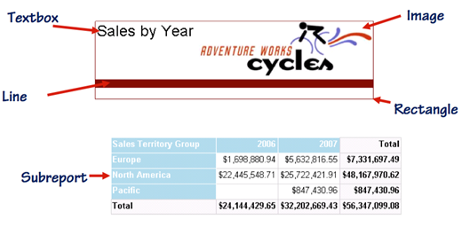

图 13:独立的报告项目

数据区域

如图 14 所示，下面的数据区域显示了数据，就像您在查询结果中看到的那样，带有可选的摘要:

*   **表**。一个表有固定数量的列。行数将根据您的查询结果而有所不同。虽然此表没有显示，但您也可以向表中添加分组和分类汇总。
*   **矩阵**。矩阵有可变的行数和列数。您还可以向矩阵布局添加分组和分类汇总。
*   **列表**。列表是根据您定义的分组重复其内容的自由形式区域。在图 14 中，您可以在列表中看到一个表和一个图表，按销售区域分组。换句话说，由于为列表配置的分组，欧洲有一个表和图表实例，北美有另一个表和图表实例。

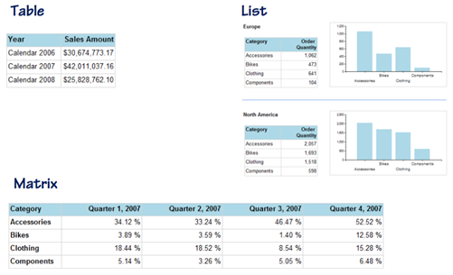

图 14:数据区域

*   **图表**。支持许多不同类型的图表，例如柱形图、条形图、饼图和散点图等。您可以配置每个图表元素的属性，例如坐标轴标题；是否包含图例及其显示方式；该系列的颜色；等等。
*   **数据栏**。虽然数据条不一定要放在数据区域内，但更多时候是作为内联图表添加到表或矩阵中，以图表形式显示单个数据点。
*   **火花线**。迷你图类似于数据条，因为它通常用作内嵌图表。但是，迷你图绘制了多个数据点，例如按年销售额。
*   **规**。仪表对于指针显示的值与红色区域等范围的可视化比较非常有用。
*   **指示灯**。如果您不想使用可用的图标，您可以使用指示器作为比较值和目标的另一种方式，使用各种形状或颜色，甚至您自己的图像。

图形数据区域使用数据可视化技术来总结数据，以便进行比较或模式发现，如图 15 所示。


图 15:图形数据区域

另一种特殊类型的数据区域是用于空间数据可视化的地图报告项，如图 16 所示。您可以创建包含以下任意或所有类型空间数据的地图:

*   **点**。每个点代表地图上的一个坐标。您可以选择使用 Bing 集成引入街道级别的细节。
*   **线**。线是成对的点。例如，您可以使用多行来显示路由信息。
*   **多边形**。多边形是第一个点和最后一个点相同的一系列点。

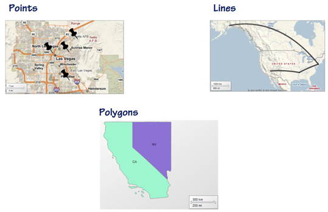

图 16:地图中的空间数据类型

现在，让我们仔细看看如何处理数据区域。虽然数据区域在**工具箱**窗口中单独列为**表**、**矩阵**、**列表**，但它们实际上是相同的结构，称为 **Tablix** 。它们之间的区别在于详细行、行组和列组的定义。

另一方面，每种类型的数据区域中字段的位置是相似的。您可以从**报告数据**窗格的数据集列表中拖动字段，并将其放入数据区域的文本框中。放置字段的另一种方法是指向一个文本框，单击显示的**字段列表**图标，然后选择一个字段。

使用数据区域时，还可以对数据进行分组。事实上，矩阵只允许您处理组，而不是明细行。您可以将用于分组的字段从**报表数据**窗格拖动到显示在报表设计器底部的**行组**或**列**组窗格，如图 17 所示。


图 17:组

桌子

表格只是文本框的表格集合。它包含的列数始终保持静态，但表中的行数将因查询返回的行数而异。这些被称为细节行，如图 18 所示。当您在预览模式下工作时，可以看到表格数据区域中心的明细行，表格左边缘的灰色行控点中有三条水平线。


图 18:表格布局

对于查询结果中的每一行，当您切换到**预览**选项卡时，相应的详细信息行会出现在渲染表中。或者，您可以包含表格和组的页眉和页脚行。事实上，除非您决定删除表标题行，否则它总是出现在表的顶部，并且只出现一次。表格页脚是表格的可选附件，与表格标题一样，它仅在所有详细信息行和任何组行呈现后出现一次。

如果将组添加到表中，可以包含组标题，该组标题在属于该实例的详细信息行之前为组的每个实例显示一次。同样，我们可以添加一个组页脚行，它显示在属于相应组的详细信息行之后。在图 18 所示的示例中，明细行按年份分组，组头显示年份，组尾显示该年的销售小计。

[数]矩阵

矩阵是以列和行的动态排列显示的文本框的交叉表集合，就像 Excel 中的透视表一样。这种排列是动态的，因为当数据集返回不同的结果时，在矩阵的每次呈现中，列数和行数可能会有所不同，这可能是因为源中的数据发生了变化，也可能是因为您应用了筛选器。对于动态行组，矩阵将为定义的组的每个实例显示一行。类似地，对于动态列组，您将获得为列组定义的每个实例一列。图 19 所示的矩阵只有一个列组和一个行组，但是您可以在列和行上创建多个分组。

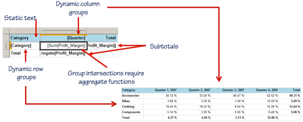

图 19:矩阵布局

使用矩阵时，必须使用聚合函数，将字段放入行和列组相交处的文本框中。顺便说一下，矩阵左上角的文本框可以包含静态文本，但它的使用是可选的。另一个可选功能是按组添加小计行或列。

目录

该列表是要作为组的一部分重复的任何报表项的自由形式集合。该集合通常是文本框和数据区域的组合。一个列表只支持一个分组，但是如果需要创建具有多个分组的自由形式布局，可以将列表放在列表内部。图 20 展示了一个包含文本框、表格和矩阵的列表，它们都是一个组的一部分。在呈现的报表中，文本框、表格和矩阵的每个组合在定义的组(在本例中是销售区域)的每个实例中重复一次。


图 20:列表布局

### 表情

表达式允许您在报表执行时修改数据集中的数据或调整属性的设置，从而为报表提供了更大的灵活性。在本节中，我首先概述了表达式的可能性，解释了如何在简单表达式中使用占位符来更容易地解释报表设计布局，并回顾了可以在表达式中引用的全局集合。我还向您展示了如何使用表达式编辑器来创建更复杂的表达式，并探索了一些可以在表达式中使用的函数。

表达式用法

报表服务中有两种类型的表达式:

*   **简单**。一个简单的表达式引用一个对象，通常是该对象的一个属性。例如，将字段放置在文本框中会自动生成一个表达式，以显示数据集的**字段**集合中特定字段的**值**属性，如下所示:

```cs
    =Fields!CalendarYear.Value

```

*   **复杂**。复杂表达式使用 Visual Basic 执行计算。NET 语法。例如，返回数据集中每个详细信息行的字段值总和的表达式如下所示:

```cs
    =Sum(Fields!SalesAmount.Value)

```

在开发报告时，您可能会以许多不同的方式使用表达式:

*   **动态连接串**。虽然这不是使用表达式的最常见方式，但这种方法确实允许您在运行时生成一个连接字符串，以便您可以指定使用一个连接字符串与另一个连接字符串的条件。但是，使用动态连接字符串的缺点是，您只能将其用于嵌入式数据源，这意味着当您需要对表达式进行更改时，可能会有一些管理开销。
*   **动态数据集**。您可以在运行时使用表达式创建查询字符串，可能基于报告中提供的参数。动态数据集可能在 FROM 子句中使用完全不同的源，或者根据运行时的条件以不同的方式修改查询的联接。
*   **计算字段**。您可以使用表达式创建标量计算。标量计算解析为数据集中每一行的单独值。计算字段与数据集生成的字段一起显示在**报告数据**窗格中。然后，您可以将计算字段添加到数据区域，就像该字段来自数据源一样。这样，当您在报表中多次使用相同的计算时，定义会存储在一个位置，您可以根据需要多次引用该字段。此外，如果您需要对表达式进行更改，您只有一个地方可以进行更改。

|  | 提示:通常最好在查询中放一个标量表达式。但是，有时您可能无法直接访问查询，例如当您在数据集中使用存储过程时。 |

*   **文本框计算**。使用表达式的最常见原因是使用计算结果在文本框中显示值。
*   **过滤**。在筛选器中使用表达式通常与参数结合使用，尽管筛选器不需要参数。例如，您可以使用计算今天日期的筛选表达式，然后筛选查询中的数据以仅显示今天的值。

占位符

您在报表中使用的许多表达式都被视为简单表达式。简单表达式引用单个项目，并在设计模式下作为占位符显示在文本框中，这样您就可以在报表开发过程中轻松查看文本框包含的内容。在 SQL Server 2008 之前，文本框中只有表达式的一部分可见。要查看整个表达式，您需要打开表达式编辑器。现在，您可以在以下集合中使用占位符:

*   **田野**。字段集合是数据集的一部分，存储查询检索的值。当您将字段从**报表数据**窗格拖放到文本框中时，报表设计器会自动创建一个包含字段名称的占位符，并将其括在括号中。换句话说，当您将**日历年**字段添加到文本框中时，您会看到`[CalendarYear]`显示在文本框中，而不是存储在 RDL 中的实际表达式`=Fields!CalendarYear.Value`。您也可以使用带有聚合函数的占位符，当您在 tablix 中使用**添加总计**命令时，报表设计者会创建这些占位符。
*   **参数**。“参数”集合允许您在表达式中引用报表参数选择。我将在本章后面详细解释参数，特别是报告参数。如果您的报表包含名为 BusinessType 的报表参数，您可以使用占位符引用它，该占位符使用`@`符号作为前缀，如下所示:`[@BusinessType]`。
*   **全球**。“全局”集合包含报告中常用的各种字段，如执行时间或页码。您可以使用 **&** 符号作为前缀，如下所示:`[&PageNumber]`。

任何其他类型的表达式都是复杂的表达式，报表设计器显示一个通用占位符`<<Expr>>`。您知道它代表什么的唯一方法是打开表达式编辑器来查看底层表达式。

表达式编辑器

直接在文本框中键入表达式或设置属性值通常是不切实际的。相反，您可以使用表达式编辑器作为图形界面。可以右键点击文本框，点击**表达式**打开编辑器，点击**表达式**按钮，或者在属性下拉列表中选择**表达式**，如图 21 所示。

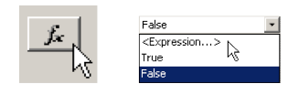

图 21:打开表达式编辑器

在表达式编辑器顶部的框中，如图 22 所示，您可以直接键入您的表达式。您也可以使用编辑器底部的以下列表来显示可用于构建表达式的项目:

*   **常数**。此列表仅在编辑具有常数的属性的表达式时包含值。例如，如果要为**颜色**属性添加一个表达式，则该列表包括一组颜色，例如蓝色、红色或绿色。
*   **内置字段**。该列表包含在“全球”收藏中找到的项目，如`ReportName`、`PageNumber`和`TotalPages`。
*   **参数**。如果您的报告包含报告参数，它们的名称会出现在此列表中。
*   **字段**。在这里，您可以找到数据集中与要添加表达式的文本框或属性相关联的字段。否则此列表为空。
*   **变量**。如果您创建报表变量，您会在此列表中看到它们。另一方面，组变量在这里不显示。
*   **操作员**。该列表显示了所有可用于数学、逻辑或字符串运算的运算符。
*   **常用功能**。有一个函数列表是有帮助的，尤其是如果你不熟悉可用的函数或者记不住函数的语法。这些功能按操作进行逻辑分组。例如，字符串操作函数、算术运算和聚合函数被组织为单独的组。

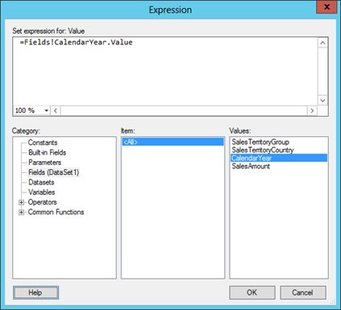

图 22:表达式编辑器

表达式示例

使用表达式的方法有很多。在本节中，我将解释几个更常见的例子。

首先，如果您提示用户使用报告参数进行选择，最好在报告的某个地方显示选择的标签。如您稍后所知，您可以设置一个报告参数，以允许用户选择多个值。在这种情况下，您需要一种从所有值中生成一个字符串的方法。为此，可以使用 **`Join`** 函数，引用 Parameters 集合，并指定一个分隔符来组合存储在数组中的值，如下所示:

```cs
    =Join(Parameters!SalesTerritoryGroup.Label, ", ")

```

使用多值参数时，值和标签存储在从零开始的数组中，并且必须使用索引来引用单个项目，如下所示:

```cs
    =Parameters!SalesTerritoryGroup.Label(0)

```

另一种常见的操作是字符串值的串联。例如，您可以将一个字段值与一个常量字符串组合在一起，用作文本框中的标签，如下所示:

```cs
    =Fields!CalendarYear.Value + " Total"

```

|  | 提示:在连接值时，您需要确保所有项目都是字符串。如有必要，使用转换函数。 |

条件格式是创建动态和可视化信息报告的好方法。任何接受表达式的属性都是条件格式的候选者。例如，您可以根据范围内一组行的销售额是否高于指定值来设置文本框的**颜色**属性，如下所示:

```cs
    =Iif(sum(Fields!SalesAmount.Value)<1000000,"Red", "Black")

```

收集

**数据集**集合允许您访问报告中包含的数据集的相关信息。从用户的角度来看，这并不是一个特别有用的集合，但是对于需要解决报表问题的开发人员来说，尤其是在使用动态数据集时。您可以添加一个显示命令文本的文本框，并通过使用如下所示的命令文本属性来查看发送到数据源的查询:

```cs
    =Datasets!Dataset1.CommandText

```

同样还有一个**数据源**集合，除了故障排除之外，它并不常用。您可以使用它来检查对数据源的引用，如下所示:

```cs
    =DataSources!AdventureWorksDW.DataSourceReference

```

**报告项目**是不显示在**报告数据**窗格或表达式编辑器中的集合。但是，当您需要引用特定文本框中的值，而该值又可能是计算的结果时，这可能会很有用。您可以定义一次计算，然后使用 ReportItems 集合引用它，而不是多次复制和粘贴该计算。ReportItems 集合的另一个重要用途是在页面呈现后访问文本框值。SQL Reporting 通过首先准备报表正文，然后准备页眉和页脚来呈现页面。报表正文呈现后，数据集不再可用。但是，您可以在表达式中使用 ReportItems 集合来访问要在页眉或页脚中显示的文本框值，如下所示:

```cs
    =ReportItems!Textbox1.Value

```

**用户**集合是一个特殊的集合，用于根据当前用户设置表达式。当您想要应用数据级安全性时，可以在表达式中使用`User!UserID`来获取当前用户的 Windows 登录。当需要创建多语言报表时，可以在表达式中使用`User!Language`根据用户的区域设置设置报表属性。

您可以创建一个变量来存储报告级别或组级别的值，然后使用**变量**集合来检索报告执行时变量的当前值。变量中存储的值可以是常数值或表达式。您可以将报表变量用作用于显示执行时间的表达式的一部分，因为报表中的表达式仅在页面呈现时计算，但报表变量不会改变。也就是说，如果您将表达式`Globals!ExecutionTime`放在多页报表的页脚中，您会在呈现的报表的每一页上找到不同的值。但是，如果您将`Now()`存储在名为`ReportExecutionTime`的报表变量中，然后将表达式`Variables!ReportExecutionTime.Value`放在页脚中，您会在呈现的报表的每一页上看到相同的值。

您也可以创建一个具有组范围的变量。组变量在组实例更改时进行计算，因此它可能会在报表的同一页上更改多种类型。当需要一个对当前组唯一的值时，可以使用组变量。

**Globals** 集合可用于显示特定于您的报告的信息，例如执行时间或报告服务器 URL *。*您可以在报表的任何文本框中使用该集合中的对象，但只能在页眉或页脚中使用与页面相关的对象，如`Globals!PageNumber`或`Globals!TotalPages`。在**报告数据**窗格中，**内置字段**文件夹包含八个字段，您可以使用这些字段将全局对象快速添加到文本框中。如果您需要根据当前渲染更改报表的外观，例如在将报表渲染到 Excel 时隐藏报表标题，您可以为文本框的**隐藏**属性指定如下表达式:

```cs
    =Iif(RenderFormat.Name = "EXCELOPENXML", True, False)

```

聚合函数

您主要使用聚合函数来汇总许多数字数据记录并显示一个值，如总计或平均值。还可以使用聚合函数来获取一组记录中的第一个或最后一个字符串值。聚合函数使用范围参数来确定聚合中包含哪些详细信息行。它可以引用组范围、数据区域范围或数据集。

如果在使用聚合函数时省略了作用域参数，则作用域将根据表达式的位置来推断。如果表达式出现在组中的文本框或该文本框的属性中，则范围仅限于与该组关联的数据集行。但是，如果要使用推断范围以外的范围，则必须在聚合函数中通过将范围名称放在双引号中来显式指定范围，如下所示:

```cs
    =Sum(Fields!SalesAmount.Value, "Tablix1")

```

对组、数据区域或数据集的任何引用都必须与名称中使用的实际大小写匹配，否则表达式将失败。如果您尝试预览报告，您只知道表达式是成功还是由于大小写不匹配而失败，因为表达式编辑器中不会显示警告来提醒您该错误。

### 报告参数

您可以使用报告参数来接受用户的输入。在报告执行时，系统会提示用户提供报告参数值。您可以提供默认值，以便首先执行报告，但允许用户在更改报告参数值后再次执行报告。您也可以将该值留空，并强制用户在执行报告之前进行选择或键入值。

使用此输入的一种常见方式是通过过滤一个或多个数据区域或将用户的选择传递给数据集的查询参数来过滤数据。您也可以在表达式中使用报表参数。例如，您可以使用参数提示用户输入决定报表显示方式的信息，例如行的排序或列的可见性。

用户可以通过三种方式为报告参数值提供输入:

*   **可用值**。使用此选项，用户可以从下拉列表中进行选择。您可以限制用户只能选择一个值，也可以允许用户选择多个值。
*   **无值**。您可以要求用户键入一个值。然而，除了数据类型检查之外，Reporting Services 中没有任何东西可以用来验证输入。如果您以这种方式提示用户输入，则不应该在 SQL 查询中直接使用该值，因为可能会受到 SQL 注入攻击。如果您必须使用这样的输入值作为查询参数的输入，例如当您有一个不太适合下拉列表的值(如发票号)时，您应该始终对数据集使用存储过程，以便在查询中使用输入值之前可以对其执行验证。
*   **日期值**。为参数设置日期数据类型时，用户可以直接键入值，也可以使用日历控件选择日期。

要在报告中添加报告参数，右键单击**报告数据**窗格中的**参数**文件夹，然后单击**添加参数**。至少，您需要为报表参数指定一个名称，提供一个用户将在报表查看器中看到的提示，并指定一个数据类型，如图 23 所示。


图 23:报告参数属性

默认情况下，报告参数配置为没有可用值，这意味着用户必须直接输入值。您还可以选择允许空值或空值。空值被解释为空字符串。

如果您提供了可用的值，默认设置是允许用户一次只从列表中选择一个值，但是您可以启用允许用户选择多个值的选项，如图 23 所示。但是，如果启用多值选项，则不能允许空值。

通常，用户可以看到报表参数。如果您不希望在用户查看报表时显示提示，但需要能够使用 URL 访问或创建订阅在报表服务器上设置参数值，请使用**隐藏**选项。当您需要在报告中使用参数值，但无需用户交互即可设置参数值时，请使用**内部**选项。例如，您可以通过计算表达式或从数据集中检索值来获取参数值，而无需提示用户。

当您希望用户从下拉列表中选择值时，您必须为报告参数配置**可用值**。在报告参数属性的**可用值**页面上，您有以下三个选项:

*   **无**。默认情况下，选择**无**选项，强制用户直接输入值。
*   **指定值**。您可以为报告参数输入有效值的静态列表。**值**是传递给参数表达式和查询参数的默认值，而**标签**是用户打开报告时显示在报告参数下拉列表中的文本。对于“标签”和“值”，可以指定表达式而不是静态值。
*   **从查询中获取值**。只要有可能，您应该使用数据集来提供报表参数的可用值列表。理想情况下，数据集应该引用数据源中的视图。然后，如果您需要在列表中添加或删除项目，您可以管理数据源中的更改，从而避免使用相同的列表编辑每个报表中的报表参数列表。当使用数据集提供报表参数值时，数据集中通常有两列，一列用于参数值，一列用于参数标签。但是，您可以使用一列作为值和标签，如图 24 所示。


图 24:从查询中报告参数的可用值

在报告参数属性的**默认值**页面上，您还有三个选项:

*   **无默认值**。默认情况下，此选项处于选中状态，这意味着在用户选择值之前，报告不会呈现。
*   **指定值**。您还可以提供默认值，以允许在用户选择参数值之前执行报告。正如可用值一样，您可以使用表达式来指定默认值，而不是使用静态文本。
*   **从查询中获取值**。您可以创建设置默认值的数据集。如果报表参数被配置为只接受单个值，则数据集必须只返回一行。多值报表参数可以接受多行。无论哪种方式，您引用的字段都必须包含由**可用值**页面上的值列定义的有效值。

### 过滤器

在报表执行时动态更改报表内容的一种方法是使用筛选器。虽然您可以在没有报告参数的情况下创建筛选器，但配置筛选器的最常见方法是使用报告参数提示用户输入筛选器值。当您将报表参数与为报表元素定义的筛选器一起使用时，报表筛选器对从源检索的数据没有影响。这意味着由新的报表参数值选择导致的筛选值的任何更改都会影响您在报表中看到的内容，但不会导致数据集查询的新执行检索不同的数据。

配置筛选器时，您可以定义一个表达式，该表达式确定数据在报表中可见所必须满足的条件。如果要基于用户输入创建动态筛选器，可以使用报表参数来存储用户的选择，然后在筛选器条件中引用该参数。

有不同的方法可以将筛选器添加到报表中:

*   **数据集**。因为在查询执行后会对数据集行应用筛选器，所以即使对数据集应用筛选器，在选择新的报表参数值后呈现报表的时间也非常短。当您希望在更改报表参数值时最大限度地减少对源数据库的查询执行次数并最大限度地提高报表性能时，请对数据集使用报表筛选器。要向数据集添加过滤器，请双击**报告数据**窗格中的数据集，然后打开**数据集属性**对话框的**过滤器**页面。
*   **数据区**。当您需要访问同一报表的某些数据区域中的所有数据和其他数据区域中的筛选数据时，请在适用的数据区域中使用报表筛选器，而不是筛选数据集。要向数据区域添加过滤器，请在**属性**窗口顶部的下拉列表中选择对象，单击**过滤器**属性框，然后单击显示的省略号按钮。
*   **组**。一个不常用的选项是对组应用过滤器。为此，双击**行组**或**列组**窗格中的组，并打开**组属性**对话框的**过滤器**页面。

无论在哪里应用过滤器，过程都是相似的。将一个值(如数据集中的字段)与另一个值(如报表参数值)进行比较。但是，任何有效的表达式都可以用于比较。

大多数情况下，您用于比较的运算符是等号，但是当您有多值报表参数时，您可以使用运算符中的**，如图 25 所示。**

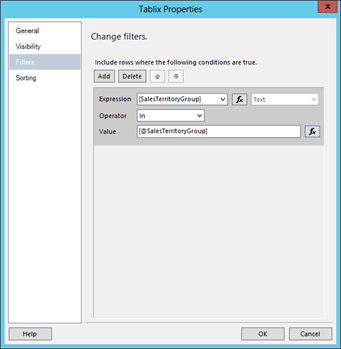

图 25:过滤数据区域

您可以使用其他运算符进行比较，如表 3 所示。

表 3:过滤器操作符

| 操作员 | 行动 |
| =，<>，>，> =， | 将表达式与值进行比较 |
| 顶部 N，底部 N | 将表达式与前(后)组 N 个值进行比较(N =整数) |
| 顶部%，底部% | 将表达式与前(后)N %的值进行比较(N =整数或浮点数) |
| 在...之间 | 确定表达式是否在两个值之间，包括两个值 |
| 在…里 | 确定表达式是否在值列表中找到 |

### 查询参数

您可以使用查询参数在源位置过滤数据。当减少将数据集的查询结果返回到报表所导致的网络流量很重要时，您可能希望这样做。其他原因包括需要减少提交报告所需的时间或安全要求。

首先向数据集查询的 WHERE 子句中添加一个查询参数，如下所示:

```cs
    SELECT
     st.SalesTerritoryGroup,
     st.SalesTerritoryCountry,
     d.CalendarYear,
     SUM(s.SalesAmount) SalesAmount
    FROM
     dbo.FactResellerSales s
     JOIN dbo.DimDate d on d.DateKey = s.OrderDateKey
     JOIN dbo.DimSalesTerritory st on st.SalesTerritoryKey =
       s.SalesTerritoryKey
    WHERE st.SalesTerritoryGroup = @SalesTerritoryGroup
    GROUP BY
     st.SalesTerritoryGroup,
     st.SalesTerritoryCountry,
     d.CalendarYear
    ORDER BY
     st.SalesTerritoryGroup,
     st.SalesTerritoryCountry

```

默认情况下，报表设计器会向报表中添加匹配的报表参数，并将查询参数与报表参数相关联。您可以在**数据集属性**对话框的**参数**页面上看到这种关联。但是，您不需要使用报表参数。您可以删除报表参数，然后将查询参数与表达式(如日期或当前用户)相关联。

|  | 提示:查询参数值可能会生成一个不从源返回任何数据的过滤器。当这种情况发生时，与数据集相关联的数据区域不会显示在报表中，如果只看到报表标题而没有其他内容，用户会感到困惑。为了澄清这种情况，可以使用数据区域的 NoRowsMessage 属性来显示消息。 |

### 子报告和钻取

使用参数的另一种方法是在报表之间共享数据。您可以创建报表之间的关系，方法是使用子报表在另一个报表中显示一个报表，或者使用钻取报表允许用户单击一个报表中的文本框来打开另一个报表。

若要使用此功能，可以配置报表，将当前上下文传递给关联的子报表或钻取报表。当前上下文来自当前范围的可用数据。它可能是数据集中的字段、基于字段的自定义表达式或报表参数。在钻取报表的情况下，当前上下文也可能来自用户单击的文本框。

若要实现此功能，子报表或钻取报表必须具有已在报表中定义的参数。向报表中添加子报表后，右键单击子报表，选择**子报表属性**，选择要添加的报表，进入对话框的**参数**页面。如果您正在构建钻取操作，请右键单击用作报告链接的文本框，单击**文本框属性**，转到对话框的**操作**页面，选择**转到报告**选项，然后选择用于钻取的报告。无论哪种情况，点击**添加**添加一行定义要通过的参数，然后在**名称**下拉列表中选择该参数。在**值**字段中，您可以配置传递到目标报告中参数的表达式。在图 26 中，当前报告中的一个字段将传递给钻取报告。


图 26:为钻取配置参数

图 26 所示参数的**省略**选项仅适用于钻取报告。使用它来定义一个表达式，当您想要禁止传递参数时，该表达式必须计算为**真**。

### 互动性

报告服务具有许多交互式功能，您可以将其添加到报告中，以增强用户的在线查看体验。其中一些功能会影响报表布局，例如交互式排序、固定标题、工具提示和可见性。其他功能作为导航辅助工具也很有用，例如文档图、动作和嵌入的 HTML。

交互式排序

设计报表时，可以通过在数据集中包含 ORDER BY 子句或在 tablix 或组上设置 Sorting 属性来定义数据的排序顺序。您也可以在报告中添加一个参数来提示用户排序方向，并使用输入来设置**排序**属性。但是，另一个选项是配置文本框进行交互式排序。为此，右键单击文本框，选择**文本框属性**，转到**交互排序**，并选中复选框以启用此功能。

通常，添加交互式排序的文本框是数据区域中的列标题或行标题。如图 27 所示，您可以将 tablix 中的每个列标题配置为使用交互式排序，如每个文本框中的箭头图标所示。用户可以一次对一列进行排序。用户第一次单击列时，数据按升序排序，最上面的行是最小的数字，最下面的行是最大的数字。如果数据是按组组织的，则明细行是按组排序的。第二次单击该列会按降序对数据进行排序。

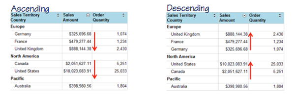

图 27:交互式排序

交互式排序功能不限于放置在列标题行中，也不限于仅排序明细行。除了对整个 tablix 进行排序之外，还可以定义仅在特定组内应用的排序，方法是将交互式排序添加到数据区域内的文本框中，然后将范围限制到该组内的详细信息行。或者，您可以将排序应用于整个组，而不是细节行。

固定标题

如果您的报告不能完全显示在屏幕上，用户必须滚动以查看页面底部的信息。但是，当到达页面底部时，用户可能会忘记哪一列包含哪些信息。要解决垂直滚动的这个问题，可以在**属性**窗口中选择 tablix，然后将**固定列标题**属性设置为**真**。当您的报告需要水平滚动时，您可以更改**固定光标**属性。

|  | 提示:当您使用任一固定标题属性时，更改行或列的 BackgroundColor 属性非常重要。如果没有定义颜色，背景是透明的，用户将在固定的标题中看到数据在文本后面滚动。添加颜色时，数据在滚动过程中将不再可见。 |

工具提示

当用户将光标放在报表中的一个项目(比如文本框)上时，可以使用工具提示来显示一条消息，如图 28 所示。您可以使用工具提示显示数据集中在报表或计算结果中不可见的其他数据，如本例中的百分比。选择报告中的项目，然后在**属性**窗口的**工具提示**属性的下拉列表中单击**表达式**。然后，您可以在双引号中键入**静态文本**或添加解析为字符串值的表达式。


图 28:工具提示

能见度

可见性功能不仅限于在线观看，它的交互方面也是如此。使用此功能的一个常见原因是在报告中包含汇总和详细数据。图 29 是包含销售区域组的组行和销售区域国家的子行的 tablix 示例。

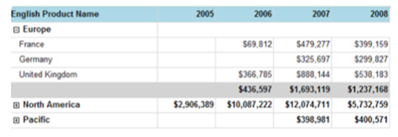

图 29:使用可见性属性切换细节行的显示

要创建明细报表的外观，其中当用户打开报表时仅显示汇总数据，请使用可见性属性**隐藏**和**隐藏项目**。可见性可以应用于整行、整列或特定文本框。选择文本框或单击列或行手柄，然后在**属性**窗口中，将**隐藏**属性设置为**真**。在**切换项目**属性的下拉列表中，选择要在其中显示切换开关图标的文本框的名称。

文档结构图

如果在 tablix 报表项中定义了多个组，则可以添加文档结构图功能作为长报表的导航辅助。它的工作方式类似于报告的交互式目录，用户不仅可以一目了然地看到组实例，还可以跳转到特定实例的位置。当报告包含组的层次结构时，文档结构图以树形形式显示书签列表。用户必须展开一个特定的组实例来查看所选组包含的组实例，如图 30 所示。

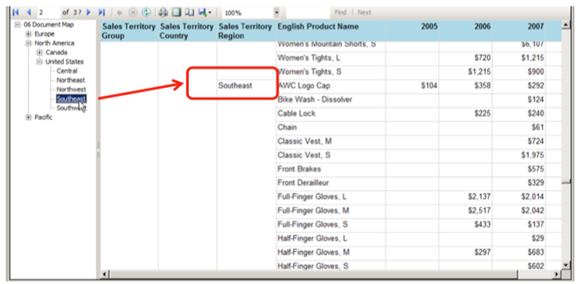

图 30:文档图

对于组中的每个实例，定义要在文档结构图中显示的表达式。该表达式相当于一个书签，显示在报表旁边。要定义该表达式，双击**行组**窗格中的组，并转到**高级**页面。

|  | 注意:文档图不仅适用于以 HTML 格式呈现的报表，也适用于以 Excel 和 PDF 格式呈现的报表。 |

### 行动

每个文本框和图像都有一个**操作**属性，当用户单击文本框或图像时，您可以使用该属性来定义显示的目标位置。选择报告正文中的项目，点击**属性**窗口中的**动作**属性框，然后点击省略号按钮。您可以实现以下三种类型的操作:

*   **转到书签**。书签对于从报告的一个部分跳到另一个部分很有用。考虑这样一个场景:报表的一页上有一个 tablix，而包含图表的列表分布在多页上。您可以使用为列表中的每个图表生成唯一名称的表达式来设置图表的书签属性。然后，在 tablix 中的文本框上配置一个操作，该操作使用基于用户单击的文本框中的值的表达式来生成书签目标。在运行时，单击文本框会导致报告跳转到适用的图表。
*   **前往报告**。要配置此操作，您需要定义目标报告。或者，您可以将父报表中的表达式映射到目标报表中的参数。在这种情况下，如果目标报表设计为基于报表参数值进行筛选，则目标报表可以使用与源报表相同的上下文来显示信息。
*   **转到网址**。此操作要求用户单击报表中的文本框，这又会导致报表服务使用目标网址作为地址打开默认浏览器。您可以提供静态网址或使用解析为网址的表达式。

嵌入式 HTML

使用网址和其他类型的超文本标记语言的另一种方法是将文本配置为超文本标记语言，也称为嵌入式超文本标记语言。要使用这种技术，首先要在文本框中使用一个表达式，该表达式解析为有效的超链接。该表达式可以直接来自数据集，也可以作为文本框中的复杂表达式导出。

您可以使用表 4 中列出的 HTML 标记(如 FONT、DIV、LI 或 B)来控制报表布局，但是 A HREF 标记对于导航尤其有用。例如，您可能有一个显示电子邮件地址的报告。当您在文本框的字符串表达式中包含 HTML 标记时，报表会将 HTML 标记呈现为文本。要将表达式渲染为 HTML，您必须选择文本框中的文本而不是选择文本框，并在**属性**窗口中将**标记类型**属性更改为 **HTML** 。然后，报告将字符串呈现为链接，当用户单击该链接时，用户的电子邮件客户端将打开，并创建一封发往所选收件人的新邮件。

表 4:超文本标记语言标记

| 标签类型 | HTML 标示标签 |
| 字体 |  |
| 标题、样式和块元素 | 1.1.1.1.1

1.1.1.1.2

1.1.1.1.3

1.1.1.1.4

*   1.1.1.1.5

     |
| 超链接 |  |
| 目录 |  |
| 文本格式 |  |

### 分页

您可以在报表中配置属性来定义页面大小、边距和方向。默认情况下，页面大小设置为 8.5 英寸宽×11 英寸高，这将产生纵向，但是您可以通过将**宽度**属性设置为 11 英寸并将**高度**属性设置为 8.5 英寸来将其更改为横向。要访问这些属性，请在**属性**窗口顶部的下拉列表中选择**报告**。

虽然您可以配置报表的高度和宽度，但是还有其他属性会影响报表每页上报表项的分布。页边距、正文大小以及页眉和页脚的存在与否都会影响整个页面的大小，如图 31 所示。渲染器通过从为报表定义的高度和宽度中减去边距大小来确定页面大小。然后，在该区域内，如果您使用页眉和页脚，呈现器会为它们分配空间，其余空间可供报表正文使用。


图 31:页面大小

在**属性**窗口下拉列表中选择**报表**时，可以设置**宽度**和**高度**属性以及边距属性:**左侧**、**右侧**、**顶部**和**底部**。如果在报表主体外的报表设计器中右键单击，可以点击命令添加页眉或页脚，然后在**属性**窗口中选择这些项目，调整**高度**属性。此外，您可以选择**几何体**来设置宽度和高度属性。

|  | 提示:如果正文大小加上页边距超过了页面大小，当您打印或导出为 PDF 或 TIFF 格式时，报告在包含报告内容的页面之间会包含额外的空白页。 |

影响页面大小的另一个因素是报告正文中的空白。如果正文尺寸比报告尺寸大，打印的报告中将出现空白页。这个问题在报表设计图面上可能不明显。例如，在一个矩阵中，列是动态的，在所有列都被呈现后，列组右边的空白被包括在报告中，导致空白页，即使矩阵本身适合一页。要禁用此行为，请在**属性**窗口中选择**报告**，并将**消费容器生命空间**属性的值更改为**真**。

默认情况下，在创建新页面(称为软分页符)之前，SQL Reporting 会尝试将尽可能多的数据区域放入页面。但是，您可以相对于数据区域插入硬分页符，或者在数据区域内组实例发生变化时插入硬分页符。如果您添加的分页符的位置导致页面大小大于报表属性允许的大小，呈现扩展插件可能会继续插入软分页符。

分页符

您可以在大多数报表项目上创建分页符。为此，选择要添加分页符的数据区域，然后在**属性**窗口中展开**分页符**类别，如图 32 所示，设置以下属性:

*   **隔断位置。**设置分页符相对于所选报表项的位置:无、开始、结束或开始和结束。您可以在报表项开始处设置分页符位置，以便在报表项呈现之前强制分页符。或者，您可以在报表项的末尾设置中断位置。如果在您设置分页符的报表项目之后，报表中什么也没有出现，这可能没有意义，因为最后会有一个额外的空白页。您还可以在报表项呈现前后设置分页符。
*   **禁用。**使用条件表达式确定是否应用分页符。例如，当渲染格式为 HTML 以防止分页符时，您可以将其设置为**真**，但当渲染格式为 PDF 以添加分页符时，您可以将其设置为**假**。

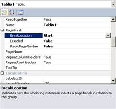

图 32:分页符属性

您也可以在数据区域的**属性**对话框中配置分页符，例如图 33 所示的 **Tablix 属性**对话框。在**分页符选项**部分，您可以在数据区域之前或之后添加分页符，或者在数据区域渲染之前和之后都添加分页符。对于 tablix，您也可以选择**尽可能在一页上保持在一起**复选框，将**保持在一起**属性设置为**真**。

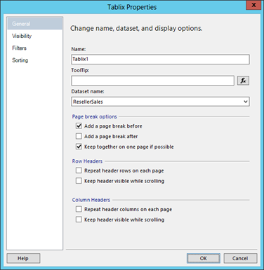

图 33: Tablix 分页属性

当您将**保持在一起**属性设置为**真**时，如果 tablix 与前面的项目不在同一页面上，渲染引擎会将它推送到新页面。如果无法在单个页面上呈现 tablix，则呈现引擎会在第一页上呈现尽可能多的表，然后在后续页面上继续。

您也可以在数据区域内按组设置分页符。与按报告项目设置分页符相同的属性适用于组:**隔断位置**和**禁用**。但是，对于**隔断位置**，除了在组的开始或结束处断开之外，您还可以在组实例之间定义分页符。这样，您就不会在报表项的开头或结尾创建不必要的分页符，而只会在新组开始时创建新页。为此，在**分组窗格**中选择组，然后在**属性**窗口中展开**组**类别，找到**分页**选项。另一种方法是右键单击组，打开**组属性**对话框的**分页符**页面，如图 34 所示。


图 34:分组分页选项

重复标题

默认情况下，当表呈现时，列标题只出现一次，因此当一个表跨越多个页面时，您将丢失后续页面上每个列的上下文。为了使 tablix 更容易阅读，可以配置重复的列标题。您可以通过在 tablix 的**属性**窗口中将 **RepeatColumnHeaders** 属性设置为 **True** 来实现。

如果您的 tablix 在 tablix 中没有列组，您将不会达到预期的效果。首先，您需要在高级模式下查看**行组。为此，单击**列组**右侧的箭头，选择**高级模式**。注意**静态组**现在出现在**行组**中，如图 35 所示。**


图 35:在高级模式下查看组

您可以通过选择突出显示最左侧列标题的静态组来设置列标题。这通常是列出的第一个静态组。在**属性**窗口中，将**重复新页面**属性设置为**真**，将**保留组**属性设置为后的**。后一个属性指定静态成员需要留在哪个组中，如下所示:**

*   **在**之后。静态成员留在组的后面或下面，充当组头。
*   **在**之前。静态成员保持在组的前面或上面，充当组页脚。
*   **无**。渲染引擎自动决定将静态成员放在哪里。

页码

当报表跨越多页时，应通过在表达式中使用以下全局变量之一在页眉或页脚中添加页码:

*   全球！页码。相对于上次页码重置的当前页码。
*   全球！TotalPages。当前页码组中的总页数。
*   全球！总体议程编号。报告中的当前页码。
*   全球！总总页数。报告中的总页数。

如果不重置页码，**总体页码**变量将与**页码**变量相同，**总页数**变量将等于**总体页码**变量。您可以使用报表项目或组的分页符属性集中的**重置项目编号**属性来重置编号。

页面命名

除了对页面进行编号，您还可以为每个页面指定唯一的名称。默认情况下，报告的第一页有一个空白名称。如果您决定分配一个页面名称，您可以为报表属性 **InitialPageName** 分配一个常量值或表达式。

然后，您可以在为报表项或组创建分页符时重置页面名称。例如，您可以使用组的名称来重置页面名称。只能通过使用“属性”窗口来设置页面名称属性。选择想要用来控制页面名称的项目，比如 tablix 组，然后设置**页面名称**属性，如图 36 所示。


图 36:页面名称属性

当您将报表导出到 Excel 时，页面名变成了工作表名，如图 37 所示。如果您为报表设置了初始页面名称，但没有为报表中的其他页面设置页面名称，则 Excel 中的所有工作表都将具有初始页面名称。

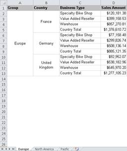

图 37:在 Excel 中，页面名变成了工作表名

## 报表生成器

报表生成器是一种单击式应用程序，您可以根据需要从内部报表服务器下载，也可以作为单独的客户端应用程序安装在计算机上。报表生成器主要是信息工作者和高级用户的工具。虽然它只允许您一次处理一个报告，但它提供了与 BIDS 或 SSDT 相同的功能。无论您决定使用哪种工具，报表开发过程都是一样的。

### 入门向导

除非选择左下角的**启动时不显示此对话框**复选框并关闭窗口，否则打开报表生成器时会显示入门向导。该向导提示您通过选择以下选项之一来启动新任务:

*   **新报告**。此选择将启动另一个向导，引导您完成构建表格、矩阵、图表或地图的过程。
*   **新数据集**。选择此选项可打开数据集设计器，以创建要发布到 SQL Reporting 以在多个报表中使用的共享数据集。
*   **打开**。使用此选项可以连接到 SQL Reporting，并在报表生成器中找到要编辑的报表。
*   **近期**。您可以返回到最近打开或经常查看的报告。

### 报表生成器中的报表开发

报表生成器中的报表开发过程与在 BIDS 或 SSDT 中的工作非常相似，只是一次只能处理一个报表。此外，您可以使用应用程序窗口顶部显示的功能区，而不是使用**工具箱**窗口向报告中添加报告项目。功能区包括以下选项卡:

*   **家**。功能区的此选项卡包含在设计和预览模式之间切换、复制和粘贴项目以及设置文本、边框和数字格式的命令。
*   **插入**。您可以使用此选项卡将报告项目添加到您的报告中，或者打开**报告零件库**。此选项卡上的命令允许您将项直接添加到报表中，或者使用向导来帮助您排列项中的数据集字段。
*   **查看**。该选项卡包含用于隐藏或显示**报告数据**、**分组**或**属性**的复选框、窗口或标尺。

## 报告查看器控件

通过在应用程序中使用 **ReportViewer** 控件，您可以将开发工作集中在应用程序逻辑上，并节省构建 SQL Reporting 已经包含的相同报告功能所需的时间。您可以创建一个内部应用程序，或者在 Windows Azure 中托管您的应用程序。

### 内部应用

要创建内部应用程序，请在应用程序中创建一个窗口或网页表单，然后向其中添加 **ReportViewer** 控件。您可以在**工具箱**的**报告**组中找到它。接下来，在设计窗口中，单击**报告查看器**控件中心的任意位置，设置**属性**窗口的焦点。在**属性**窗口中，**服务器报告**部分包含定义与 SQL Reporting 服务器上的报告的连接的属性，如图 38 所示。


图 38:报告查看器属性

|  | 注意:在配置报表查看器控件之前，您必须按照[第 4 章，报表管理](4.html#_Chapter_4_Report_1)所述，将报表部署到 SQL Reporting server。 |

至少，您必须配置**报告查看器**控件的**处理模式**、**报告路径**和**报告服务器 URL** 属性。要使用**报告服务**管理的报告，您必须将**处理模式**属性更改为**远程**。定义**报告路径**时，只提供文件夹和报告名称。您不能包含网址访问命令。对于**报告服务器网址**，您可以使用网络服务网址，该网址与您在部署来自 BIDS 或 SSDT 的报告时使用的网址相同。

**属性**窗口的**工具栏**部分包括几个属性，允许您在 HTML 查看器中配置每个项目的可见性。通过将相应的属性设置为**假**，可以从 HTML 查看器中删除按钮。例如，如果您想限制用户只能在线查看报告，可以隐藏**导出**按钮。

您还需要修改表单中的代码来传递登录用户和密码，如下所示:

```cs
    reportViewer1.ServerReport.ReportServerCredentials.SetFormsCredentials(   null, "awadmin", "<password>", null);
    reportViewer1.RefreshReport();

```

构建应用程序时，Visual Studio 会在 **bin\Debug** 文件夹中创建其可执行文件。然后，您可以将此可执行文件分发给有权访问 SQL Reporting server 并拥有报表权限的任何人。

### Windows Azure 应用程序

另一个选择是使用 Windows Azure 来托管您的应用程序。在 Visual Studio 中创建 Windows Azure 应用程序时，必须选择 ASP.NET 网站角色，为该角色分配名称(如 RptVwrWebRole)，并将其添加到解决方案中。您需要在**报表查看器**控件上方的网页表单设计图面上添加一个**脚本管理器**控件。然后将 **ReportViewer** 控件从**工具箱**中的 **Reporting** 组添加到 **Default.aspx 表单**中，然后按照本章上一节中对内部应用程序的描述设置该控件的属性。

接下来，您需要添加一个类来实现并调用 **IReportServerCredentials** 接口，如下所示:

```cs
    using System;
    using System.Collections.Generic;
    using System.Linq;
    using System.Web;
    using System.Web.UI;
    using System.Web.UI.WebControls;
    using System.Configuration;

    using Microsoft.Reporting.WebForms;
    using System.Security.Principal;
    using System.Net;

    namespace RptVwrWebRole
    {
        public partial class _Default : Page
        {

            protected void Page_Init(object sender, EventArgs e)
            {
                ReportViewer1.ServerReport.ReportServerUrl = new 
                    Uri(String.Format("https://{0}/reportserver",
                    ConfigurationManager.AppSettings["SERVER_NAME"]));
                ReportViewer1.ServerReport.ReportPath =
                    ConfigurationManager.AppSettings["REPORT_PATH"];
                ReportViewer1.ServerReport.ReportServerCredentials = new 
                    ReportServerCredentials();
            }
        }
        public class ReportServerCredentials : IReportServerCredentials
        {
            public ReportServerCredentials()
            {
            }

            public WindowsIdentity ImpersonationUser
            {
                get
                {
                    return null;
                }
            }
            public ICredentials NetworkCredentials
            {
                get
                {
                    return null;
                }
            }
            public bool GetFormsCredentials(out Cookie authCookie, out string user, out string password, out string authority)
            {
                authCookie = null;
                user = ConfigurationManager.AppSettings["USERNAME"];
                password = ConfigurationManager.AppSettings["PASSWORD"];
                authority = ConfigurationManager.AppSettings["SERVER_NAME"];
                return true;
            }
        }

    }

```

您还需要更新解决方案中的 Web.config 文件，其中包含有关报表位置的详细信息以及应用程序用来访问报表的凭据。为此，您可以在`<configuration>`元素内的`<appsettings>`元素中指定应用程序设置，如下所示:

```cs
    <appSettings>
          <add key="SERVER_NAME" value="xyz123.reporting.windows.net" />
          <add key="USERNAME" value="awuser"/>
          <add key="PASSWORD" value="<awuser_password>"/>
          <add key="REPORT_PATH" value="/Reports/Reseller Sales Margin Analysis by Sales Territory"/>
    </appSettings>

```

要在 Windows Azure 应用程序中运行 **ReportViewer** 控件，必须将 Microsoft.ReportViewer.Common.dll 引用添加到项目中。你可以在 C:\ Windows \汇编\ GAC _ MSIL \微软找到这个 DLL。报表查看器。公共路径，然后导航到与您正在使用的 Visual Studio 版本匹配的版本文件夹。Microsoft.ReportViewer.WebForms.dll 也是必需的，但是当您将控件添加到窗体时，它会添加到文件夹中。然后，对于两个组件，将**复制本地**属性设置为**真**。

现在准备 Windows Azure 的部署包。为此，在**解决方案资源管理器**中右键单击云服务名称，单击**包**，然后在对话框中单击**包**。上传部署包，进入新的 Windows Azure 门户，打开**云服务**页面，点击**创建云服务**，给服务命名，选择地区。

创建云服务后，单击服务名称以打开其控制面板。点击页面顶部的**证书**链接，然后点击**上传证书**。浏览到您计算机上的证书并选择要上传的证书，然后键入私钥密码。

返回您的云服务仪表板，点击链接**上传新的生产部署**。提供一个部署名称，然后浏览到解决方案的 bin\release\app.publish 文件夹，找到包的 CSPKG 和 CSCFG 文件。如有必要，即使一个或多个角色包含单个实例，也一定要选择**部署。**

部署完成后，返回到您的部署仪表板以获取服务的站点 URL。您可以单击链接在浏览器中打开您的应用程序。