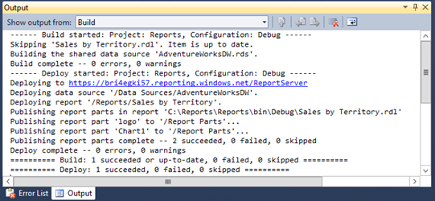
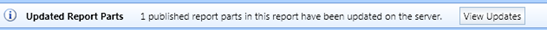

# 五、报告部件

报表部件是集中业务逻辑和简化报表中常用元素维护的有用方法。在本章中，我回顾了使用报表部件的好处，然后解释了如何从每个报表开发工具创建和部署报表部件。我还解释了如何在 SQL Reporting Server 上管理报表部分，以及用户如何与报表部分交互。

## 报告部分的优势

通常，相同类型的数据区域在多个报告中使用，但组合不同。虽然您可以使用子报表来重用相同的布局，但是报表部件为技术水平较低的用户在报表生成器中构建自己的报表提供了更大的灵活性，因为他们可以使用报表部件作为报表开发的起点，但是他们也可以在不影响原始版本的情况下对报表部件进行更改。

用户还可以混合和匹配多个报告部分来个性化他们的报告。例如，一个用户可以将这两个项目组合成一个报表中的报表部分，左边是表，右边是图表，而不是将一个报表和表部署在一起。另一个用户可以创建一个单独的报告，图表报告部分在左边，表格在右边。

用户不仅可以利用报表部件进行报表个性化，还可以使用它们来确保报表的底层数据是正确的。报表部分的用户不需要知道如何编写 T-SQL 查询来从 SQL 数据库中检索数据，因为查询已经构建并与报表部分相关联。

## 报告零件创建

报表部件是您有选择地发布到 SQL Reporting server 以供其他人在他们的报表中使用的单个报表项或报表项集合。不仅保存了报表项，还保存了相关的数据源和数据集。此外，如果报表部件引用了筛选器或文本框表达式中的报表参数，则相应的报表参数也会与报表部件一起保存。因此，用户不需要知道如何构建这些支持元素，只需将报告部分放入报告正文中，就可以成功创建工作报告。

您可以从以下任何报告项目创建报告部分:

*   数据区域:表格、矩阵、列表
*   图形数据区域:图表、数据条、迷你图、仪表图、指示器、地图
*   报表项目:矩形、图像
*   参数

要创建报表部件，可以通过在报表中创建一个或多个报表项，在 BIDS、SSDT 或报表生成器中开发报表。您必须选择要作为报告部分添加到 SQL Reporting server 的各个项目。当您部署包含这些项的报表时，报表部件将被创建并存储在服务器上。

如果创建嵌套结构，如列表中的表，整个结构将成为单个报表部分。您不能将这些项目作为单个报表部件发布。但是，用户可以删除嵌套表，然后向列表中添加不同的报告项。但是，您可以考虑将嵌套项创建为独立的报表项，在这种情况下，您可以将它们作为单独的报表部分发布。在这种情况下，用户可以选择单独的报告项目，然后根据需要嵌套它们。

### 报告零件部署

在使用 BIDS、SSDT 或报表生成器选择报表中的某个项目作为要发布的项目之前，该项目不会成为报表的一部分。从 BIDS 或 SSDT 发布时，报表部件将部署到您在项目属性中专门为报表部件定义的公共文件夹中，但是如果您是 SQL Reporting 管理员，则可以将报表部件移动到 SQL Reporting server 上的其他文件夹中，并在这些文件夹上配置安全性。

|  | 注意:要将报表部件部署到 SQL Reporting server，用于发布报表部件的用户名必须分配给内容管理器或发布者角色，如[第 6 章“安全性”](6.html#_Chapter_6_Security)所述。如果将用户名分配给“我的报告”角色，您还可以将报告部分部署到“我的报告”文件夹中。 |

### 从报表设计器部署

在 BIDS 或 SSDT，开发报告后，通过打开**报告**菜单中的**发布报告部分**来选择要发布的报告部分。您可以在对话框的列表中看到报告零件候选项。展开每个项目以查看其缩略图，如图 44 所示。在**报表生成器**中提供的**报表部件库**中使用搜索功能时，您可以指定新名称和详细描述来帮助用户定位项目。例如，您可以提供更具描述性的名称，如**按地区按年份销售**，而不是将报告部分部署为**图表 1** ，您可以在描述中放置关键字和有关图表类型、其包含的字段、其轴、系列和分组的更多信息。

图 44:报告零件选择

仅当您为要部署的每个项目选中复选框时，报表部件才会部署到 SQL Reporting server。您不需要在**发布报表部件**对话框中部署所有报表项目。选择所需的报表部件后，还必须部署父报表来部署报表部件。输出窗口如图 45 所示，除了父报表之外，还确认了报表部分的成功部署。

图 45:部署输出

### 从报表生成器部署

报表生成器还允许您部署报表部件。为此，单击左上角的**报表生成器**，选择**发布报表零件**。在**发布报表部件**对话框的第一页，如图 46 所示，您可以选择使用默认设置发布所有报表部件，或者首先查看和修改报表部件。您应该选择**在发布**选项之前检查和修改报告部分，因为最好为报告部分分配清晰的名称并添加描述。选择此选项时，将显示**发布报告零件**对话框的第二页，类似于您在 BIDS 或 SSDT 中看到的页面。从报表生成器部署的不同之处在于，您可以选择更改每个报表部件的目标文件夹。

图 46:报表生成器的发布报表部件选项

### 报告零件重新部署

在任何报表开发客户端工具中，您都可以修改之前作为报表部件发布的报表项。当您执行此操作，然后打开**发布报告部件**对话框时，您会看到一个附加选项，用于部署报告部件的新副本。在 BIDS 和 SSDT，该选项显示为名为**发布为新报告部分**的链接。单击此链接时，消息框会提示您确认为报告部件分配新的标识，并显示一条消息，说明您无法通过继续操作来修改报告部件的早期版本。如果您单击**是**，两个版本的报告部分都可以在 SQL Reporting server 上使用，但是只有最后发布的版本可以在 BIDS 或 SSDT 进行修改。在报表生成器中，您必须选择**发布为报表部件的新副本**复选框来创建报表部件的新版本，而不是单击链接。

如果您决定在不创建新版本的情况下重新部署报表部件，则 SQL Reporting Server 上的报表部件将替换为新版本。下次用户在报表生成器中打开包含该报表部分的报表时，将在应用窗口中显示更新通知，如本章后面的[更新通知](#_Update_Notification)部分所述。

## 报告零件管理

一旦将报表部件放在 SQL Reporting 服务器上，您就可以像管理报表一样管理它们。您可以使用[第 7 章报告访问](7.html#_Chapter_7_Report_1)中描述的网络服务网址或使用 SQL Reporting 管理门户来浏览文件夹中的报告部分列表。但是，您不能单击报表部件链接来查看其内容。

您可以像在[第 6 章，安全性](6.html#_Chapter_6_Security_1)中描述的那样，在报告部分配置安全性。必须将用户分配给浏览器或报表生成器角色，才能在报表部件库中搜索报表部件并将其添加到报表生成器中的报表中。

## 报告零件库

要在报表生成器中将报表部件添加到您的报表中，请转到功能区的**插入**选项卡，然后单击**报表部件**。“报告部件库”在页面右侧打开，其中包含一个搜索框，您可以通过报告部件名称或描述中的单词或短语找到报告部件。您可以通过按**进入**查看所有可用的报告零件，无需键入关键字，如图 47 所示。

|  | 注意:报告零件库在 BIDS 或 SSDT 不可用。 |

图 47:报告部件库

您可以通过单击报表部件库顶部附近的**添加标准**来进一步细化搜索范围。您可以选择以下一个或多个标准:

*   **已创建。**一个日期范围。
*   **创建者。**域名\用户格式或部分字符串形式的原作者姓名。
*   **修改。**一个日期范围。
*   **修改人。**域\用户格式或部分字符串的最新版本的作者。
*   **服务器文件夹。**一个省略号按钮，用于导航 SQL Reporting server 上的文件夹以搜索报表部分。
*   **类型。**列表中的一个或多个报表部件类型，如图表、矩形或 tablix，用作搜索过滤器。

当报告零件符合您指定的标准时，当您在报告零件库中使用**缩略图**视图时，每个报告零件都会显示一个图标。如果您希望按名称查看报告零件列表，请单击报告零件库顶部的**详细信息**。在任一视图中，您都可以选择一个报表部件来查看有关原始作者、最后作者、创建和修改日期、报表部件在报表服务器上的位置以及说明(如果存在)的信息。若要将其添加到报表中，请双击它或将其拖到报表设计图面上。

将报表部分添加到报表中时，相关的数据源和数据集也会添加到报表中，并出现在**报表数据**窗格中。如果报表部件使用嵌入式数据集，您可以查看查询，也可以根据需要进行更改。但是，数据源连接字符串不可见，因为报表部件需要共享数据源，这可以确保连接字符串的安全。

您可以使用报表部件的数据集在报表中创建其他报表项。例如，如果从报表中添加图表，则可以使用其数据集中的字段来添加相应的表。这样，即使用户不知道如何添加数据源或编写查询，他们也可以利用预构建的组件向报表添加更多内容，而不仅仅依赖报表部分。

因为无论数据集是否共享，都可以在报表中访问，所以可以使用它向报表中添加更多的报表项。例如，假设您从报表部分添加了一个图表。您可以调整其大小，为矩阵腾出空间，然后使用数据集中的字段并应用格式。在不知道如何添加数据源或编写查询的情况下，您可以轻松地从库中选择一个报表部件，然后将数据集重新用于您自己的报表项。

您还可以更改报表部件的属性。例如，如果您愿意，可以更改图表的调色板。然后，您可以以新的形式将其部署到服务器。如果您有必要的权限，您可以替换现有的报告部分，或者您可以将其发布为新的报告部分，如本章前面的[报告部分部署](#_Report_Part_Deployment)部分所述。如果对报表部分进行更改，则没有义务在报表服务器上更新报表部分。您的更改可以保留在您的报告中。

## 更新通知

如果您向报表中添加了其他人随后在 SQL Reporting server 上修改和更新的报表部分，那么下次在报表生成器中打开该报表时，您将看到一条通知，如图 48 所示。如果您已经打开了报表生成器，并且知道您使用的报表部分已经重新部署到服务器，您可以单击菜单上的**报表生成器**并单击**检查更新**来显示通知。

图 48:报告零件更新通知

可以点击**查看更新**查看更新了哪个报表部分。但是，您只能看到报告部分的名称和描述、修改日期以及更新报告部分的用户。发现更改类型的唯一方法是选中报告零件名称旁边的复选框，然后单击**更新**将更改应用于您的报告。如果您决定更喜欢更改前报告中的版本，请单击**撤消**以恢复它。

最后要考虑的是变革管理中的差异。使用报告部分，用户可以编辑报告部分以对其进行个性化设置，或者使用报告部分的最新副本更新新报告。请注意，只有当用户在报表生成器中打开报表进行编辑时，才能进行更新，而在报表服务器上呈现报表时，则不能进行更新。子报表总是呈现最新版本，不给用户选择的余地。此外，对子报表的任何更改都会影响引用它的所有报表，而对报表部分的更改只会影响报表作者应用了更新的报表。