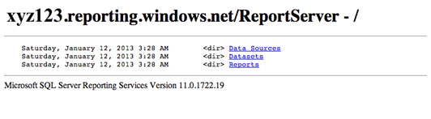
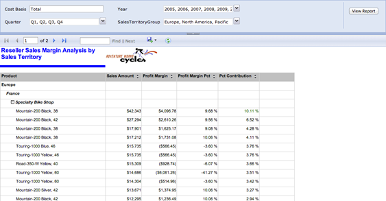

# 第七章报告获取

上传内容、添加用户帐户和分配权限后，SQL Reporting server 就可以供报表读取器使用了。报表读取器是在 SQL Reporting server 上拥有最少权限的用户。这组用户访问报表的最简单方法是使用“SQL Reporting 报表服务器”链接浏览可用内容，然后单击报表链接进行查看。另一种选择是为报表读取器提供特定报表的 URL，其中还可以包含控制呈现体验的命令。第三个选项是让报表读取器打开一个使用 ReportViewer 控件显示报表的应用。在本章中，我将从报表读者的角度解释这些选项。

## Web 服务 URL

要浏览 SQL Reporting 服务器的内容，您必须拥有服务器的 URL 和登录服务器的凭据。报表服务器管理员为您提供的服务器 URL 类似于:https://xyz123.reporting.windows.net:443/reportserver.当您在 web 浏览器中打开此 URL 时，系统会提示您输入分配给您的用户名和密码。成功输入凭据后，顶级项目会显示在浏览器中，如图 52 所示。您只能查看已被授予权限的项目。



图 52: SQL 报告服务器主目录

单击目录链接查看它们包含的项目，或者单击报告链接显示报告，如图 53 所示。默认情况下，报表以 HTML 格式呈现，并在报表上方包含 HTML 查看器工具栏。此工具栏包含用于导航报告、在报告中搜索文本、将报告导出为新格式或刷新报告的按钮。如果报告包含报告参数，它们将显示在 HTML 查看器工具栏的上方。更改参数值后，点击**查看报告**用新值更新报告。



图 53:HTML 格式的报告

|  | 注意:如果您是 SQL Reporting 管理员，也可以在 SQL Reporting 管理门户中导航文件夹层次结构，然后单击某个报告以在浏览器中打开新选项卡。在浏览器中查看报告之前，您必须键入用户凭证，如图 53 所示。 |

## 渲染格式

当用户想要查看报告但无法连接到互联网时，或者当他们想要以不同的方式使用报告中的信息时，他们可以将报告导出为替代呈现格式。SQL Reporting 支持七种不同的呈现格式，作为用于在浏览器中显示报告的在线 HTML 格式的替代。这七种格式被组织成三种类型的渲染器:

*   **软分页**。该文档遵循 RDL 的报告布局，并针对在线查看进行了优化:Excel、Word 和 MHTML。
*   **硬分页**。该文档遵循 RDL 的报告布局，并针对打印进行了优化:TIFF 和 PDF。使用这些格式时，您应该检查“宽度”、“高度”和“边距”属性是否设置正确。
*   **数据**。渲染器的输出是原始数据，不包括为报告布局定义的格式:CSV、XML。

### Excel

导出到 Excel 会生成一个扩展名为 XLSX 的文件，该文件与 Excel 2007 和更新版本兼容。它为报表中的每个文本框、图表、迷你图、数据栏、仪表、指示器、地图和图像生成一个单元格，但使用多个单元格来呈现数据区域、子报表、矩形和报表正文。在某些情况下，当报表项边缘不对齐时，渲染会合并多个单元格。除非将图像分配给报表正文的 BackgroundImage 属性，否则将忽略报表项的背景图像。

在大多数情况下，格式属性尽可能保留在工作表中。如果没有在报表中定义分页属性，SQL Reporting 会将报表呈现为 Excel 工作簿中的单个工作表。另一方面，如果定义了分页规则，那么基于一个组的每个分页符都会在 XLSX 文件中生成一个单独的工作表。您可以通过配置组的“页面名称”属性来命名每个工作表。

当 Excel 工作簿呈现时，页眉中包含的项目呈现在工作表的最上面的行中。相比之下，页脚成为 Excel 页脚的一部分。文档图作为第一张工作表添加到工作簿中，并包含文档图链接，如图 54 所示，这允许您跳转到 Excel 工作簿中的特定位置。


图 54:Excel 中的文档图链接

|  | 注意:Excel 渲染器在文档图中最多支持七个级别。 |

Excel 渲染器也支持超链接和书签操作，但不支持交互式排序。此外，表达式在工作簿中解析为常数值。渲染器将图表生成为图像，并且不包括底层数据。

### 字

这个渲染器生成一个 DOCX 文件，如图 55 所示，并且保留了许多交互特性，比如超链接和动作。但是，它不会像您预期的那样呈现文档图。相反，它从文档标签创建 Word 目录标签，但是您必须使用 Word 功能区上的**引用**选项卡来创建文档中的目录。此外，通过为图形数据区域和图像创建静态图像，Word 渲染器的行为类似于 Excel。但是，请注意，它不包括报告或报告正文中的背景图像。


图 55:查看呈现为 Word 文档的报告

Word 渲染器将报表中的页眉和页脚转换为文档页眉和页脚，但忽略这些项目的**高度**属性。它还使用您为报表定义的报表、正文和边距大小设置，但报表的最大宽度为 22 英寸。

### MHTML

当您从浏览器或 SQL Reporting 管理门户打开报表时，默认情况下报表呈现为 HTML，并且所有交互功能都已启用。如果报告中定义了明确的分页符，或者报告非常大，则必须使用 **HTML 查看器**工具栏中的导航按钮在页面之间移动。如果您想将此报告保存为单页或嵌入电子邮件中，可以将其保存为 MHTML 文件。当您这样做时，您将失去切换可见性的能力。在执行导出以更改可见性状态之前，必须单击报告的 HTML 版本中的切换项。

### PDF

PDF 渲染器会生成与您在网上看到的内容相匹配的报告。也就是说，任何处于隐藏状态的报表项在报表的 PDF 版本中都不可见。此外，PDF 文件不支持交互功能，如切换可见性、交互排序、书签和钻取。另一方面，它确实支持文档图，如图 56 所示，以及**转到 URL** 动作。


图 56:查看呈现为 PDF 文档的报告

### TIFF

您可以将报告渲染为标记图像文件格式(TIFF)的多页图像文件。与 PDF 渲染器一样，TIFF 渲染器不支持交互功能，仅渲染报告的当前视图。

### CSV

CSV 渲染器将报表数据中的数据转换为最低详细级别。它还在每个字段之间添加逗号分隔符，并在每个记录的末尾添加回车和换行符。文件中包含所有详细信息行，包括隐藏在报告的 HTML 版本中的行。列名列在文件的标题行中。请注意，下列项目不会呈现:页眉、页脚、线条、图像、矩形或使用组或 tablix 页脚中的表达式计算的总数。同样，交互功能也被排除在外。

报告中的每个项目在输出文件中呈现为一组单独的行和列，如图 57 所示。每个报表项类型都有自己的呈现行为，如下所示:

*   **独立式文本框**。独立文本框呈现的内容带有列标题和行值。
*   **表**。表在其包含的最低详细级别包括行和列，这不一定是报告中可见的详细级别。页脚中的行或列总数不包括在内。
*   **矩阵**。矩阵在其包含的最低详细级别包括行和列，这不一定是报告中可见的详细级别。页脚中的行或列总数不包括在内。
*   **列表**。列表中包含的每个详细信息行或组实例都有一行。如果列表包含嵌套项，父组实例值将在嵌套项的每一行中重复。
*   **子报表**。如果子报表嵌套在另一个报表项中，子报表内容的每一行的父项值都会重复。
*   **图表**。图表包含值和类别的每个组合的一行，通常表示为图表中的单个数据点。如果图表包含多个系列，则每个系列的标签都包含在该系列值之前的行中。数据条和迷你图具有相同的呈现行为，但不包括系列标签。
*   **规**。仪表包括包含刻度的最小值和最大值、范围的开始值和结束值以及指针值的单行。
*   **指示灯**。指示器包括具有当前指示器状态、可用状态和指示器值的单行。
*   **地图**。地图包括每个空间数据值的一行及其对应的标签。


图 57:查看呈现为 CSV 文件的报告

### XML

XML 渲染器以层次结构导出数据，如图 58 所示。报表定义中报表项的名称将成为导出文件中的 XML 元素，因此请考虑将报表项从默认名称(如 Textbox1)重命名为更具描述性的名称。XML 文件包括所有详细信息行，如果行可以切换到可见状态，还包括隐藏数据。每个报表项类型都有自己的呈现行为，如下所示:

*   **报告**。该报告是 XML 文件中的顶级元素。
*   **独立式文本框**。独立文本框在其父容器的元素中呈现为属性。
*   **数据区域和矩形**。在此上下文中，数据区域是表格、矩阵、列表、图表、数据条或迷你图。数据区域和矩形呈现为其父容器的子元素。在图表中，每个系列都是图表的子元素。
*   **分组及明细**。每个实例都呈现为其父数据区域的子元素。组实例包括行组和列组。
*   **数据区内的文本框**。非独立的文本框呈现为其父数据区域的子元素。
*   **地图**。地图本身呈现为其父容器的子元素。每个地图图层呈现为地图的子元素，并包括每个空间成员的元素。
*   **规**。仪表呈现为其父容器的元素，并将刻度的最小值和最大值、范围的开始值和结束值以及指针值呈现为仪表元素的属性。
*   **指示灯**。指示器呈现为其父容器的元素，并将当前指示器状态、可用状态和指示器值呈现为指示器元素的属性。


图 58:查看呈现为 XML 文件的报告

## 我的报告文件夹

**我的报告**文件夹是一个用户特定的文件夹，可用于存储报告。只有指定的用户和报表服务器管理员才能访问个人的**我的报表**文件夹。默认情况下，**我的报告**功能在服务器上被禁用，必须由报告管理员在使用前启用，如[第 4 章报告管理](4.html#_Chapter_4_Report)所述。如果功能已启用，并且您已被分配到“我的报告”角色(或分配给该功能用户的角色)，则通过**报告管理器**的主页浏览服务器时，可以看到**我的报告**文件夹。

添加您的**我的报表**文件夹后，您可以像内容管理器向报表服务器上的其他文件夹添加内容一样向其中添加内容。这样，您可以将您最喜欢的报表保存在一个位置，而不是在 SQL Reporting server 上的文件夹层次结构中进行搜索。

如果您是 SQL Reporting 管理员，您可以看到任何用户的**我的报表**文件夹的内容。您可以从此文件夹中移动报告，并在必要时删除报告。

## 网址访问

您可能无法在浏览器中浏览 SQL Reporting server 的文件夹目录，而是可以访问包含通过 URL 访问指向特定报表的直接链接的门户。该链接可以包含更改参数默认值、隐藏部分或全部 HTML 查看器工具栏或以不同格式导出报告的附加命令。角色分配在访问网址时仍然有效，因此如果您没有足够的权限，就无法打开报表。您可以将此 URL 存储在文档中，以便快速访问经常引用的报表，或者您可以负责构建带有 URL 访问链接的门户页面。

### 报告网址

您可以通过首先浏览 SQL Reporting server 来定位报表的 URL，如本章前面所述。单击报告的链接，然后查看浏览器地址栏中的网址。例如，图 38 所示报告的 URL 如下所示:`https://xyz123.reporting.windows.net/ReportServer/Pages/ReportViewer.aspx?%2fReports%2fReseller+Sales+Margin+Analysis+by+Sales+Territory&rs:Command=Render`

您可以复制此网址并在文档、电子邮件或网页中使用它。

|  | 提示:您也可以通过删除网址的/Pages/ReportViewer.aspx 和&rs:Command=Render 部分来缩写报告网址。您也可以通过分别用正斜杠和空格替换%2f 和+字符来消除编码。 |

### 网址访问参数

您不限于使用报表呈现、工具栏或参数的默认设置。相反，您可以附加提供附加选项的网址访问参数。

报告参数

对于要在报表中覆盖的每个参数，可以将一个名称/值对作为字符串，并将该字符串附加到报表的 URL。如果参数接受多个值，您可以追加多个名称/值对，如下所示:

```cs
    https://xyz123.reporting.windows.net/ReportServer/Reports/Reseller Sales Margin Analysis by Sales Territory&Quarter=1&Quarter=2

```

|  | 注意:请确保在名称/值对中使用参数的值，而不是其标签。 |

HTML 查看器参数

您也可以使用网址访问参数来修改显示在 HTML 查看器中的控件。例如，您可能决定排除 HTML 查看器的“参数”部分，因为您在 URL 中提供了参数值。表 5 列出了附加到网址的可用命令。

表 5: HTML 查看器参数

| 网址访问参数 | 描述 | 例子 |
| DocMap | 隐藏文档结构图。 | `&rc:DocMap=false` |
| 后退页面 | 如果搜索失败，显示指定的页面。 | `&rc:FallbackPage=1` |
| 查找字符串 | 使用*开始查找*和*结束查找*指定要搜索的页面范围，在报表中搜索字符串。 | `&rc:FindString=Mountain-200&rc:StartFind=1&rc:EndFind=5` |
| 因素 | 隐藏工具栏的参数部分。 | `&rc:Parameters=false` |
| 部分 | 显示指定的页面。 | `&rc:Section=5` |
| 工具栏 | 隐藏 HTML 查看器工具栏。 | `&rc:Toolbar=false` |
| 一款云视频会议软件 | 将报告大小增加或减少指定的百分比或由*页面宽度*或*整页定义的适合度。* | `&rc:Zoom=50`或者`&rc:Zoom=Page Width` |

报表服务器参数

使用 URL 访问参数的另一种方法是向报表服务器发出命令。当您想要使用**格式**参数将报告导出为 HTML 以外的格式时，您可以这样做。但是，并非所有报表服务器参数都显示报表。例如，您可以使用命令参数显示报表服务器内容。表 6 列出了可用的参数。

表 6:报表服务器参数

| 网址访问参数 | 描述 | 例子 |
| ClearSession | 从当前报告会话中删除报告(包括具有不同参数值的报告的所有执行)。 | `&rs:ClearSession=true` |
| 命令 | 对目录项目执行操作:

*   列出子项目列出子项目
*   呈现以呈现报告
*   显示共享数据集的 XML 的 GetSharedDatasetDefinition(如果您有读取报告定义权限)
*   获取数据源内容以显示数据源属性
*   获取资源内容以在 HTML 页面中呈现文件(而不是报告)
*   显示报告的 RDL(如果您有读取内容权限)

 | `&rs:Command=ListChildren` |
| 格式 | 以指定格式呈现报告(默认 HTML4.0) | `&rs:Format=excelopenxml` |
| GetNextStream | 获取持久化流的下一个块(默认值=false)。 | `&rs:GetNextStream=true` |
| 参数语言 | 定义独立于浏览器语言的参数语言。 | `&rs:ParameterLanguage=en-us` |
| PersistStreams | 一次在单个持久化流或一个块中呈现报告(默认值=false)。 | `&rs:PersistStreams=true` |
| SessionID | 指定活动的报告会话。 | `&rs:SessionID= 1lvwaoji1ok1sdyujn1dg5un` |
| 显示隐藏切换 | 切换报告某一部分的可见性。 | `&rs:ShowHideToggle=1` |