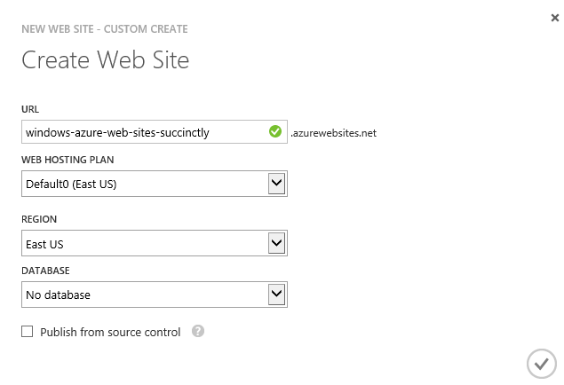
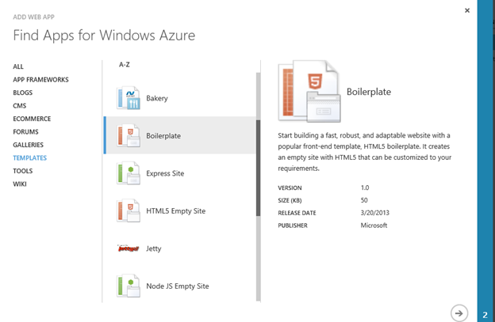

# 第 2 章资源调配

一旦建立了本地开发环境和 Azure 帐户，就可以开始在 Azure 平台上提供服务了。在本节中，您将学习如何提供一些与网站开发最相关的服务。在所有情况下都将描述的主要资源调配方法是使用 Windows Azure 管理门户。但是，还将简要讨论 PowerShell 集成，以演示如何在 Azure 生态系统中使用 PowerShell 来自动化 DevOps 执行的许多重复管理任务。

对于要调配的任何资源，该过程从选择 http://manage.windowsazure.com 管理门户中的“新建”命令开始，如图 5 所示:

图 5:创建新资源

## 蔚蓝网站

要使用 Azure 管理门户提供新的 Azure 网站，第一步是确定您希望网站公开的 URL。默认情况下，Azure 网站将以 http:// **您的网站** .azurewebsites.net **的网址格式向公众公开，其中** **您的网站**由您指定，在 Azure 托管的网站中必须是唯一的。存在指定自定义域名而不是默认命名的选项，但这些选项不会在本书中讨论。

虽然在大多数情况下会为您提供默认值，但是考虑一下您希望服务托管在哪里也是很好的。微软在全球有几个托管 Azure 服务的数据中心。它们目前位于以下位置:

*   美国中北部
*   美国中南部
*   美国西部
*   美国东部
*   巴西
*   中国北京
*   中国上海
*   东亚
*   东南亚
*   北欧
*   西欧
*   东日本
*   西日本

当你浏览地区列表时，你可能会注意到，在大多数情况下，它们成对出现，在同一个大陆上彼此相对。微软使用这种安排来提供冗余，即托管服务和数据的备用位置仍然与主要来源在同一个大陆上，但距离足够远，使得这两个位置不太可能受到洪水和地震等重大灾难事件的影响。

为您的 Azure 网站选择区域时，最重要的考虑因素是延迟。当您的 Azure 网站的预期访问者在地理上靠近时，尽可能靠近他们托管您的 Azure 网站将确保往返您的 Azure 网站所需的网络跳数更少，并缩短响应时间。考虑您的 Azure 网站将使用的任何其他托管服务的位置也很重要，因为将网站定位在它所使用的服务所在的同一区域将减少它们之间的延迟，并且有时还会防止数据进出 Azure 数据中心时产生的费用。

一旦您知道了网站所需的网址和区域，您就可以通过在 Azure 管理门户中选择“新建”命令来开始创建网站的过程。此命令将显示一个分层菜单，您应该导航到菜单中的“计算…网站”。您将看到三个选项可供选择:“快速创建”、“自定义创建”和“来自图库”。

### 快速创建

当选择“快速创建”时，将显示其他选项来指定所需的网址，并可选地覆盖为您的网站托管计划显示的默认值，您希望将这些默认值附加到网站和您希望托管该网站的区域。这些选项如图 6 所示。指定网址并选择“创建网站”后，您的网站将在 Azure 数据中心内进行设置，并为您部署内容做好准备:

图 6:快速创建选项

### 自定义创建

当选择“自定义创建”时，会出现一个对话框(如图 7 所示)，除了“快速创建”可用的选项之外，还允许您指定站点可用的数据库(这可以是一个免费的 20MB SQL 数据库，用于轻度需求，也可以是一个付费的 SQL Server 或 MySQL 数据库实例)，并设置站点以便从源代码管理提供者(如 Visual Studio Online、GitHub 等)进行部署。根据所选的选项，可能会在安装向导中添加其他步骤，例如源代码管理提供程序和数据库详细信息的选择和配置。完成向导后，将设置您的网站和数据库(可选)。如果选择了源代码管理提供程序，网站内容将从源代码管理提供程序部署，并准备好供网站访问者查看。

图 7:自定义创建选项

### 来自画廊

当选择“从图库”时，网络应用程序图库(如图 8 所示)显示为向导中的第一页，以帮助配置您的新网站。在图库中，有一个不断增长的预配置选项列表，从入门模板到快速入门，为您的网站奠定了框架，以完成包括流行的内容管理系统、博客和电子商务框架在内的应用程序。图库中可用的每个应用程序可能需要不同的信息来完成设置和配置，因此向导将动态引导您收集适用于您网站的信息。向导完成后，您的网站将完全准备就绪，您可以完成初学者模板的构建，也可以让访问者开始消费您的内容。

图 8:网络应用程序库

## 储存

Azure 网站的一个常见需求是在提供的 20MB 免费数据库之外增加额外的存储空间。在需要额外存储的情况下，经常使用 Azure Storage，因为与其他数据服务相比，它具有灵活性、可扩展性和低成本。与 Azure 网站一样，配置新存储帐户的第一步是确定存储帐户可访问的 URL。默认情况下，Azure Storage 帐户将以 http://**your-site**. core . windows . net**的 URL 格式公开，其中** **your-site** 由您指定，在 Azure 托管的存储帐户中必须是唯一的。如果需要的话，子域之间的差异为在您的 Azure 网站和 Azure 存储帐户中对网址的**您的站点**部分使用相同的值打开了惯例。

除了 URL 之外，创建 Azure 存储帐户时必须提供的另外两条信息是所需的位置/亲缘关系组和复制选项。默认情况下，位置/相似性组选项仅包括位置(数据将驻留在其中的数据中心)，但您可以在管理门户中创建称为相似性组的逻辑容器。相似性组用于指示 Azure，某些计算和存储资源应在数据中心内相互靠近分组，以减少它们之间的网络跳数，从而降低传输成本和延迟。复制选项决定了如何复制数据，以平衡性能、成本和持久性。其中包括以下内容:

*   地理冗余:默认情况下，此选项处于选中状态，它指定除了在本地数据中心存储多个副本(准确地说是三个)之外，还将数据复制到地理上分开的数据中心。如果人为或自然灾害破坏了本地数据中心或其中的数据，数据中心之间的数据复制可以防止数据丢失。
*   读取访问地理冗余:此选项类似于地理冗余选项，但增加了对存储在独立存储中的数据副本提供直接只读访问的能力。这可以提供容错并允许跨资源的负载平衡。
*   本地冗余:此选项提供了放弃将数据复制到辅助数据中心的选项。虽然这看起来不可取(有一个原因说明它不是默认的)，但在某些情况下，应用程序可能不需要额外的冗余。该选项提供了地理复制存储的折扣定价结构。此外，使用本地冗余帐户的数据传输比地理复制帐户更快。

当您知道将为您的存储帐户指定的配置选项时，您可以通过选择 Azure 管理门户中的“新建”命令并导航菜单层次结构到“数据服务…存储…快速创建”来调配帐户指定所需选项并选择“创建存储帐户”，Azure 将调配您的新存储帐户。

## 其他服务

您可以通过在 Azure 管理门户中选择“新建”命令，在层次结构中导航以查找服务，然后遵循直观的向导为调配的服务收集配置选项，来调配您的应用程序使用的 SQL 数据库、服务总线队列或 Azure 平台上提供的任何其他服务。

## 总结

在本章中，您学习了如何在 Azure 帐户中提供服务。根据所选的选项，您可能创建的许多服务将不再有用，或者处于您希望任何人访问您的网站的状态。在下一章中，您将学习如何开发和部署这些服务中托管的内容和代码。