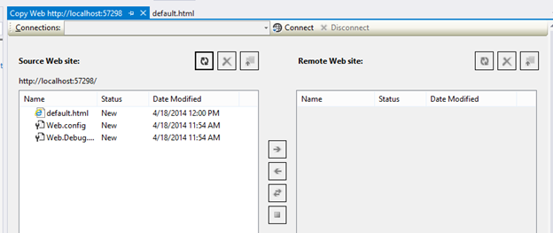
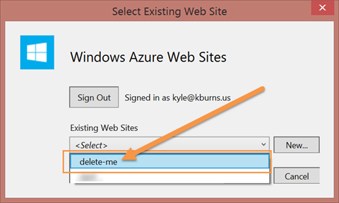
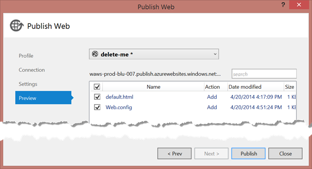
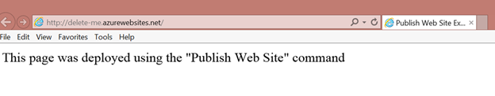
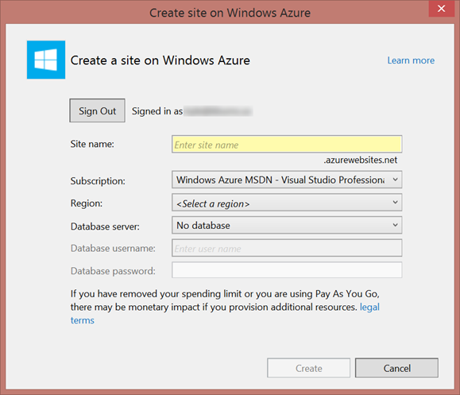
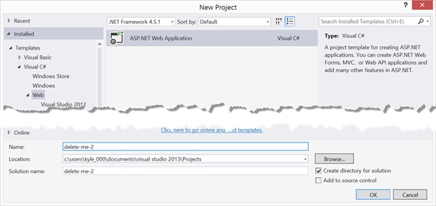
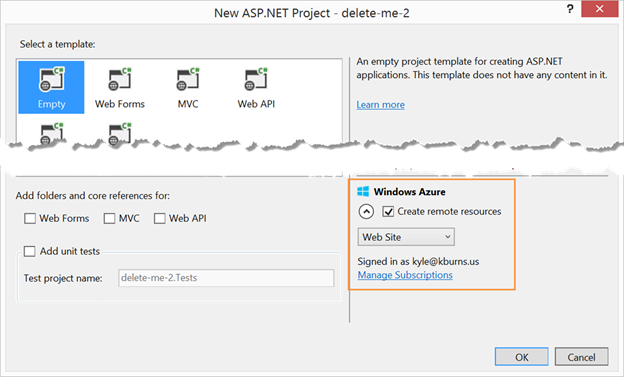
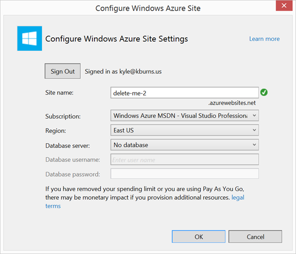
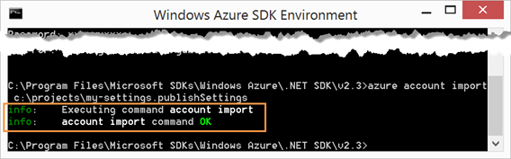
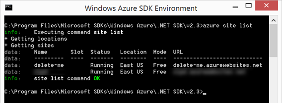

# 第 4 章部署网站

几乎不用说，除非图库模板完全满足您的即时需求，否则您闪亮的新 Azure 网站对您来说相对无用，除非您能够部署新内容或对从所选图库模板创建的内容进行更改。与 Azure 中的许多任务一样，完成部署的正确方法不止一种。在本章中，我们将研究其中的几个选项。

## 通过 FTP 部署

文件传输协议(FTP)是一种在网络连接的主机之间移动文件的方法，已经被普遍使用了几十年。作为一种部署机制，它有许多限制，因此不太适合大型或复杂的部署。但是它的简单性和跨平台的 FTP 客户端和服务器软件的几乎普遍的可用性几乎保证了它可以让你移动文件。

现在使用的大多数操作系统都提供了一个命令行 FTP 客户端，您可以通过它输入要执行的命令，包括列出目录内容、上传文件和下载文件等操作。许多还提供了一个图形客户端，允许您在与操作系统的本机文件管理器应用程序几乎相同的管理器中与服务器上的文件和目录进行交互。但是，在大多数情况下，这些客户端往往受限于专用 FTP 客户端中存在的功能，例如自动执行日期检查，以避免下载或上传自上次同步以来未更改的内容。如今，许多人的 FTP 客户端是开源的 FileZilla 软件，可在[http://filezilla-project.org](http://filezilla-project.org)找到，并在 GNU 通用公共许可证下分发。

### 为 FTP 部署配置 Azure

在使用 FTP 客户端将内容部署到 Azure 网站之前，必须为 FTP 访问进行配置。这主要包括设置可用于连接 FTP 客户端的凭据，因为 FTP 不能使用您用于大多数 Azure 管理任务的 Microsoft 帐户凭据。因为凭据将用于不能使用 Microsoft 帐户凭据的其他部署选项，所以在 Azure 管理门户中，它们被称为“部署凭据”，而不是专门称为 FTP 凭据。

要为 Azure 网站配置部署凭据，请在 Azure 管理门户中通过单击网站名称来选择该网站，这将显示所选网站的详细信息。使用顶部导航栏导航到仪表板选项卡，并在快速浏览部分找到“设置部署凭据”，如图 16 所示:


图 16:仪表板部署凭据命令

管理门户将显示如图 17 所示的对话框，提示您输入用户名和密码，以便通过 Git 或 FTP 进行部署。输入用户名和密码并保存更改:


图 17:设置部署凭证

您的 Azure 网站现在可以接受来自您选择的 FTP 客户端的连接，以部署资产。

### 获取 FTP 客户端的连接信息

一旦您的 Azure 环境配置了部署凭据，您需要知道您的 FTP 客户端指向何处与 Azure FTP 服务器交互。这些信息以及凭证本身可以通过从 Azure 管理门户下载一个名为“发布配置文件”的文件来获得。要获取 Azure 网站的部署凭据，请在 Azure 管理门户中选择该网站，方法是单击网站名称，这将显示所选网站的详细信息。除非您选择了跳过快速启动屏幕的选项，否则将显示快速启动屏幕。您可以在图 18 所示的“发布您的应用程序”部分找到“下载发布配置文件”命令:


图 18:快速启动下载发布配置文件

如果您已经选择了跳过快速启动屏幕的选项，则可以在快速浏览下的仪表板选项卡上找到“下载发布概要文件”命令，如图 19 所示:


图 19:仪表板下载发布概要文件

无论您在哪里找到该命令，Azure 管理门户都将通过提供名为`*your-site*` `.azurewebsites.net.PublishSettings`的文件进行响应，其中`*your-site*`是您网站的名称。该文件是一个 XML 文档，包括各种部署方法的部分，每个部分都包含在名为`publishProfile`的节点中。`publishProfile`节点的 XML 格式如下:

```
    <publishProfile profileName="delete-me - FTP"
    publishMethod="FTP"
    publishUrl="ftp://waws-prod-blu-007.ftp.azurewebsites.windows.net/site/wwwroot"
    ftpPassiveMode="True"
    userName="delete-me\$delete-me"
    userPWD="[omitted]"
    destinationAppUrl="http://delete-me.azurewebsites.net"
    SQLServerDBConnectionString=""
    mySQLDBConnectionString=""
    hostingProviderForumLink=""
    controlPanelLink="http://windows.azure.com">
    <databases/>
    </publishProfile>

```

用于查找文件传输协议连接信息的合适的`publishProfile`节点是`publishMethod`属性的值为“文件传输协议”的节点。`publishUrl`节点包含发布网站内容的根目录 URL，凭证包含在`userName`和`userPWD`(密码)属性中。您会注意到，这些凭据与设置部署凭据时输入的实际凭据不同。这是因为 Azure 使用您用作种子的信息来生成实际的凭据。

|  | 注意:请务必记住，此文件中包含的凭据将授予获得它们的人控制网站内容的能力，因此发布设置文件应该保持安全。FTP 不是一个安全的协议，所以我也建议经常更改部署凭据，并为您正在使用的任何应用程序生成一个新的发布设置文件。 |

获得适当的网址和凭据后，您可以使用首选的 FTP 客户端和网站文件连接到网站。图 20 演示了如何连接文件服务器:


图 20: FileZilla FTP 连接

|  | 注意:除了专用的 FTP 客户端之外，一些 web 集成开发环境(IDEs)，如 Adobe Dreamweaver，还具有集成的 FTP 管理工具，允许您从开发环境中管理和部署资产。 |

### 重置发布配置文件和部署凭据

用户名/密码凭证的安全性仅取决于对其保密的能力，而这通常很难做到。PublishSettings 文件可能会在不知情的情况下在网络驱动器上可用，受信任的员工可能会突然变成不满的前员工，OpenSSL Heart Bleed 等漏洞会以惊人的频率被发现。有时你甚至会发现，当你为一个博客条目或一本书捕捉屏幕截图时，你已经忘记掩盖你的凭证。这些因素都支持这样的断言:如果要保护任何重要的东西，即使是最安全的凭据也必须定期更改。

先前建立部署凭据后，Azure 管理门户中将提供两个附加命令。这些命令是:

*   重置您的部署凭据:此命令建立用于用户名/密码的新“种子”值。
*   重置发布配置文件凭据:此命令为发布配置文件中使用的实际凭据生成新值。使用该命令后，现有发布设置文件中的信息将无法再用于连接和部署到您的网站。因此，如果多人部署到同一个网站，当每个人拥有的发布设置文件不再是最新的时，进行沟通是很重要的。

要访问用于更改部署内容所用凭据的命令，请导航到快速入门或仪表板屏幕，如前所述。“重置您的部署凭据”命令出现在“发布您的应用程序”部分的快速启动屏幕中，这两个命令都出现在快速浏览部分的仪表板屏幕中。

## 从 Visual Studio 部署

尽管 FTP 部署是跨平台兼容性的一个选项，并提供了最广泛的工具来管理您的网站(目前使用的每个主要操作系统都包括一个 FTP 客户端和一个简单的文本编辑器)，但大多数在 Azure 平台上创建网站的人很有可能至少可以访问 Visual Studio，并且希望使用比 UI 和命令行 FTP 更友好的开发和部署方法(这并没有什么问题)。对于使用 Visual Studio 2013 的开发人员来说，Azure 中托管的网站的部署已经很好地集成到开发人员工作流中。在本节中，我们将介绍一些使用 Visual Studio 进行部署的可用选项。

### 复制网站

从 Visual Studio 部署网站时，您可以利用的一个选项是使用“复制网站”命令来启动基于 FTP 的内容副本。这个命令可以在 Visual Studio 中作为“网站”菜单的子项目找到，如图 21 所示，或者在解决方案资源管理器中右键单击网站的项目，如图 22 所示:


图 21:从网站菜单复制网站


图 22:复制网站上下文菜单

无论如何调用“复制网站”，Visual Studio 都会在“源网站”部分和最初为空的“远程网站”部分显示一个包含网站项目中文件的窗口。这个界面如图 23 所示，看起来非常类似于许多流行的图形 FTP 客户端，因为它本质上有相同的工作:



图 23:复制网站用户界面

从复制网站用户界面，您需要做的第一件事是使用从发布设置文件中获得的信息建立到 Azure 网站的连接。这是通过调用窗口顶部“连接”下拉菜单旁边的“连接”命令来启动的。这将显示一个对话框，允许您连接到本地文件系统上的文件夹、本地 IIS 实例或 FTP 服务器。选择 FTP，并使用您的发布设置文件中的值填写连接信息字段，显示类似于图 24 所示。对于服务器和目录字段，您必须从`publishUrl`属性中提取主机名和路径值:


图 24:复制网络文件传输协议连接

提供连接信息和凭据后，通过选择“打开”命令接受条目。然后，Visual Studio 将通过 FTP 连接到 Azure，网站根目录将显示在“远程网站”部分。此时，您可以手动选择要同步的文件，并使用位于“源”和“远程网站”部分之间的命令来执行同步。图 25 演示了将文件从源站点复制到远程站点:


图 25:将文件复制到远程

在使用复制网站工具时，需要记住的一件非常重要的事情是，它本质上只是一个集成到 Visual Studio 中的 FTP 客户端。因此，许多高级任务(如集成构建和配置转换)无法通过该工具实现。这使得该工具只适用于最简单的网站，甚至不适用于网络应用程序项目。

### 发布网站

|  | 注意:发布网站的工具没有集成到 Visual Studio 的免费快速版本中，因此，如果您已经选择或必须使用快速版本，此部分将不适用于您。 |

在前一节中，我讨论了 Visual Studio 中“复制网站”部署方法的一个相当大的缺点，即它只是网站文件的直接副本，没有考虑数据库和构建转换等因素。“发布网站”命令是处理这些类型任务的“复制网站”的更强大的替代命令。

“发布网站”命令和“复制网站”命令都可以从 Visual Studio 主菜单中获得，也可以作为解决方案资源管理器中的上下文菜单项获得。在 Visual Studio 主菜单系统中，命令位于“构建”菜单中(如图 26 所示)，右键单击解决方案资源管理器中的 web 项目时会显示上下文菜单项(如图 27 所示):


图 26:从构建菜单发布网站


图 27:从上下文菜单发布网站

无论调用菜单的方式如何，Visual Studio 都会通过显示“发布网站”对话框进行响应。当对话框显示时，您要做的第一件事是向 Visual Studio 提供关于网站预期目的地的信息。对于许多第三方托管提供商，这可能包括手动导入发布设置文件或手动输入发布设置文件中的信息类型。但是，随着 Azure 集成内置到工具中，通过在图 28 中显示的“选择发布目标”部分选择“Windows Azure 网站”，很多手动工作被消除了。此时，您将被要求使用您的 Microsoft 帐户登录 Azure，Visual Studio 将连接到 Azure 管理门户并下载您的发布设置文件，以自动导入您的设置:


图 28:发布网站对话框

一旦您的发布设置文件被导入，Visual Studio 将要求您选择在 Azure 上提供的哪些网站应该被用作当前项目的目标，如图 29 所示。选择适当的站点，然后接受您的选择:



图 29:发布网站选择网站

此时，“发布网站”对话框将使用网站发布设置中的信息完全填充，并且已经可以通过选择“发布”命令启动部署。但是，在开始该过程之前，您可能还需要自定义其中一个选项卡上的设置。

#### 连接选项卡

如图 30 所示，Connection 选项卡用于指定用于部署的发布方法(在本例中，我们将使用 Web Deploy)以及适用于所选类型的连接和凭据信息。Azure 集成允许在没有干预的情况下完全填充这个，但是您可能希望(作为探索性步骤)选择 Validate Connection 命令来查看结果，如图 30 所示:


图 30:发布网站连接设置

#### 设置选项卡

如图 31 所示，在将网站发布到 Azure 之前，设置选项卡是您最需要定制部署选项的地方。在这个选项卡上，您可以选择用于构建模式和生成适当配置转换的配置。此外，您可以从与发布文件相关的多个选项中进行选择，包括:

*   在目标位置删除其他文件:此选项用于将 Visual Studio 项目建立为应该存在的文件的真正来源，并且它指定项目中未表示的任何文件都不应保留在 Azure 网站目录中。
*   在发布过程中预编译:默认情况下，ASP.NET 基于一个文件中的标记以及与该网页或控件相关的代码(位于称为“代码隐藏”的单独文件中)执行 web 内容的按需编译。这提供了很大的灵活性，可以在部署代码后就地修改代码。但是，在某些情况下，您更喜欢在访问者试图访问您的网站之前编译代码的性能影响，或者知道原始源文件没有直接发布到 web 主机文件系统的舒适性。在这些情况下，您可以在部署网站之前执行构建，并在 **bin** 文件夹中生成程序集，而不是代码隐藏文件。这仍然允许您在没有构建和部署周期的情况下修改标记，但是任何应用程序代码更改都需要新的部署。

|  | 注意:在考虑预编译选项时，考虑围绕它做什么以及为什么使用它的所有应用程序信息是很重要的。如果您选择该工具只是为了保护应用程序代码不被泄露给网站访问者，那么您可以放心，因为您知道 IIS 不会直接提供代码隐藏文件。如果您试图保护应用程序代码，使其不被能够直接访问站点部署位置(如 FTP 访问和部署凭据)的人访问，则需要额外的步骤(如模糊处理)来防止个人使用高可用性对编译后的程序集进行简单的逆向工程。NET 反编译工具。 |

*   从 **App_Data** 文件夹中排除文件:一旦网站处于活动状态，覆盖应用程序数据(默认情况下存储在 **App_Data** 文件夹中)的后续部署可能会产生负面的潜在破坏性影响。你肯定不会希望每次更新页面外观或添加新功能时，都清除网站的所有用户注册或博客帖子。此选项允许您指定您的发布操作应考虑将**应用程序 _ 数据**目录视为禁区，以避免潜在的代价高昂的错误。

除了版本配置和文件发布选项之外，此选项卡还使您能够指定与数据库部署相关的选项，包括将用于 Azure 中托管的数据库的连接字符串，以及当应用程序开始使用实体框架的代码优先迁移工具时，应用程序是否应该对该数据库执行数据库迁移代码。


图 31:发布网站设置

#### 预览选项卡

名称“预览”可能意味着，在实际提交更改之前，您将有机会查看已部署网站对网站最终用户的外观，但“预览”选项卡实际上为您提供了部署工具确定的成功部署所需操作的预览。生成预览动作的输出如图 32 所示，包括将要采取某些动作的资产列表、要采取的动作(在我们的例子中，所有内容都要被添加)、资产上次被修改的日期以及资产的大小。随着您逐渐习惯该工具并了解对其行为的期望，将预览输出用作各种健全性检查以确保您知道在通过选择“发布”命令启动部署操作时会发生什么，这可能会很有价值:



图 32:发布网站预览

#### 发布命令

一旦您直接跳到发布命令或者首先查看并配置了附加选项卡，部署工具就会连接到 Azure 并执行所有必要的更改。作为部署的最后一步，Visual Studio 将把您的 web 浏览器启动到站点根目录，如图 33 所示:



图 33:发布网站完成

### 提供新的 Azure 网站

在前面关于在 Visual Studio 中部署的部分中，重点和假设是使用 Visual Studio 的开发人员正在 Visual Studio 中处理一个新的或现有的 web 项目，并且希望将该项目的内容部署到以前提供的 Azure 网站。Visual Studio 还提供了创建新的 Azure 网站的功能，无论是在创建新的 Visual Studio 网站项目时，还是在配置目标 Azure 网站以在发布网站工具中进行部署时。

#### 发布网站

为了在执行“发布网站”工具的过程中创建新的 Azure 网站，如前一节所述，通过解决方案资源管理器中的“构建”菜单或上下文菜单调用该工具，并选择“Windows Azure 网站”作为发布目标。登录 Azure 后，不再像前面描述的那样选择现有的 Azure 网站，而是调用“New”命令，该命令将显示如图 34 所示的对话框:



图 34:创建站点对话框

在“创建站点”对话框中，您需要为新站点指定一个名称，选择为了计费目的站点应该绑定到的订阅，并选择站点应该托管的区域。此外，如果您选择这样做，您可以选择一个数据库，站点应该使用它来存储数据，并在必要时创建一个新的数据库。选择所需选项后，选择“创建”命令，并继续使用前面介绍的“发布网站”工具将内容部署到新创建的 Azure 网站。

#### 新网站项目

除了在先前创建的 web 项目的发布过程中创建新的 Azure 网站之外，您还可以在首次创建 Web 项目时使用 Visual Studio 工具来创建新的 Azure 网站。这带来的一个好处是，它提供了在完成网站编码之前锁定网站基本网址的机会。这确保了你不会想出一个完美的网址，却发现别人在你忙着开发一个像网址一样好的网站时抢先获得了它。

要创建新的 Azure 网站作为创建新网站项目的一部分，首先调用“新建项目”对话框，方法是在 Visual Studio 起始页上选择“新建项目”，或者从 Visual Studio 的主菜单中选择“文件…新建…项目”。Visual Studio 将显示“新建项目”对话框，如图 35 所示:



图 35:新建项目对话框

选择 ASP.NET Web 应用程序项目类型后，Visual Studio 显示“新 ASP.NET 项目”对话框(如图 36 所示)，以收集详细信息，例如要创建的 Web 应用程序的具体类型、为方便起见从通常选择的引用中进行选择，以及(现在对我们来说最重要的)指定应该为您的项目创建 Azure 中的新资源的选项。该对话框让您可以选择是使用 Azure 网站服务还是在虚拟机中创建 Azure 资源。因为我们的重点是 Azure 网站，所以选择“网站”:



图 36:新 ASP.NET 项目对话框

指定网站类型并指定应该创建 Windows Azure 远程资源后，选择“确定”。然后，Visual Studio 将显示“配置 Windows Azure”对话框，如图 37 所示。至少，在此对话框中，您将指定一个网站名称(将根据项目名称指定默认值)，并确保订阅和区域设置正确。如果您的应用程序也需要创建一个数据库，那么在这个对话框中也会指定一个数据库服务器、用户名和密码。选择所需选项后，选择“确定”，Visual Studio 将完成项目创建，并将与 Azure 管理应用编程接口交互，以调配您的 Azure 网站和数据库(如果适用):



图 37:配置 Windows Azure 对话框

一旦 Visual Studio 完成了项目和 Azure 网站的设置，就可以像处理任何其他网站项目一样处理该项目。当您拥有适合与世界共享的产品时，请使用“发布网站”命令来部署您的资产。

## 从网络矩阵部署

除了更面向专业开发人员的 Visual Studio(尽管 Express 版本面向学生和业余爱好者销售)，微软还将网络矩阵作为一种工具提供，以便于网站的创建、编辑和部署。

使用以前使用 Azure 管理门户或其他工具设置的 Azure 网站的最简单方法是使用附加到您的 Azure 帐户的相同微软帐户登录网络矩阵，并从启动页面选择“打开…窗口 Azure”。该操作显示一个窗口，显示已在您的 Azure 门户中配置的 Azure 网站，如图 38 所示。该对话框在左侧导航中提供了几个可供选择的类别。选择 Windows Azure 将显示您设置的 Azure 网站列表，并允许您选择要使用的网站:


图 38:网络矩阵开放站点对话框

从“打开”对话框中选择“确定”后，网络矩阵将在集成开发环境中显示网站内容，并允许您编辑文件、创建新文件和删除文件。与网站的连接是实时远程连接，因此在网络矩阵中保存文件会自动将更新部署到您的 Azure 网站。

## 从源代码管理部署

Azure 网站具有集成选项，可以将许多流行的源代码管理存储库连接到您的部署位置。为了完整起见，源代码管理集成包含在列表中，但是这些选项将在下一章中详细讨论，这里不再赘述。

## 自动化部署

在此之前讨论的部署方法都围绕着在图形界面中单击命令和选择选项。但是，许多管理员和开发人员发现，通过命令行可以更高效地完成资源调配和代码部署等管理任务，尤其是在命令行任务可以编写脚本的情况下，这样也更不容易出错。除了可以用来生成自己的命令行工具的 REST 管理应用编程接口之外，微软还提供了一个跨平台的命令行界面，其中有一个用于 Windows、Mac 和 Linux 的安装包，以及一组在 Windows PowerShell 中使用的脚本工具。这些工具中的任何一个都可以用来轻松地自动化管理任务。

### Azure 命令行界面

Azure 命令行界面提供了一种通用的命令语法，用于从 Windows、Mac 或 Linux 客户端自动执行 Azure 管理任务。在 Windows 中，通过打开“Windows Azure 命令提示符”来访问该工具，它将打开一个类似于图 39 所示的 DOS 风格的命令窗口:


图 39: Windows Azure 命令提示符

该窗口是一个标准的窗口命令窗口，但是路径和其他环境变量被设置为确保可以调用 Azure 命令行工具。要访问 Azure 命令，先键入`azure`命令，然后键入适用的选项。如果你和我一样，打开命令窗口后输入的第一句话是:

```
    >azure help

```

这显示了可以用命令行工具控制的基本命令和服务的文档，每个命令和服务都能够单独调用帮助文档以获得更多详细信息。由于本书主要关注 Azure 网站，请键入以下内容查看该服务的特定命令:

```
    >azure help site

```

现在您已经查看了可用命令的列表，您可能已经在脑海中形成了脚本。为了开始使用该工具，您需要让环境准备好使用您的 Azure 订阅。直观地说，这意味着在命令提示符下键入`azure login`并提供凭据，但这只有在您使用的是组织帐户并且标准微软帐户无法成功登录的情况下才有效。相反，您需要获取您的`.publishSettings`文件并将其导入工具。这是通过以下命令启动的:

```
    >azure account download

```

键入命令后，将打开一个网络浏览器窗口，打开 Azure 管理门户，并提示您下载`.publishSettings`文件。因为您将在下一步中从命令行使用`.publishSettings`文件的路径，所以我强烈建议将文件保存到易于记忆和键入的位置。假设在下载过程中使用了路径`C:\projects\my-settings.publishSettings`，接下来使用以下命令将文件导入命令行界面:

```
    >azure account import c:\projects\my-settings.publishSettings

```

命令行工具应该在此时导入文件，成功完成后将显示类似于图 40 所示的输出:



图 40: Azure 命令行界面导入帐户

要查看命令行工具此时是否与您的 Azure 帐户进行了适当的交互，请通过键入以下命令并观察类似于图 41 所示的输出来获取您创建的 Azure 网站列表:

```
    >azure site list

```



图 41: Azure 命令行界面列表站点

现在，您已经通过该命令与 Azure 进行了交互，现在是调配和部署新站点的时候了。我们将在这里介绍整个过程，但重要的是要指出，该示例将使用 Git 存储库，这将在下一章中详细解释。

|  | 注意:以下示例引用了一个名为 delete-cli-deploy 的站点。如果您在自己的计算机上进行跟踪，如果您使用示例中使用的相同站点名称，您将会遇到错误，因为站点名称在 Azure 中必须是唯一的。在尝试该示例时，请务必选择您自己唯一的站点名称。 |

在命令行界面中，将工作目录更改为包含网站文件的目录。示例网站存储在我计算机上的一个目录中，路径为`C:\projects\delete-cli-deploy`，以匹配我将在 Azure 中用作网站名称的内容。现在发布`azure site create delete-cli-deploy --git`命令`to initiate a new website creation. The tool will prompt for an appropriate region, which you should supply (I chose North Europe in the example). After providing several status updates, the tool will notify you that the website creation is complete. The command and output should be similar to what is shown in Figure 42:`


图 42: Azure 命令行界面创建站点

创建网站后，您需要将本地目录的内容添加到 Git 存储库中。这可以通过以下命令来完成:

```
    git add .
    git commit –m “this is a checkin comment”

```

现在，您已经将更改提交到了您的 Git 存储库中，是时候将它们部署到 Azure 了。使用以下命令部署内容:

```
    git push azure master

```

在提示部署凭证后，Git 会将内容部署到您的 Azure 网站。通过执行我们将在本节中介绍的最终 Azure 命令行界面命令，可以看到部署的结果:

```
    azure site browse delete-cli-deploy

```

Azure 命令行界面有丰富的命令可供探索和学习利用；我们在这一部分只触及了表面。我鼓励任何可能发现自己处于 DevOps 角色或对自动化感兴趣的人，通过集成的帮助系统或借助微软的在线文档直观地探索这个工具。

### Windows PowerShell

作为 Azure 命令行界面的替代，Windows PowerShell 提供了一个专门为脚本管理任务定制的环境，并与微软集成。NET 框架来提供在你的脚本中完成你能写的任何事情的能力。NET 代码来做。它还与用于通过 Visual Studio 环境进行部署的工具中使用的同一个 MS Deploy 引擎集成在一起，因此，直接从 Visual Studio 进行部署而不涉及 Git 这样的中介这样的事情要容易得多。PowerShell 本身是一个非常强大的工具，除了强大的功能之外，它还具有您所期望的复杂性。“简洁的 PowerShell”在这个电子书系列中很容易获得自己的标题，所以我不会试图在这里提供关于 PowerShell 的说明。相反，我将狭隘而清晰地讨论通过 PowerShell 连接到 Azure 和部署在 Visual Studio 中创建的网站所需的最基本命令。

通过启动“Windows Azure PowerShell”项目，最容易使用 Azure PowerShell 命令，该项目是在安装 PowerShell 工具时添加到 Windows 开始屏幕的。这会将适当的 Azure `cmdlets`导入到 PowerShell 环境中，并且在第一次加载时，会提示您允许导入模块。与命令行工具一样，好奇的开发人员(我希望包括阅读这本书的每个人)可能希望在启动工具后通过键入`help azure`并稍微探索一下来探索提供的命令。

一旦您从帮助屏幕上完成了任何初步的探索，您需要做的第一件事就是从 Azure 管理门户导入您的`.publishSettings`文件。这是通过以下命令启动的:

```
    >Get-AzurePublishSettingsFile

```

键入命令后，将打开一个网络浏览器窗口，打开 Azure 管理门户，并提示您下载`.publishSettings`文件。因为您将在下一步中从命令行使用`.publishSettings`文件的路径，所以我强烈建议将文件保存到易于记忆和键入的位置。假设在下载过程中使用了路径`C:\projects\delete-me\publish.publishSettings`，接下来使用以下命令将文件导入到您的命令行界面中(为可读性而包装，但在一行中输入):

```
    >Import-AzurePublishSettingsFile -PublishSettingsFile
    “c:\projects\delete-me\publish.publishSettings”

```

命令行工具将在此时导入文件，并在成功完成后提示下一个命令。如果您有多个订阅，将向您显示一条消息，详细说明将设置为默认和当前的订阅，以及查看其他订阅的说明。

与命令行工具一样，验证您能否成功与 Azure 帐户交互的一种快速方法是发出命令来检索 Azure 网站实例列表。在 PowerShell 命令提示符下，键入以下命令:

```
    Get-AzureWebsite

```

几秒钟后，系统会做出响应，列出您在 Azure 中添加的每个网站，包括网站名称、运行状态和网站的域名系统地址。如果显示此输出，您将被设置为使用导入的`.publishSettings`文件与您的 Azure 帐户进行交互。

一旦设置并验证了与 Azure 的连接，部署项目就是一个简单的任务，只需一个命令即可完成。在 Azure PowerShell 控制台中，将工作目录更改为包含 web 项目的`.csproj`文件的目录，并输入以下命令:

```
    Publish-AzureWebsiteProject -Name delete-me -ProjectFile .\delete-me.csproj

```

PowerShell `cmdlet`将调用工具来构建项目，创建包，并将包部署到您的 Azure 网站。成功的执行应该会产生类似于图 43 所示的结果:


图 43: Azure PowerShell 发布项目

一旦 PowerShell 命令完成执行，您就可以通过网络浏览器导航到您的网站并查看更新的内容。

如前所述，Azure PowerShell `cmdlets`中提供的功能非常广泛，允许您在脚本中使用大量控制。我们只是勉强触及表面。我鼓励读者访问微软位于 http://azure.microsoft.com/en-us/documentation/scripts/ T2 的 Azure 脚本中心，在那里你可以找到大量的脚本，或者按原样使用，或者研究和调整来解决你需要解决的问题。

## 总结

在本章中，您已经了解了几个部署选项，这些选项可让您的 Azure 网站的访问者使用您的资产。对于个人开发人员来说，从 Visual Studio 进行微软平台部署很可能是第一种也是最常用的部署方法。但是，随着应用程序变得越来越复杂，或者更多的开发人员在一个团队中工作，自动化部署选项通常会被考虑在内。在下一章中，您将更具体地关注源代码管理，以及两个主要的源代码管理系统如何与 Windows Azure 集成。