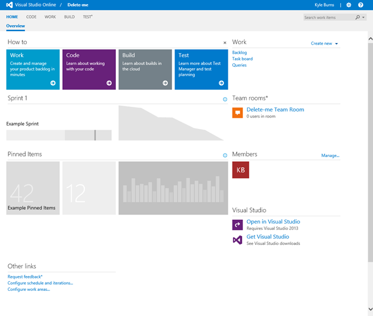
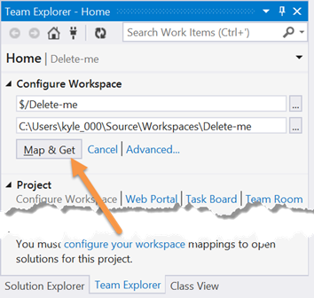
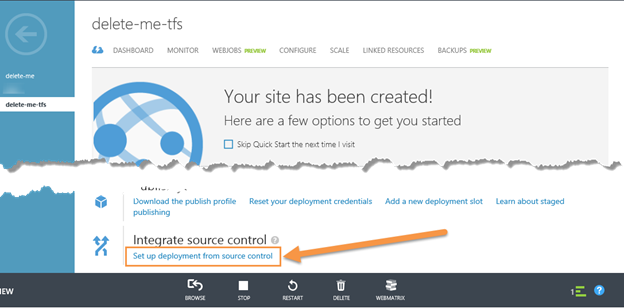

# 第五章源代码管理集成

源代码管理是您开发环境中极其重要的一部分，无论您是作为 300 名开发人员团队的一员开发企业级产品，还是作为一名开发人员为朋友建立网站。源代码控制(或称修订控制)为您的开发提供了一个安全网，它提供了一个备份的中心点，也提供了一种方法，在更改引入了无法预料的副作用，使您的应用程序无法正常工作后，可以轻松地恢复到以前的代码版本。在这一章中，我们将研究两个流行的源代码管理提供者:Team Foundation Server 和 Git。每一种都代表了两种不同的版本控制方法，您将看到它们是如何轻松集成到您的 Azure 网站开发中的。

## 团队基础服务器

微软的 Team Foundation Server 产品有两种风格:通常安装在组织内部服务器上的企业工具和现在称为 Visual Studio Online 的 Azure 产品。虽然版本控制是该工具的一个方面，但它是一个完整的应用程序生命周期管理(ALM)解决方案，不仅具有管理源代码的功能，还具有管理需求、测试和时间表的功能。在本节中，我们将了解 Visual Studio Online 工具与 Azure 网站的集成。

因为 Visual Studio Online 是一个完整的 ALM 解决方案，而不仅仅是一个版本控制系统，微软实际上已经对它进行了工具化，以便在集中的版本控制方法(在 Team Foundation 版本控制产品中提供)和更分布式的方法(使用 Git)之间进行选择。Git 将在本章的后面获得自己的内容，因此，在这一节中，我们将只关注 Team Foundation 版本控制。但是，我将指出一些决策点，如果您使用的不是 Team Foundation 版本控制，您选择的版本控制策略可能会导致您在 Visual Studio Online 中采取不同的操作。

截至本文撰写之时，微软正在通过一项名为“Visual Studio Online Basic”的服务，为最多五名成员的服务团队提供免费帐户，从而让小型团队轻松开始使用 Visual Studio Online。这项免费服务允许以每月额外费用添加团队成员，并包括以下功能:

*   项目数量不限
*   使用 Team Foundation 版本控制或 Git 托管代码存储库。这些存储库是私有的，只对您的团队成员可用
*   项目规划工具，如 Sprint 和看板板，以及敏捷和瀑布开发中常用的其他工具
*   与 Visual Studio、Xcode 和 Eclipse 的集成
*   使用云构建服务的持续集成

除了 Visual Studio Online Basic 之外，微软还有付费的 Visual Studio Online Professional 产品，该产品增加了 Visual Studio Professional IDE 和 Visual Studio Online Advanced 产品，后者仍然使用 Visual Studio Express，但增加了更高级的协作功能、项目管理工具以及让利益相关者发出声音的机会。作为最后一个选项，Visual Studio Premium 与 MSDN 还包括一个 Visual Studio Online 订阅，该订阅增加了测试用例管理以及除了云之外在内部托管团队项目的选项。

假设您要开始探索 Visual Studio Online Basic 产品，您可以通过导航网络浏览器到[http://www.visualstudio.com](http://www.visualstudio.com)开始设置。在此页面上，您应该会发现一个宣传点广告 Visual Studio Online，上面有一个行动号召，标签为“免费开始”(如果自撰写本文以来发生了变化，您可能需要在页面上搜索类似的内容)。选择操作调用，您将被带到(可能在停止登录到您的 Microsoft 帐户后)一个页面，在该页面上，您将被要求提供其他信息，如您的姓名和要分配给您的 Visual Studio Online 帐户的姓名。填写并提交表格。

提交注册表单后，Visual Studio Online 将创建您的帐户并将您转移到您的帐户仪表板，其中将包含一个提示您创建第一个项目的表单。表单需要以下信息:

*   项目名称:这是您分配给项目的名称，它将显示在项目链接和报告中。此字段为必填字段。
*   描述:这是一个可选字段，但是，作为一种良好的做法，并为在此门户之外管理几个项目做准备，您应该包括对项目目的的合理描述。
*   版本控制:这允许您选择 Team Foundation 版本控制还是 Git 将用作项目的版本控制。根据您的选择，将创建一个合适的存储库来为您的项目提供服务。
*   流程模板:流程模板用于定义工具和流程，这些工具和流程将用于管理构建软件产品的工作，这是您项目的目标。根据团队的工作方式，工具及其利用方式可能会有很大的不同。正因为如此，微软创建了三个模板来捕捉当今大量现代开发团队的工作方式:

出于此演练的目的，选择 Team Foundation 版本控制作为您的版本控制，选择 Microsoft Visual Studio Scrum 作为您的流程模板，并选择“创建项目”。Visual Studio Online 应该通过启动团队项目的创建来做出响应，并在几分钟后导航到类似于图 44 的项目门户。



图 44: Visual Studio 在线项目门户

在项目门户中有许多选项可供选择，例如邀请其他用户加入团队，并开始向您的待办事项列表中添加工作项。但是，目前，只需选择“在 Visual Studio 中打开”，这将导致 Visual Studio 打开并尝试连接到您的团队项目。您会注意到您无法立即开始工作，因为您尚未配置本地工作区。Visual Studio 的“团队资源管理器”应该如图 45 所示:


图 45:团队资源管理器配置工作区提示

“团队资源管理器”窗口提供了几个选择“配置工作区”或“配置您的工作区”的机会。选择其中一个命令继续，团队资源管理器窗口将提供将项目根目录映射到本地文件夹的机会，如图 46 所示。接受默认值并选择“映射和获取”命令:



图 46:团队资源管理器配置工作区选项

在连接到团队项目并映射您的工作空间后，团队资源管理器将指示团队项目当前不存在任何解决方案(因为您刚刚创建了它)，并为您提供添加新解决方案或打开现有解决方案的选项，如图 47 所示。对于本演练，您将创建一个新的 Visual Studio 解决方案，因此选择“新建”命令:


图 47:团队资源管理器新解决方案

选择“新建...”后，Visual Studio 将显示“新建项目”对话框。您应该选择 ASP.NET Web 应用程序项目类型，并注意到“添加到源代码管理”选项被选中，如图 48 所示:


图 48:新建项目对话框

在“新建项目”对话框中选择“确定”，当系统提示您提供适用于 ASP.NET 网络应用程序的其他选项时，选择“空项目”模板，不选择“创建远程资源”，因为我们将在此演练中对该部分使用 Azure 管理门户。选择“确定”后，Visual Studio 将创建您的 web 项目。

为了在以后直观地验证源代码管理集成，请在解决方案资源管理器中向项目添加一个名为“default.html”的 HTML 页面。在网页中放置您想要的任何内容。一旦您对内容满意，保存 HTML 文件，并通过调用“全部保存”命令(Ctrl-Shift-S)来确保您的项目和解决方案文件已经保存。

此时，您有一个本地解决方案文件，其内容位于连接到源代码管理的工作区中，但您尚未将任何文件提交到远程存储库。在解决方案资源管理器中右键单击解决方案文件，然后选择“签入”命令。这将导致团队资源管理器窗口显示签入选项，如图 49 所示。完成选项并选择“登记”。Visual Studio 可能会确认您确实要签入您的更改，然后会与 Visual Studio Online Team Foundation Server 版本控制服务交互以提交您的更改。过一会儿，团队资源管理器窗口将显示一条消息，指示您的更改集已成功签入。


图 49:签入挂起的更改

现在您已经签入了您的更改，并且它们位于 TFS 版本控制中，请打开 Azure 管理门户。使用您在“资源调配”一章中学到的知识，使用“快速创建”选项创建一个新的 Azure 网站。一旦 Azure 完成了网站的设置，您应该进入新网站的快速启动屏幕。这就是从源代码管理设置部署的选项将出现在“集成源代码管理”部分的地方，如图 50 所示:



图 50:快速启动源代码管理集成

调用“从源代码管理中设置部署”命令，Azure Portal 会首先询问项目的源代码位于何处，以此作为响应。该列表包含许多预配置的提供程序以及一个可配置选项，允许高级配置指向不在列表中但使用受支持协议的源代码管理提供程序。对于此演练，请选择“Visual Studio Online”并前进到向导中的下一步。此时，系统将提示您输入您的 Visual Studio Online 帐户的 URL，并要求您授权 Azure Portal 作为您的 Visual Studio Online 存储库的用户。授予请求的权限。然后，向导将要求您选择适当的存储库，从该存储库中部署此网站的代码。选择您在演练开始时创建的项目，并调用“完成”命令。

此时，您在 Visual Studio Online 中的团队项目应该成功链接到您的 Azure 网站，并且应该在 Azure 管理门户中显示一条消息，指示源代码管理的下一次签入操作将启动到您的网站的构建和部署周期。此时，有两个选项可用于从 TFS 版本控制部署代码:

*   返回到 Visual Studio Online 项目，并转到“生成”选项卡。在“构建定义”下找到唯一的条目，右键单击该条目，然后选择“队列构建...”。这将显示“队列构建”对话框，您可以选择“确定”，接受默认参数。在查看队列时使用 refresh 命令，直到构建和部署完成。
*   在 Visual Studio 中，编辑“`default.html`”。保存您的更改并将其签入源代码管理。Visual Studio Online 将在项目的生成队列中显示一个新的生成。在查看队列时使用 refresh 命令，直到构建和部署完成。

无论您选择哪种方法(或者两种方法都选择)，一旦部署完成，您就可以查看您的 Azure 网站，并查看您在 Visual Studio 中创建并签入 Team Foundation Server 版本控制的内容。您还可以在 Azure 管理门户的“部署”选项卡中查看部署活动。

## 走吧

|  | 提示:本节给出了 Git 及其与 Azure 网站集成的基本概述。关于 Git 的更完整的报道，请查阅 Ryan Hodson 写的书《Git 简洁》。它作为 Syncfusion 简洁系列的一部分免费提供。 |

Git 与 Team Foundation Server Version Control 的根本区别在于，TFS 是基于开发人员连接到单个集中式“服务器”存储库的概念，而 Git 是基于开发人员以更分布式的方式工作，每个开发人员都有自己的本地存储库，他们的更改被推送到共享存储库或从共享存储库中取出，因为他们被认为足够成熟，可以引入共享代码库。

在这个演练中，在你的电脑上创建一个新的文件夹和一个名为`default.html`的文件，该文件是用你选择的文本或 HTML 编辑器创建的。这将是最终部署到您的 Windows Azure 网站的内容。

现在您有了要部署的内容，转到 Azure 管理门户，并使用您在“资源调配”一章中所学的内容，使用“快速创建”选项创建一个新网站。Azure 完成网站设置后，您应该会进入新网站的“快速入门”屏幕，其中“集成源代码管理”部分提供了从源代码管理设置部署的选项。

调用“从源代码管理中设置部署”命令，Azure Portal 会通过询问项目的源代码位于何处来做出响应。从列表中选择“本地 Git 存储库”。此时，Azure 管理门户将创建一个新的 Git 存储库，该存储库托管在 Azure 中，并连接到您的新 Azure 网站。推送到此存储库将触发存储库中的部署。请注意这个屏幕上提供的 Git URL(方便的是，微软已经为这个元素包含了一个“复制到剪贴板”命令)，因为您将在未来的步骤中需要它。

回到您的本地机器上，打开一个您选择的 Git 客户端，用之前创建的文件夹和文件创建一个新的存储库。如果您使用的是命令行客户端，请导航到所需的目录，并使用以下命令创建存储库并执行初始提交:

```cs
    git init
    git add .
    git commit -m "initial commit"

```

完成初始提交后，您可以将 Azure 网站设置为远程存储库，并从本地存储库推送至 Azure。在一行中，输入以下命令来添加到远程存储库的连接(记住使用您自己的粗体 Git URL 值):

```cs
    git remote add azure https://DeleteMeSiteDeployer@delete-me-git.scm.azurewebsites.net:443/delete-me-git.git

```

现在，发出以下命令将数据从本地存储库推送到远程存储库:

```cs
    git push azure master

```

Git 将提示您输入为部署凭据设置的密码，然后继续从本地主存储库推送至远程 Azure 存储库。此时，您的内容已部署到您的 Azure 网站，您可以通过在浏览器中查看网站并查看更新的内容，以及通过在 Azure 管理门户中查看网站的“部署”选项卡来查看这些内容。

## 总结

在本章中，您已经了解了 Team Foundation Server 版本控制(以及与之相关的 Visual Studio Online)和 Git，并了解了如何使用它们来实现与源代码管理集成的 Azure 网站。可以在此基础上构建一个解决方案，只需签入代码，更改就可以快速集成到您的实时站点中。对于审核和控制要求不太严格的较小站点，这可能是一个理想的部署解决方案，您可以在本地计算机上测试更改，然后简单地将更改提交给源代码管理。在不允许签入自动更改活动站点的情况下，您可以选择使用与临时站点目标的持续集成，然后在活动站点被视为生产就绪后将其迁移到您的活动站点。