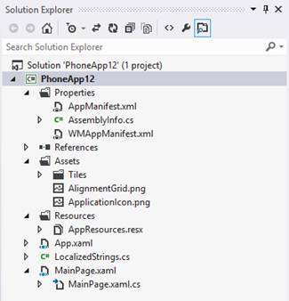
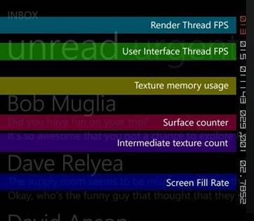

## 镇上有一个新来的孩子

毫无疑问，智能手机和平板电脑是消费市场的王者。传统计算机不会很快消失，尤其是在商业世界，但在许多情况下，移动设备已经用基于触摸和自然界面的更现代、更直观的方法取代了旧的“鼠标和键盘”方法。当然，苹果的 iPhone 是迫使所有其他公司重新思考移动体验的产品:首先是新的手机概念，其次是应用和应用商店的想法。如今，选择新手机的关键考虑因素之一是应用程序的可用性和质量，而不仅仅是平台提供的功能。开发者在其中扮演着重要的角色。

微软加入派对可能有点晚，但它是以一种全新的方式加入的。当微软意识到这款手机对于开始习惯 iPhone 或安卓设备的消费者来说不是一款有吸引力的产品时，它正在开发 Windows Mobile 7。所以它的开发者放弃了这个项目，从头开始构建一个全新的平台:Windows Phone 7。结果与其他竞争对手真的不同:一个新的用户界面，基于一种叫做微软设计风格(曾经被称为 Metro)的平面设计风格；以及与社交网络和所有微软服务(如 Office、SkyDrive 和 Xbox)的深度集成。

当前版本的平台(本书会涉及)是 Windows Phone 8；中间，微软发布了一个名为 Windows Phone 7.5 的更新，增加了许多新的消费者功能，但最重要的是，通过增加许多新的 API，改善了开发人员的体验。

Windows Phone 8 对该平台来说是一个全新的开始:微软放弃了 Windows Phone 7 中使用的旧技术堆栈(Windows Mobile 内核、Silverlight、XNA)，转而采用 Windows 8 中引入的新功能，如新内核、Windows Runtime 和本机代码(C++)支持。

因此，Windows Phone 8 不能作为旧 Windows Phone 7 设备的更新。为了帮助用户过渡，微软发布了一个名为 Windows Phone 7.8 的中间更新，将一些新的 Windows Phone 8 功能(如新的 Tile 格式)移植到旧设备上。

自 Windows Phone 8 发布以来，微软已经发布了三个更新:

*   更新 1(或 GDR1)，在 Internet Explorer、Wi-Fi 连接和消息传递体验方面增加了一些改进。
*   更新 2(或 GDR2)改进了对谷歌账户、Xbox Music 和 Skype 的支持，增加了调频广播支持，并扩展了数据感知应用程序的可用性，以跟踪数据流量
*   更新 3(或 GDR3)，增加了对新分辨率(1080p)、驾驶模式、屏幕锁定方向和更好的存储管理的支持，并改进了蓝牙和 Wi-Fi 堆栈

## 硬件

谈论硬件很重要，因为它与开发经验和开发应用程序时可以使用的功能密切相关。借助视窗手机，微软引入了一种混合了苹果和谷歌的方法。

和安卓一样，Windows Phone 可以在多种设备上运行，具有不同的外形和硬件功能。然而，微软已经定义了一套硬件指南，所有制造商都需要遵循这些指南来构建一个 Windows Phone 设备。此外，供应商不能定制用户界面或操作系统；所有的手机，无论生产商是谁，都提供同样熟悉的用户体验。

通过这种方式，Windows Phone 可以两全其美:广泛的设备意味着更多的机会，因为 Windows Phone 可以在廉价和小型设备上运行良好，就像它在高分辨率、功能强大的手机上运行良好一样。相反，一个更可控的硬件让开发者的生活变得更容易，因为他们可以随时依靠传感器或全球定位系统等功能。

以下是 Windows Phone 8 设备的主要功能:

*   多核处理器支持(双核和四核处理器)。
*   至少 512 兆内存(高端设备通常为 1 GB 或 2 GB)。
*   至少 4 GB 的存储空间(可使用微型 SD 扩展)。
*   相机。
*   可选运动传感器(加速度计、陀螺仪、指南针)。
*   接近传感器，可选。
*   无线网络和 3G 连接。
*   全球定位系统。
*   支持四种分辨率:**WVGA**(480×800)**WXGA**(768×1280)**720 p**(720×1280)**1080 p**(1080×1920)。
*   三个硬件按钮:后退、开始和搜索。

## Windows 运行时

视窗运行时是微软在视窗 8 中引入的新的应用编程接口层，它是开发应用程序的新的和更现代的方法的基础。事实上，与。NET 框架，它是一个原生层，这意味着更好的性能。此外，它支持广泛的应用编程接口，涵盖了近年来推出的许多新场景:地理定位、运动传感器、NFC 等。最后，它非常适合异步和多线程场景，这是移动应用程序的关键需求之一；无论应用程序执行哪种操作，用户界面都需要始终响应。

在操作系统的掩护下，微软推出了 **Windows Phone Runtime** 。与最初的 Windows Runtime 相比，它缺少一些功能(具体来说，所有在手机上没有太大意义的 API，比如打印 API)，但它增加了几个特定于平台的新功能(比如 hub 集成、联系人和约会访问等)。).

微软在 Windows Phone 8 开发过程中面临一个挑战:Windows Phone Store 上已经发布了大量基于 Silverlight 和 XNA 等“旧”技术的应用程序。为了避免迫使开发人员从头开始编写应用程序，微软引入了三个特性:

*   XAML 堆栈已经直接从 Windows Phone 7 移植，而不是从 Windows 8 移植。这意味着 XAML 仍然是托管的，而不是本地的，但是它与之前的版本完全一致，因此，例如，像行为这样仅在 Windows 8.1 中添加了支持的功能仍然可用)。这样，您将能够重用为 Windows Phone 7 应用程序编写的所有 XAML 程序，而无需对其进行更改或修复。
*   得益于名为**怪癖模式**的功能，为 Windows Phone 7 编写的应用程序能够在 Windows Phone 8 设备上运行，在大多数情况下无需应用任何更改。该模式能够将 Windows Phone 7 应用编程接口调用转换为相关的 Windows 运行时调用。
*   Windows Phone Runtime 包含一个名为**的层。NET，它是 Windows Phone 7 中可用的 API 的子集。由于这一层，您将能够在 Windows Phone 8 应用程序中使用旧的应用程序接口，即使它们已经被 Windows Runtime 中的新应用程序接口所取代。这样，您将能够将旧应用程序迁移到新平台，而不必重写所有代码。**

与完整的 Windows Runtime 一样，Windows Phone 8 增加了对作为编程语言的 **C++** 的支持，而 **WinJS 层**则缺失了，后者是一个允许开发人员使用 HTML 和 JavaScript 创建 Windows Store 应用程序的库。如果你想使用网络技术开发视窗手机应用程序，你必须依赖`WebBrowser`控件(它在应用程序中嵌入了一个网络视图)，并利用像 PhoneGap 这样的框架提供的功能。

这本书将涵盖使用 C#作为编程语言和 XAML 作为用户界面语言的开发。我们不会谈论 C++或 VB.NET(可用的 API 是相同的，所以很容易重用通过阅读这本书获得的知识)。

另外，由于这本书是关于 Windows Phone 8 的，我将只介绍 Windows 运行时 API。在重复应用编程接口的区域(这意味着同时有窗口运行时和。NET 来完成同样的任务，比如存储或传感器)，我将只介绍 Windows 运行时的。

## 开发工具

开发 Windows Phone 应用的官方平台是 **Visual Studio 2012** ，不过 Visual Studio 2013 商业版也增加了支持。主要区别在于，虽然 Visual Studio 2012 仍然允许您打开和创建 Windows Phone 7 项目，但 Visual Studio 2013 只能用于开发 Windows Phone 8 应用程序。

当我们谈论 Windows Phone 开发时，这两个版本之间没有区别:由于 SDK 是相同的，所以您将在两个环境中获得相同的功能，因此我们将使用 Visual Studio 2012 作为本书的参考。

首先，你需要从官方开发者门户网站[http://dev.windowsphone.com](http://dev.windowsphone.com)下载 Windows Phone 8 SDK。此下载适用于新开发人员和已经拥有 Visual Studio 2012 商业版的微软开发人员。如果您尚未安装 Visual Studio，安装程序将安装免费的快速版本；否则，它将简单地安装 SDK 和模拟器，并将它们添加到您现有的 Visual Studio 安装中。

该设置还将为 Windows Phone 安装**Blend**，这是微软专门为设计师制作的工具。这是一个 XAML 可视化编辑器，可以更容易地为 Windows Phone 应用程序创建用户界面。如果你是一名开发人员，你可能会花大部分时间在 Visual Studio 编辑器中手动编写 XAML，但是当涉及到更复杂的事情，比如创建动画或管理控件的视觉状态时，它可能是一个有效的伴侣。

要安装 Windows Phone 8 SDK，您需要一台带有 **Windows 8 Pro** 或 **Windows 8 Enterprise 64 位**的电脑。这是必需的，因为模拟器是基于 **Hyper-V** ，这是微软的虚拟化技术，只有在专业版本的 Windows 中可用。此外，还有一个硬件要求:您的 CPU 需要支持二级地址转换( **SLAT** )，这是 Hyper-V 正常运行所需的 CPU 功能。如果你有一台更新的电脑，你不必担心；基本上所有架构都来自英特尔 i5 并进一步支持它。否则，您仍然可以安装和使用软件开发工具包，但是您需要一个真正的设备来进行测试和调试。

您可以使用一个名为[机器板条状态检查](https://slatstatuscheck.codeplex.com/)的免费工具来确定您的中央处理器是否满足板条要求。

## 仿真器

在提交到 Windows Phone Store 之前，需要在设备上测试和调试 Windows Phone 应用程序；只有在真正的手机上，您才能测试应用程序的真实性能。在日常开发过程中，使用该设备会让您变慢。这就是模拟器有用的时候，尤其是因为你可以很容易地测试不同的条件(比如不同的分辨率、连接的丢失等)。).

模拟器是一个由 Hyper-V 驱动的虚拟机，能够与您计算机的硬件进行交互。如果有触摸显示器，可以模拟手机触摸屏；如果有麦克风，可以模拟手机麦克风等。此外，模拟器还附带了一组附加工具，有助于测试一些需要物理设备的场景，例如使用加速度计或全球定位系统传感器。

您将能够直接从 Visual Studio 启动模拟器。模拟器有不同的版本，以匹配市场上可用的不同分辨率和内存大小。

## 开发者体验

Windows Phone 应用程序发布在 Windows Phone Store 上，这是开发人员分发其应用程序的主要方式。然而，有两个例外:出于测试目的的企业公司和开发人员。

要开始发布应用程序，您需要一个开发人员帐户，可以从官方门户网站[http://dev.windowsphone.com](http://dev.windowsphone.com)购买。费用为每年 19 美元，允许您发布无限数量的付费应用和最多 100 个免费应用。最近，微软合并了两个主要平台的开发者体验。这意味着，使用开发人员帐户，您还可以在 Windows 商店上发布 Windows 8 的 Windows 商店应用程序。

开发人员帐户也与测试相关联。事实上，默认情况下，手机是锁定的，安装第三方应用的唯一方法是通过 Windows Phone Store。所有开发者都可以免费解锁手机，即使没有付费账号；不同的是，使用免费账户，只能解锁一部手机，手机上只能加载两个应用程序。使用付费账户，开发者最多可以解锁三部手机，每部手机最多可以加载 10 个应用程序。

应用程序部署可以直接从 Visual Studio 执行，也可以使用安装了名为**应用程序部署**的软件开发工具包的工具执行。

要解锁您的手机，您将需要另一个名为 **Windows Phone 开发者注册**的 SDK 附带的工具。您必须将手机连接到计算机，并使用注册开发人员帐户时使用的相同 Microsoft 帐户登录。

要在 Windows Phone Store 上发布的应用程序需要经过认证。认证过程(其中自动和手动测试都被执行)确保您的应用程序从技术角度来看是可接受的(应用程序不会崩溃，用户体验不会混乱等)。)和内容(没有色情，没有过度暴力)的观点。

我们将在这本书的最后一章介绍更多关于出版过程的细节。

## 开发者预览

微软为开发者推出了一项新计划，允许他们提前访问新的 Windows Phone 更新。通过这种方式，开发人员能够在向用户分发应用程序之前，根据最新的操作系统版本对其进行测试。

要订阅该计划，您必须:

*   拥有一部开发者解锁的手机。
*   在 App Studio([http://apps.windowsstore.com](http://apps.windowsstore.com/))上拥有付费开发者账号或免费账号，App Studio 是微软为无需编程技能即可轻松创建 Windows Phone 应用而创建的网络工具。

满足这些要求后，您可以从商店下载“开发者预览”应用程序，网址为:[https://go.microsoft.com/fwlink/p/?LinkId=324357](https://go.microsoft.com/fwlink/p/?LinkId=324357)。

安装后，您必须运行它，并通过接受条款和条件来启用预览程序。完成该过程后，预览更新将像常规更新一样交付:您必须转到**设置**页面的**更新**部分，并检查新的更新。在撰写本文时，微软正在交付带有该预览程序的 GDR3。

请记住，根据制造商的不同，安装预览版可能会破坏手机的保修。这是一个安全的程序，但如果出现问题，您的制造商可能无法支持您。

## 第一个项目

每个 Windows Phone 应用程序的起点都是 Visual Studio 2012。让我们看看如何创建一个项目，以及它是如何构建的。

第一步，打开 Visual Studio 2012，点击**新建项目**。在可用的已安装模板中，您会发现**视窗手机**部分包含所有与视窗手机开发相关的模板。

我们将使用最简单的一个， **Windows Phone 应用程序**，它只包含一个起始页。给它起个名字，点击**确定**。你会被问到你会支持哪个平台。既然我们在报道 Windows Phone 8 的开发，那就选择 **Windows Phone 8.0** 。设计者将自动加载起始页，在**解决方案资源管理器**窗口中，您将看到项目的结构。让我们详细看看:

图 1:标准视窗电话项目的结构

### App.xaml

**App.xaml** 文件是每个 Windows Phone 应用程序的起点:它负责初始化应用程序和将包含页面的框架。此外，由于**应用程序**类的一个实例(在**应用程序. xaml.cs** 文件中定义)在应用程序执行期间始终保持活动状态，因此它还用于定义所有全局设置。例如，您可以截取我们将在[第 3 章](03.html#_Chapter_3_Core)中介绍的生命周期事件，或者您可以定义将在应用程序中使用的全局 XAML 风格和资源。

### 首页

这是应用程序初始化后启动的主页面。这是项目中包含的默认页面，但是您可以在项目中添加任意多的页面。每一页都有相同的结构:它由一个扩展名为**的文件组成。定义用户界面的 xaml** ，以及扩展名为**的文件。cs** ，这是后面的**代码，定义了与用户界面交互的逻辑。每个页面都继承自一个名为 **PhoneApplicationPage** 的类，该类为与页面生命周期相关的属性和事件提供内置支持，例如导航事件、方向、系统托盘管理等。**

### 资产

**资产**文件夹包含应用程序的图形资产。标准项目包括一些默认图标和图像，用于不同的图块大小和模板。

### 资源

**资源**文件夹包含管理本地化所需的所有文件。默认情况下，您只会找到一个名为 **AppResources.resx** 的文件，其中包含基本语言(通常是英语，但您可以选择另一种)。通过添加一个新的 AppResources 文件，将支持所有其他语言。 **LocalizedStrings.cs** 文件默认添加在项目的根目录下，我们将使用这个类来管理本地化。我们将在[第 10 章](10.html#_Chapter_10_Distributing)中对此进行更深入的讨论。

### 清单文件

在**属性**文件夹中，你会发现一个名为**的文件。这是一份非常重要的文件。它被称为清单，因为它被用来声明应用程序的所有功能和特性。其作用在认证过程中至关重要；由于有了这个文件，自动过程能够提取应用程序所需的所有信息，比如它的标题、支持的分辨率、使用的功能等。**

Visual Studio 2012 为清单文件提供了可视化编辑器；只需双击文件将其打开。需要注意的是，可视化编辑器并不支持所有的用例场景。有时我们必须手动编辑 XML 来扩展我们的应用程序。

编辑器分为四个不同的部分:

*   **应用 UI** :搭载了应用一旦安装到手机上外观的所有信息，比如标题、支持的分辨率、模板以及用作主 Tile 的标准图片。
*   **功能**:列出应用程序可以使用的所有硬件和软件功能，如摄像头、地理定位服务、联网等。在大多数情况下，使用尚未声明特定功能的功能会导致应用程序执行时出现异常。在这本书里，我会记下每次我们使用一个需要特定功能的特性。
*   **要求**:列出你的应用可以使用的具体硬件功能，比如摄像头或者 NFC。如果你设置了要求，拥有没有这些特定硬件功能的手机的人将无法下载该应用程序。
*   **打包**:定义将要在商店发布的包的特性，比如作者、发布者、默认语言和支持的语言。

### 闪屏

如果你已经为 Windows Phone 7 开发了应用程序，你应该对闪屏很熟悉。这是一个静态图像，当应用程序打开时会立即显示，当应用程序完全加载并准备使用时会消失。

闪屏是 Windows Phone 7 项目的标准 Visual Studio 模板的一部分，但在 Windows Phone 8 项目中已被删除。由于 Windows Runtime 中引入的性能改进，应用程序现在启动得更快，因此通常不需要启动屏幕。

如果您确实需要一个闪屏，您将不得不按照特定的命名约定手动将其添加到项目中:它必须是 JPG 格式，文件名必须是**SplashScreenImage.jpg**，并且所需的分辨率是 **768 × 1280** 。这样，图像将自动适应设备的分辨率。如果您想要完全控制设备的分辨率，可以添加三种不同的图像，每种图像对应一种支持的分辨率。在这种情况下，要遵循的命名约定是:

*   **SplashScreenImage.screen-WVGA.jpg**为 480 × 800 设备。
*   **SplashScreenImage.screen-WXGA.jpg**为 768 × 1280 设备。
*   **SplashScreenImage.screen-720p.jpg**为 720 × 1280 设备。

从长宽比的角度来看，1080p 分辨率的表现类似于 720p:如果您的应用程序是在 1080p 设备上启动的，那么将使用 720p 闪屏(如果有的话)。

## 测试应用程序

当您准备好测试您的应用程序时，您可以直接从 Visual Studio 将其部署在设备或模拟器中。在工具栏区域，您会发现一个看起来像播放按钮的东西，以及一个部署目标的描述。您可以在五个不同的目标之间进行选择:一个真实设备、两个版本的 WVGA 仿真器(一个具有 512 MB 内存，一个具有 1 GB 内存)、一个 WXGA 仿真器和一个 720p 仿真器。有时，列表可能会更长，因为微软会定期发布 SDK 更新，以添加与操作系统新版本相匹配的新模拟器。例如，微软已经发布了一个 SDK 更新，添加了与 GDR2 版本一致的模拟器映像。

图 2:使用默认软件开发工具包调试 Windows Phone 应用程序的选项

当应用程序在调试模式下运行时，会自动启用两个功能来帮助您工作:

*   屏幕右侧显示性能计数器，如每秒帧数或内存使用情况。它们将帮助您识别应用程序的潜在性能问题(有关更多详细信息，请参见图 3)。
*   手机或模拟器永远不会被挂起-在不使用后关闭屏幕的“自动锁定”功能通常在设备上启用，但在调试模式下，该功能被禁用。

图 3:调试模式下可用的各种计数器

## 快速回顾一下

在第一章中，我们已经开始熟悉每个 Windows Phone 开发人员都应该熟悉的一些重要概念:

*   我们已经了解了开发人员可以利用的平台的主要软件和硬件功能。
*   我们讨论了 Windows 运行时，它是最新微软技术的核心，比如 Windows 8 和 Windows Phone 8。
*   我们已经看到了如何开始使用 Windows Phone:下载和安装哪些工具，如何创建第一个项目，以及 Windows Phone 应用程序的结构。