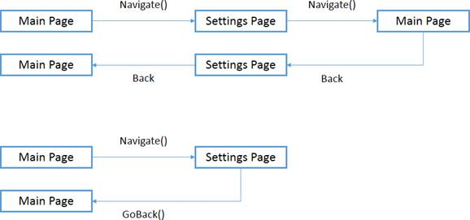

# 三、核心概念

## 异步编程

如今，异步编程是开发人员的必备技能。在过去，大多数应用使用同步方法工作:用户启动一个操作，在操作完成之前，应用被冻结并且完全不可用。

这种行为在今天是不可接受的，尤其是在移动世界。用户不会购买一部不允许他们接听电话的手机，因为一个应用在试图完成一项操作时被卡住了。

在 Windows Phone 中有两种方法来管理异步编程:**回调**和**异步/等待**模式。

### 回调

在大多数情况下，尤其是在 Windows Phone 8 中，回调已经被使用异步和等待模式的异步方法所取代。然而，有一些 API 仍然使用回调方法，所以学习它很重要。

回调是在异步操作终止时调用的委托方法。这意味着触发操作的代码和管理结果的代码存储在两个不同的方法中。

让我们看看下面的`WebClient`类的例子，它是框架的基本 API 之一，执行下载和上传文件等网络操作:

```cs
    private void OnStartDownloadClicked(object sender, RoutedEventArgs e)
    {
        WebClient client = new WebClient();
        client.DownloadStringCompleted += new DownloadStringCompletedEventHandler(client_DownloadStringCompleted);
        client.DownloadStringAsync(new Uri("http://wp.qmatteoq.com", UriKind.Absolute));
        Debug.WriteLine("Download has started");
    }

    void client_DownloadStringCompleted(object sender, DownloadStringCompletedEventArgs e)
    {
        MessageBox.Show(e.Result);
    }

```

当我们调用`DownloadStringAsync()`方法时，文件下载(在这种情况下，我们正在下载网页的 HTML)开始，但是我们需要订阅`DownloadStringCompleted`事件，该事件在下载完成时被触发，以管理结果。通常，事件处理程序(回调方法)有一个包含请求结果的参数。在前面的例子中，它被称为`e`，它的类型是`DownloadStringCompletedEventArgs`。

注意在 Visual Studio **输出**窗口中写的消息“下载已经开始”。由于该方法是异步的，下载开始后将立即显示消息，因为代码将继续运行，直到下载完成。然后，执行转移到回调方法。

### 异步并等待

回调方法很难理解。与同步代码不同，执行流程从一个方法“跳转”到另一个方法，因此开发人员不能简单地一行一行地阅读以了解发生了什么。此外，如果您需要编写一个自定义方法来启动网络操作并返回下载的文件，您根本无法做到这一点，因为逻辑被分成了两个不同的部分。

在 C# 5.0 中引入了异步和等待模式来解决这些问题。视窗运行时主要基于这种方法，我们将在本书中看到的大多数应用编程接口都使用这种方法。

当我们使用`async`和`await`关键字时，我们将编写顺序代码，就好像它是同步的一样——编译器将一行接一行地执行。为了更好地理解幕后发生的事情，请记住，当我们启动异步操作时，编译器会设置一个书签，然后退出该方法。这样，用户界面线程是免费的，用户可以继续与应用交互。当异步操作完成时，编译器返回书签并继续执行。

异步和等待模式基于`Task`类，这是异步方法的基本返回类型。方法可以返回:

*   `Task`如果是`void`方法:编译器应该等待操作完成再执行下一行，但不期望有值返回。
*   `Task<T>`如果方法返回值。编译器将等待操作完成，并将结果(类型为`T`)返回给主方法，主方法将能够对其执行额外的操作。

我们来看一个例子。我们将为我们的项目添加一个名为 **异步的库。NET** ，由微软开发，可在 [NuGet](http://nuget.org/packages/Microsoft.Bcl.Async/) 上获得。它的目的是添加异步并等待对不支持它的旧技术的支持，因为它们不是基于 C# 5.0 的，比如 Windows Phone 7 或 Silverlight。它在 Windows Phone 8 应用中也很有用，因为它向仍然基于回调模式的 API 添加了异步方法。

其中一个 API 就是我们之前看到的`WebClient`类。通过安装这个库，我们可以使用支持新模式的`DownloadStringTaskAsync()`方法。这个方法的返回类型是`Task<string>`。这意味着操作是异步的，它将返回一个字符串。

```cs
    private async void OnStartDownloadClicked(object sender, RoutedEventArgs e)
    {
        WebClient client = new WebClient();
        string result = await client.DownloadStringTaskAsync("http://wp.qmatteoq.com");
        MessageBox.Show(result);
    }

```

首先，让我们注意如何使用这个新语法。任何包含异步方法的方法都必须用`async`关键字标记。在这种情况下，当用户按下按钮时调用的是一个事件处理程序。

接下来，我们需要添加`await`关键字作为异步方法的前缀。在我们的例子中，我们将其放在方法`DownloadStringTaskAsync()`之前。这个关键字告诉编译器等到方法完成后再继续。

当异步方法启动时，您可以假设编译器已经设置了书签，然后退出该方法，因为应用仍然有响应。下载完成后，编译器返回书签并继续执行。下载结果存储在`result`变量中，该变量的值使用`MessageBox`显示在屏幕上。

如您所见，即使引擎盖下的代码是异步的，并且没有冻结 UI，它看起来也是同步的:代码一次执行一行，`MessageBox`直到`DownloadStringTaskAsync()`方法完成其工作后才会显示。

### 调度员

有时，尤其是当您必须处理回调方法时，操作是在后台线程中执行的，这与管理用户界面的线程不同。这种方法非常有助于保持 UI 线程尽可能自由，以便界面总是快速和响应的。

有时后台线程可能需要与用户界面交互。例如，假设一个后台线程已经完成了它的工作，需要在页面中放置的`TextBlock`控件中显示结果。如果您尝试这样做，将显示一条`UnauthorizedAccessException`错误消息“无效跨线程访问”。

出现此错误的原因是不允许后台线程访问页面中的控件，因为它们由不同的线程管理。解决方案是使用框架的`Dispatcher`类。它的目的是从另一个线程向 UI 线程分派操作。这样，您就可以毫无问题地与 XAML 控件交互，因为线程是相同的。下面的示例说明了如何使用它:

```cs
    Dispatcher.BeginInvoke(() =>
    {
        txtResult.Text = "This is the result";
    })

```

您只需将需要在 UI 线程上执行的`Action`作为`Dispatcher`类的`BeginInvoke()`方法的参数。在前面的示例中，`Action`是使用**匿名方法**定义的。

|  | 提示:匿名方法之所以这样叫，是因为它们没有特定的名称——它们只是定义了要执行的操作。 |

当您使用异步和等待模式时，不需要`Dispatcher`，因为它确保即使操作在线程池中可用的空闲线程之一中执行，结果也总是在用户界面线程中返回。

## 导航

开发 Windows Phone 应用时需要学习的另一个重要概念是导航。在大多数情况下，您的应用将由不同的页面组成，因此您需要一种从一个页面移动到另一个页面的方法。

该框架提供了一个内置的导航系统，可以使用`NavigationService`类进行管理。

导航到页面很容易。只需调用`Navigate()`方法，传递一个`Uri`，作为它的参数，T1 是从项目根开始的页面路径。

```cs
    private void OnGoToPage2Clicked(object sender, RoutedEventArgs e)
    {
        NavigationService.Navigate(new Uri("/Pages/Page2.xaml", UriKind.Relative));
    }

```

导航系统在每一页提供两个可以管理拦截导航事件的事件:`OnNavigatedTo()`从另一页移动到当前页时触发；当您从当前页面移动到另一个页面时，会触发`OnNavigateFrom()`。另一个可以订阅的重要页面事件是`Loaded`，该事件在页面完全加载时触发。它通常用于加载需要在页面上显示的数据。

```cs
    public partial class MainPage : PhoneApplicationPage
    {
        public MainPage()
        {
            InitializeComponent();
            Loaded += MainPage_Loaded;
        }

        void MainPage_Loaded(object sender, RoutedEventArgs e)
        {
           Debug.WriteLine("Page is loaded");
        }

        protected override void OnNavigatedTo(NavigationEventArgs e)
        {
           base.OnNavigatedTo(e);
        }

        protected override void OnNavigatedFrom(NavigationEventArgs e)
        {
           base.OnNavigatedFrom(e);
        }
    }

```

### 将参数传递到另一个页面

处理导航时的一个常见要求是将参数传递给另一个页面，例如，在主/详细方案中，您在母版页中选择一个列表项，并在新页面中显示其详细信息。

导航框架提供了一种传递简单参数(如字符串和数字)的内置方式，该方式直接从 web 世界继承而来:查询字符串参数。它们被直接添加到您想要重定向用户的页面的 URL，如以下示例所示:

```cs
    private void OnGoToPage2Clicked(object sender, RoutedEventArgs e)
    {
        NavigationService.Navigate(new Uri("/Pages/Page2.xaml?id=1", UriKind.Relative));
    }

```

您将能够通过使用`OnNavigatedTo`事件和`NavigationContext`类来检索登录页面中的参数，如下例所示:

```cs
    protected override void OnNavigatedTo(NavigationEventArgs e)
    {
        if (NavigationContext.QueryString.ContainsKey("id"))
        {
           int id = int.Parse(NavigationContext.QueryString["id"]);
           MessageBox.Show("The id is " + id);
        }
    }

```

`NavigationContext`类提供了一个名为`QueryString`的集合，其中包含了所有可用的参数。您将能够通过使用它的键(这是参数的名称)来获取该值。

在某些情况下，简单的参数是不够的。有时您需要将复杂的对象传递到另一个页面。主/细节场景也是一个很好的例子。在许多情况下，要正确填充详细信息页面，您需要访问列表中选择的整个对象。一个很好的方法是向详细信息页面传递一个简单的参数，它可以用来识别所选的项目，比如一个唯一的标识符。然后，在详细信息页面的`OnNavigatedTo`事件处理程序中，使用从您的数据集合(可以是数据库或远程服务)接收的标识符加载项目。

### 操纵导航堆栈

每个应用都有自己的导航堆栈，这是用户在使用应用时浏览过的页面列表。每当用户导航到一个新页面时，它就会被添加到堆栈中。当用户返回时，栈中的最后一页被移除。当堆栈中剩下一页并且用户按下后退按钮时，应用关闭。

`NavigationService`类提供了一些操作堆栈的方法。一开始，有一个名为`BackStack`的特定属性，它是堆栈中所有页面的集合。当我们在本章后面讨论快速应用恢复时，我们将看到一个可用的方法来操作堆栈:`RemoveBackEntry()`，它从堆栈中移除最后一页。

另一个重要的方法是`GoBack()`，它将用户重定向到堆栈中的上一页。其目的是避免在应用中产生循环导航问题。

图 16 展示了一个循环导航的例子以及如何纠正它。假设您有一个由两个页面组成的应用，一个主页面和一个设置页面。每次导航都选择使用`NavigateService`类的`Navigate()`方法。用户从主页导航到设置页面，然后再次导航到主页。这里的问题是，每次您调用`Navigate()`方法时，您都会向导航堆栈添加一个新页面。当用户在主页上并按下后退按钮时，他或她希望退出应用。相反，第二次，用户将被重定向到设置页面，因为之前的导航将该页面添加到堆栈中。

正确的做法是使用`GoBack()`法。这个方法不是向堆栈中添加新页面，而是简单地将用户重定向到上一个页面。结果将是一样的——用户从设置页面返回到主页面——但是由于没有页面添加到堆栈中，应用将按预期运行。如果用户按下后退按钮，应用将关闭。



图 16:循环导航(上)和正确导航(下)

### 拦截导航:UriMapper 类

在本书的后面，我们将讨论应用用特殊的`Uri`打开的不同情况，例如使用语音应用编程接口或数据共享(我们将在[第 7 章](07.html#_Chapter_7_)中讨论)。

在这些情况下，我们将使用一个名为`UriMapper`的导航特性，这是一个可以在每个导航操作中充当中间人的类。当用户从一个页面导航到另一个页面时(起始页面也可以是手机的主屏幕)，如果需要，类能够拦截它并将用户重定向到另一个页面。

要创建基于`UriMapper`的类，只需在项目中添加一个新类。它必须从`UriMapperBase`类继承。它将要求您实现`MapUri()`方法，该方法在导航期间被调用，如下例所示:

```cs
    public class UriMapper: UriMapperBase
    {
        public override Uri MapUri(Uri uri)
        {
           string tempUri = HttpUtility.UrlDecode(uri.ToString());
           if (tempUri.Contains("/FileTypeAssociation"))
            {
                //Manage the selected file.
                return new Uri("/Pages/FilePage.xaml", UriKind.Relative);
            }
           else
            {
                return uri;
            }
        }
    }

```

`MapUri()`方式取源`Uri`需要返回新的`Uri`重定向用户。在前面的示例中，我们检查了源`Uri`是否包含特定的字符串(在本例中，它属于我们将在第 7 章中看到的数据共享场景)。在肯定的情况下，我们将用户重定向到能够管理场景的应用的特定页面；否则，我们不会通过返回原`Uri`来改变导航流程。

在你创建了一个`UriMapper`类之后，你必须把它分配给在 **App.xaml.cs** 文件中声明的`RootFrame`对象的`UriMapper`属性。您必须扩展名为`Phone application initialization`的区域(通常是折叠的)，并更改`InitializePhoneApplication()`方法，如下例所示:

```cs
    private void InitializePhoneApplication()
    {
        if (phoneApplicationInitialized)
           return;

        // Create the frame but don't set it as RootVisual yet; this allows the
        // splash screen to remain active until the application is ready to render.
        RootFrame = new PhoneApplicationFrame();
        RootFrame.UriMapper = new UriMapper();
        RootFrame.Navigated += CompleteInitializePhoneApplication;

        // Handle navigation failures.
        RootFrame.NavigationFailed += RootFrame_NavigationFailed;

        // Handle reset requests for clearing the backstack.
        RootFrame.Navigated += CheckForResetNavigation;

        // Ensure we don't initialize again.
        phoneApplicationInitialized = true;
    }

```

## 应用生命周期

移动应用的生命周期与传统桌面应用不同，因为它们的需求不同，如电源管理和性能优化。您在 Windows 中体验到的传统多任务处理方法不太适合移动体验:必要的电量会很快耗尽电池。此外，如果您打开太多应用，您可能会遇到严重的性能问题，这会降低用户体验。

下图说明了微软为 Windows Phone 应用引入的生命周期，以满足所需的条件:


图 17:应用生命周期

当应用正在运行时，它可以随时挂起。例如，用户可以按下“开始”按钮或点击通知来打开另一个应用。在这种情况下，应用被“冻结”(休眠的**状态)；它保留在内存中，但是所有正在运行的线程和操作都将停止。在这种状态下，应用正在使用系统内存，但 CPU 是空闲的。这样，其他应用可以使用可用资源，而不会遇到性能问题。**

 **当用户决定返回应用时(通过使用后退按钮或任务切换器)，它的实例从内存中恢复，并且先前的线程和操作被重新启动。

如果用户长时间使用他们的设备，可能会打开太多的应用，并且没有足够的内存来保持其他应用挂起。在这种情况下，操作系统可以开始“杀死”运行时间较长的应用，为新打开的应用释放一些内存——旧的应用会被移动到**墓碑**状态。为了给用户带来与应用简单暂停时相同的流畅体验，开发人员有能力在应用被墓碑化时保存其状态，并在以后恢复它。当用户打开一个有墓碑的应用时，他们会发现应用完全处于以前的状态，就好像它从未关闭过一样。

墓碑体验是 Windows Phone 7 中唯一可用的体验，但它通常会导致糟糕的用户体验。由于应用被终止，应用总是需要从头开始，导致加载时间更长。在 Windows Phone 7.5 中，微软引入了**快速应用切换**的概念，这个概念已经被转化为当前的生命周期，应用被置于休眠状态，只有在需要的时候才会被杀死。

基于这些信息，我们可以理解应用不能在后台运行——当一个应用被挂起时，它所有正在运行的操作都会被取消。在[第 9 章](09.html#_Chapter_9_)中，我们将查看即使在应用没有运行时也能执行一些操作的可用技术。

作为开发人员，当应用被墓碑化时，操作系统不会通知您。这就是为什么在图 17 所示的模式中，您可以看到每次应用挂起时都会执行保存状态操作。你将永远不得不处理它，因为你不会提前知道你的应用是否会被墓碑。

相反，仅当应用已被墓碑化时，才会执行恢复操作。当应用处于休眠状态时，整个过程都存储在内存中，因此应用恢复时不会有数据丢失。

因为墓碑不是确定性的，所以 Visual Studio 提供了一种测试它的方法。默认情况下，应用在挂起时会进入休眠状态。您可以通过右键单击项目并选择**属性**来更改此行为。在**调试**部分，您将在调试选项时发现停用的**墓碑。当它被选中时，应用在挂起时将总是被墓碑化，因此您可以测试在这种情况下一切正常并且没有数据丢失。**

### 控制生命周期

您可以通过`PhoneApplicationService`类来控制应用的生命周期，该类在 **App.xaml** 文件中声明为一个生存期对象。

```cs
    <Application.ApplicationLifetimeObjects>
        <shell:PhoneApplicationService
           Launching="Application_Launching" Closing="Application_Closing"
           Activated="Application_Activated" Deactivated="Application_Deactivated"/>
    </Application.ApplicationLifetimeObjects>

```

如您所见，`PhoneApplicationService`类被注册来管理四个不同的事件，这些事件在 **App.xaml.cs** 文件中可用:

*   `Application_Launching`在 app 首次启动时调用。
*   当应用完全关闭时，会调用`Application_Closing`。它只在用户按下应用主页中的后退按钮时发生。
*   当应用从暂停状态恢复时，调用`Application_Activated`。
*   当应用暂停时，调用`Application_Deactivated`。

还记得图 17 中的“保存状态”和“恢复状态”操作吗？通常，他们在这些事件中被管理。当`Application_Deactivated`事件发生时状态被保存，当`Application_Activated`事件发生时状态被恢复。

具体来说，`Application_Activated`事件处理程序的一个参数包含重要信息——它显示应用是来自休眠状态还是墓碑状态，如下例所示:

```cs
    private void Application_Activated(object sender, ActivatedEventArgs e)
    {
        if (e.IsApplicationInstancePreserved)
        {
           Debug.WriteLine("The app was dormant");
        }
        else
        {
           Debug.WriteLine("The app was tombstoned");
        }
    }

```

关键是`ActivatedEventArgs`对象的`IsApplicationInstancePreserved`属性，是一个布尔值。如果是真的，则该应用处于休眠状态；否则，它就被杀死了，是时候恢复我们之前保存的数据了。

`PhoneApplicationService`类也可以用来存储应用挂起时的状态。事实上，它提供了一个名为`State`的属性，这是一个类型为`Dictionary<string, object>`的集合。它可用于保存由密钥标识的任何对象。

通常，当应用暂停时，您将在`State`属性中保存数据，当应用从墓碑状态恢复时，您将恢复数据。

然而，有一些重要的事情要记住:

*   最好尽快保存数据，不要只在`Application_Deactivated`事件发生时保存。意外的错误或其他错误会导致用户在执行过程中丢失数据。
*   `State`属性的内容只有在 app 恢复时才会保存在内存中；如果用户决定从头开始打开应用(例如，通过轻按其“平铺”而不是使用“后退”按钮)，收藏将被擦除，保存的数据将丢失。如果需要在多次执行中保存数据，最好保存到本地存储，我们将在[第 4 章](04.html#_Chapter_4_)中介绍。

### 快速应用恢复

前面描述的生命周期有一个缺陷:用户只能通过使用后退按钮或任务切换器来恢复挂起的应用。如果他们在“开始”屏幕上为应用锁定一个图块并点击它，应用的新实例将被打开，暂停的应用将被终止。

Windows Phone 8 引入了名为**快速 App Resume** 的新功能，可以激活该功能来解决之前描述的缺陷。不管开始点是什么，如果有一个挂起的实例，它将一直被使用。

支持快速应用恢复需要一些工作，因为默认情况下，Windows Phone 模板使用旧的生命周期，即使该功能已激活。

第一步是修改清单文件，不幸的是，这是可视化编辑器没有帮助的情况之一。事实上，我们需要手动编辑文件。为此，只需右键单击**属性**文件夹中的**文件，并选择**查看代码**选项。**

您会发现一个名为`DefaultTask`的节点，它告诉应用在应用启动时首先加载哪个页面。您需要添加一个名为`ActivationPolicy`的属性来将其值设置为`Resume`，如下例所示:

```cs
    <Tasks>
       <DefaultTask Name ="_default" NavigationPage="MainPage.xaml" ActivationPolicy="Resume" />
    </Tasks>

```

当用户点击应用的主磁贴并启用快速应用恢复时会发生什么？操作系统会触发两个导航:第一个是指向应用中最后打开的页面，第二个是指向应用的主页面，因为应用 Tile 是通过默认导航 Uri 与之关联的。

此时，您有两个选择:

*   你可以继续使用旧的方法。在这种情况下，您必须从后堆栈中移除最后访问的页面；否则你会破坏导航系统。事实上，当用户在应用的主页面上并按下后退按钮时，他们期望退出应用，而不是回到旧页面。
*   您可以支持快速应用简历。在这种情况下，您必须停止对主应用页面的导航，以便用户可以进入应用的最后一个访问页面。

默认的 Windows Phone 8 模板包含第一种方法的实现。打开 **App.xaml.cs** 文件，寻找一个名为`InitializePhoneApplication()`的方法，负责初始化管理各种页面和导航系统的框架。您会发现应用订阅了一个名为`RootFrame`类的`Navigated`的事件，每当用户从应用的一个页面移动到另一个页面时，该事件就会被触发。

被指定为该事件处理程序的方法称为`ClearBackafterReset()`，其定义如下:

```cs
    private void ClearBackStackAfterReset(object sender, NavigationEventArgs e)
    {
        // Unregister the event so it doesn't get called again.
        RootFrame.Navigated -= ClearBackStackAfterReset;

        // Only clear the stack for 'new' (forward) and 'refresh' navigations.
        if (e.NavigationMode != NavigationMode.New && e.NavigationMode != NavigationMode.Refresh)
           return;

        // For UI consistency, clear the entire page stack.
        while (RootFrame.RemoveBackEntry() != null)
        {
            ; // Do nothing.
        }
    }

```

这个方法和前面描述的完全一样:没有取消对主页面的导航，但是使用`RootFrame`类的`RemoveBackEntry()`方法，清理了应用的页面堆栈。

注意`NavigationMode`属性:它指定了导航的状态，就像用户导航到新页面时的`New`或者用户返回到上一页时的`Back`。管理快速应用恢复的关键状态是`Reset`，当用户导航到主应用页面但正在使用该应用的旧实例时，会设置该状态。

我们将使用`NavigationMode`属性以及对原始代码的一些更改。第一步是更改`Navigated`事件处理程序，以便在 **App.xaml.cs** 类的全局布尔属性中简单地存储`NavigationMode`是否被重置。我们将在另一个事件处理程序中使用这些信息。事实上，我们需要订阅`RootFrame`班的`Navigating`活动。该事件类似于`Navigated`事件，只是在导航开始之前触发，而不是之后。这种差异对我们的目的很重要，因为我们有机会在导航操作执行之前取消它。

下面是我们在`Navigating`事件处理程序中所做的事情:

```cs
    void RootFrame_Navigating(object sender, NavigatingCancelEventArgs e)
    {
        if (reset && e.IsCancelable && e.Uri.OriginalString == "/MainPage.xaml")
        {
            e.Cancel = true;
            reset = false;
        }
    }

```

在这种情况下，我们等待一个特定的条件发生:`NavigationMode`是`Reset`，并且触发导航到主页面。当用户点击主磁贴，并且应用的一个实例已经在内存中时，就会出现这种情况。第一个导航重定向到上次访问的页面，第二个(T2 模式)重定向到主页面。这是我们需要管理的场景。通过设置方法参数的`Cancel`属性，我们中止了对主页面的导航，并将用户留在应用的最后访问页面上。体验与用户使用后退按钮返回应用时完全相同。

以下是实现快速应用恢复所需的完整代码在 **App.xaml.cs** 文件中的外观:

```cs
    private bool reset;

    // Do not add any additional code to this method.
    private void InitializePhoneApplication()
    {
        if (phoneApplicationInitialized)
           return;

        // Create the frame but don't set it as RootVisual yet; this allows the
        // splash screen to remain active until the application is ready to render.
        RootFrame = new PhoneApplicationFrame();
        RootFrame.Navigated += CompleteInitializePhoneApplication;

        // Handle navigation failures.
        RootFrame.NavigationFailed += RootFrame_NavigationFailed;

        // Handle reset requests for clearing the backstack.
        RootFrame.Navigated += RootFrame_Navigated;

        RootFrame.Navigating += RootFrame_Navigating;

        // Ensure we don't initialize again.
        phoneApplicationInitialized = true;
    }

    void RootFrame_Navigated(object sender, NavigationEventArgs e)
    {
        reset = e.NavigationMode == NavigationMode.Reset;
    }

    void RootFrame_Navigating(object sender, NavigatingCancelEventArgs e)
    {
        if (reset && e.IsCancelable && e.Uri.OriginalString == "/MainPage.xaml")
        {
            e.Cancel = true;
            reset = false;
        }
    }

```

你可能想知道为什么需要所有这些努力来支持快速应用恢复。为什么不是由操作系统自动实现？答案是，Fast App Resume 并不适合每一个应用——当你决定支持它时，你必须非常小心，因为如果你没有很好地实现它，你可能会破坏用户体验。

例如，如果您的用户大部分时间都在您的应用(例如，社交网络应用)的主页上，他们可能更喜欢在打开应用时直接转到主页，而不是继续他们之前正在做的事情。

以下是改善快速应用简历体验的两个技巧:

*   如果您的应用有许多页面和复杂的导航层次结构，请在内页中添加一种快速返回主页的方法(如应用栏中的按钮)。
*   添加计时条件。如果最近没有使用该应用，请禁用快速应用恢复，并将用户重定向到主页。

## 管理方向

通常，Windows Phone 设备在纵向模式下使用，但在某些情况下，用户可以从横向模式中受益。例如，如果您的应用提供了一种插入长文本的方法，那么用户使用横向键盘打字会更方便。或者，在其他情况下，您可以使用横向模式为内容提供不同的布局。

默认情况下，添加到 Windows Phone 的每个新页面都以纵向模式显示，不支持横向模式。当你旋转手机时，什么都没发生。定向行为由 XAML 中`PhoneApplicationPage`节点的两个属性控制:

```cs
    <phone:PhoneApplicationPage
        x:Class="Webinar.Rest.MainPage"
        SupportedOrientations="Portrait" Orientation="Portrait">

```

*   `SupportedOrientations`属性定义页面支持哪些方向。要支持两种方向，您需要将该值设置为`PortraitOrLandscape`。
*   `Orientation`属性定义页面的默认方向。

一旦您将`SupportedOrientations`属性设置为`PortraitOrLandscape`，当手机旋转时，页面布局将自动适应横向模式。

如果您想要进一步的控制(例如，因为您想要在纵向和横向模式之间深度改变页面布局)，APIs 提供了一个名为`OrientationChanged`的页面事件，每次手机从纵向模式旋转到横向模式时都会引发该事件，反之亦然。该事件由`PhoneApplicationPage`类直接公开，因此您可以在 XAML 订阅，如下例所示:

```cs
    <phone:PhoneApplicationPage
        x:Class="Webinar.Rest.MainPage"
        SupportedOrientations="Portrait" Orientation="Portrait"
        OrientationChanged="MainPage_OnOrientationChanged">

```

将在代码中生成的事件处理程序将返回关于新方向的信息。您可以使用它来移动或更改页面中放置的控件的外观。以下示例显示了如何根据检测到的方向设置不同的`Button`控件的`Height`:

```cs
    private void MainPage_OnOrientationChanged(object sender, OrientationChangedEventArgs e)
    {
        if (e.Orientation == PageOrientation.PortraitUp || e.Orientation == PageOrientation.PortraitDown)
        {
            Button1.Height = 100;
        }
        else
        {
           if (e.Orientation == PageOrientation.LandscapeLeft || e.Orientation == PageOrientation.LandscapeRight)
            {
                Button1.Height = 500;
            }
        }
    }

```

## 快速回顾一下

如果您是 Windows Phone 开发的新手，这一章非常重要，因为我们已经学习了一些基本的核心概念，我们将在后面的章节中再次使用。

这里简单回顾一下:

*   异步编程是移动开发人员必备的知识。我们已经了解了回调和新的异步和等待模式将如何帮助您保持用户界面的快速和响应。
*   您的应用不太可能仅由一个页面组成，因此我们已经学习了如何支持不同页面之间的导航以及如何正确管理导航流。
*   应用生命周期是另一个关键概念。您必须了解一个 Windows Phone 应用是如何在幕后工作的，才能正确管理所有多任务场景。我们已经谈到了快速应用切换，这是在 Windows Phone 7.5 中引入的一项改进，旨在加快暂停和恢复过程，以及快速应用恢复，这是 Window Phone 8 的一项新功能，可改善恢复体验。**