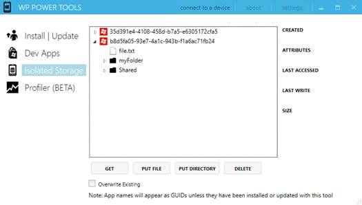

# 第四章数据访问:存储

## 本地存储

互联网在移动应用中发挥着重要作用。商店中提供的大多数 Windows Phone 应用都利用了每台设备提供的网络连接。然而，仅仅依靠网络连接可能是一个错误；用户可能会发现自己处于无法连接的情况。此外，数据计划往往是有限的，所以我们做的网络操作越少，用户体验就越好。

Windows Phone 提供了一种特殊的方式来存储本地数据，称为**隔离存储**。它的工作方式类似于普通的文件系统，因此您可以在计算机硬盘上创建文件夹和文件。不同之处在于存储是隔离的，只有您的应用可以使用它。没有其他应用可以访问您的存储，用户将手机连接到电脑时也无法看到它。此外，作为一种安全措施，隔离存储是应用可以使用的唯一存储。不允许您访问操作系统文件夹或在应用文件夹中写入数据。

本地存储是提供重复 API 的特性之一——基于`IsolatedStorageFile`类的旧 Silverlight 和基于`LocalFolder`类的新 Windows Runtime。正如本书开头提到的，我们将重点关注 Windows 运行时 API。

标识本地存储中文件夹的基类称为`StorageFolder`。甚至存储的根(可以使用属于`Windows.Storage`命名空间的`ApplicationData.Current.LocalStorage`类来访问)也是一个`StorageFolder`对象。

此类公开了与当前文件夹交互的不同异步方法，例如:

*   `CreateFolderAsync()`在当前路径中创建新文件夹。
*   `GetFolderAsync()`获取对当前路径的子文件夹的引用。
*   `GetFoldersAsync()`获取当前路径中可用的文件夹列表。
*   `DeleteAsync()`删除当前文件夹。
*   `RenameAsync()`重命名文件夹。

在以下示例中，您可以看到如何在本地存储的根目录下创建文件夹:

```cs
    private async void OnCreateFolderClicked(object sender, RoutedEventArgs e)
    {
        await ApplicationData.Current.LocalFolder.CreateFolderAsync("myFolder");
    }

```

不幸的是，API 没有一个方法来检查文件夹是否已经存在。最简单的解决方法是尝试使用`GetFolderAsync()`方法打开文件夹，截取文件夹不存在时出现的`FileNotFoundException`错误，如下例所示:

```cs
    private async void OnOpenFileClicked(object sender, RoutedEventArgs e)
    {
        StorageFolder folder;
        try
        {
            folder = await ApplicationData.Current.LocalFolder.GetFolderAsync("myFolder");
        }
        catch (FileNotFoundException exc)
        {
            folder = null;
        }

        if (folder == null)
        {
           MessageBox.Show("The folder doesn't exist");
        }
    }

```

相反，文件由`StorageFile`类标识，该类同样提供与文件交互的方法:

*   `DeleteAsync()`删除文件。
*   `RenameAsync()`重命名文件。
*   `CopyAsync()`将文件从一个位置复制到另一个位置。
*   `MoveAsync()`将文件从一个位置移动到另一个位置。

操作文件的起点是我们之前讨论过的`StorageFolder`类，因为它提供了打开现有文件(`GetFileAsync()`)或在当前文件夹中创建新文件(`CreateFileAsync()`)的方法。

让我们检查两个最常见的操作:向文件写入内容和从文件读取内容。

#### 如何创建文件

如前所述，创建文件的第一步是在`StorageFolder`对象上使用`CreateFile()`方法。以下示例显示了如何在本地存储的根目录下创建一个名为 **file.txt** 的新文件:

```cs
    private async void OnCreateFileClicked(object sender, RoutedEventArgs e)
    {
        StorageFile file = await ApplicationData.Current.LocalFolder.CreateFileAsync("file.txt", CreationCollisionOption.ReplaceExisting);
    }

```

您也可以将可选参数`CreationCollisionOption`传递给方法，以定义在同名文件已经存在的情况下要使用的行为。在上一个示例中，`ReplaceExisting`值用于覆盖现有文件。

由于`StorageFile`对象，现在您有了一个文件引用，您可以使用`OpenAsync()`方法来处理它。此方法返回文件流，您可以使用它来写入和读取内容。

以下示例显示了如何在文件中写入文本:

```cs
    private async void OnCreateFileClicked(object sender, RoutedEventArgs e)
    {
        StorageFile file = await ApplicationData.Current.LocalFolder.CreateFileAsync("file.txt", CreationCollisionOption.ReplaceExisting);
        IRandomAccessStream randomAccessStream = await file.OpenAsync(FileAccessMode.ReadWrite);

        using (DataWriter writer = new DataWriter(randomAccessStream.GetOutputStreamAt(0)))
        {
            writer.WriteString("Sample text");
           await writer.StoreAsync(); }
    }

```

关键是`DataWriter`类，这是一个 Windows Runtime 类，可以用来轻松地将数据写入文件。我们只需创建一个新的`DataWriter`对象，将我们使用`GetOuputStreamAt()`方法得到的文件的输出流作为参数传递给`OpenAsync()`方法返回的流。

`DataWriter`类提供了许多方法来编写不同的数据类型，如十进制数字的`WriteDouble()`、日期的`WriteDateTime()`和二进制数据的`WriteBytes()`。在示例中，我们使用`WriteString()`方法编写文本，然后调用`StoreAsync()`和`FlushAsync()`方法来完成编写操作。

|  | 注意:`using`语句可以用于支持 IDisposable 接口的类。它们通常是锁定资源直到操作完成的对象，就像前面的示例一样。在写入操作完成之前，没有其他方法可以访问该文件。使用 using 语句，我们确保在操作完成时释放锁。 |

#### 如何读取文件

读取文件的操作和写入文件的操作没有太大区别。在这种情况下，我们还需要使用`OpenFile()`方法获取文件流。不同的是，我们将使用`DataReader`类，而不是使用`DataWriter`类，后者执行相反的操作。请看下面的示例代码:

```cs
    private async void OnReadFileClicked(object sender, RoutedEventArgs e)
    {
        StorageFile file = await ApplicationData.Current.LocalFolder.GetFileAsync("file.txt");
        IRandomAccessStream randomAccessStream = await file.OpenAsync(FileAccessMode.Read);

        using (DataReader reader = new DataReader(randomAccessStream.GetInputStreamAt(0)))
        {
           uint bytesLoaded = await reader.LoadAsync((uint) randomAccessStream.Size);
           string readString = reader.ReadString(bytesLoaded);
           MessageBox.Show(readString);
        }
    }

```

在这种情况下，我们使用`GetFileAsync()`方法来代替`CreateFileAsync()`方法，该方法可以用来获取对已经存在的文件的引用。然后，我们使用`DataReader`类开始读取过程，这次使用的是我们使用`GetInputStreamAt()`方法获得的输入流。

和`DataWriter`类一样，`DataReader`也提供了很多读取不同数据类型的方法，比如`ReadDouble()`、`ReadDateTime()`和`ReadBytes()`。在这种情况下，我们使用`ReadString()`方法阅读我们之前编写的文本，该方法需要文件的大小作为其参数。

本地存储是我们可以用来写入应用数据的唯一存储，但是在某些情况下，我们可能需要在项目中包含一些需要应用处理的现有文件。

Windows 运行时提供了一个应用编程接口，可以访问安装应用的文件夹，以及复制作为 Visual Studio 项目一部分的所有文件的文件夹。它叫做`Package.Current.InstalledLocation`，是`Windows.ApplicationModel`命名空间的一部分。

`InstalledLocation`的类型是`StorageFolder`，就像本地存储中的文件夹一样，所以你可以用同样的方法来处理文件和文件夹。请记住，您将无法写入数据，只能读取数据。

在下面的示例中，我们将文件从应用的文件夹复制到本地存储，以便获得写访问权限。

```cs
    private async void OnCopyFileClicked(object sender, RoutedEventArgs e)
    {
        StorageFile file = await Package.Current.InstalledLocation.GetFileAsync("file.xml");
        await file.CopyAsync(ApplicationData.Current.LocalFolder);
    }

```

|  | 注意:在开发过程中，您可能会注意到您可以在应用的文件夹中执行写操作。不要指望它——在认证过程中，应用被锁定，因此当应用在 Windows Phone Store 上分发时，写访问被撤销，您将开始获得例外。 |

移动开发中的一个常见场景是需要存储设置。许多应用提供了一个设置页面，用户可以在其中自定义不同的选项。

为了让开发人员快速完成这项任务，SDK 包括一个名为`IsolatedStorageSettings`的类，它提供了一个名为`ApplicationSettings`的字典，您可以使用它来存储设置。

|  | 注意:`IsolatedStorageSettings`类是旧存储 API 的一部分；视窗运行时提供了一个新的应用编程接口来管理设置，但不幸的是，它在视窗手机中不可用。 |

使用`ApplicationSettings`属性非常简单:它的类型是`Dictionary<string, object>`，可以用来存储任何对象。

在下面的示例中，您可以看到两个事件处理程序:第一个将对象保存在设置中，而第二个则检索它。

```cs
    private void OnSaveSettingsClicked(object sender, RoutedEventArgs e)
    {
        IsolatedStorageSettings settings = IsolatedStorageSettings.ApplicationSettings;
        settings.Add("name", "Matteo");
        settings.Save();
    }

    private void OnReadSettingsClicked(object sender, RoutedEventArgs e)
    {
        IsolatedStorageSettings settings = IsolatedStorageSettings.ApplicationSettings;
        if (settings.Contains("name"))
        {
           MessageBox.Show(settings["name"].ToString());
        }
    }

```

唯一需要强调的是`Save()`方法，每次想要坚持已经做的更改时都需要调用这个方法。除此之外，它的工作方式就像一个常规的`Dictionary`集合。

|  | 注意:在引擎盖下，设置存储在一个 XML 文件中。该应用编程接口自动处理您保存的对象的序列化和反序列化。我们将在本章的后面讨论更多关于序列化的内容。 |

对于使用本地存储的开发人员来说，一个常见的要求是能够看到实际存储的文件和文件夹。由于存储是隔离的，开发人员不能简单地将手机连接到计算机并探索它。

查看应用本地存储的最佳方式是使用 CodePlex 上提供的第三方工具[**【Windows Phone Power Tools】**](http://wptools.codeplex.com/)，该工具为探索应用的本地存储提供了可视化界面。

这个工具很容易使用。安装后，您将能够连接到设备或可用的仿真器之一。然后，在**独立存储**部分，您将看到一个列表，其中列出了已经从 Visual Studio 端加载的所有应用。每个都将由其应用标识(一个 GUID)来标识。像普通的文件资源管理器一样，您可以展开树结构并分析存储的内容。您可以将设备中的文件保存到电脑中，将电脑中的文件复制到应用存储中，甚至删除项目。



图 18:Windows 电话应用的本地存储

## 贮藏技术

在前一节中，我们讨论了可用于在应用中存储文件和文件夹的基本 API。在本节中，我们将更深入地了解存储应用数据的最佳方式，以便可以跨不同的应用维护数据。

### 序列化和反序列化

序列化是在本地存储中存储应用数据的最简单方式。它是将复杂对象转换成纯文本的过程，这样它们就可以存储在文本文件中，使用 XML 或 JSON 作为输出。反序列化是相反的过程；纯文本被转换回对象，以便应用可以使用它们。

在使用这些技术的 Windows Phone 应用中，序列化通常在每次应用的数据更改时(添加、编辑或删除新项目时)应用，以最大限度地降低发生意外情况(如意外崩溃或暂停)时丢失数据的风险。相反，反序列化通常在应用第一次启动时应用。

序列化使用起来非常简单，但是它的使用应该仅限于处理少量数据的应用，因为在执行过程中，所有内容都保存在内存中。此外，它最适合要跟踪的数据很简单的情况。如果您必须处理许多关系，数据库可能是更好的解决方案(我们将在本章的后面部分详细讨论这一点)。

在下面的示例中，我们将使用与前几章相同的`Person`类。

```cs
    public class Person
    {
        public string Name { get; set; }
        public string Surname { get; set; }
    }

```

我们假设您将拥有一组`Person`对象，它们代表您的本地数据:

```cs
    List<Person> people = new List<Person>
                            {
                                new Person
                                    {
                                        Name = "Matteo",
                                        Surname = "Pagani"
                                    },
                                new Person
                                    {
                                        Name = "John",
                                        Surname = "Doe"
                                    }
                            };

```

#### 序列化

为了序列化应用的数据，我们将使用上一节中学习的本地存储 API。我们将再次使用`CreateFile()`方法，如下例所示:

```cs
    private async void OnSerializeClicked(object sender, RoutedEventArgs e)
    {
        DataContractSerializer serializer = new DataContractSerializer(typeof(List<Person>));

        StorageFile file = await ApplicationData.Current.LocalFolder.CreateFileAsync("people.xml");
        IRandomAccessStream randomAccessStream = await file.OpenAsync(FileAccessMode.ReadWrite);

        using (Stream stream = randomAccessStream.AsStreamForWrite())
        {
            serializer.WriteObject(stream, people);
           await stream.FlushAsync();
        }
    }

```

`DataContractSerializer`类(是`System.Runtime.Serialization`命名空间的一部分)负责管理序列化过程。当我们创建一个新实例时，我们需要指定要序列化的数据类型(在前面的示例中，是`List<Person>`)。接下来，我们在本地存储中创建一个新文件，并获取写入数据所需的流。序列化操作是通过调用`DataContractSerializer`类的`WriteObject()`方法进行的，该方法需要将写入数据的流位置和要序列化的对象作为参数。在这个例子中，它是我们之前定义的`Person`对象的集合。

如果您使用 Windows Phone Power Tools 查看存储内容，您会发现一个 **people.xml** 文件，其中包含您的数据的 xml 表示:

```cs
    <ArrayOfPerson xmlns:i="http://www.w3.org/2001/XMLSchema-instance" >
       <Person>
        <Name>Matteo</Name>
        <Surname>Pagani</Surname>
       </Person>
       <Person>
        <Name>John</Name>
        <Surname>Doe</Surname>
       </Person>
    </ArrayOfPerson>

```

|  | 提示:DataContractSerializer 类使用 XML 作为其输出格式。如果您想使用 JSON，您将不得不使用 DataContractJsonSerializer 类，它的工作方式是相同的。 |

#### 反序列化

反序列化过程非常相似，同样包括读取文件内容的存储 API 和`DataContractSerializer`类。以下示例显示了如何反序列化我们在上一节中序列化的数据:

```cs
    private async void OnDeserializeClicked(object sender, RoutedEventArgs e)
    {
        StorageFile file = await ApplicationData.Current.LocalFolder.GetFileAsync("people.xml");
        DataContractSerializer serializer = new DataContractSerializer(typeof(List<Person>));

        IRandomAccessStream randomAccessStream = await file.OpenAsync(FileAccessMode.Read);

        using (Stream stream = randomAccessStream.AsStreamForRead())
        {
           List<Person> people = serializer.ReadObject(stream) as List<Person>;
        }
    }

```

唯一的区别是:

*   我们通过使用`AsStreamForRead()`方法获得一个要读取的流。
*   我们使用`DataContractSerializer`类的`ReadObject()`方法来反序列化文件的内容，该方法将文件流作为其输入参数。需要注意的是，该方法总是返回一个泛型对象，因此您总是必须将其转换为真实的数据类型(在示例中，我们将其转换为`List<Person>`)。

### 使用数据库:SQL CE

当您开发复杂的应用时，您可能需要处理复杂的数据。数据库是管理这种情况的一个很好的解决方案，因为它们支持关系，并且因为整个数据集不保存在内存中，所以只保存所需的项。

SQL CE 是在 Windows Phone 7.5 中引入的数据库解决方案。它是一个独立的数据库，这意味着数据存储在存储中的一个文件中，而不需要数据库管理系统来管理所有的操作。

Windows Phone 使用 SQL CE 3.5(此时最新版本是 4.0，但不支持)，不支持 SQL 查询执行。每一个操作都是使用 LINQ 到 SQL 进行的，这是微软最早的 ORM 解决方案之一。

|  | 注意:对象关系映射解决方案是能够自动将对象操作(插入、编辑、删除)转换成数据库操作的库。这样，您就可以继续使用面向对象的方法来处理您的项目。ORM 将负责编写将数据存储在数据库中所需的 SQL 查询。 |

Windows Phone 上 SQL CE 使用的方法叫做**代码优先**。根据要存储在表中的实体定义，数据库是在第一次需要数据时创建的。另一个解决方案是在您的 Visual Studio 项目中包含一个已经存在的 SQL CE 文件。在这种情况下，您只能在只读模式下使用它。

#### 如何定义数据库

第一步是创建需要存储在数据库中的实体。每个实体将被映射到一个特定的表。

使用属性进行实体定义，属性是`System.Data.Linq.Mapping`命名空间的一部分。每个属性都用一个属性修饰，该属性将用于将其转换为一个列。在下面的示例中，我们将熟悉的`Person`类存储在一个表中:

```cs
    [Table]
    public class Person
    {
        [Column(IsPrimaryKey = true, CanBeNull = false, IsDbGenerated = true)]
        public string Id { get; set; }

        [Column]
        public string Name { get; set; }

        [Column]
        public string Surname { get; set; }
    }

```

整个实体用`Table`属性标记，而每个属性用`Column`属性标记。可以使用某些属性自定义属性，例如:

*   `IsPrimaryKey`应用于作为主键一部分的列。
*   `IsDbGenerated`如果每次插入新行时需要自动生成列的值(例如，自动递增的数字)。
*   `Name`如果要为列指定不同于属性的名称。
*   `DbType`自定义列的类型。默认情况下，列的类型由属性的类型自动设置。

#### 使用数据库:数据上下文

`DataContext`是一个特殊的类，充当数据库和应用之间的中介。它公开了执行最常见操作(如插入、更新和删除)所需的所有方法。

`DataContext`类包含连接字符串的定义(存储数据库的路径)和数据库中包含的所有表。在下面的示例中，您可以看到一个包含我们之前定义的`Person`表的`DataContext`定义:

```cs
    public class DatabaseContext: DataContext
    {
        public static string ConnectionString = "Data source=isostore:/Persons.sdf";

        public DatabaseContext(string connectionString):base(connectionString)
        {

        }

        public Table<Person> Persons;
    }

```

您的项目有一个独立的类继承自`DataContext`类。它将强制您实现一个公共构造函数，该构造函数支持连接字符串作为其输入参数。基于以下前缀，有两种连接字符串类型:

*   `isostore:/`表示文件存储在本地存储器中。在前面的示例中，数据库的文件名是 **Persons.sdf** ，它存储在存储的根目录中。
*   `appdata:/`表示文件改为存储在 Visual Studio 项目中。在这种情况下，您被迫将`File Mode`属性设置为`Read Only`。

```cs
    public static string ConnectionString = "Data source=appdata:/Persons.sdf; File Mode=Read Only";

```

最终，您还可以通过向连接字符串添加`Password`属性来加密数据库:

```cs
    public static string ConnectionString = "Data source=isostore:/Persons.sdf; Password='password'";

```

#### 创建数据库

一旦需要数据，如果数据库还不存在，就需要创建它。为此，`DataContext`类公开了两种方法:

*   `DatabaseExists()`返回数据库是否已经存在。
*   `CreateDatabase()`有效地在存储器中创建数据库。

在下面的示例中，您可以看到每次应用启动时都会执行的典型数据库初始化:

```cs
    private void OnCreateDatabaseClicked(object sender, RoutedEventArgs e)
    {
        using (DatabaseContext db = new DatabaseContext(DatabaseContext.ConnectionString))
        {
           if (!db.DatabaseExists())
            {
                db.CreateDatabase();
            }
        }
    }

```

#### 使用数据

所有操作都是使用我们在`DataContext`定义中声明的`Table<T>`对象进行的。支持标准的 LINQ 操作，可以使用`Where()`、`FirstOrDefault()`、`Select()`、`OrderBy()`等方式查询数据。

在下面的示例中，您可以看到我们如何检索表中所有名为 Matteo 的`Person`对象:

```cs
    private void OnShowClicked(object sender, RoutedEventArgs e)
    {
        using (DatabaseContext db = new DatabaseContext(DatabaseContext.ConnectionString))
        {
           List<Person> persons = db.Persons.Where(x => x.Name == "Matteo").ToList();
        }
    }

```

返回的结果不仅可以用于显示，还可以用于编辑。要更新数据库中的项目，可以通过调用`DataContext`类公开的`SubmitChanges()`方法来更改返回对象的值。

要向表中添加新项目，`Table<T>`类提供了两种方法:`InsertOnSubmit()`和`InsertAllOnSubmit()`。第一种方法可用于插入单个对象，而第二种方法在一次操作中添加多个项(事实上，它接受一个集合作为参数)。

```cs
    private void OnAddClicked(object sender, RoutedEventArgs e)
    {
        using (DatabaseContext db = new DatabaseContext(DatabaseContext.ConnectionString))
        {
           Person person = new Person
            {
                Name = "Matteo",
                Surname = "Pagani"
            };

            db.Persons.InsertOnSubmit(person);
            db.SubmitChanges();
        }
    }

```

请再次注意`SubmitChanges()`方法:重要的是每次修改表格时都要调用它(通过添加新项目或编辑或删除已经存在的项目)，否则更改不会被保存。

同样，您可以使用`DeleteOnSubmit()`和`DeleteAllOnSubmit()`方法删除项目。在以下示例中，我们删除了所有名为 Matteo 的人:

```cs
    private void OnDeleteClicked(object sender, RoutedEventArgs e)
    {
        using (DatabaseContext db = new DatabaseContext(DatabaseContext.ConnectionString))
        {
           List<Person> persons = db.Persons.Where(x => x.Name == "Matteo").ToList();
            db.Persons.DeleteAllOnSubmit(persons);
            db.SubmitChanges();
        }
    }

```

#### 关系

在前几节中，我们已经讨论了存储在单个表中的数据。现在是引入关系的时候了，关系是连接两个或多个表的一种方式。例如，我们将向数据库中添加一个新的`Order`实体，我们将使用它来保存用户在`Person`表中所做的订单。

借助 LINQ 到 SQL，我们将能够:

*   向`Order`实体添加一个`Person`属性，该属性将存储对发出订单的用户的引用。
*   向`Person`实体添加一个`Orders`集合，该集合将包含用户发出的所有订单。

这是通过使用**外键**来实现的，该外键是在`Order`实体中声明的属性，该实体将保存下订单的用户的主键值。

以下是`Order`类的外观:

```cs
    [Table]
    public class Order
    {
        [Column(IsPrimaryKey = true)]
        public int OrderCode
        {
           get;
           set;
        }

        [Column]
        public double TotalPrice
        {
           get;
           set;
        }

        [Column]
        public string ShippingAddress
        {
           get;
           set;
        }

        [Column]
        public int PersonId
        {
           get;
           set;
        }

        private EntityRef<Person> _Person;

        [Association(Name = "PersonOrders",
            Storage = "_Person",
            ThisKey = "PersonId",
            OtherKey = "PersonId",
            IsForeignKey = true)]
        public Person Person
        {
           get
            {
                return this._Person.Entity;
            }
           set
            {
                Person previousValue = this._Person.Entity;
                if (((previousValue != value) || (this._Person.HasLoadedOrAssignedValue == false)))
                {
                    if ((previousValue != null))
                    {
                        this._Person.Entity = null;
                        previousValue.Orders.Remove(this);
                    }
                    this._Person.Entity = value;
                    if ((value != null))
                    {
                        value.Orders.Add(this);
                        this.PersonId = value.Id;
                    }
                    else
                    {
                        this.PersonId = default(int);
                    }
                }
            }
        }
    }

```

类定义中有两个关键属性:

*   `PersonId`是外键，简单的持有人的 ID。
*   `Person`是一个真实的`Person`对象，由于`Association`属性，该对象能够保存对下订单的用户的引用。属性的 setter 包含一些逻辑来管理您是添加一个新值还是移除一个已经存在的值。

当然，为了管理关系，我们还必须更改`Person`类的定义:

```cs
    [Table]
    public class Person
    {
        public Person()
        {
            _Orders = new EntitySet<Order>();
        }
        [Column(IsPrimaryKey = true, CanBeNull = false, IsDbGenerated = true)]
        public int Id { get; set; }

        [Column]
        public string Name { get; set; }

        [Column]
        public string Surname { get; set; }

        private EntitySet<Order> _Orders;

        [Association(Name = "PersonOrders",
        Storage = "_Orders",
        ThisKey = "PersonId",
        OtherKey = "PersonId",
        DeleteRule = "NO ACTION")]
        public EntitySet<Order> Orders
        {
           get
            {
                return this._Orders;
            }
           set
            {
                this._Orders.Assign(value);
            }
        }
    }

```

同样在这个类中，我们定义了一个名为`Orders`的新属性，它的类型是`EntitySet<T>`，其中`T`是关系中涉及的其他表的类型。由于`Association`属性，我们能够通过查询`Orders`集合来访问用户发出的所有订单。

在以下示例中，您可以看到两个涉及关系的常见操作:创建和选择。

```cs
    private void OnAddClicked(object sender, RoutedEventArgs e)
    {
        using (DatabaseContext db = new DatabaseContext(DatabaseContext.ConnectionString))
        {
           Person person = new Person
            {
                Name = "Matteo",
                Surname = "Pagani",
            };

           Order order = new Order
            {
                TotalPrice = 55,
                ShippingAddress
                    = "Fake Street, Milan",
                Person = person
            };

            db.Orders.InsertOnSubmit(order);
            db.SubmitChanges();
        }
    }

    private void OnQueryClicked(object sender, RoutedEventArgs e)
    {
        using (DatabaseContext db = new DatabaseContext(DatabaseContext.ConnectionString))
        {
           Order result = db.Orders.FirstOrDefault(x => x.OrderCode == 1);
           MessageBox.Show(result.Person.Name);
        }
    }

```

由于`Person`是`Order`类的一个属性，创建一个新的订单，并将代表订单用户的对象设置为`Person`属性的值就足够了。

同样，当我们获得订单时，我们只需查询`Person`属性就能获得用户的详细信息。在前面的示例中，我们显示了下订单的用户的姓名。

#### 更新架构

当您计划发布应用更新时，一个常见的情况是，您已经通过添加新表或新列来更改了数据库模式。

Windows Phone 中的 SQL CE 提供了一个特定的类来满足这个需求，称为`DatabaseSchemaUpdater`，它提供了一些方法来更新已经存在的数据库的模式。

|  | 注意:`DatabaseSchemaUpdater`的目的只是更新已经存在的数据库的模式。您仍然需要更新您的实体和数据上下文定义，以反映新的变化。 |

`DatabaseSchemaUpdater`类提供的关键属性是`DatabaseSchemaVersion`，用于跟踪当前模式的版本。每次应用更新时正确设置它很重要，因为我们将在创建或更新数据库时使用它来识别我们是否使用最新版本。

修改完项目中的实体或`DataContext`定义后，可以使用以下方法:

*   `AddTable<T>()`如果你已经添加了一个新的表格(类型为`T`)。
*   `AddColumn<T>()`如果您在表格中添加了一个新列(类型为`T`)。
*   `AddAssociation<T>()`如果您已经向表中添加了新的关系(类型为`T`)。

以下示例代码在应用启动并需要处理模式更新过程时执行:

```cs
    private void OnUpdateDatabaseClicked(object sender, RoutedEventArgs e)
    {
        using (DatabaseContext db = new DatabaseContext(DatabaseContext.ConnectionString))
        {
           if (!db.DatabaseExists())
            {
                db.CreateDatabase();
                DatabaseSchemaUpdater updater = db.CreateDatabaseSchemaUpdater();
                updater.DatabaseSchemaVersion = 2;
                updater.Execute();
            }
           else
            {
                DatabaseSchemaUpdater updater = db.CreateDatabaseSchemaUpdater();
                if (updater.DatabaseSchemaVersion < 2)
                {
                    updater.AddColumn<Person>("BirthDate");
                    updater.DatabaseSchemaVersion = 2;
                    updater.Execute();
                }
            }
        }
    }

```

我们假设当前数据库的模式版本是 2。如果数据库不存在，我们只需创建它，并使用`DatabaseSchemaUpdater`类更新`DatabaseSchemaVersion`属性。这样，下次需要数据时，就不会执行更新操作，因为我们已经在使用最新版本了。

相反，如果数据库已经存在，我们检查版本号。如果是旧版本，我们会更新当前模式。在前面的示例中，我们在`Person`表中添加了一个名为`BirthDate`的新列(这是`AddColumn<T>()`方法请求的参数)。同样在这种情况下，我们需要记住正确设置`DatabaseSchemaVersion`属性，以避免更新操作的进一步执行。

在这两种情况下，我们都需要通过调用`Execute()`方法来应用所描述的更改。

#### SQL Server 紧凑工具箱:使用 SQL CE 的一种更简单的方法

微软 Erik Ej 开发了一款强大的 Visual Studio 工具 **SQL Server Compact Toolbox** ，对于处理 SQL CE 和 Windows Phone 应用非常有帮助。

该工具有两个版本:

*   作为集成到 Visual Studio 商业版本中的扩展。
*   作为 Visual Studio Express 的[独立工具](http://sqlcetoolbox.codeplex.com/releases/view/104096)，因为它不支持扩展。

以下是该工具支持的一些功能:

*   从已经存在的 SQL CE 数据库开始，自动创建实体和一个`DataContext`类。
*   生成的`DataContext`能够将数据库从您的 Visual Studio 项目复制到您的应用的本地存储中。这样，您可以从预填充的数据库开始，同时拥有写访问权限。
*   生成的`DataContext`支持在 Visual Studio 输出窗口中进行日志记录，这样就可以看到 LINQ 生成的 SQL 到 SQL 的查询。

### 使用数据库:SQLite

从概念的角度来看，SQLite 与 SQL CE 是类似的解决方案:它是一个独立的数据库解决方案，数据存储在一个文件中，不需要 DBMS。

使用 SQLite 的优点是:

*   它提供了比 SQL CE 更好的性能，尤其是在有大量数据的情况下。
*   它是开源的、跨平台的；你会发现一个适用于 Windows 8、安卓、iOS、网络应用等的 SQLite 实现。

由于新的原生代码支持功能(因为 SQLite 引擎是用原生代码编写的)，SQLite 支持仅在 Windows Phone 8 中引入，它作为 Visual Studio 扩展提供，您可以在此下载。

安装后，您将在**视窗电话分机**部分的**添加参考**窗口中找到适用于视窗电话运行时的 SQLite。要小心；这个运行时只是 SQLite 引擎，它是用本机代码编写的。如果您需要在 C#应用中使用 SQLite 数据库，您将需要能够为您执行适当的本机调用的第三方库。

实际上，有两个可用的 SQLite 库: **sqlite-net** 和**SQLite Windows Phone 包装器**。不幸的是，它们都不如可用于 SQL CE 的 LINQ 到 SQL 库强大和灵活。

让我们简单看一下它们。我们不会挖得太深。因为他们在不断发展，事情会很快改变。

#### sqlite 网络

sqlite-net 是一个第三方库。Windows 商店应用的原始版本由[弗兰克·克鲁格](https://github.com/praeclarum)开发，而 Windows Phone 8 端口由[彼得·休恩](https://github.com/peterhuene)开发。

在 GitHub 上有 Windows Phone 版本。它的配置程序有点棘手，还会时不时的变化，所以一定要按照开发者在[项目主页](https://github.com/peterhuene/sqlite-net-wp8)上提供的说明进行操作。

sqlite-net 提供了一种使用数据库的 LINQ 方法，这种方法类似于 LINQ 提供的代码优先的方法。

例如，在 sqlite-net 中，表与项目的实体进行映射。不同的是，这一次不需要属性，因为每个属性都将自动转换为一个列。只有当您需要自定义转换过程时，才需要属性，如下例所示:

```cs
    public class Person
    {
        [PrimaryKey, AutoIncrement]
        public int Id { get; set; }

        [MaxLength(50)]
        public string Name { get; set; }

        public string Surname { get; set; }
    }

```

`Surname`没有任何属性，所以会自动转换成一个`varchar`列。相反，我们将`Id`设置为具有自动增量值的主键，而我们指定`Name`可以具有最大 50 个字符的长度。

数据库的所有基本操作都是使用`SQLiteAsyncConnection`类完成的，该类公开了创建表、查询数据、删除项目等异步方法。它需要保存数据库的本地存储路径作为输入参数。

与 SQL CE 和 LINQ 转 SQL 一样，我们需要在使用数据库之前创建数据库。这是通过为我们需要创建的每个表调用`CreateTableAsync<T>()`方法来完成的，其中`T`是表的类型。在下面的示例中，我们创建了一个表来存储`Person`实体:

```cs
    private async Task CreateDatabase()
    {
        SQLiteAsyncConnection conn = new SQLiteAsyncConnection(Path.Combine(ApplicationData.Current.LocalFolder.Path, "people.db"), true);
        await conn.CreateTableAsync<Person>();
    }

```

我们没有方法来验证该表是否已经存在，因为它是不需要的；如果我们正在创建的表已经存在，`CreateTableAsync<T>()`方法根本不起作用。

以类似于 LINQ 对 SQL 的方式，使用`Table<T>`对象执行查询。唯一的区别是所有的 LINQ 方法都是异步的。

```cs
    private async void OnReadDataClicked(object sender, RoutedEventArgs e)
    {
        SQLiteAsyncConnection conn = new SQLiteAsyncConnection(Path.Combine(ApplicationData.Current.LocalFolder.Path, "people.db"), true);
        List<Person> person = await conn.Table<Person>().Where(x => x.Name == "Matteo").ToListAsync();
    }

```

在前面的示例中，我们检索了所有名为 Matteo 的`Person`对象。

相反，插入、更新和删除操作直接使用`SQLiteAsyncConnection`对象执行，该对象提供了`InsertAsync()`、`UpdateAsync()`和`DeleteAsync()`方法。不需要指定对象的类型；sqlite-net 将自动检测它，并在适当的表上执行操作。在下面的示例中，您可以看到如何将新记录添加到表中:

```cs
    private async void OnAddDataClicked(object sender, RoutedEventArgs e)
    {
        SQLiteAsyncConnection conn = new SQLiteAsyncConnection(Path.Combine(ApplicationData.Current.LocalFolder.Path, "people.db"), true);

        Person person = new Person
        {
            Name = "Matteo",
            Surname = "Pagani"
        };

        await conn.InsertAsync(person);
    }

```

sqlite-net 是提供最简单方法的 sqlite 库，但它有许多限制。例如，不支持外键，因此不可能轻松管理关系。

#### 视窗手机的 SQLite 包装器

Windows Phone 的 SQLite Wrapper 由微软团队成员(特别是 Peter Torr 和 Andy Wigley)直接开发，提供了一种与 sqlite-net 完全不同的方法。它不支持 LINQ，只支持普通的 SQL 查询语句。

优点是您拥有完全的控制和自由，因为支持每一个 SQL 特性:索引、关系等。缺点是为每个操作编写 SQL 查询需要更多的时间，而且没有使用 LINQ 那么简单直观。

要了解如何在项目中配置包装器，请遵循 [CodePlex 项目页面](http://sqlwinrt.codeplex.com/)上发布的说明。您必须下载项目的源代码，并将正确的包装版本添加到您的解决方案中——有两个独立的库，一个用于 Windows Phone 8，另一个用于 Windows Store 应用。

键类被称为`Database`，它负责初始化数据库，并提供执行查询所需的所有方法。作为一个参数，您需要设置本地存储路径来保存数据库。如果路径不存在，它将被自动创建。然后，您需要使用`OpenAsync()`方法打开连接。现在您已经准备好执行操作了。

根据查询返回的值，有两种方法可以执行查询。

如果查询没有返回值，例如创建表，您可以使用`ExecuteStatementAsync()`方法，如下例所示:

```cs
    private async void OnCreateDatabaseClicked(object sender, RoutedEventArgs e)
    {
        Database database = new Database(ApplicationData.Current.LocalFolder, "people.db");

        await database.OpenAsync();

        string query = "CREATE TABLE PEOPLE " +
                        "(Id INTEGER PRIMARY KEY AUTOINCREMENT NOT NULL," +
                        "Name varchar(100), " +
                        "Surname varchar(100))";

        await database.ExecuteStatementAsync(query);
    }

```

前面的方法只是对打开的数据库执行查询。在示例中，我们创建了一个带有两个字段`Name`和`Surname`的`People`表。

相反，查询可以包含一些动态参数或返回一些值。在这种情况下，我们需要引入一个名为`Statement`的新类，如下例所示:

```cs
    private async void OnAddDataClicked(object sender, RoutedEventArgs e)
    {
        Database database = new Database(ApplicationData.Current.LocalFolder, "people.db");

        await database.OpenAsync();

        string query = "INSERT INTO PEOPLE (Name, Surname) VALUES (@name, @surname)";
        Statement statement = await database.PrepareStatementAsync(query);
        statement.BindTextParameterWithName("@name", "Matteo");
        statement.BindTextParameterWithName("@surname", "Pagani");

        await statement.StepAsync();
    }

```

`Statement`类标识了一个查询，但是它允许使用该查询执行额外的定制。在示例中，我们使用它为`Name`和`Surname`参数指定一个动态值。我们使用@前缀(`@name`和`@surname`设置占位符，然后使用`BindTextParameterWithName()`方法为它们赋值，传递参数的名称和值。

`BindTextParameterWithName()`不是唯一可用的方法，但它专门针对字符串参数。根据参数的类型还有其他方法，如数字的`BindIntParameterWithName()`。

为了执行查询，我们使用`StepAsync()`方法。它的目的不仅仅是执行查询，而且是迭代结果行。

在下面的示例中，我们可以看到如何使用该方法来管理`SELECT`查询的结果:

```cs
    private async void OnGetDataClicked(object sender, RoutedEventArgs e)
    {
        Database database = new Database(ApplicationData.Current.LocalFolder, "people.db");

        await database.OpenAsync();

        string query = "SELECT * FROM PEOPLE";
        Statement statement = await database.PrepareStatementAsync(query);

        while (await statement.StepAsync())
        {
           MessageBox.Show(statement.GetTextAt(0) + " " + statement.GetTextAt(1));
        }
    }

```

`StepAsync()`方法包含在`while`语句中。在每一次循环迭代中，我们将从第一行开始获取查询返回的下一行的引用。迭代完所有行后，应用将退出`while`循环。

当我们有一行的引用时，我们可以通过使用列索引和`Get()`方法来访问它的值。我们对每种数据类型都有一个`Get()`变体，如`GetText()`、`GetInt()`等。

另一种方法是使用以列名为索引的`Columns`集合来访问列。在这种情况下，首先要调用`EnableColumnsProperty()`方法，如下例所示:

```cs
    private async void OnGetSomeDataWithColumnsPropertyClicked(object sender, RoutedEventArgs e)
    {
        Database database = new Database(ApplicationData.Current.LocalFolder, "people.db");

        await database.OpenAsync();

        string query = "SELECT * FROM PEOPLE";
        Statement statement = await database.PrepareStatementAsync(query);

        statement.EnableColumnsProperty();

        while (await statement.StepAsync())
        {
           MessageBox.Show(statement.Columns["Name"] + " " + statement.Columns["Surname"]);
        }
    }

```

请记住，这种方法比使用列的索引要慢。

## 快速回顾一下

本章提供了每个 Windows Phone 开发人员都应该熟悉的更多关键概念。管理本地数据很重要，在本章中，我们讨论了以下方法:

*   得益于 Windows 运行时 API，可以正确使用独立存储中的文件和文件夹。
*   使用`IsolatedStorageSettings`类轻松管理我们的应用设置。
*   在简单的应用场景中使用序列化和反序列化来存储应用的数据。
*   在更复杂的应用中，我们已经看到了如何使用数据库更好地组织数据。我们分析了两种可用的解决方案:SQL CE 和 SQLite。它们都提供独立的数据库平台。SQL CE 是 Windows Phone 独有的，但是功能更强大，更容易使用；SQLite 是开源和跨平台的，但是你必须依赖于第三方库，这些库不如 LINQ 的 SQL 对 SQL CE 那么强大。