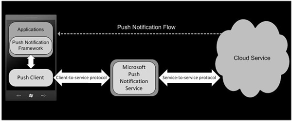
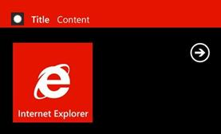
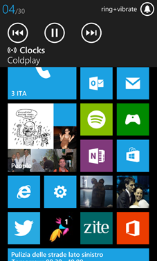
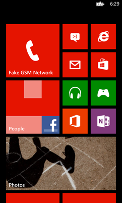
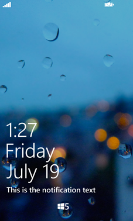

# 第 9 章实时应用:切片、通知和多任务处理

## 多任务处理方法

正如我们在[第 3 章](03.html#_The_application_life)中讨论的应用生命周期中所看到的，当应用不在前台时，它们会被挂起。每个正在运行的进程都被终止，所以应用不能在后台执行操作。

有三种方法可以克服这个限制:

*   **推送通知**，由远程服务使用 HTTP 通道发送。这种方法用于向用户发送通知、更新切片或警告用户发生了什么事情。
*   **后台代理**，是连接到我们的应用的服务，可以在特定条件下不时运行。这些服务也可以用于推送通知场景——在这种情况下，不涉及远程服务——但是只要它们使用受支持的 API，它们也可以执行其他任务。
*   **报警和提醒**，在特定的日期和时间向用户显示提醒。

让我们详细看看它们是如何工作的。

## 推送通知

推送通知是发送到手机的消息，可以根据通知类型以多种方式做出反应。推送通知有三种类型:

*   **原始通知**可以存储任何类型的信息，但只有当关联的应用位于前台时，才能接收到这些通知。
*   **吐司通知**是最具侵入性的通知，因为它们会在屏幕顶部显示一条消息，并伴有声音和振动。短信是敬酒通知的一个很好的例子。
*   **平铺通知**可用于更新应用的平铺。

推送通知体系结构涉及三个因素:

*   Windows Phone 应用，充当接收通知的客户端。
*   负责发送通知的服务器应用，可以是 web 应用或服务。通常，服务器会存储所有注册接收通知的设备的列表。
*   **微软推送通知服务** (MPNS)，这是微软提供的云服务，能够从服务器应用接收通知，并将通知路由到 Windows Phone 客户端。



图 29:微软的推送通知架构

每个 Windows Phone 应用都使用一个**通道**接收推送通知，该通道由唯一的 URI 标识。服务器应用将通过使用 POST 命令向这个 URI 发送一个 XML 字符串来向注册的客户端发送通知。MPNS 将负责将请求路由到适当的设备。

这是一个代表频道的 URI 的例子:

```cs
    http://sn1.notify.live.net/throttledthirdparty/01.00/AAhsLicyiJgtTaidbJoSgm-

```

|  | 注意:MPNS 的使用是免费的，但是每台设备每天只能收到 500 个通知。如果您需要超过这一限制，您必须购买一个顶级域名数字证书，您需要在认证过程中提交该证书，并对您的服务器应用进行数字签名。这样，您还可以支持 SSL 来加密通知的通道。 |

### 发送通知:服务器

如前所述，通知是使用带有 POST 命令的 HTTP 通道发送的。好处是它依赖于标准技术，因此您将能够使用任何开发平台创建服务器应用。

代表通知的 HTTP 请求具有以下特征:

*   它是用 XML 定义的，所以请求的内容类型应该是`text/xml`。
*   一个名为`X-WindowsPhone-Target`的自定义标题，包含通知的类型(吐司、平铺或原始)。
*   一个名为`X-NotificationClass`的自定义标题，它是通知的优先级(我们将在后面对此进行更深入的讨论)。

让我们详细看看不同的推送通知是如何构造的。

#### 祝酒通知

以下示例显示了发送祝酒通知所需的 XML:

```cs
    <?xml version="1.0" encoding="utf-8"?>
    <wp:Notification xmlns:wp="WPNotification">
       <wp:Toast>
        <wp:Text1>Title</wp:Text1>
        <wp:Text2>Text</wp:Text2>
        <wp:Param>/MainPage.xaml?ID=1</wp:Param>
       </wp:Toast>
    </wp:Notification>

```

有三个参数需要设置:

*   `wp:Text1`是通知的标题。
*   `wp:Text2`是通知的文字。
*   `wp:Param`是可选的通知深度链接；设置此选项后，应用将在指定页面上自动打开，其中包含一个或多个查询字符串参数，可用于标识通知的上下文。

当您准备通过 HTTP 发送请求时，`X-WindowsPhone-Target`头应该设置为`toast`，而`X-NotificationClass`头支持以下值:

*   **2** 立即发送通知。
*   **12**450 秒后发送通知。
*   **22**900 秒后发送通知。



图 30:祝酒通知

#### 平铺通知

切片通知用于更新应用的主切片或一个辅助切片。我们在这里不描述发送通知所需的 XML:平铺比其他通知类型更复杂，因为 Windows Phone 8 支持许多模板和大小。我们将在本章后面的[平铺](#_Tiles)部分查看描述平铺通知的 XML。

要发送平铺通知，HTTP 请求的`X-WindowsPhone-Target`头应该设置为`tile`，而`X-NotificationClass`头支持以下值:

*   **1** 立即发送通知。
*   **11**450 秒后发送通知。
*   **21**900 秒后发送通知。

#### 原始通知

原始通知没有特定的 XML 定义，因为它们可以传递任何类型的数据，所以我们可以包含自己的定义。

要发送原始通知，HTTP 请求的`X-WindowsPhone-Target`头应该设置为`raw`，而`X-NotificationClass`头支持以下值:

*   3 立即发送通知。
*   13 450 秒后发送通知。
*   23 在 900 秒后发送通知。

#### 发送请求和管理响应

下面的示例代码显示了如何使用基本类之一的`HttpWebRequest`类发送敬酒通知的示例。用于执行网络操作的. NET 框架类:

```cs
    string toastNotificationPayloadXml = "<?xml version=\"1.0\" encoding=\"utf-8\"?>" +
                                            "<wp:Notification xmlns:wp=\"WPNotification\">" +
                                            "<wp:Toast>" +
                                            "<wp:Text1> title </wp:Text1>" +
                                            "<wp:Text2> text </wp:Text2>" +
                                            "</wp:Toast> " +
                                            "</wp:Notification>";

    byte[] payload = Encoding.UTF8.GetBytes(toastNotificationPayloadXml);

    var pushNotificationWebRequest = (HttpWebRequest)WebRequest.Create("http://sn1.notify.live.net/throttledthirdparty/01.00/AAEqbi-clyknR6iysF1QNBFpAgAAAAADAQAAAAQUZm52OkJCMjg1QTg1QkZDMkUxREQ");

    pushNotificationWebRequest.Method = "POST";
    pushNotificationWebRequest.ContentType = "text/xml";

    var messageId = Guid.NewGuid();

    pushNotificationWebRequest.Headers.Add("X-MessageID", messageId.ToString());
    pushNotificationWebRequest.Headers.Add("X-WindowsPhone-Target", "toast");
    pushNotificationWebRequest.Headers.Add("X-NotificationClass", "2");

    pushNotificationWebRequest.ContentLength = payload.Length;

    using (var notificationRequestStream = pushNotificationWebRequest.GetRequestStream())
    {
        notificationRequestStream.Write(payload, 0, payload.Length);
    }

    using (var pushNotificationWebResponse = (HttpWebResponse)pushNotificationWebRequest.GetResponse())
    {
        //Check the status of the response.
    }

```

XML 定义简单地存储在`string`中。我们将只更改存储通知标题和文本的节点值。然后，我们开始使用`HttpWebRequest`类准备 HTTP 请求。我们添加自定义标题，定义内容的长度和类型(`text/xml`)，并指定要使用的方法(`POST`)。

最后，通过使用`GetRequestStream()`方法，我们获得了流位置来写入请求的内容，这是通知的 XML。然后我们通过调用`GetResponse()`方法发送，该方法返回请求的状态。通过分析反应，我们能够判断手术是否成功。

响应的分析包括状态代码和三个自定义标题:

*   响应的状态代码返回一般信息，告诉您是否已经收到请求。它基于标准的 HTTP 状态代码。例如 **200 OK** 表示请求已成功接收， **404 未找到**表示 URI 无效。
*   `X-NotificationStatus`标题使用值`Received`、`Dropped`、`QueueFull`和`Supressed`告诉您 MPNS 是否已收到请求。
*   发送请求时，`X-DeviceConnectionStatus`头返回设备状态:`Connected`、`Inactive`、`Disconnected`或`TempDisconnected`。
*   如果信道仍然有效(`Active`)或无效(`Expired`)，则`X-SubscriptionStatus`报头返回。在第二种情况下，我们不应该试图再次发送它，因为它已经不存在了。

这些参数的组合将帮助您了解操作的真实状态。MSDN 文件描述了所有可能的组合。

正确管理通知很重要，因为 MPNS 没有提供任何自动重试机制。如果通知未送达，MPSN 不会再次尝试发送，即使操作因暂时原因失败(例如，设备未连接到互联网)。这取决于您根据响应实现重试机制。

#### 推送通知助手库

如您所见，发送推送通知有点棘手，因为它需要您手动设置标题、XML 字符串等。一些开发人员开发了包装器，通过公开高级 API 来隐藏手动定义通知的复杂性，以便您可以使用类和对象。

最有趣的包装器之一叫做 [PushSharp](https://github.com/Redth/PushSharp) ，它可以简单地使用 [NuGet](http://nuget.org/packages/PushSharp/) 安装在你的服务器项目上。该库的最大好处是:

*   这是一种仿制药。NET 库，不仅支持 Windows Phone，还支持使用推送通知的最常见平台，如 Windows Store 应用、iOS、Android 和黑莓。如果您有一个跨平台的应用，它将使您在管理能够向不同类型的设备发送通知的单服务器应用时更加轻松。
*   它与 Windows Phone 8 完全兼容，因此它不仅支持吐司和原始通知，还支持所有新的 Tile 模板和大小。

以下示例显示了使用该库发送敬酒通知是多么简单:

```cs
    WindowsPhoneToastNotification notification = new WindowsPhoneToastNotification();
    notification.Text1 = "Title";
    notification.Text2 = "Text";
    notification.EndPointUrl = "http://sn1.notify.live.net/throttledthirdparty/01.00/AQHcej5duTcJRqnn779soTA1AgAAAAADAQAAAAQUZm52OkJCMjg1QTg1QkZDMkUxREQFBkxFR0FDWQ";
    notification.NotificationClass=BatchingInterval.Immediate;
    PushBroker broker = new PushBroker();
    broker.RegisterWindowsPhoneService();
    broker.QueueNotification(notification);

```

每个通知类型都由一个特定的类表示，该类为每个通知功能公开一个属性。在前面的示例中，`WindowsPhoneToastNotification`类提供了设置通知标题、文本和深层链接的属性。

发送通知的通道 URI 位置在`EndPointUrl`属性中设置。一旦一切都设置好了，你可以通过创建一个`PushBroker`对象来发送它，它代表负责发送通知的调度程序。首先，您必须注册您想要发送的通知类型。因为我们使用的是 Windows Phone，所以我们使用`RegisterWindowsPhoneService()`方法。然后，我们可以通过简单地将其传递给`QueueNotification()`方法来对通知进行排队。它将按照您设置的优先级自动发送。

如果要发送切片，方法是相同的。根据瓷砖的模板，你有三个不同的职业:`WindowsPhoneCycleTileNotification`、`WindowsPhoneFlipTileNotification`和`WindowsPhoneIconicTileNotification`；或`WindowsPhoneRawNotification`获取原始通知。

最终`PushBroker`类暴露了很多事件来控制通知生命周期，比如`OnNotificationSent`在通知发送成功时触发，或者`OnNotificationFailed`在发送操作失败时触发。

### 接收推送通知:客户端

标识推送通知通道的基类称为`HttpNotificationChannel`，它公开了许多方法和事件，这些方法和事件在连接到通道的某个事件发生时被触发。

|  | 注意:要接收推送通知，您需要在清单文件中启用标识-帽-推送-通知功能。 |

每个应用都有一个唯一的通道，由一个关键字标识。因此，应该只在应用第一次订阅接收通知时创建它；如果你试图创建一个已经存在的频道，你会得到一个异常。为了避免这种情况，`HttpNotificationChannel`类提供了`Find()`方法，该方法返回对通道的引用。

```cs
    private void OnRegisterChannelClicked(object sender, RoutedEventArgs e)
    {
        HttpNotificationChannel channel = HttpNotificationChannel.Find("TestChannel");
        if (channel == null)
        {
            channel = new HttpNotificationChannel("TestChannel");
            channel.Open();
        }
    }

```

在上一个示例中，只有当`Find()`方法失败并返回空对象时，才会创建通道。`HttpNotificationChannel`类公开了许多开始与推送通知交互的方法；只有当频道还不存在时，才应该调用它们。在示例中，我们看到了`Open()`方法，应该调用该方法来有效地创建通道，并且该方法会自动订阅原始通知。

如果我们希望能够接收 toast 和 Tile 通知，我们需要使用类提供的另外两种方法:`BindToShellToast()`和`BindToShellTile()`。以下示例显示了完整的初始化:

```cs
    private void OnRegisterChannelClicked(object sender, RoutedEventArgs e)
    {
        HttpNotificationChannel channel = HttpNotificationChannel.Find("TestChannel");
        if (channel == null)
        {
            channel = new HttpNotificationChannel("TestChannel");
            channel.Open();
            channel.BindToShellToast();
            channel.BindToShellTile();
        }
    }

```

除了提供方法之外，`HttpNotificationChannel`类还提供了一些事件来管理通道生命周期中可能触发的不同条件。

最重要的一个叫做`ChannelUriUpdated`，当频道创建操作完成，MPNS 归还了识别它的 URI 时触发。这是一个事件，在一个常规的应用中，我们将 URI 发送到服务器应用，以便它可以存储它供以后使用。无论频道是刚刚创建的，还是已经存在并使用`Find()`方法检索的，订阅该事件都很重要。有时，识别频道的 URI 可能会过期。在这种情况下，`ChannelUriUpdated`事件再次被触发以返回新 URI。

以下示例显示了完整的客户端初始化:

```cs
    private void OnRegisterChannelClicked(object sender, RoutedEventArgs e)
    {
        HttpNotificationChannel channel = HttpNotificationChannel.Find("TestChannel");
        if (channel == null)
        {
            channel = new HttpNotificationChannel("TestChannel");
            channel.Open();
            channel.BindToShellToast();
            channel.BindToShellTile();
        }

        channel.ChannelUriUpdated += channel_ChannelUriUpdated;
    }

    void channel_ChannelUriUpdated(object sender, NotificationChannelUriEventArgs e)
    {
        MessageBox.Show(e.ChannelUri);
    }

```

可以看到，`ChannelUriUpdated`事件返回了一个带有`ChannelUri`属性的参数，其中包含了我们需要的信息。在前面的示例中，我们只是向用户显示 URI 频道。

`HttpNotificationChannel`课程还提供了另外两个有用的活动:

*   当应用收到原始通知时，触发`HttpNotificationReceived`。
*   当应用打开时收到祝酒通知时，触发`ShellToastNotificationReceived`。默认情况下，如果关联的应用位于前台，则不会显示吐司通知。

`HttpNotificationReceived`事件在参数中接收识别通知的对象。内容存储在`Body`属性中，这是一个流，因为原始通知可以存储任何类型的数据。在下面的示例中，我们假设原始通知包含文本，并在收到时显示它:

```cs
    void Channel_HttpNotificationReceived(object sender, HttpNotificationEventArgs e)
    {
        using (StreamReader reader = new StreamReader(e.Notification.Body))
        {
           string message = reader.ReadToEnd();
            Dispatcher.BeginInvoke(() => MessageBox.Show(message));
        }
    }

```

相反，`ShellNotificationReceived`事件在参数中返回一个`Collection`对象，该对象包含作为通知一部分的所有 XML 节点。下面的示例向您展示了如何提取通知的标题和描述，以及如何向用户显示它们:

```cs
    void Channel_ShellToastNotificationReceived(object sender, NotificationEventArgs e)
    {
        string title = e.Collection["wp:Text1"];
        string message = e.Collection["wp:Text2"];
        Dispatcher.BeginInvoke(() => MessageBox.Show(title + " " + message));
    }

```

#### 管理错误

如果在打开通知通道时出现问题，您可以订阅`HttpNotificationChannel`类的`ErrorOccurred`事件来发现发生了什么。

该事件返回一个包含错误信息的参数，如`ErrorType`、`ErrorCode`、`ErrorAdditionalData`和`Message`。

以下列表包括在通道打开过程中可能导致故障的最常见情况:

*   为了保持电池寿命和性能，Windows Phone 限制了同时保持活动的最大通道数。如果已经达到极限，你尝试打开一个新的频道，你会得到`ChannelOpenFailed`作为`ErrorType`的值。
*   收到的通知可能包含格式不正确的消息；在这种情况下`ErrorType`将是`MessageBadContent`。
*   您可以同时发送太多通知；在这种情况下，它们会因`NotificationRateTooHigh`错误而被拒绝。
*   为了保持电池电量，只有当电池不重要时才能收到通知；在这种情况下，你会得到一个`PowerLevelChanged`错误。

`ErrorAdditionalData`属性可以包含关于错误的附加信息。例如，如果您出现`PowerLevelChanged`错误，您将被告知当前的电池电量(低、严重或正常)。

```cs
    void channel_ErrorOccurred(object sender, NotificationChannelErrorEventArgs e)
    {
        if (e.ErrorType == ChannelErrorType.PowerLevelChanged)
        {
           ChannelPowerLevel level = (ChannelPowerLevel) e.ErrorAdditionalData;
           switch (level)
            {
                case ChannelPowerLevel.LowPowerLevel:
                    MessageBox.Show("Battery is low");
                    break;
                case ChannelPowerLevel.CriticalLowPowerLevel:
                    MessageBox.Show("Battery is critical");
                    break;
            }
        }
    }

```

## 背景代理

推送通知是应用不运行时与用户交互的最佳方式，因为它们提供了最佳体验，同时还能延长电池寿命。但是，这种体验仅限于通知:您不能执行任何其他操作，如从 web 服务中获取数据或从本地存储中读取文件。此外，对于某些不需要即时通知的场景，创建所需的服务器基础架构可能会非常昂贵。例如，考虑一个天气应用:当预测发生变化时，立即更新预测并不重要。

对于所有这些场景，Windows Phone 7.5 都引入了后台代理，这是 Windows Phone 定期执行的特殊服务，即使应用没有运行也是如此。有两种类型的周期性背景代理:周期性和音频。在 Visual Studio 的**新项目**部分，您会发现许多适用于所有支持的代理类型的模板。在本节中，我们将详细了解定期代理是如何工作的。

|  | 提示:即使后台代理是单独的 Visual Studio 项目，它也与前台应用共享相同的资源。例如，它们共享同一个本地存储，因此您可以读取由代理中的应用创建的数据，反之亦然。 |

### 代理限制

后台代理必须满足一些限制。最重要的一点与时间有关，因为代理只能在特定的时间范围内运行有限的时间。我们将在后面讨论这个限制，因为根据您将要使用的后台代理类型，会有一些不同。

第一个限制与支持的**API**有关:在后台代理中只能使用有限数量的 API。基本上，所有与用户界面相关的 API 都被禁止，因为代理不能与应用界面交互。您可以在 [MSDN 文档](http://msdn.microsoft.com/en-us/library/windowsphone/develop/hh202962(v=vs.105).aspx)中找到不支持的 API 的完整列表。

第二个限制是关于**内存**:后台代理不能使用超过 11 MB 的内存，否则会被终止。需要强调的是，在测试过程中(当附加了 Visual Studio 调试器时)，内存限制将被禁用，如果后台代理使用了超过 11 MB 的内存，它不会被终止。如果你想确保没有达到极限，你必须在真实的环境中测试它。

第三个也是最后一个限制是关于**计时**:后台代理在被连接的应用初始化 14 天后自动禁用。有两种方法可以克服这个限制:

*   用户继续使用应用；每次打开应用时，代理都可以续订 14 天。
*   代理用于发送通知以更新主应用的平铺或锁定屏幕；每次代理发送通知时，都会自动续订 14 天。

重要的是要记住，如果后台代理连续执行失败两次(因为它超过了内存限制或引发了非托管异常)，它将被自动禁用；应用在启动时必须重新启用它。

### 周期药剂

当您需要频繁执行小操作时，可以使用定期代理。它们通常每 30 分钟执行一次**(执行间隔有时可以缩短到每 10 分钟一次，以配合其他后台进程，从而节省电池寿命)，它们可以运行**长达 25 秒**。用户可以从**设置**面板管理定期代理，并禁用不需要的代理。如果手机在“电池节省”模式下运行，定期代理会自动禁用；当电池电量充足时，它们会自动恢复。**

周期性代理由`PeriodicTask`类标识，该类属于`Microsoft.Phone.Scheduler`命名空间。

### 资源密集型代理

为相反的场景创建了资源密集型代理:偶尔执行的长时间运行的任务。它们最多可以运行 10 分钟，但前提是手机连接了无线网络和外部电源。

这些代理非常适合数据同步等任务。事实上，它们通常在夜间执行，这时手机正在充电。除了之前的条件，其实手机不应该在用。锁定屏幕应被激活，不应执行任何其他操作(如电话)。

资源密集型代理由`ResourceIntensiveTask`标识，它也是`Microsoft.Phone.Scheduler`命名空间的一部分。

### 创建后台代理

如前所述，后台代理是在独立于前端应用的项目中定义的。周期性代理共享相同的模板和架构，Windows Phone 应用将决定将其注册为`PeriodicTask`或`ResourceIntensiveTask`对象。

要创建后台代理，您必须向包含 Windows Phone 应用的解决方案中添加一个新项目。在**添加新项目**窗口中，您会在 Windows Phone 部分找到一个名为**的 Windows Phone 计划任务代理**的模板。

项目已经包含将管理代理的类；它被称为`ScheduledAgent`，继承自`ScheduledTaskAgent`类。类别已经实作方法和事件处理常式。

这个方法叫做`OnInvoke()`，是最重要的一个。它是在后台代理执行时触发的方法，因此它包含执行我们需要的操作的逻辑。以下示例显示了如何从后台代理发送敬酒通知:

```cs
    protected override void OnInvoke(ScheduledTask task)
    {
        ShellToast toast = new ShellToast();
        toast.Title = "Title";
        toast.Content = "Text";
        toast.Show();

        NotifyComplete();
    }

```

突出`NotifyComplete()`方法很重要，代理完成所有操作后就应该调用该方法。它通知操作系统该任务已完成其作业，并且可以执行下一个计划任务。`NotifyComplete()`方法决定任务的状态。如果没有在指定的时间内调用它(周期性任务为 25 秒，资源密集型任务为 10 分钟)，执行将被中断。

还有一种方法可以完成代理的执行:`Abort()`。当出现问题(例如，不满足执行代理所需的条件)并且用户需要打开应用来修复问题时，会调用此方法。

事件处理程序称为`UnhandledException`，当出现意外异常时触发。例如，您可以使用它来记录错误。

上一个示例向您展示了如何发送本地吐司通知。敬酒通知由`ShellToast`类识别。您只需设置所有支持的属性(`Title`、`Content`，以及可选的`NavigationUri`，这是深层链接)。最后，你必须调用`Show()`方法来显示它。

像远程通知一样，只有当应用在后台时，才支持本地祝酒。前面的代码只在后台代理中工作。如果由前台应用执行，则不会发生任何事情。

### 注册代理

后台代理在单独的项目中定义，但在应用中注册。注册应该在应用启动时完成，或者在设置页面中完成，如果我们给用户在应用中启用或禁用它的选项的话。

使用后台代理时使用的基类是`ScheduledActionService`，它代表手机的调度程序。它负责注册所有后台代理，并在它们的生命周期中维护它们。

第一步是定义您想要使用的代理类型。如前所述，后台代理架构总是相同的；类型(周期性的或资源密集型的)由应用定义。

在第一种情况下，您需要创建一个`PeriodicTask`对象，在第二种情况下，需要创建一个`ResourceIntensive`任务对象。无论是哪种类型，设置`Description`属性都很重要，它是在设置页面向用户显示的文本。它用于解释代理的用途，以便用户可以决定是否启用它。

```cs
    PeriodicTask periodicTask = new PeriodicTask("PeriodicTask");
    periodicTask.Description = "This is a periodic task";

    ResourceIntensiveTask resourceIntensiveTask = new ResourceIntensiveTask("ResourceIntensiveTask");
    resourceIntensiveTask.Description = "This is a resource intensive task";

```

在这两种情况下，后台代理都由一个名称标识，该名称作为类的参数传递。该名称在使用`PhoneApplicationService`类注册的所有任务中应该是唯一的；否则你会得到一个例外。

添加任务的基本操作非常简单:

```cs
    public void ScheduleAgent()
    {
        ScheduledAction action = ScheduledActionService.Find("Agent");
        if (action == null || !action.IsScheduled)
        {
           if (action != null)
            {
                ScheduledActionService.Remove("Agent");
            }

           PeriodicTask task = new PeriodicTask("Agent");
            task.Description = "This is a periodic agent";
           ScheduledActionService.Add(task);
            #if DEBUG
           ScheduledActionService.LaunchForTest("Agent", TimeSpan.FromSeconds(10));
                    #endif
         }
    }

```

第一个操作通过使用`ScheduledActionService`类的`Find()`方法检查代理是否已经被调度，这需要任务的唯一名称。如果我们想延长代理的生命周期，则需要执行此操作。如果代理还不存在或者没有被调度(T2 属性为假)，我们首先从调度器中移除它，然后添加它，因为`ScheduledActionService`类不提供简单更新注册任务的方法。添加操作使用`Add()`方法完成，该方法接受一个`PeriodicTask`或一个`ResourceIntensiveTask`对象。

现在任务已经安排好了，将在满足适当的条件时执行。如果你在测试阶段，你会发现`LaunchForTest()`方法很有用；它强制代理在固定时间后执行。在前面的示例中，名称为`PeriodicTask`的代理在五秒钟后启动。`LaunchForTest()`方法也可以在后台代理内部的`OnInvoke()`事件中执行，允许您轻松模拟多次执行。

在前面的示例中，您可以看到，只有当应用在调试模式下启动时，我们才使用条件编译来执行`LaunchForTest()`方法。这样，我们可以确保在发布模式下编译应用以发布到 Windows Store 时，不会执行该方法；否则，如果该方法由从存储中安装的应用调用，您将获得异常。

#### 管理错误

后台代理是 Windows Phone 背后理念的很好例子:

*   用户始终处于控制之中；他们可以通过设置页面禁用任何他们不感兴趣的后台代理。
*   性能和电池寿命是两个至关重要的因素；Windows Phone 限制了注册后台代理的最大数量。

由于这些原因，代理注册过程可能会失败，因此我们需要管理这两种情况。以下代码显示了后台代理初始化的更完整示例:

```cs
    public void ScheduleAgent()
    {
        ScheduledAction action = ScheduledActionService.Find("Agent");
        if (action == null || !action.IsScheduled)
        {
           if (action != null)
            {
                ScheduledActionService.Remove("Agent");
            }

           try
            {
                PeriodicTask task = new PeriodicTask("Agent");
                task.Description = "This is a periodic agent";
                ScheduledActionService.Add(task);
            }
           catch (InvalidOperationException exception)
            {
                if (exception.Message.Contains("BNS Error: The action is disabled"))
                {
                    // No user action required.
                }

                if (exception.Message.Contains("BNS Error: The maximum number of ScheduledActions of this type have already been added."))
                {
                    // No user action required.
                }
            }

        }
    }

```

上一个例子的不同之处在于`Add()`操作是在`try / catch`块内执行的。这样，我们就可以抓住可能出现的`InvalidOperationException`错误。

我们可以通过异常消息来识别场景:

*   **BNS 错误:动作被禁用**。用户已在设置页面中禁用了连接到我们的应用的代理。在这种情况下，我们必须警告用户在尝试注册之前在设置页面中再次启用它。
*   **BSN 错误:已经添加了最大数量的此类计划操作**。用户已达到允许在电话上安装的最大代理数量。在这种情况下，我们什么都不用做；Windows Phone 将显示一条正确的警告消息。


图 31:用户在设置页面中禁用的后台代理

而且`ScheduledTask`类(也就是`PeriodicTask`、`ResourceIntensiveTask`继承的基类)提供了一些属性来理解最后一次执行的状态，比如`LastScheduledTime`包含最后一次执行的日期和时间，`LastExitReason`存储最后一次执行的状态。

具体来说，`LastExitReason`对于了解最后一次执行是否成功完成(`Completed`)、是否超过内存限制(`MemoryQuotaExceeded`)或时间限制(`ExecutionTimeExceeded`)或是否发生未处理的异常(`UnhandledException`)非常有用。

## 后台音频代理

有一种特殊的后台代理的工作方式与周期性代理不同:音频代理，它用于音频相关的应用，在应用关闭时继续播放音频。目标是提供与本地音乐+视频中心类似的体验；即使应用不在前台，用户也能继续收听他们的音乐库。



图 32:背景音频播放器

同样，后台代理是在与前台应用不同的项目中定义的。然而:

*   代理不需要像我们对周期性代理所做的那样，在前台应用中使用`ScheduledActionService`类来初始化。
*   没有时间限制。每当用户与音乐控件交互时，代理就会运行，并且永不过期。唯一的限制是触发的操作应该在 30 秒内完成。
*   内存有限制，但上限更高:20 MB(请记住，连接 Visual Studio 调试器时不会激活内存限制)。
*   在这个场景中，后台代理不仅仅是一个同伴，而是应用的核心；它管理与音乐播放的所有交互，无论它们发生在前台应用还是本地嵌入式播放器中。

### 与音频交互

再现背景音频的核心类叫做`BackgroundAudioPlayer`，标识内置的 Windows Phone 音频播放器。系统内只有一个玩家的实例，不能共享。如果用户启动另一个使用后台音频代理的应用(包括本地音乐+视频中心)，它将控制音频再现。正如我们将很快看到的那样，`BackgroundAudioPlayer`类在前台应用和后台代理中都用于与音乐回放交互。

后台音频代理播放的音轨由`AudioTrack`类表示。除了要播放的资源之外，每个轨道都包含所有元数据，如标题、艺术家和专辑标题。

轨道的路径在`Source`属性中设置，可以是远程文件，也可以是存储在本地存储器中的文件。但是，大多数属性可以在创建`AudioTrack`对象时直接设置，如下例所示:

```cs
    AudioTrack track = new AudioTrack(new Uri("http://www.windowsphonelounge.net/issues/wpl_issue_01.mp3", UriKind.Absolute), "Episode 1", "Igor & Matteo", "Windows Phone Lounge", null);

```

使用前面的代码，除了设置源文件，我们还立即设置了标题、艺术家和专辑等信息。一个有用的可用属性叫做`PlayerControls`，可以用来设置哪些控件(播放、暂停、前进等)。)可用于该轨道。这样，例如，如果您正在开发连接到在线收音机的应用，您可以自动阻止不支持的选项(如跳过轨道按钮)。

### 创建代理

Visual Studio 提供了两个模板来创建后台音频代理: **Windows Phone 音频播放代理**和 **Windows Phone 音频流**代理。他们有着相同的目的；它们的不同之处在于， **Windows Phone 音频流**代理需要使用平台本身不支持的媒体流编解码器。

一个后台音频代理的项目已经有了一个名为`AudioAgent`的类，继承自`AudioPlayerAgent`类。正如我们在周期性代理中看到的，该类自动实现了一些用于与代理交互的方法。最重要的是`OnUserAction()`和`OnPlayStateChanged()`。

`OnUserAction()`在用户每次手动与音乐播放交互时触发，如暂停曲目或按前台应用或后台播放器中的跳过曲目按钮。

方法返回一些可用于理解上下文和执行适当操作的参数:

*   一个`BackgroundAudioPlayer`对象，是对背景音频播放器的引用。
*   一个`AudioTrack`对象，是对当前正在播放的曲目的引用。
*   一个`UserAction`对象，是用户触发的动作。

以下示例显示了`OnUserAction()`方法的典型实现:

```cs
    protected override void OnUserAction(BackgroundAudioPlayer player, AudioTrack track, UserAction action, object param)
    {
        switch (action)
        {
           case UserAction.Pause:
            {
                player.Pause();
                break;
            }
           case UserAction.Play:
                {
                    player.Play();
                    break;
                }
           case UserAction.SkipNext:
                {
                    //Play next track.
                    break;
                }
           case UserAction.SkipPrevious:
                {
                    //Play previous track.
                    break;
                }
        }
        NotifyComplete();
    }

```

通常使用`switch`语句，您将监控存储在`UserAction`对象中的每个支持的用户交互。然后，您使用`BackgroundAudioPlayer`类所暴露的方法进行响应。`Play`和`Pause`是最容易管理的州；`SkipNext`和`SkipPrevious`通常需要更多的逻辑，因为你必须从你的库中获得列表中要播放的上一首或下一首曲目。

注意后台音频代理也要求我们一完成就执行`NotifyComplete()`方法来管理操作；应该在 30 秒内调用它以避免终止。

`OnPlayStateChanged()`方法在每次音乐播放状态改变时自动触发，但不是手动操作的直接结果。例如，当当前轨道结束时，代理应该自动开始播放列表中的下一个轨道。

该方法的结构与`OnUserAction()`方法非常相似。在这种情况下，除了对背景播放器和当前轨道的引用之外，您还会得到一个`PlayState`对象，它会通知您发生了什么。

以下示例显示了该方法的典型实现:

```cs
    protected override void OnPlayStateChanged(BackgroundAudioPlayer player, AudioTrack track, PlayState playState)
    {
        if (playState == PlayState.TrackEnded)
           //Play next track.

        NotifyComplete();
    }

```

|  | 提示:后台音频代理不会一直保存在内存中，而是只有在音乐播放状态发生变化时才会启动。如果您需要在不同的执行中保存一些数据，您将需要依赖本地存储。 |

### 前景应用

我们已经看到了所有主要的回放逻辑是如何由后台代理直接管理的。在大多数情况下，前台应用只是代理的一个可视化前端。

为了理解回放状态(并正确更新用户界面)，我们需要再次使用我们已经看到的`BackgroundAudioPlayer`类。不同的是，在前台应用中，我们需要使用`Instance` singleton 来访问它。

该类公开的方法是相同的，因此我们可以使用它来播放、暂停或更改音乐播放状态(例如，如果我们想要将这些操作连接到像按钮这样的输入控件)。

`BackgroundAudioPlayer`暴露了一个叫做`PlayStateChanged`的重要事件，每次播放状态改变时都会触发。我们可以用它来更新视觉界面(例如，如果我们想显示当前播放的曲目)。

以下示例显示了如何使用`PlayStateChanged`事件来更改播放/暂停按钮的行为，并显示关于当前播放曲目的一些元数据:

```cs
    public partial class MainPage : PhoneApplicationPage
    {
        private BackgroundAudioPlayer player;

        // Constructor
        public MainPage()
        {
            InitializeComponent();
            player = BackgroundAudioPlayer.Instance;
            player.PlayStateChanged += new EventHandler(player_PlayStateChanged);
        }

        private void OnPlayClicked(object sender, RoutedEventArgs e)
        {
            player.Play();
        }

        void player_PlayStateChanged(object sender, EventArgs e)
        {
           if (player.PlayerState == PlayState.Playing)
                Dispatcher.BeginInvoke(() => btnPlay.Content = "Pause");
           else
                Dispatcher.BeginInvoke(() => btnPlay.Content = "Play");

           if (player.PlayerState == PlayState.Playing)
            {

                Dispatcher.BeginInvoke(() =>
                {
                    txtTitle.Text = player.Track.Title;
                    txtArtist.Text = player.Track.Artist;
                    txtAlbum.Text = player.Track.Album;
                });
            }
        }
    }

```

前面的代码应该很熟悉；您可以访问我们在后台代理中看到的所有属性，如`PlayerState`识别当前播放状态，或`Track`识别当前播放的曲目。`Track`不仅仅是只读属性。如果我们想在应用中设置一个新的曲目播放，我们可以简单地将新的`AudioTrack`对象分配给`BackgroundAudioPlayer`实例的`Track`属性。

## 报警和提醒

警报和提醒是在指定日期和时间向用户显示提醒的简单方法，就像本机警报和日历应用一样。

他们以同样的方式工作。这些应用编程接口属于`Microsoft.Phone.Scheduler`命名空间，它们继承自基本的`ScheduledNotification`类。这两个应用编程接口有一些共同的属性:

*   `Content`:提醒说明。
*   `BeginTime`:应该显示提醒的日期和时间。
*   `RecurrenceType`:设置是循环提醒还是一次性提醒。
*   `ExpirationTime`:重复提醒到期的日期和时间。

每个提醒都由一个名称标识，该名称在应用创建的所有警报和提醒中应该是唯一的。他们像后台特工一样工作；它们的生命周期由`ScheduledActionService`类控制，该类负责添加、更新和删除它们。

报警由`Alarm`类识别，用于显示没有特定上下文的提醒。用户可以暂停或取消它。警报特有的一个特性是它们可以播放自定义声音，这是在`Sound`属性中设置的。

以下示例显示了如何创建和安排警报:

```cs
    private void OnSetAlarmClicked(object sender, RoutedEventArgs e)
    {
        Alarm alarm = new Alarm("Alarm")
        {
            BeginTime = DateTime.Now.AddSeconds(15),
            Content = "It's time!",
            RecurrenceType = RecurrenceInterval.None,
            Sound = new Uri("/Assets/CustomSound.mp3", UriKind.Relative)
        };

        ScheduledActionService.Add(alarm);
    }

```

该示例创建一个在当前日期和时间后 15 秒安排的警报，并使用一个自定义声音，该声音是 Visual Studio 项目中的 MP3 文件。

相反，提醒由`Reminder`类标识，并在通知连接到特定上下文时使用，就像日历提醒连接到约会一样。

使用`NavigationUri`属性管理上下文，该属性支持深度链接。当用户点击提醒标题时，会打开页面(带有可选的查询字符串参数)。

```cs
    private void OnSetReminderClicked(object sender, RoutedEventArgs e)
    {
        Reminder reminder = new Reminder("Reminder")
        {
            BeginTime = DateTime.Now.AddSeconds(15),
            Title = "Reminder",
            Content = "Meeting",
            RecurrenceType = RecurrenceInterval.None,
            NavigationUri = new Uri("/DetailPage.xaml?id=1", UriKind.Relative)
        };

        ScheduledActionService.Add(reminder);
    }

```

前面的代码安排了一个提醒，打开一个名为**的页面。使用[第 3 章](03.html#_Navigation)中描述的导航事件，您将能够获取查询字符串参数并加载请求的数据。还要注意的是`Reminder`类提供了`Title`属性，这是警报所不支持的。**

## 活瓦

毫无疑问，Live Tiles 是 Windows Phone 最独特的功能，也是任何其他平台都找不到的功能。它们被称为实时切片，因为它们不仅仅是打开应用的快捷方式；它们可以通过本地或远程通知进行更新，以显示信息，而无需强制用户打开应用。许多类型的应用都利用了这一功能，比如显示天气预报的天气应用、显示最新头条新闻的新闻应用以及显示即将上映的电影标题的电影应用。

Windows Phone 8 引入了许多关于平铺的新功能，比如新模板和新尺寸。

一个应用可以使用三种不同大小的切片:小切片、中切片和宽切片。作为开发人员，我们将能够根据大小定制图块的内容，例如，宽图块可以显示比小图块更多的信息。



图 33:不同的瓷砖尺寸

Windows Phone 8 还引入了三种不同的模板来定制图块:翻转、循环和图标。需要注意的是，您只能为应用选择一个模板；它必须在清单文件中声明，在**应用界面**部分。一旦您设置了它，您将无法在运行时更改它，并且您要创建或更新的所有切片都必须使用该模板。此外，您还可以选择功能(平铺、图片等)。)用于**应用界面**部分的主图块；该信息将一直使用，直到通知对其进行更新。

在下面的部分中，我们将详细检查每个可用的模板。对于每一个，我们将讨论用通知更新它所需的架构和代码。对于远程通知，我们将看到所需的 XML。对于本地通知，我们将查看应用或后台代理中使用的 API。

在这两种情况下，定义切片的所有字段都是可选的。如果您不设置其中的一些属性，这些属性将被忽略。另一方面，如果之前设置的字段没有用通知更新，旧值将被保留。

### 翻转模板

Flip 是标准的 Windows Phone 模板，也是 Windows Phone 7 中唯一可用的模板。使用此模板，您可以在图块的正面显示文本、计数器和图像。平铺会定期旋转或“翻转”以显示相反的一面，这可以显示不同的文本或图像。


图 34:使用翻转模板的切片解剖图

从上图中可以看到，您可以自定义图块的前侧和后侧。如果要包含图像，必须使用以下尺寸之一:

*   小:159 × 159
*   中:336 × 336
*   宽:691 × 336

翻转模板图块由`FlipTileData`类标识。下面的示例显示了如何使用它来定义可由代码管理的切片。

```cs
    private void OnCreateFlipTileClicked(object sender, RoutedEventArgs e)
    {
        FlipTileData data = new FlipTileData
        {
            SmallBackgroundImage = new Uri("Assets/Tiles/FlipCycleTileSmall.png", UriKind.Relative),
            BackgroundImage = new Uri("Assets/Tiles/FlipCycleTileMedium.png", UriKind.Relative),
            WideBackgroundImage = new Uri("Assets/Tiles/FlipCycleTileLarge.png", UriKind.Relative),
            Title = "Flip tile",
            BackTitle = "Back flip tile",
            BackContent = "This is a flip tile",
            WideBackContent = "This is a flip tile with wide content",
            Count = 5
        };
    }

```

下面的代码显示了如何使用远程通知所需的 XML 定义来表示同一个切片:

```cs
    <?xml version="1.0" encoding="utf-8"?>
    <wp:Notification xmlns:wp="WPNotification" Version="2.0">
      <wp:Tile Id="[Tile ID]" Template="FlipTile">
        <wp:SmallBackgroundImage Action="Clear">[small Tile size URI]</wp:SmallBackgroundImage>
        <wp:WideBackgroundImage Action="Clear">[front of wide Tile size URI]</wp:WideBackgroundImage>
        <wp:WideBackBackgroundImage Action="Clear">[back of wide Tile size URI]</wp:WideBackBackgroundImage>
        <wp:WideBackContent Action="Clear">[back of wide Tile size content]</wp:WideBackContent>
        <wp:BackgroundImage Action="Clear">[front of medium Tile size URI]</wp:BackgroundImage>
        <wp:Count Action="Clear">[count]</wp:Count>
        <wp:Title Action="Clear">[title]</wp:Title>
        <wp:BackBackgroundImage Action="Clear">[back of medium Tile size URI]</wp:BackBackgroundImage>
        <wp:BackTitle Action="Clear">[back of Tile title]</wp:BackTitle>
        <wp:BackContent Action="Clear">[back of medium Tile size content]</wp:BackContent>
      </wp:Tile>
    </wp:Notification>

```

请注意为许多节点设置的`Action`属性。如果您在没有为节点赋值的情况下设置它，它将简单地删除以前的值，使其恢复为默认值。

### 循环模板

循环模板可用于创建类似于照片中心提供的视觉体验。瓷砖正面最多可循环显示 9 张图片。


图 35:使用循环模板的切片解剖图

与其他两个模板相比，循环模板提供了更少的自定义平铺方式，因为它的焦点是图像。图像大小与翻转模板使用的图像大小相同:

*   小:159 × 159
*   中:336 × 336
*   宽:691 × 336

循环模板由`CycleTileData`类标识，如下例所示:

```cs
    private void OnCreateCycleTileClicked(object sender, RoutedEventArgs e)
    {
        CycleTileData data = new CycleTileData()
        {
            Count = 5,
            SmallBackgroundImage = new Uri("Assets/Tiles/FlipCycleTileSmall.png", UriKind.Relative),
            Title = "Cycle tile",
            CycleImages = new List<Uri>
            {
                new Uri("Assets/Tiles/Tile1.png", UriKind.Relative),
                new Uri("Assets/Tiles/Tile2.png", UriKind.Relative),
                new Uri("Assets/Tiles/Tile3.png", UriKind.Relative)
            }
        };
    }

```

以下 XML 可用于发送远程通知，以基于周期模板更新切片:

```cs
    <?xml version="1.0" encoding="utf-8"?>
    <wp:Notification xmlns:wp="WPNotification" Version="2.0">
      <wp:Tile Id="[Tile ID]" Template="CycleTile">
        <wp:SmallBackgroundImage Action="Clear">[small Tile size URI]</wp:SmallBackgroundImage>
        <wp:CycleImage1 Action="Clear">[photo 1 URI]</wp:CycleImage1>
        <wp:CycleImage2 Action="Clear">[photo 2 URI]</wp:CycleImage2>
        <wp:CycleImage3 Action="Clear">[photo 3 URI]</wp:CycleImage3>
        <wp:Count Action="Clear">[count]</wp:Count>
        <wp:Title Action="Clear">[title]</wp:Title>
      </wp:Tile>
    </wp:Notification>

```

### 图标模板

图标模板用于创建强调计数器的图块。许多本地应用(如邮件、消息和电话)都使用此模板。在这个模板中，计数器更大，更容易看到。


图 36:使用循环模板的切片解剖图

图标模板与翻转和循环模板有两个主要区别。首先是不支持全尺寸图像；相反，您可以指定显示在计数器附近的图标图像。只需要两种图像尺寸:

*   小而宽的瓷砖:110 × 110
*   中型瓷砖:202 × 202

另一个区别是可以自定义背景颜色(使用其他模板的唯一方法是使用您喜欢的背景颜色的图像)。如果您没有设置背景颜色，模板将自动使用手机的主题。

图标图块由`IconicTileData`模板表示，如下例所示:

```cs
    private void OnCreateIconicTileClicked(object sender, RoutedEventArgs e)
    {
        IconicTileData data = new IconicTileData()
        {
            SmallIconImage = new Uri("/Assets/Tiles/IconicTileSmall.png", UriKind.Relative),
            IconImage = new Uri("/Assets/Tiles/IconicTileMediumLarge.png", UriKind.Relative),
            Title = "My App",
            Count = 5,
            WideContent1 = "First line",
            WideContent2 = "Second line",
            WideContent3 = "Third line"
        };
    }

```

以下示例是使用图标模板的图块中远程推送通知的 XML 表示形式:

```cs
    <?xml version="1.0" encoding="utf-8"?>
    <wp:Notification xmlns:wp="WPNotification" Version="2.0">
      <wp:Tile Id="[Tile ID]" Template="IconicTile">
        <wp:SmallIconImage Action="Clear">[small Tile size URI]</wp:SmallIconImage>
        <wp:IconImage Action="Clear">[medium/wide Tile size URI]</wp:IconImage>
        <wp:WideContent1 Action="Clear">[1st row of content]</wp:WideContent1>
        <wp:WideContent2 Action="Clear">[2nd row of content]</wp:WideContent2>
        <wp:WideContent3 Action="Clear">[3rd row of content]</wp:WideContent3>
        <wp:Count Action="Clear">[count]</wp:Count>
        <wp:Title Action="Clear">[title]</wp:Title>
        <wp:BackgroundColor Action="Clear">[hex ARGB format color]</wp:BackgroundColor>
      </wp:Tile>
    </wp:Notification>

```

### 使用多个图块

前面的代码除了在应用或后台代理中受支持以更新主切片之外，还可以用于创建多个切片——这是 Windows Phone 7.5 中引入的一项功能。辅助切片的行为与主切片类似:它们可以通过通知进行更新，并从“开始”屏幕中移动或删除。

不同的是，二级切片有一个唯一的标识，这是切片的深层链接。主切片总是打开应用的主页，而辅助切片可以打开应用的另一个页面，并包含一个或多个查询字符串参数来标识上下文。例如，天气应用可以为用户最喜欢的城市创建切片，每个切片都会将用户重定向到所选城市的预测页面。

与 Tiles 交互的基类叫做`ShellTile`，属于`Microsoft.Phone.Shell`命名空间。

创建第二个图块很简单:通过传递图块的深层链接和图块本身，使用我们之前看到的一个类来调用`Create()`方法。以下示例显示了如何使用翻转模板创建辅助切片:

```cs
    private void OnCreateFlipTileClicked(object sender, RoutedEventArgs e)
    {
        FlipTileData data = new FlipTileData
        {
            SmallBackgroundImage = new Uri("Assets/Tiles/FlipCycleTileSmall.png", UriKind.Relative),
            BackgroundImage = new Uri("Assets/Tiles/FlipCycleTileMedium.png", UriKind.Relative),
            WideBackgroundImage = new Uri("Assets/Tiles/FlipCycleTileLarge.png", UriKind.Relative),
            Title = "Flip tile",
            BackTitle = "Back flip tile",
            BackContent = "This is a flip tile",
            WideBackContent = "This is a flip tile with wide content",
            Count = 5
        };

        ShellTile.Create(new Uri("/MainPage.xaml?id=1", UriKind.Relative), data, true);
    }

```

当应用使用此图块打开时，您将能够理解上下文，并使用我们在[第 3 章](03.html#_Navigation)中使用的`OnNavigatedTo`方法和`NavigationContext`类显示适当的信息。

|  | 注意:为了避免二级切片的不适当使用，每次创建新切片时，应用都将关闭并立即向用户显示。 |

删除辅助图块需要再次使用`ShellTile`类。它公开了一个名为`ActiveTiles`的集合，其中包含了所有属于该应用的 Tiles，包括主应用。获得对我们想要删除的图块的引用(使用深层链接作为标识符)并在其上调用`Delete()`方法就足够了。

```cs
    private void OnDeleteTileClicked(object sender, RoutedEventArgs e)
    {
        Uri deepLink = new Uri("/MainPage.xaml?id=1", UriKind.Relative);
        ShellTile tile = ShellTile.ActiveTiles.FirstOrDefault(x => x.NavigationUri == deepLink);
        if (tile != null)
        {
            tile.Delete();
        }
    }

```

上一个示例删除了由深层链接`/MainPage.xaml?id=1`标识的图块。与创建切片时不同，应用不会关闭。

|  | 提示:请记住，在移除图块之前，请务必检查图块是否存在。与其他所有平铺一样，事实上，用户也可以通过轻按并按住平铺，然后轻按取消固定图标来删除主页上的一个平铺。 |

图块也可以更新。不仅主应用可以执行更新，后台代理也可以在后台执行更新。

这种方法类似于我们看到的删除操作。首先，我们必须检索对要更新的图块的引用，然后我们调用`Update()`方法，将图块对象作为参数传递。以下示例显示了如何更新使用翻转模板的切片:

```cs
    private void OnUpdateMainTileClicked(object sender, RoutedEventArgs e)
    {
        FlipTileData data = new FlipTileData
        {
            Title = "Updated Flip tile",
            BackTitle = "Updated Back flip tile",
            BackContent = "This is an updated flip tile",
            WideBackContent = "This is an updated flip tile with wide content",
            Count = 5
        };
        Uri deepLink = new Uri("/MainPage.xaml?id=1", UriKind.Relative);
        ShellTile tile = ShellTile.ActiveTiles.FirstOrDefault(x => x.NavigationUri == deepLink);
        if (tile != null)
        {
            tile.Update(data);
        }
    }

```

`Update()`方法也可以用来更新应用的主 Tile。它总是作为`ActiveTiles`集合的第一个元素存储，因此在它上面调用`Update()`方法就足够了，如下例所示:

```cs
    private void OnUpdateMainTileClicked(object sender, RoutedEventArgs e)
    {
        FlipTileData data = new FlipTileData
        {
            Title = "Updated Flip tile",
            BackTitle = "Updated Back flip tile",
            BackContent = "This is an updated flip tile",
            WideBackContent = "This is an updated flip tile with wide content",
            Count = 5
        };
        ShellTile.ActiveTiles.FirstOrDefault().Update(data);
    }

```

即使主图块没有固定在“开始”屏幕上，前面的代码也将始终工作。如果用户决定锁定它，图块将已经更新为最新的通知。

|  | 提示:您可以邀请用户在“开始”屏幕上锁定主平铺，但不能通过代码强制。 |

## 与锁屏交互

得益于锁屏支持，Windows Phone 8 引入了一种新的应用与用户交互的方式。有两种方式与之互动:

*   显示通知的方式与消息和邮件应用显示未读消息数量的方式相同。
*   更改锁定屏幕图像；具体来说，应用可以成为锁屏提供程序，并偶尔使用后台代理更新图像。

让我们详细看看如何支持这两种场景。

### 通知

在“设置”页面中，用户最多可以选择五个能够显示计数器通知的应用，并且只能选择一个能够显示文本通知的应用。

为了在我们的应用中支持这两种情况，我们需要在清单文件中手动添加一个新的声明(记住使用上下文菜单中的**查看代码**选项，因为可视化编辑器不支持它):

```cs
    <Extensions>
       <Extension ExtensionName="LockScreen_Notification_IconCount" ConsumerID="{111DFF24-AA15-4A96-8006-2BFF8122084F}" TaskID="_default" />
       <Extension ExtensionName="LockScreen_Notification_TextField" ConsumerID="{111DFF24-AA15-4A96-8006-2BFF8122084F}" TaskID="_default" />
    </Extensions>

```

第一个扩展用于支持计数器通知，而第二个扩展用于文本通知。根据您的要求，您可以只声明其中一个或两个。

如果您想支持计数器通知，还有一个修改要应用到清单文件中:在`Tokens`部分，您将找到定义主平铺的基本属性的标签。其中一个叫做`DeviceLockImageURI`，你需要用图像的路径来设置它，它将被用作通知的图标。

```cs
    <DeviceLockImageURI IsRelative="true" IsResource="false">Assets/WinLogo.png</DeviceLockImageURI>

```

图像应具有以下属性:

*   支持的分辨率为 38 × 38。
*   它必须是巴布亚新几内亚格式。
*   它只能包含透明或白色像素。不支持其他颜色。

一旦设置了应用，您就不需要做任何特殊的事情来显示锁屏通知。事实上，它们是基于平铺通知的，因此您只需一个通知就可以更新平铺和锁定屏幕。

*   如果您的应用支持计数器通知，您需要发送一个平铺通知，其编号存储在`Count`属性中。
*   如果您的应用支持文本通知，您需要发送平铺通知，文本存储在翻转模板的`WideBackContent`属性或图标模板的`WideContent1`属性中。周期模板不支持文本通知。



图 37:带有计数器和文本的锁屏通知

### 锁定屏幕图像

支持锁屏图像的起点还是清单文件。以下示例是应添加到`Extensions`部分的声明:

```cs
    <Extensions>
       <Extension ExtensionName="LockScreen_Background" ConsumerID="{111DFF24-AA15-4A96-8006-2BFF8122084F}" TaskID="_default" />
    </Extensions>

```

从现在开始，您的应用将在设置页面中被列为壁纸提供商。如果用户选择您的应用作为提供者，您将能够从前台应用和使用后台代理更新锁屏图像。

API 允许您检查应用是否已经被设置为提供者，或者您可以询问用户。如果应用设置为提供者，你将能够有效地更改壁纸；否则你会得到一个例外。

两个类是`Windows.Phone.System.UserProfile`命名空间的一部分:`LockScreenManager`可以用来检测当前的提供者状态，`LockScreen`可以有效地在锁屏上执行操作。

```cs
    private async void OnSetWallpaperClicked(object sender, RoutedEventArgs e)
    {
        Uri wallpaper = new Uri("ms-appx:///Assets/Wallpapers/Wallpaper1.jpg", UriKind.RelativeOrAbsolute);

        bool isProvider = LockScreenManager.IsProvidedByCurrentApplication;
        if (isProvider)
        {
           LockScreen.SetImageUri(wallpaper);
        }
        else
        {
           LockScreenRequestResult lockScreenRequestResult = await LockScreenManager.RequestAccessAsync();
           if (lockScreenRequestResult == LockScreenRequestResult.Granted)
            {
                LockScreen.SetImageUri(wallpaper);
            }
        }
    }

```

第一步是使用`LockScreenManager`类的`IsProvidedByCurrentApplication`属性检查当前应用是否被设置为提供程序。否则，我们通过调用`RequestAccessAsync()`方法请求用户的许可。作为回报，我们收到用户的选择，可以是肯定的(`LockScreenRequestResult.Granted`)也可以是否定的(`LockScreenRequestResult.Denied`)。

在这两种情况下，只有当应用被设置为提供程序时，我们才能使用`SetImageUri()`方法有效地更改锁屏图像，这需要图片的路径作为参数。图片可以是项目的一部分(如我们使用`ms-appx:///`前缀的前一个示例)，也可以存储在本地存储中(在这种情况下，我们必须使用`ms-appdata:///Local/`前缀)。不直接支持远程图像；在将它们用作锁屏背景之前，必须下载它们。

前面的代码也可以用于后台代理。不同的是，您将能够检查应用是否被设置为提供程序，并最终更改图像。由于后台代理无法与用户界面交互，您将无法向用户请求将您的应用用作提供商的许可。

## 快速回顾一下

在本章中，我们已经看到实时应用是 Windows Phone 开发中的核心概念之一，为了正确创建高质量的体验，涉及到许多因素，如通知、代理和 Tiles。

下面的列表详细介绍了我们学到的知识:

*   即使应用在后台，推送通知也是通知用户某事的最佳方式。应用可以发送吐司通知或更新切片。我们已经看到了如何在客户端和服务器端创建 reach 所需的架构。
*   推送通知提供了优化电池寿命和性能的最佳方法，但是它们支持有限的场景，并且需要服务器应用来发送它们。为此，Windows Phone 引入了后台代理，我们可以定期执行这些代理来发送通知或执行通用操作，即使应用不在前台。
*   Windows Phone 提供了一种特殊的后台代理类型，称为音频后台代理，用于音频播放场景。应用能够播放音频，即使它们没有运行，就像本地音乐+视频中心一样。
*   警报和提醒是在应用未运行时向用户显示提醒的简单方法。
*   实时切片是该平台的特色之一。我们已经学会了如何通过在不同的模板和尺寸之间进行选择来定制它们。
*   我们已经看到了 Windows Phone 8 中引入的另一个新功能，锁屏支持:应用现在可以通过显示通知和更改壁纸来与锁屏进行交互。